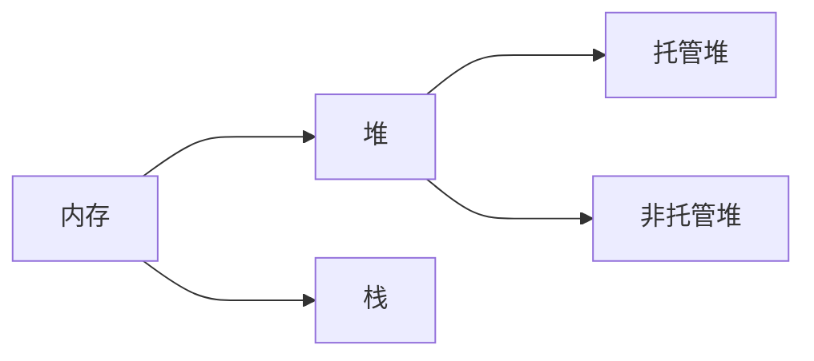
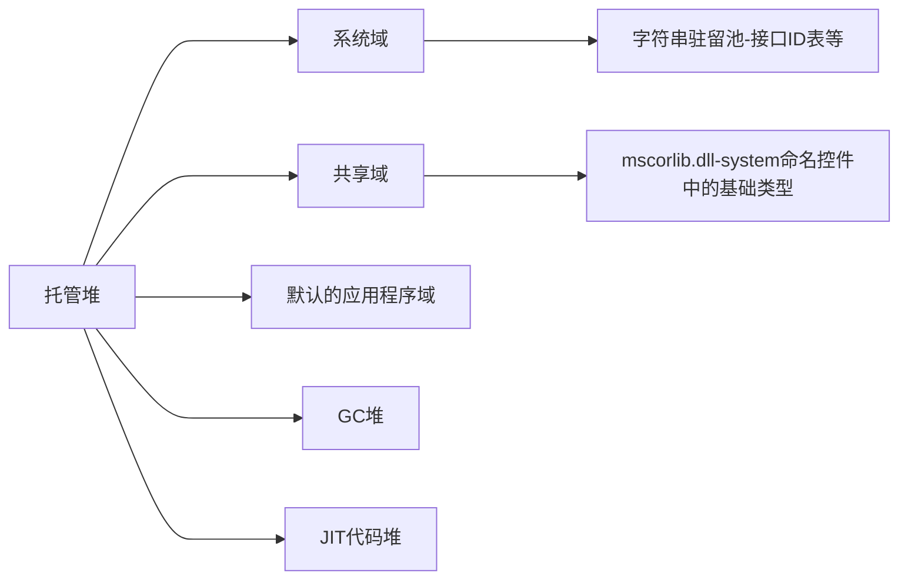
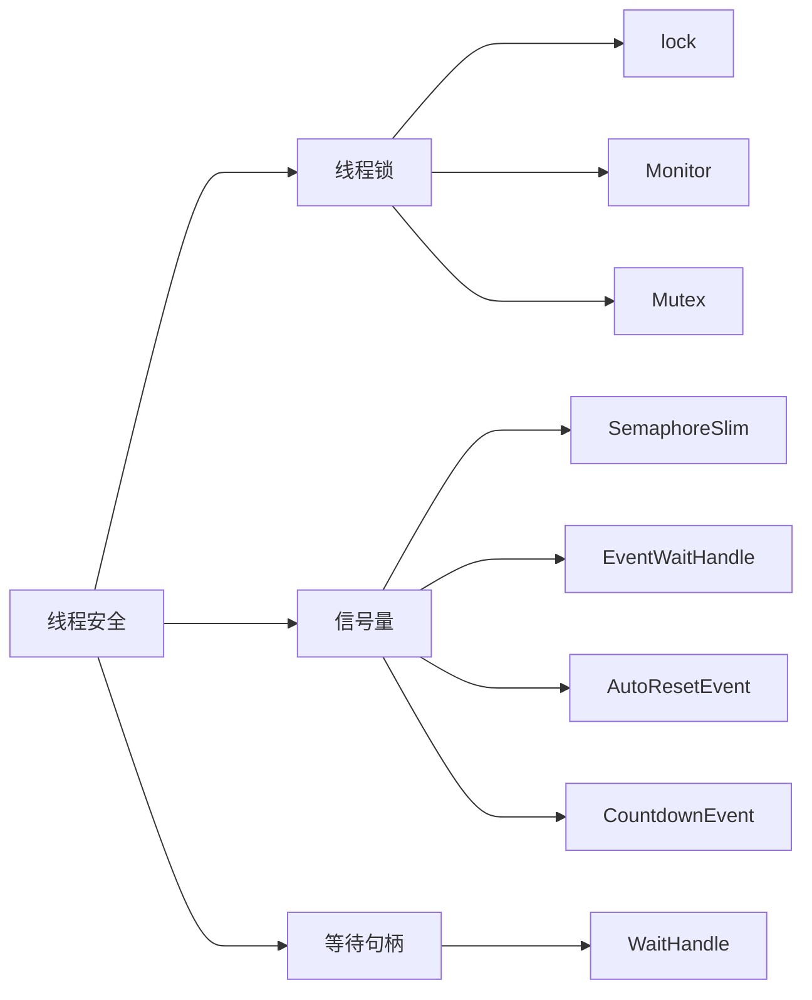
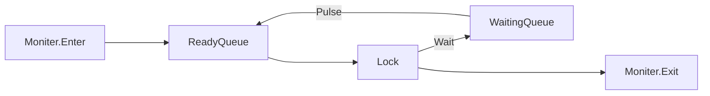
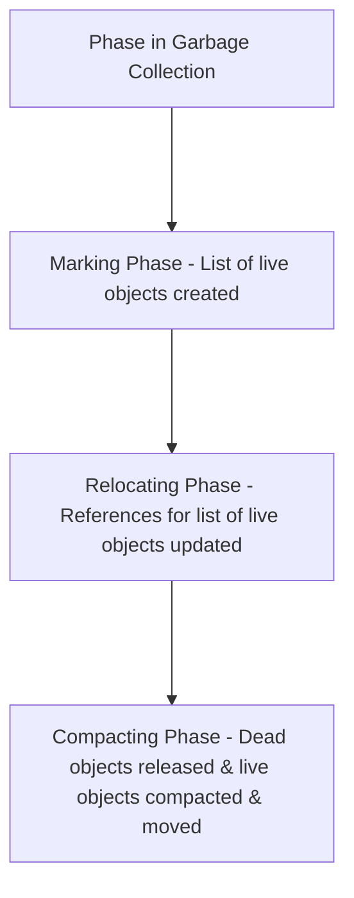
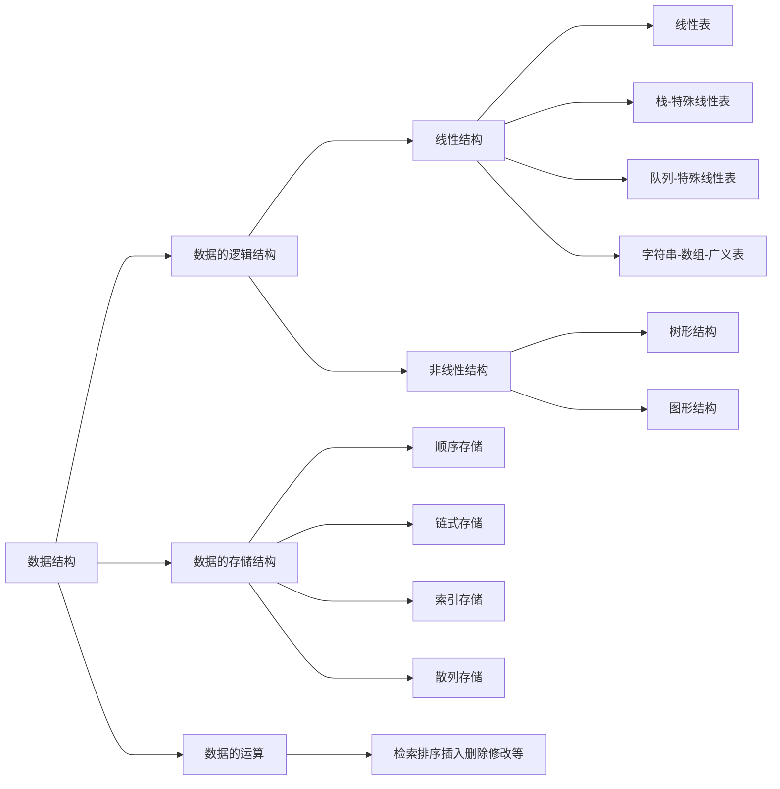
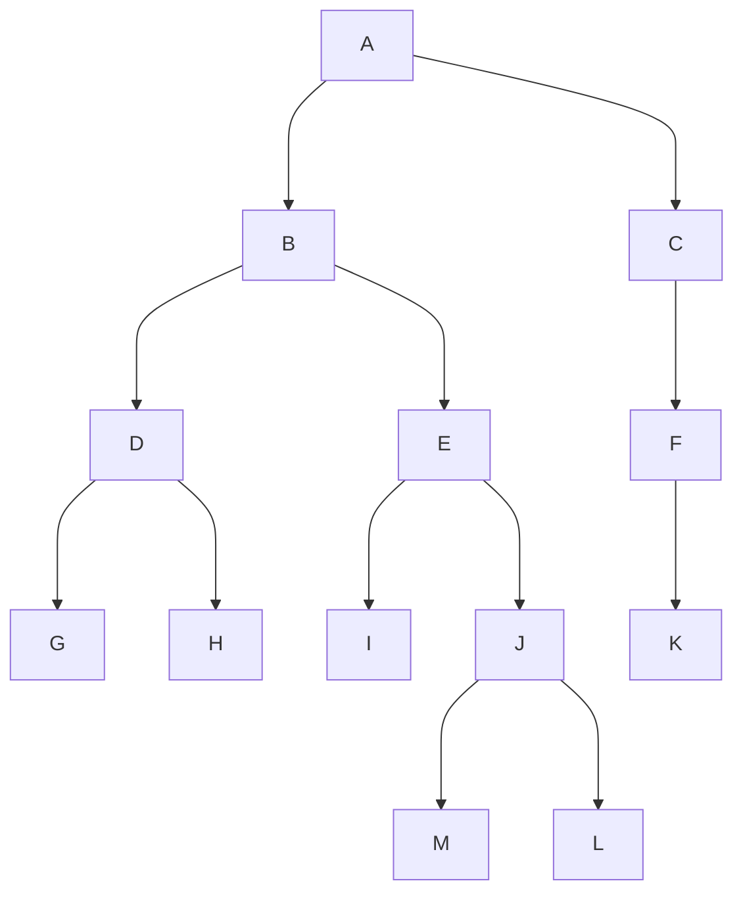

# C#高级编程

## 概述

C#是微软公司发布的一种面向对象的、运行于.NET Framework之上的高级程序设计语言，C#是一种安全的、稳定的、简单的、优雅的，由C和C++衍生出来的面向对象的编程语言

特点：1.简单 2.现代 3.面向对象 4.类型安全 5.相互兼容性 6.可伸缩性和可升级性

关系：.NET框架是由微软开发的，致力于敏捷软件开发、快速应用开发、平台无关性和网络透明化的软件开发平台。

C#只是用于编写运行在该平台上的一种语言。

## .NET类型

C#有15中预定义的类型，其中有13中值类型，2种引用类型

### 值类型

|名称|类型|说明|位数|范围|
|----|---|----|---|----|
|sbyte|System.SByte|8位有符号整数||-2^7^-2^7^-1|
|short|System.Int16|16位有符号整数||-2^15^-2^15^-1|
|int|System.Int32|32位有符号整数||-2^31^-2^31^-1|
|long|System.Int64|64位有符号整数||-2^63^-2^63^-1|
|byte|System.Byte|8位无符号整数||0-2^8^-1|
|ushort|System.UInt16|16位无符号整数||0-2^16^-1|
|uint|System.UInt32|32位无符号整数||0-2^32^-1|
|ulong|System.UInt64|64位无符号整数||0-2^64^-1|
|float|System.Single|32位单精度浮点数|7||
|double|System.Double|64位双精度浮点数|15~16||
|decimal|System.Decimal|128位高精度十进制数表示法|28||
|bool|System.Boolean|true或者false||true/false|
|char|System.Char|表示一个16位Unicode字符|16||

### 引用类型

|名称|类型|说明|
|----|---|----|
|object|System.Object|根类型，其他类型都是从它派生而来|
|string|System.String|Unicode字符串|

### 栈和堆

针对这些不同的数据类型，在计算机中存储在不同的地方。堆和栈是两种可以分配内存的地方。



堆与栈都是内存中的一部分，栈负责保存我们的代码执行路径，而堆负责保存对象的路径。对托管堆中的一部分(GC堆)中不用的对象进行释放就是垃圾回收的主要工作，而托管堆的其他部分，和开发者关系相对没有那么大。对非托管堆的管理则需要有开发者完成。托管堆和栈有CLR管理，在CLR开始执行第一行代码之前，会建立三个程序域：系统域，共享域以及默认的第一个应用程序域(AppDomain)。其中，开发者无法直接操作系统域和共享域，AppDomain类型的实例可以有多个。

托管堆，在运行程序时，CLR申请的一块内存控件，基于进程，属于进程内存控件的一部分。



对象的数据存储在堆上，而对上的数据是所有线程共享的，根据不同的数据类型，堆可以分为

+ GC堆：对象实例大小小于85K字节时，对象分配到GC堆上
+ 加载堆Loader Heap：用来存储类型的元数据，也就是类的type信息，反射的时候就是用到这里面的信息。每个类在加载堆中对应一个方法表，里面记录该类的元数据信息，比如基类型、静态类型、继承的接口、所有的方法等。加载堆不受GC控制，不会被回收，其生命周期时从创建直到`AppDomain`卸载。
+ 大对象堆Large Object Heap：对象实例大小大于85K字节时，对象分配到LOH堆上

栈，也是线程栈 thread stack，基于线程

空间比较小，在每开启一个新线程时，从内存中开辟大约1M空间，作为该线程的自留地。栈是一个先进后出的数据结构，所以一直是连续的。CLR维护一个指针，指向栈的下一个自由空间的地址，当成员出入栈时，指针地址跟着发生变化。因为栈中的对象离开了定义域就会被自动销毁，通常栈的空间是够用的。

在写程序的时候，可能会爆栈，此时就会抛出`StackOverflow`异常，最简单的例子就是一个没有出口的递归，此时所有的变量都还在他们的定义域中。对于非静态的、纯粹的值类型，初始化时，CLR会计算它需要的空间大小，然后将其值存储在栈上。而对于引用类型，它也会使用栈，但栈上仅仅存储一个地址，就是在托管堆上的内存地址。通过访问站上的地址，就可以间接访问到堆上的引用类型对象，以及对象真正的成员和他们的值。由于栈有着得天独厚的优势，栈中的内存总是连续的，不需要进行GC

栈和堆，程序运行时的内存区域

+ 栈空间比较小，但是读取速度快
+ 堆空间比较大，但是读取速度慢

栈的特征：数据只能从栈的顶端插入和删除，把数据放入栈顶称为入栈，从栈顶删除数据称为出栈，简单就是先进后出

堆的特征：堆是一块内存区域，与栈不同，堆里的内存能够以任意顺序存入和移除

当我们在类中封装了对非托管资源的操作时，就需要显示或者隐式的释放这些资源。在.NET中释放非托管资源的主要2中方式，Dispose和Finalize分别是显示和隐式操作中分别使用到的方法。

例如文件流，数据库的连接，系统的窗口句柄，打印机资源等等，在使用完成这些资源之后，需要进行Dispose操作。Finalize一般情况不用于基类不带close方法或者不带Dispose显示方法的类，也就是说，在Finalize过程中我们需要隐式的实现非托管资源的释放，然后系统会在Finalize过程完成后，自动释放托管资源。用Finalize方法回收对象使用的内存需要至少两次垃圾回收，所以有析构函数的对象，需要两次，一次是调用析构函数，第二次删除对象。在析构函数中包含大量的释放资源代码，会降低垃圾回收期的工作效率，影响性能。所以对于包含非托管资源的对象，最好及时的调用Dispose()方法来回收资源，而不是依赖垃圾回收器。

## 泛型

泛型的几个优点和缺点

+ 性能：在使用泛型的情况下，有些情况可以使用object类型代替，虽然功能上实现可行，但是使用object类型代替会造成类型之间的转换，避免不了拆箱和装箱的操作。在C#中，值类型存储在栈上，而引用类型存储在堆上。值类型转换为引用类型比较容易，经过装箱即可，反过来引用类型转化为值类型，拆箱需要使用类型前置转换运算符。所以，使用泛型可以在很大程度上提升性能。
+ 类型安全性：和ArrayList类一样，如果使用对象，就可以在这个集合中添加任意类型。

     ```C#
     var list = new ArrayList();
     list.Add(44);//列表中添加一个数值类型的元素
     list.Add("mystring");//列表中添加一个字符串类型的元素
     list.Add(new MyClass());//列表中添加一个自定义类型的元素
     ```

     对于上述的列表，如果需要遍历，列表中的元素类型不一致，遍历的时候就会出错，运行时出错。
     像这种错误应该今早发现，在泛型类`List<T>`中，定义了允许使用的类型，这样，错误就能在编译的时候发现。

+ 二进制代码重用：泛型允许更好地重用二进制代码，可以定义一次，并且可以用许多不同的类型实例化
+ 代码的扩展：在用不同的特定类型实例化泛型时，会创建很多的代码，因为泛型类的定义会放在程序集中，所以用特定类型实例化泛型类不会在IL代码中复制这些类。
+ 命名约定：1.泛型类型的名称用字母T作为前缀；2.如果没有特殊要求，泛型类型允许用任意类型代替，并且只是用了一个泛型类型，就可以用ifuT作为泛型类型的名称；3.如果泛型类型有特定的要求，或者使用了两个或多个泛型类型，就应该给泛型类型使用描述性的名称

     `ShowObject`这种方法也可以实现代码不重复，但是会增加拆箱和装箱的动作，增加了性能损耗，并且存在一定的类型安全问题，在类型相互转换的时候可能会出现转换失败的情况。
     
     声明泛型类型时，确定了类型实参，所以不需要拆箱和装箱，而且将大量的安全检查从运行时转移到了编译时，保证了类型安全。

### 泛型类

泛型类示例：

```C#
///泛型类
public class Show<T>
{
    public void ShowMsg(T t)
    {
        Console.WriteLine("This is ShowMsg,parameter={0},type={1}",
                        t.GetType().Name, t);
    }
}
public class Program
{
    public void Main(string[] args)
    {
        Show<int> show_i = new Show<int>();
        show_i.ShowMsg(999);
        Show<string> show_s = new Show<string>();
        show_s.ShowMsg("888");
    }
}
```

在创建泛型类时，还需要一些其他C#关键字。

默认值

现在给`Show<T>`类添加一个`GetInstance()`的方法，在这个方法中，应把类型T指定为`null`，但是，不能把`null`赋值给泛型类型。原因是泛型类型也可以实例化为值类型，而`null`只能用于引用类型。为了解决这个问题，可以使用`default`关键字。通过`default`关键字，将`null`赋值给引用类型，将`0`赋值为值类型。

```C#
///泛型类
public class Show<T>
{
    public T Getinstance()
    {
        T t = default;
        return t;
    }
}
```

约束

定义泛型类时，可以对客户端代码能够在实例化类时用于类型参数的几种类型施加限制。如果客户端代码尝试使用约束所不允许的类型来实例化类，则会产生编译时错误。这些限制成为约束。通过使用`where`上下文关键字指定约束。

|约束|说明|
|----|----|
|where T:struct|对于结构约束，类型T必须是值类型|
|where T:class|类约束指定类型T必须是引用类型|
|where T:IFoo|指定类型T必须实现接口IFoo|
|where T:Foo|指定类型T必须派生自基类foo|
|where T:new()|这是一个构造函数约束，指定类型T必须有一个默认构造函数|
|where T1:T2|这个约束也可以指定，类型T1派生自泛型类型T2|

继承

泛型类可以实现泛型接口，也可以派生自一个类，要求是必须重复接口的泛型类型，或者必须指定基类的类型。

```C#
///泛型基类
public class Base<T>
{
    //todo
}
///泛型类
public class Derived<T>: Base<string>
{
    //todo
}
```

派生类可以使泛型类或者非泛型类，还可以定义一个部分的特殊操作。

```C#
///抽象的泛型类
public abstract class Calc<T>
{
    public abstract T Add(T x, T y);
    public abstract T Sub(T x, T y);
}
///非泛型类作为派生类
public class IntClass : Calc<int>
{
    public override abstract int Add(int x, int y);
    public override abstract int Sub(int x, int y);
}
///定义一个泛型参数
public class Query<TRequest, TResult>
{
    //todo
}
///派生类
public class StringQuery<TRequest>: Query<TRequest, string>
{
    //todo
}
```

静态成员

泛型类的静态成员只能在类的一个实例中共享，不同的具体实现中，静态成员有不同的值。

### 泛型接口

使用泛型可以定义接口，在接口中定义的方法可以带泛型参数。

协变：如果泛型类型用`out`关键字标注，泛型接口就是协变的。这也意味着返回类型只能是`T`。
抗变：如果泛型类型用`in`关键字标注，泛型接口就是抗变的。这样，接口只能把泛型类型T用作其方法的输入。

```C#
//泛型接口
public interface IDisplay<T>
{
    void Show(T item);
}
//泛型类实现泛型接口
public class ShapDisplay<T>:IDisplay<T>
{
    public void Show(T item)
    {
        Console.WriteLine("测试成功");
    }
}
//自定义一个父类
public class ParentClass
{

}
//自定义一个子类
public class SubClass:ParentClass
{

}
//实际调用测试
class Program
{
    static void Main(string[] args)
    {
        //用子类实例化泛型类，称为子类对象
        IDisplay<SubClass> sub1 = new ShapDisplay<SubClass>();

        //用父类实例化泛型类，称为父类对象
        IDisplay<ParentClass> par1 = new ShapDisplay<ParentClass>();

        //用父类类型接收子类对象，协变
        IDisplay<ParentClass> parent = sub1;

        //用子类类型接收父类对象，抗变
        IDisplay<SubClass> sub = par1;
    }
}
```

如果按照上述的代码进行编译，是不会通过的，原因是我们在定义接口的时候，没有加`out`或`in`关键字，即泛型接口默认不支持协变和抗变。

```C#
//修改泛型接口，只增加out关键字，那么泛型接口支持抗变
public interface IDisplay<out T>
{
    T Show();
}
//泛型类实现泛型接口
public class ShapDisplay<T>:IDisplay<T>
{
    T item = default;
    public T Show()
    {
        return item;
    }
}
//修改泛型接口，只增加out关键字，那么泛型接口支持抗变
public interface IDisplay<in T>
{
    void Show(T item);
}
//泛型类实现泛型接口
public class ShapDisplay<T>:IDisplay<T>
{
    public void Show(T item)
    {
        Console.WriteLine("测试成功");
    }
}
//修改泛型接口，同时有out和in关键字
public interface IDisplay<in T, out K>
{
    void Show(T item);
    K ShowK();
}
public class ShapDisplay<T,K> : IDisplay<T,K>
{
    K item = default;
    public void Show(T item)
    {
        Console.WriteLine("测试成功");
    }
    public K ShowK()
    {
        return item;
    }
}
```

小结：

+ 泛型接口，如果泛型类型前没有关键字`out`后者`in`标注，则该泛型接口不支持抗变和协变，即只能是什么对象指向什么类型。
+ 如果泛型接口使用关键字`out`标注，表示其方法的输出为`T`类型，也就是方法的返回值。可以用父类类型指向子类对象。
+ 如果泛型接口使用关键字`in`标注，表示其方法的输入为`T`类型，也就是方法的参数，可以用子类的类型执行父类的对象

### 泛型结构

与类相似，结构也可以是泛型的，只是没有继承特性。
`Nullable<T>`结构：表示可分配有`null`的值类型。

```C#
Nullable<int> x;
x = 4;
x += 3;
if(x.HasValue)
{
    int y = x.Value;
}
x = null;
```

一般情况下，申明一个值类型的变量是不允许为空的。也可以使用类似`int?`来声明变量，此时为可空类型。

### 泛型方法

示例

```c#
///泛型方法示例
public void ShowInt(int a)
{
    Console.WriteLine("This is {0},parameter={1},type={2}",
                       typeof(Form1).Name, a.GetType().Name, a);
}
public void ShowString(string text)
{
    Console.WriteLine("This is {0},parameter={1},type={2}",
                       typeof(Form1).Name, text.GetType().Name, text);
}
public void ShowDateTime(DateTime dateTime)
{
    Console.WriteLine("This is {0},parameter={1},type={2}",
                       typeof(Form1).Name, dateTime.GetType().Name, dateTime);
}
public void ShowObject(Object o)
{
    Console.WriteLine("This is {0},parameter={1},type={2}",
                       typeof(Form1).Name, o.GetType().Name, o);
}
public void Show<T> (T t)
{
    Console.WriteLine("This is {0},parameter={1},type={2}",
                       typeof(Form1).Name, t.GetType().Name, t);
}
```


### 协变和逆变

```C#
public interface IMyList<in inT, out outT>
{
    void Show(inT t);
    outT Get();
    outT Do(inT t);
}
public class MyList<T1, T2> : IMyList<T1, T2>
{
    public void Show(T1 t)
    {
        Console.WriteLine(t.GetType().Name);
    }
    public T2 Get()
    {
        Console.WriteLine(typeof(T2).Name);
        return default(T2);
    }
    public T2 Do(T1 t)
    {
        Console.WriteLine(t.GetType().Name);
        Console.WriteLine(typeof(T2).Name);
        return default(T2);
    }
}
public class Program
{
    public void Main(string[] args)
    {
        //严格按照类的类型进行实例化
        IMyList<Cat,Animal> myList1 = new MyList<Cat,Animal>();
        //协变，Cat是Animal的子类，返回结果的类型是父类，实例化的时候可以使用子类类型
        IMyList<Cat,Animal> myList2 = new MyList<Cat,Cat>();
        //逆变，在泛型接口/类中，不会使用子类独有的方法，使用父类作为入参可行
        IMyList<Cat,Animal> myList3 = new MyList<Animal,Animal>();
        //逆变+协变
        IMyList<Cat,Animal> myList3 = new MyList<Animal,Cat>();
    }
}
```


## 反射

反射指程序可以访问、检测和修改它本身状态或行为的一种能力。
程序集包含模块，而模块包含类型，类型又包含成员。反射则提供了封装程序集、模块和类型的对象。
优点：

+ 反射提高了成都徐的灵活性和扩展性
+ 降低耦合性，提高自适应能力
+ 允许程序创建和控制任何类的对象，无需提前硬编码目标类

缺点：

+ 性能问题：使用反射基本上是一种解释操作，用于字段和方法接入时要远慢于直接代码。因此反射机制主要应用再对灵活性和拓展性要求很高的系统框架上，普通程序不建议使用。
+ 使用反射会模糊程序内部逻辑，程序员希望在源代码钟看到程序的逻辑，反射却绕过了源代码的技术，因而会带来维护的问题，反射代码比相应的直接代码更复杂。

特点：

+ 允许在运行时查看特性信息
+ 允许审查集合的各种类型，以及实例化这些类型
+ 允许延迟绑定的方法和属性
+ 允许在运行时创建新类型，然后使用这些类型执行一些任务

用途：

+ 使用`Assembly`定义和加载程序集，加载在程序集清单中列出模块，以及从此程序集中查找类型并创建该类型的实例。
+ 使用`Module`了解包含模块的程序集以及模块中的类等，还可以获取在模块上定义的所有全局方法或其他特定的非全局方法
+ 使用`ConstructorInfo`了解构造函数的名称、参数、访问修饰符和实现详细信息等
+ 使用`MethodInfo`了解方法的名称、返回类型、参数、访问修饰符和实现详细信息等
+ 使用`FieldInfo`了解字段的名称、返回类型、参数、访问修饰符和实现详细信息等，并获取或设置字段值
+ 使用`EventInfo`了解事件的名称、事件处理程序数据类型、自定义属性、声明类型和反射类型等，添加或移除事件处理程序
+ 使用`PropertyInfo`了解属性的名称、数据类型、声明类型、反射类型和只读或可写状态等，获取或设置属性值
+ 使用`ParameterInfo`了解参数的名称、数据类型、是入参还是出参，以及参数在方法签名中的位置等

反射用到的名称空间

```C#
    System.Reflection
```

反射用到的主要的类

```C#
    System.Type;                //通过这个类剋访问任何给定数据类型的信息
    System.Reflection.Assembly; //可以用于访问给定程序集的信息，或者把这个程序集加载到程序中
```

`System.Type`类
使用这个类只是为了存储类型的引用。对于反射起着核心的作用，是一个抽象的基类，有与每种数据类型对应的派生类，我们使用这个派生类的对象的方法、字段和属性来查找有关该类型的所有信息。
获取给定类型的`Type`引用有3中常用的方式

```C#
//使用typeof运算符
Type type = typeof(string);
//使用对象GetType()方法
string s = "Hello world"
Type type = s.GetType();
//调用Type类的静态方法GetType()
Type type = Type.GetType("Hello world");
```

`Type`类的常用的属性
|属性|说明|
|----|---|
|FullName|数据类型的完全限定名称|
|NameSpace|定义数据类型的命名空间名称|
|IsAbstract|指示该类型是否为抽象类型|
|IsArray|指示该类型是否为数组|
|IsClass|指示该类型是否为类|
|IsEnum|指示该类型是否为枚举|
|IsInterface|指示该类型是否为接口|
|IsPublic|指示该类型是否为共有的|
|IsSealed|指示该类型是否为密封类|
|IsValueType|指示该类型是否为值类型|

`Type`类的常用的方法
|方法|说明|
|----|----|
|GetConstructor()</br>GetConstructors()|返回ConstructorInfo类型，用于取得该类型的构造函数的信息|
|GetEvent()</br>GetEvents()|返回EventInfo类型，用于取得该类型的事件信息|
|GetField()</br>GetFields()|返回FieldInfo类型，用于取得该类型的字段(成员变量)信息|
|GetInterface()</br>GetInterfaces()|返回InterfaceInfo类型，用于取得该类型实现的接口信息|
|GetMember()</br>GetMembers()|返回MemberInfo类型，用于取得该类型的成员信息|
|GetMethod()</br>GetMethods()|返回MethodInfo类型，用于取得该类型的方法信息|
|GetProperty()</br>GetProperties()|返回PropertyInfo类型，用于取得该类型的属性信息|

使用反射的时候调用静态方法

```C#
//第一步，获取到Assembly实例，参数需要有完整的路径
Assembly assembly = Assembly.LoadFile();
//第二步，获取到类型，参数需要包含名称空间的完整名称
Type type = assembly.GetType();
//第三步，调用方法
Object obj = type.InvokeMember("方法名称",BindingFlags.InvokeMethod | BindingFlags.Static | BindingFlags.NonPublic, null, null, new Object[] {});
//调用后得到的值可以转换成目标值
```

## 特性

特性提供功能强大的方法，用以将元数据或声明信息与代码相关联。特性与程序实体关联后，即可在运行时使用反射的技术查询特性。
特性的属性：

+ 特性可向程序中添加元数据。元数据是有关在程序中定义的类型的信息。
+ 可以将一个或多个特性应用到整个程序集、模块或较小的程序元素
+ 特性可以与方法和属性相同的方式接受参数
+ 程序可以使用反射检查自己的元数据或其他程序内的元数据

在生成的时候会生成pdb文件，这个文件中存储了关于程序集内部的所有的成员信息，例如，成员的数据类型，属性类型，方法返回值，方法入参类型，就是程序集内部所有的定义信息的数据信息，是存储定义信息的一类数据信息，程序集里面的所有关于声明类的数据信息，包括方法间调用，都是存放在元数据里面。

1. 声明自定义特性
2. 构建自定义特性
3. 在目标程序元素上应用自定义特性
4. 通过反射访问特性

```C#
[AttributeUsage(AttributeTargets.All)]
public class TestAttribute : Attribute
{
    private string _remark;

    public string Remark
    {
        get { return _remark; }
        set { _remark = value; }
    }


    public TestAttribute(string remark)
    {
        _remark = remark;
    }
}
public enum Operator
{
    [Test("增加")]
    Add,
    [Test("删除")]
    Remove,
    [Test("查找")]
    Find
}

public static class OperatorEx
{
    public static void GetRemark(this Operator @operator)
    {
        Type type = typeof(Operator);

        var name = type.GetEnumName(@operator);

        FieldInfo item = type.GetField(name);

        Console.WriteLine(item.GetCustomAttribute<TestAttribute>()?.Remark);
    }
}
public class Program
{
    static void Main(string[] args)
    {
        Console.WriteLine("Hello World!");
        Operator.Add.GetRemark();
        Operator.Remove.GetRemark();
        Operator.Find.GetRemark();
        Console.ReadLine();
    }
}
```

上面的例子中，枚举`Operator`中的各个枚举成员都应用了一个`[Test]`的特性，编译器遇到这个时，首先会在`Test`后面追加一个`Attribute`字符串，这样就形成了一个新的字符串`TestAttribute`(如果使用的特性本身已经自带了`Attribute`字符串，编译器就不会再次增加)。然后在其搜索路径的所有命名空间中搜索这个名称(`TestAttribute`)的类。这个类直接或这间接派生自`System.Attribute`。编译器还会认为这个类包含控制特性用法的信息。特别是属性类需要指定：

+ 特性可以应用到哪些类型的程序元素上
+ 是否可以多次应用到同一个程序元素上
+ 在应用到类或接口上时，是否由派生类和接口继承
+ 这个特性有哪些必选和可选参数

```c#
[AttributeUsage(AttributeTargets.All)]
public class TestAttribute : Attribute
{
    private string _remark;

    public string Remark
    {
        get { return _remark; }
        set { _remark = value; }
    }


    public TestAttribute(string remark)
    {
        _remark = remark;
    }
}
```

这个类本身是一个特性类，使用`[AttributeUsage]`来标记，用于标识自定义特性可以应用到哪些类型的程序元素上。

```c#
namespace System
{
    /* By default, attributes are inherited and multiple attributes are not allowed */
    [AttributeUsage(AttributeTargets.Class, Inherited = true)]
    public sealed class AttributeUsageAttribute : Attribute
    {
        private readonly AttributeTargets _attributeTarget;
        private bool _allowMultiple;
        private bool _inherited;
 
        internal static readonly AttributeUsageAttribute Default = new AttributeUsageAttribute(AttributeTargets.All);
 		/// <summary>
        /// 构造方法
        /// </summary>
        /// <param name="validOn">使用按位或运算符组合的一组值，只是哪些程序元素是有效的</param>
        public AttributeUsageAttribute(AttributeTargets validOn)
        {
            _attributeTarget = validOn;
            _inherited = true;
        }
 
        internal AttributeUsageAttribute(AttributeTargets validOn, bool allowMultiple, bool inherited)
        {
            _attributeTarget = validOn;
            _allowMultiple = allowMultiple;
            _inherited = inherited;
        }
 		/// <summary>
        /// 获取一组值，指示的属性可应用到的程序元素
        /// </summary>
        public AttributeTargets ValidOn => _attributeTarget;
 		/// <summary>
        /// 指示能否为一个程序元素指定多个指示属性实例
        /// </summary>
        public bool AllowMultiple
        {
            get => _allowMultiple;
            set => _allowMultiple = value;
        }
 		/// <summary>
        /// 指示的属性是否由派生类和重写成员继承
        /// </summary>
        public bool Inherited
        {
            get => _inherited;
            set => _inherited = value;
        }
    }
}
```

`AttributeTargets`枚举，指定可应用属性的应用程序元素

| 枚举成员         | 说明                           |
| ---------------- | ------------------------------ |
| All              | 可以对任何应用程序元素应用属性 |
| Assembly         | 可以对程序集应用属性           |
| Class            | 可以对类应用属性               |
| Constructor      | 可以对构造函数应用属性         |
| Delegate         | 可以对委托应用属性             |
| Enum             | 可以对枚举应用属性             |
| Event            | 可以对事件应用属性             |
| Field            | 可以对字段应用属性             |
| GenericParameter | 可以对泛型参数应用属性         |
| Interface        | 可以对接口应用属性             |
| Method           | 可以对方法应用属性             |
| Parameter        | 可以对参数应用属性             |
| Property         | 可以对属性应用属性             |
| ReturnValue      | 可以对返回值应用属性           |
| Struct           | 可以对结构应用属性，即值类型   |
| Module           | 可以对模块应用属性             |

其中有两个值不对应任何程序元素`Assembly`和`Module`。

```C#
[assembly:SomeAssemblyAttribute(Parameters)]
[module:SomeAssemblyAttribute(Parameters)]
```

## 运算符

1. 条件运算符：也称三元运算符

```C#
condition ? true_value : false_value ;
```

其中`condition`是条件判断的表达式，`true_value`是`condition`为真时的值，`false_value`是`condition`为假时的值。
2. checked和unchecked运算符
如果把一个代码块标记为`checked`，CLR就会做溢出检查，如果溢出就会抛出`OverflowException`异常。

```C#
byte b=255;
checked
{
    b++;
}
Console.WriteLine(b);
```

运行这段代码，可以接收到一个异常报错。
对所有未标记的代码进行溢出检查，修改项目文件：

```xml
<PropertyGroup>
    <OutputType>Exe</OutputType>
    <TargetFramework>netcoreapp2.0</TargetFramework>
    <CheckForOverflowUnderflow>true</CheckForOverflowUnderflow>
</PropertyGroup>
```

如果要禁止溢出检查，则可以把代码块标记为`unchecked`：

```C#
byte b=255;
unchecked
{
    b++;
}
Console.WriteLine(b);
```

运行这段代码，不会抛出异常，但会丢失数据，因为`byte`数据类型不能包含256，溢出的位会被丢弃，变量`b`得到的值是0。
3. is运算符
`is`运算符可以检查对象是否与特定的类型兼容(兼容是指对象是该类型，或者派生自该类型)

```C#
int i = 42;
if(i is 42)
{
    Console.WriteLine("i has the value 42");
}
object o = null;
if(o is null)
{
    Console.WriteLine("o is null");
}
```

使用具有类型匹配的`is`运算符，可以在类型的右边声明变量。如果`is`运算符返回true，则该变量通过对该类型的对象的引用来填充。

```C#
public static void AMethodUsingPatternMatching(object o)
{
    if(o is Person P)
    {
        Console.WriteLine("");
    }
}
AMethodUsingPatternMatching (new Person());
```

`is`运算符的`if`语句内可以使用该变量。
4. as运算符
`as`运算符用于执行引用类型的显示类型转换。如果要转换的类型与指定的类型兼容，转换就会成功进行；如果类型不兼容，就会返回`null`值。

```C#
object o1 = "some string";
object o2 = 5;
string s1 = o1 as string;
string s2 = o2 as string;
```

`as`运算符允许在一步中进行安全的类型转换，不需要先使用`is`测试类型，再进行类型转换。
5. sizeof运算符
使用`sizeof`运算符可以确定栈中*值类型*需要的长度(单位是字节)。类不能使用这个运算符。
6. typeof运算符
`typeof`运算符返回一个表示特定类型的`System.Type`对象。
7. nameof运算符
该运算符接受一个符号、属性或方法，并返回其名称。
8. 空合并运算符
空合并运算符`??`提供了一种快捷方式，可以在处理可控类型和引用类型时表示`null`值的可能性。

```C#
int? a = null;
int b;
b = a ?? 10;//b has the value 10
a = 3;
b = a ?? 10;//b has the value 3
```

如果第一个操作数不是`null`，整个表达式就等于第一个操作数的值；如果第一个操作数是`null`，整个表达式就等于第二个操作数的值。
9. 空值条件运算符
示例

```C#
public void ShowPerson(Person p)
{
    if(p == null) return;
    string firstName = p.FirstName;
}
//使用空值条件运算符
public void ShowPerson(Person p)
{
    string firstName = p?.FirstName;
}
```

10. `ToString`方法

| C    | 货币                                                         | 2.5.**ToString**("C")     | ￥2.50        |
    | ---- | ------------------------------------------------------------ | ------------------------- | ------------- |
| D    | 十[进制](https://so.csdn.net/so/search?q=进制&spm=1001.2101.3001.7020)数 | 25.**ToString**("D5")     | 00025         |
| E    | 科学型                                                       | 25000.**ToString**("E")   | 2.500000E+005 |
| F    | 固定点                                                       | 25.**ToString**("F2")     | 25.00         |
| G    | 常规                                                         | 2.5.**ToString**("G")     | 2.5           |
| N    | 数字                                                         | 2500000.**ToString**("N") | 2,500,000.00  |
| X    | 十六进制                                                     | 255.**ToString**("X")     | FF            |

## 比较对象的相等

1. ReferenceEquals()方法
`ReferenceEquals()`是一个静态方法，测试两个引用是否指向类的同一个实例，特别是两个引用是否包含内存中的相同地址。

```C#
static void ReferenceEqualsSample()
{
    SomeClass x = new SomeClass(), y = new SomeClass(), z = x;
    //return true
    bool b1 = object.ReferenceEquals(null,null);
    //return false
    bool b2 = object.ReferenceEquals(null,x);
    //return false because x and y references different objects
    bool b3 = object.ReferenceEquals(x,y);
    //return true because x and z references the same object
    bool b4 = object.ReferenceEquals(x,z);
}
```

上面的例子说明了如果两个引用指向同一个对象实例，则返回`true`。
2. Equals()虚方法
    这个是虚方法，可以在自己的类中重写，从而按照值来比较对象。值得注意的是，重写的代码不应该抛出异常。
3. 静态的Equals()方法
    静态版本和虚方法的作用相同，区别是静态版本带有两个参数，并对它们进行相等性比较。如果参与比较的两个引用都是`null`，就返回`true`，如果只有一个引用是`null`，就返回`false`。如果两个引用实际上引用了某个对象，就调用`Equals()`的虚实例版本。
4. 比较运算符(==)
    比较运算符是严格的值比较和严格的引用比较之间的中间选项。

## BeginInvoke模型

### BeginInvoke()函数定义

```c#
public DispatcherOperation BeginInvoke(DispatcherPriority priority, Delegate method, Object arg, params Object[] args)
{
    return this.BeginInvokeImpl(priority, method, this.CombineParameters(arg, args), false);
}
```

这个函数用来向WPF系统中插入一个由method参数所传入的工作项。这些插入到系统中的工作项将根据priority参数所指定的优先级进行排列。第三个和第四个参数将被作为参数传递进method所表示的工作项中。

这个函数的返回值是DispatcherOperation类型的一个实例，通过该实例，开发人员可以和系统中的工作项进行交互。DispatcherOperation实例的priority属性用来操作插入工作项的优先级，一个工作项的优先级越高，就会被越早执行。同时，在代码中，开发人员可以通过DispatcherOperation类的status属性来访问当前工作项的状态，在工作项执行完毕之后，可以通过Result属性得到工作项的运行结果。

BeginInvoke()函数的内部实现中可以看出，在每次调用BeginInvoke()函数的时候，其内部都会调用BeginInvokeImp()函数。在调用BeginInvokeImpl()函数之前，WPF内部将通过CombineParameters()函数将传入的参数arg与args合并。因此在调用BeginInvoke()函数的时候，您并不需要担心参数arg与args之间的区别。

```c#
internal DispatcherOperation BeginInvokeImpl(DispatcherPriority priority, Delegate method, object args, bool isSingleParameter)
{
    ……
    DispatcherOperation data = new DispatcherOperation(this, method, priority, args, isSingleParameter)
    {
        _item = this._queue.Enqueue(priority, data)
    };
    this.RequestProcessing();
    ……
    return data;
}
private bool RequestProcessing()
{
     DispatcherPriority maxPriority = this._queue.MaxPriority;
     switch (maxPriority)
     {
         case DispatcherPriority.Invalid:
         case DispatcherPriority.Inactive:
             return true;
     }
     if (_foregroundPriorityRange.Contains(maxPriority))
     {
         return this.RequestForegroundProcessing();
     }
     return this.RequestBackgroundProcessing();
}
```

### DispatcherPriority枚举

| Name            | Value | Description                                            |
| --------------- | ----- | ------------------------------------------------------ |
| ApplicationIdle | 2     | 在应用程序空闲时处理操作                               |
| Background      | 4     | 在完成所有其他非空闲操作后处理操作                     |
| ContextIdle     | 3     | 在完成后台操作处理操作                                 |
| DataBind        | 8     | 按与数据绑定相同的优先级处理操作                       |
| Inactive        | 0     | 操作未处理                                             |
| Input           | 5     | 按与输入相同的优先级处理                               |
| Invalid         | -1    | 无效的优先级                                           |
| Loaded          | 6     | 在布局和呈现已完成，即将按输入优先级处理项之前处理操作 |
| Normal          | 9     | 按正常优先级处理操作，典型的应用程序优先级             |
| Render          | 7     | 与呈现相同的优先级处理操作                             |
| send            | 10    | 在其他异步操作之前处理操作，最高优先级                 |
| systemIdle      | 1     | 在系统空闲时处理操作                                   |

在`BeginInvokeI`mpl()函数中，系统将首先创建一个`DispatcherOperation`类的实例，用来记录当前所有请求执行的任务的信息，将该实例记录在成员`_queue`中，`_queue`会根据传入的优先级`priority`在内部对各个任务进行排列。然后，WPF就调用了`RequestBackgroundProcessing()`函数请求异步执行该任务。

### `RequestBackgroundProcessing()`

1. `RequestBackgroundProcessing()`方法定义

   ```C#
   private bool RequestProcessing()
   {
       DispatcherPriority maxPriority = this._queue.MaxPriority;
       switch (maxPriority)
       {
           case DispatcherPriority.Invalid:
           case DispatcherPriority.Inactive:
               return true;
       }
       if (_foregroundPriorityRange.Contains(maxPriority))
       {
           return this.RequestForegroundProcessing();
       }
       return this.RequestBackgroundProcessing();
   }
   ```

   这个方法中，如果优先级是`Invalid`和`Inactive`的时候，直接返回true，不执行具体的操作。接下来，WPF会根据优先级是否存在于`_foregroundPriorityRange`来决定需要调用的是`RequestForegroundProcessing()`还是`RequestBackgroundProcessing()`。但是不管怎样，WPF都将最终调用`RequestForegroundProcessing()`函数。

2. RequestForegroundProcessing()方法

   ```C#
   private bool RequestForegroundProcessing()
   {
       ……
       return MS.Win32.UnsafeNativeMethods.TryPostMessage(new HandleRef(this, this._window.Value.Handle), _msgProcessQueue, IntPtr.Zero, IntPtr.Zero);
   }
   ```

   `BeginInvoke()`函数的执行逻辑实际上非常简单：在调用`BeginInvoke()`函数时，WPF将在成员`_queue`中记录该异步调用的相关信息。接下来，其将向Windows系统发送一个_`msgProcessQueue`消息。那我们可以大胆猜想：对BeginInvoke()函数所传入的回调函数的调用就是在对`_msgProcessQueue`消息的处理中完成的。

3. _msgProcessQueue消息

   ```C#
   private IntPtr WndProcHook(IntPtr hwnd, int msg, IntPtr wParam, IntPtr lParam, ref bool handled)
   {
       ……
       else if (msg == _msgProcessQueue)
       {
           this.ProcessQueue();
       }
       ……
   }
   ```

   当`_msgProcessQueue`消息到达时，`ProcessQueue()`函数将被执行。这里的`WndProcHook`就是WPF向当前窗口中添加的消息处理函数钩子。而`ProcessQueue()`函数则调用了`BeginInvoke()`函数所插入到成员`_queue`中的回调函数。

4. ProcessQueue()方法

   ```C#
   private void ProcessQueue()
   {
       ……
       operation = this._queue.Dequeue();
       ……
       if (operation != null)
       {
       ……
           operation.Invoke();
       ……
       }
   }
   ```

### Invoke和BeginInvoke的区别

Invoke`或者`BeginInvoke`方法都需要一个委托对象作为参数。委托类似于回调函数的地址，因此调用者通过这两个方法就可以把需要调用的函数地址封送给界面线程。这些方法里面如果包含了更改控件状态的代码，那么由于最终执行这个方法的是界面线程，从而避免了竞争条件，避免了不可预料的问题。如果其它线程直接操作界面线程所属的控件，那么将会产生竞争条件，造成不可预料的结果。

使用`Invoke`完成一个委托方法的封送，就类似于使用`SendMessage`方法来给界面线程发送消息，是一个同步方法。也就是说在`Invoke`封送的方法被执行完毕前，`Invoke方`法不会返回，从而调用者线程将被阻塞。

使用`BeginInvoke`方法封送一个委托方法，类似于使用`PostMessage`进行通信，这是一个异步方法。也就是该方法封送完毕后马上返回，不会等待委托方法的执行结束，调用者线程将不会被阻塞。但是调用者也可以使用`EndInvoke`方法或者其它类似`WaitHandle`机制等待异步操作的完成。

但是在内部实现上，`Invoke`和`BeginInvoke`都是用了`PostMessage`方法，从而避免了`SendMessage`带来的问题。而`Invoke`方法的同步阻塞是靠`WaitHandle`机制来完成的。

如果你的后台线程在更新一个UI控件的状态后不需要等待，而是要继续往下处理，那么你就应该使用`BeginInvoke`来进行异步处理。

如果你的后台线程需要操作UI控件，并且需要等到该操作执行完毕才能继续执行，那么你就应该使用`Invoke`。否则，在后台线程和主截面线程共享某些状态数据的情况下，如果不同步调用，而是各自继续执行的话，可能会造成执行序列上的问题，虽然不发生死锁，但是会出现不可预料的显示结果或者数据处理错误。

可以看到`ISynchronizeInvoke`有一个属性，`InvokeRequired`。这个属性就是用来在编程的时候确定，一个对象访问UI控件的时候是否需要使用`Invoke`或者`BeginInvoke`来进行封送。如果不需要那么就可以直接更新。在调用者对象和UI对象同属一个线程的时候这个属性返回`false`。在后面的代码分析中我们可以看到，`Control`类对这一属性的实现就是在判断调用者和控件是否属于同一个线程的。

## 多线程

### 概念

**进程**：计算机概念，操作系统进行资源分配的基本单位。计算机可以同时存在多个进程进行执行，每个进程可以拥有多个线程。进程之间是隔离的，线程之间共享堆，拥有私有的栈空间。

**线程**：计算机概念，操作系统进行运算调度的最小单位，是进程的实际运作单位。每个线程指进程中单一顺序的控制流。

**并行**：同一时间，多个进程/线程同时执行。目的是充分利用计算机资源，提高程序的性能，缩短执行时间。单核的计算机，由于CPU的分片机制，可以将CPU分为多个片段，每个片段资源分配给不同的执行流，如此便也可以实现多线程。

我们写的代码一般都是运行在`CLR`中，创建一个对象，声明一个变量等操作，都是在`CLR`中运行的，除了少部分非托管的资源。在`CLR`中为每个线程分配了各自独立的栈空间，因此，存放在栈空间里的变量是线程独立的，而堆空间是共享的。

示例一

```c#
static void Main()
{
    new Thread(Go).Start();
    Go();
}
static void Go()
{
    for(int i=0; i<5; i++)
    {
        Console.Write("?")
    }
}
```

这段代码中，在入口处创建了一个新的线程，执行了一次`Go()`方法，后有主动调用执行了一次，共执行两次。所以输出的`?`会有10个

```c#
??????????
```

示例二

```c#
static void Main()
{
   for (int i = 0; i < 5; i++)
   {
       //方式一，使用new关键字创建一个线程
       Task task1 = new Task(Go,i);
       task1.Start();
       
       //方式二，使用lambda表达式创建线程
       Task.Run(() => { Debug.WriteLine(i); });
   }
}
static void Go(object? index)
{
    Debug.WriteLine(index?.ToString());
}
```

示例代码中，有两种不同的创建线程的方式，但是执行的结果完全不同。

方式一：由于创建线程的时候已经把参数`i`传入，则线程在创建的时候已经有了相应的值，所以输出的结果为0-4的数字，随着循环按顺序输出

方式二：由于创建线程的时候没有传入参数，只是在调用线程中留下了创建线程入口，具体执行的时候才会取值`i`，所以输出的结果不确定

为了改进方式二，需要另外声明一个变量来存放

```c#
//方式二，使用lambda表达式创建线程
int index = i;
Task.Run(() => { Debug.WriteLine(index); });
```

这种临时临时变量，也就证明了线程的栈空间是独立的。

但是，这种情况只是针对**栈空间**，如果是引用类型，存放的地址是堆空间，线程间堆空间是共享的，即不同的线程可以访问同一个对象实例。

示例

```c#
static void Main()
{
   List<int> list = new List<int>();
    for (int i = 0; i < 50; i++)
    {
        list.Add(i);
    }
    Debug.WriteLine(list.Count);
}
```

这段代码是单线程执行的，内容很简单，最后输出的结果一定是50

如果使用多线程实现这个功能，如下代码

```c#
static void Main()
{
   List<int> list = new List<int>();
    List<Task> taskList = new List<Task>();
    for (int i = 0; i < 50; i++)
    {
        taskList.Add(Task.Run(() => { list.Add(i); }));
    }
    Task.WaitAll(taskList.ToArray());
    Debug.WriteLine(list.Count);
}
```

这样就实现了一个多线程的方法去实现对`list`的操作，但是这样的结果又出现了问题，结果不一致，也和单线程执行的结果不一定相同，这样也就引出了一个关键概念-**线程安全**。解决线程安全的方法有很多中，最简单的一个就是加锁，在读写公共字段时，获得一个互斥锁。

```c#
//声明一个互斥锁
private readonly object _lock = new object();

static void Main()
{
   List<int> list = new List<int>();
    List<Task> taskList = new List<Task>();
    for (int i = 0; i < 50; i++)
    {
        taskList.Add(Task.Run(() => 
                              { 
                                  lock(_lock)
                                  {
                                      list.Add(i);
                                  }
                              }));
    }
    Task.WaitAll(taskList.ToArray());
    Debug.WriteLine(list.Count);
}
```

如图中的代码，就是在具体执行的时候增加了一个互斥锁，保证在访问`list`的时候，同一个时间只有一个线程可以访问。

**临界区**：在同一个时刻只有一个线程能进入，不允许并发。当线程进入临界区时，其他试图进入的线程只能等待或者阻塞

**线程阻塞**：指一个线程在执行过程中暂停，以等待某个条件的触发来接触暂停，阻塞的时候不会消耗计算机资源

**挂起**：和阻塞相似，在虚拟内存管理的操作系统中，通常把阻塞状态的进程的物理内存空间换出到硬盘，等需要再次运行时，再从硬盘换入到物理内存。描述进程没有占用实际的物理内存空间的情况，这个状态就是挂起状态。

### 原理

线程在内部是由一个线程调度器管理，一般`CLR`会把这个任务交给操作系统完成。线程调度器确保所有活动线程能分配到适当的执行时间，并保证哪些处于等待或者阻塞的线程不消耗计算机资源。

虽然线程对于开发者来讲，也是一个类型，但是和其他类型不同的是，我们可以完全掌控其他类型的，但是线程是交给操作系统来执行的，有一定的不确定性，我们操作线程只能是对操作系统发起请求，具体执行还是要依靠操作系统。所以，线程的创建，执行，挂起，恢复，销毁等操作，开发者无法完全掌控，这就引起了并发过程中，线程间抢占资源的问题，伴随着一些线程的先后顺序的控制问题。

在单核计算机，线程调度器会进行时间分片，快速在活动线程中切换执行，得益于计算机硬件的计算能力足够强大。

在多核计算机，混合了时间切片和真实的并发，不同的线程同时运行在不同的`CPU`核心上。

### 线程的创建和启动

1. Thread

   源码

   ```c#
   namespace System.Threading
   {
       public sealed class Thread : System.Runtime.ConstrainedExecution.CriticalFinalizerObject
       {
           /*=========================================================================
           ** Creates a new Thread object which will begin execution at
           ** start.ThreadStart on a new thread when the Start method is called.
           **
           ** Exceptions: ArgumentNullException if start == null.
           =========================================================================*/
           [System.Security.SecuritySafeCritical]  // auto-generated
           public Thread(ThreadStart start) {
               if (start == null) {
                   throw new ArgumentNullException("start");
               }
               Contract.EndContractBlock();
               SetStartHelper((Delegate)start,0);  //0 will setup Thread with default stackSize
           }
   
           [System.Security.SecuritySafeCritical]  // auto-generated
           public Thread(ThreadStart start, int maxStackSize) {
               if (start == null) {
                   throw new ArgumentNullException("start");
               }
               if (0 > maxStackSize)
                   throw new ArgumentOutOfRangeException("maxStackSize",Environment.GetResourceString("ArgumentOutOfRange_NeedNonNegNum"));
               Contract.EndContractBlock();
               SetStartHelper((Delegate)start, maxStackSize);
           }
           [System.Security.SecuritySafeCritical]  // auto-generated
           public Thread(ParameterizedThreadStart start) {
               if (start == null) {
                   throw new ArgumentNullException("start");
               }
               Contract.EndContractBlock();
               SetStartHelper((Delegate)start, 0);
           }
   
           [System.Security.SecuritySafeCritical]  // auto-generated
           public Thread(ParameterizedThreadStart start, int maxStackSize) {
               if (start == null) {
                   throw new ArgumentNullException("start");
               }
               if (0 > maxStackSize)
                   throw new ArgumentOutOfRangeException("maxStackSize",Environment.GetResourceString("ArgumentOutOfRange_NeedNonNegNum"));
               Contract.EndContractBlock();
               SetStartHelper((Delegate)start, maxStackSize);
           }
       }
   }
   ```

   ```c#
   namespace System.Threading
   {
       public delegate void ThreadStart();
       public delegate void ParameterizedThreadStart(Object obj);
   }
   ```

   `Thread`类有4个重载的构造函数，`ThreadStart`和`ParameterizedThreadStart`是两个不含返回值的委托，`maxStackSize`指定该线程最大的访问栈空间。

   ```c#
   public class Program
   {
       public void Main(string[] args)
       {
           //创建没有参数的线程
           Thread thread1 = new Thread(()=>
           {
                //do...
           });
           //创建含有参数的线程
           Thread thread2 = new Thread((Object o)=>
           {
                //do...                           
           });
           //启动线程
           thread1.Start();
           thread2.Start(Object o);
       }
   }
   ```

   上面的代码可以看出，创建一个线程和启动一个线程，有对应的`API`可以直接使用。

   + `Thread`类创建的线程默认为前台线程，可以通过`IsBackGround`属性设置
   + 可以通过`Priority`属性设置线程的优先级，优先级高的线程优先获取资源分配权力
   + 线程内部可以通过`try-catch`进行异常捕获
   + 慎重使用`API`，因为线程的具体执行在操作系统，所以类似挂起，恢复，中断等操作慎用

   **这种方式操作线程是最原始的方法，由于当时技术不是很成熟，公开了很多的线程操作方法，这就导致了很多时候无法正确使用线程，比如真的可以创建很多的线程，最终导致机器宕机，超出了机器能够承受的范围**

2. ThreadPool

   由于线程的创建和销毁需要耗费一定的开销，过多的使用线程会造成内存资源的浪费，处于对性能的考虑，于是引入了线程池的概念。线程池维护一个请求队列，线程池的代码从队列中提取任务，然后委派给线程池的一个线程执行，线程执行完毕不会被立即销毁，这样既可以在后台执行任务，又可以减少线程创建和销毁所带来的开销。

   ```c#
   public static class ThreadPool
   {
       public static bool QueueUserWorkItem (System.Threading.WaitCallback callBack);
       public static bool QueueUserWorkItem (System.Threading.WaitCallback callBack, object state);
   }
   ```

   ```c#
   public class Program
   {
       public void Main(string[] args)
       {
           ThreadPool.QueueUserWorkItem(()=>
           {
               //do...
           });
           ThreadPool.QueueUserWorkItem((Obeject o)=>
           {
                //do...
           });
       }
   }
   ```

   **优点**：

   线程池中的线程执行完指定的方法后并不会自动消除，而是以挂起的状态返回线程池，如果应用程序再次向线程池发出请求，那么处在挂起状态的线程就会被激活并执行任务，而不会创建新线程，节约了不少的开销。只有当线程数达到最大线程数量，系统才会自动销毁线程。

   **限制**：

   + 线程池中的线程均为后台线程，并且不能更改为前台线程
   + 不能给池中的线程设置优先级或名称
   + 入池的线程只适合时间较短的任务
   + 最小允许4个工作线程，最大允许2048个工作线程

3. Task

   相比于`Thread`类，`Task`为控制线程提供了更大的灵活性。

   + 可以获取线程的返回值
   + 可以定义连续的任务，在任务结束后开启下一个任务
   + 可以在层次结构安排任务，在父任务中可以创建子任务，这一算是创建了一种依赖关系，如果父任务被取消了，子任务也会随之取消
   + 默认使用的是池中的线程，不推荐执行长期运行的任务
   + 任务是架构在线程之上的，任务和线程不是一对一的关系，在线程池中取线程

   **启动任务**

   实例化一个`Task`后手动启动

   先看看`Task`相关的源码

   ```c#
   namespace System.Threading.Tasks
       public calss Task : IAsyncResult, IDisposable
       {
           public Task(Action action);
       }
   ```

   上面的代码中可以看到，构造方法中需要一个委托，所以在实例化的时候可以使用`lambda`表达式，也可以写一个委托。

   ```c#
   static void Main()
   {
       //使用`lambda`表达式实例化
       Task task = new Task(() => { Debug.WriteLine($"{Thread.CurrentThread.ManagedThreadId}"); });
       
       //普通方法实例化
       Task task1 = new Task(Go);
       
       //使用start方法启动任务
       task.Start();
       task1.Start();
   }
   private void Go()
   {
       Debug.WriteLine($"{Thread.CurrentThread.ManagedThreadId}");
   }
   ```

   还有一种比较快捷的方式启动任务，使用静态方法`Run()`直接启动

   ```c#
   static void Main()
   {
       Task.Run(() => { Debug.WriteLine($"{Thread.CurrentThread.ManagedThreadId}"); });
       Task.Run(Go);
   }
   ```

   通过使用工厂对象创建新任务并执行

   ```c#
   static void Main()
   {
       TaskFactory taskFactory = new TaskFactory();
       Task task2 = taskFactory.StartNew(() => { Debug.WriteLine($"{Thread.CurrentThread.ManagedThreadId}"); });
       task2.Start();
       task2 = taskFactory.StartNew(Go);
       task2.Start();
       Task task3 = Task.Factory.StartNew(() => { Debug.WriteLine($"{Thread.CurrentThread.ManagedThreadId}"); });
       task3.Start();
       task3 = Task.Factory.StartNew(Go);
       task3.Start();
   }
   ```

   **常用的方法**

   | 方法名称       | 说明                                                       |
   | -------------- | ---------------------------------------------------------- |
   | ConfigureAwait | 配置一个bool值，指定是否需要await                          |
   | ContinueWith   | 两个Task之间的顺序关系，指定一个Task的执行顺序在另一个之后 |
   | Delay          | 延迟完成                                                   |
   | Dispose        | 释放当前Task所有资源                                       |
   | FromCanceled   | 创建一个Task，这个任务是因为特定的原因取消                 |
   | FromException  | 创建一个Task，这个任务是因为特定的原因执行                 |
   | FromResult     | 创建一个Task，这个任务有特定的返回结果                     |
   | Run            | 创建并开启一个Task                                         |
   | Start          | 开启一个Task                                               |
   | Wait           | 等待当前的Task结束，阻塞线程                               |
   | WaitAll        | 等待所有的Task结束，阻塞线程，适用于Task[]                 |
   | WaitAny        | 等待任一的Task结束，阻塞线程，适用于Task[]                 |
   | WhenAll        | 创建一个Task在所有的Task结束之后，阻塞线程，适用于Task[]   |
   | WhenAny        | 创建一个Task在任一的Task结束之后，阻塞线程，适用于Task[]   |

   

4. Parallel

   `Parallel`和`Task`都位于`System.Threading.Task`命名空间，是对`Thread`和`ThreadPool`更高级的抽象。

   + `Invoke()`方法，实现任务并行性，允许同时调用不同的方法
   + `Parallel.For()`和`Parallel.Foreach()`实现数据并行性，在每次迭代中调用相同的代码

   **Parallel.For()**

   类似于`for`循环语句，多次执行同一个任务，主要用于处理数组元素的并行操作

   在`For()`方法中，共有三个参数：

   + 前两个参数定义了循环的开头和结束，0-9
   + 第三个参数是委托
   + 整数参数是循环的迭代次数，该参数被传递给委托引用的方法

   ```c#
   static void Main()
   {
       Parallel.For(0, 5, (t) => { Debug.WriteLine($"{Thread.CurrentThread.ManagedThreadId.ToString()}"); }) ;
       int[] nums = new int[]{,,,,,,,,,,,,,,};
       Parallel.For(, nums.length, (i) => Debug.WriteLine(""););
   }
   ```

   该方法的返回类型是`ParallelLoopResult`结构，提供了循环是否结束的信息

   **Parallel.ForEach()**

   该方法遍历实现了`IEnumerable`的集合，类似于`foreach`语句，但是按照异步遍历，主要用于处理泛型集合元素的并行操作

   数据的并行方式一

   ```c#
   static void Main()
   {
       List<int> nums = new List<int>{,,,,,,,,,,};
       Parallel.ForEach(nums, (items) => Debug.WriteLine(""););
   }
   ```

   数据的并行方式二

   ```c#
   static void Main()
   {
       List<int> nums = new List<int>{,,,,,,,,,,};
       
       //这里是个延迟加载，也就是不用集合的时候，这个Calculate里面的算法是不会运行的
       var evenNumbers = nums.AsParallel().Select(item => Calculate(item));
       
       //对返回的结果进行排序
       evenNumbers = nums.AsParallel().AsOrdered().Select(item => Calculate(item));
   }
   static int Calculate(int number)
   {
       return number *;
   }
   ```

   这个方法的很好的点就是可以将数据进行分区，每一个小区内实现串行计算，分区采用`Partitioner.Create`实现

   ```c#
   static void Main()
   {
       for(int j = ; j < ; j++)
       {
           ConcurrentBag<int> bag = new ConcurrentBag<int>();
           Parallel.ForEach(Partitioner.Create(,), i => 
                            {
                                for(int m = i.Item1; m < i.Item2; m++)
                                {
                                    bag.Add(m);
                                }
                            });
       }
   }
   ```

   **Parallel.Invoke()**

   如果多个任务并行运行，就可以使用这个方法。这个函数的功能和`Task`有些相似，省略了`Task.WaitAll`这一步，自然也缺少了`Task`的相关管理。

   ```c#
   static void Main()
   {
       var actions = new Action[]
       {
         	() => ActionTest("Test 1"),  
           () => ActionTest("Test 2"), 
           () => ActionTest("Test 3"), 
           () => ActionTest("Test 4"), 
       };
       Parallel.Invoke(actions);
   }
   static void ActionTest(object value)
   {
       //do
   }
   ```


### 线程异常处理

当线程开始运行后，子线程内部发生的异常不会抛出到调用线程，更不会被外面的`try-catch-finally`捕获。

解决办法就是将异常处理移动到子线程内部，实现当前线程自己处理自己的异常。

### 中断和中止

所有阻塞线程的方法`Wait()`,`Sleep()`,`Join()`等，在阻塞条件永远无法满足并没有设置超时的情况下，线程将陷入永久阻塞。

**中断(Thread.Interrupt())**

在一个阻塞线程调用`Thread.Interrupt`会强制释放，并抛出`ThreadInterruptException`异常，但只停留在当前线程。如果在一个非阻塞线程上调用这个方法，线程会继续执行直到下次被阻塞是生效。

随意中断一个线程是很危险的，可能导致调用栈上的任意方法收到意外的中断，而不仅仅是自己的代码。只要调用栈上发生阻塞，中断就会发生，如果设计的时候没有考虑中断，线程中的对象就可能称为一个奇怪状态(不可用或者为完全释放)。

**中止(Thread.Abort())**

通过这个方法也可以使阻塞的线程被强制释放，效果和`Thread.Interrupt()`类似，不同的是抛出的异常是`ThreadAbortException`。另外，这个异常会在`catch`块结束的时候重新抛出。

中止和中断最大的不同是：中断会继续工作直到下次被阻塞，而中止会立即在线程正在执行的地方抛出异常。

这就导致一个新的问题出现：这种中止是不安全的，在非托管代码中正在实例化一个对象的过程中，很可能造成一个非托管的句柄保持打开直到应用程序结束。

**协作取消模式CancellationTokenSource-CancellationToken**

前面提到的两种方式很危险，不是很好用，替代方案就是实现一个**协作模式**：工作线程定期检查一个用于指示**是否应该结束的标识**，发起者只需要设置这个标识，等待工作线程相应，即可取消线程执行。

`CancellationToken`

名称空间：`System.Threading`

程序集：`System.Runtime.dll`

传播有关应取消操作的通知

```c#
public readonly struct CancellationToken : IEquatable<System.Threading.CancellationToken>
```

构造函数

| 名称                             | 描述                                            |
| -------------------------------- | ----------------------------------------------- |
| CancellationToken(bool canceled) | 初始化CancellationToken，参数为标记的已取消状态 |

`canceled == true`：`CanBeCanceled`和`IsCancellationRequested`为`true`

`canceled == false`：`CanBeCanceled`和`IsCancellationRequested`为`false`


属性

| 名称                    | 描述                                 |
| ----------------------- | ------------------------------------ |
| CanBeCanceled           | 获取此标题是否能处于已取消状态       |
| IsCancellationRequested | 获取是否已请求取消此标记             |
| None                    | 返回一个空CancellationToken值        |
| WaitHandle              | 获取在取消标记时受到信号的WaitHandle |

方法

|名称|描述|
| --------------------------------- | ------------------------------------------------------------ |
| Equals(CancellationToken)         | 确定当前的 CancellationToken 实例是否等于指定的标记。        |
| Equals(Object)                    | 确定当前的 CancellationToken 实例是否等于指定的 Object。 |
| GetHashCode()                     | 作为 CancellationToken 的哈希函数。 |
| Register(Action)                  | 注册一个将在取消此 CancellationToken时调用的委托。 |
| Register(Action, Boolean)         | 注册一个将在取消此 CancellationToken时调用的委托。 |
| Register(Action, Object)          | 注册取消此 CancellationToken时将调用的委托。 |
| Register(Action, Object)          | 注册一个将在取消此 CancellationToken 时调用的委托。 |
| Register(Action, Object, Boolean) | 注册一个将在取消此 CancellationToken 时调用的委托。 |
| ThrowIfCancellationRequested()    | 如果已请求取消此标记，则引发 OperationCanceledException |
| UnsafeRegister(Action, Object)    | 注册取消此 CancellationToken时将调用的委托。 |
| UnsafeRegister(Action, Object)    | 注册一个在取消此 CancellationToken时调用的委托 |

`CancellationTokenSource`

名称空间:`System.Threading`

程序集:`System.Runtime.dll`

通知`CancellationToken`,告知其应被取消

```c#
public class CancellationTokenSource : IDisposable
```

构造函数

|名称|描述|
| ------------------------------------------------------------ | ------------------------------------------------------------ |
| CancellationTokenSource() 类的新实例。 |
| CancellationTokenSource(Int32) | 初始化 CancellationTokenSource 类的新实例，在指定的延迟（以毫秒为单位）后将被取消。 |
| CancellationTokenSource(TimeSpan) | 初始化 CancellationTokenSource 类的新实例，在指定的时间跨度后将被取消。 |

属性

|名称|描述|
| ------------------------------------------------------------ | ------------------------------------------------------------ |
| IsCancellationRequested。 |
| Token | 获取与此 CancellationToken关联的 CancellationTokenSource。 |

方法

|名称|描述|
| ------------------------------------------------------------ | ------------------------------------------------------------ |
| Cancel() | 传达取消请求。                                               |
| Cancel(Boolean) | 如果出现异常，传达取消请求，并指定是否应处理其余回调和可取消操作。 |
| CancelAfter(Int32) | 在指定的毫秒数后计划对此 CancellationTokenSource 的取消操作。 |
| CancelAfter(TimeSpan) | 在指定的时间跨度后计划对此 CancellationTokenSource 的取消操作。 |
| CreateLinkedTokenSource(CancellationToken) | 创建当提供的标记处于已取消状态时将处于已取消状态的 CancellationTokenSource)。 |
| CreateLinkedTokenSource(CancellationToken, CancellationToken) | 创建一个将在任何源标记处于取消状态时处于取消状态的 CancellationTokenSource。 |
| CreateLinkedTokenSource(CancellationToken[\]) | 创建一个将在在指定的数组中任何源标记处于取消状态时处于取消状态的 CancellationTokenSource。 |
| Dispose()| 释放 CancellationTokenSource 类的当前实例所使用的所有资源。 |
| Dispose(Boolean) | 释放 CancellationTokenSource类使用的非托管资源，并可以选择释放托管资源。 |
| Equals(Object) | 确定指定对象是否等于当前对象。(继承自 Object) |
| GetHashCode() | 作为默认哈希函数。(继承自 Object) |
| GetType() | 获取当前实例的 Type)。(继承自 )Object|
| MemberwiseClone() | 创建当前 Object的浅表副本。(继承自 Object |
| ToString() | 返回表示当前对象的字符串。(继承自 Object) |
| TryReset() | 尝试重置 CancellationTokenSource 要用于不相关的操作。 |

示例

```c#
using System;
using System.Collection.Generic;
using System.Threading;
using System.Threading.Tasks;

public calss Example
{
    public void Main()
    {
        // Define the cancellation token
        CancellationTokenSource source = new CancellationTokenSource();
        CancellationToken token = source.Token;
        
        Random rnd = new Random();
        Object lockObj = new Object();
        List<Task<int[]>> tasks = new List<Task<int[]>>();
        TaskFactory factory = new TaskFactory(token);
        
        for (int taskCtr = 0; taskCtr <= 10; taskCtr++) 
        {
         int iteration = taskCtr + 1;
         tasks.Add(factory.StartNew( () => 
                                    {
           int value;
           int[] values = new int[10];
           for (int ctr = 1; ctr <= 10; ctr++) 
           {
              lock (lockObj) 
              {
                 value = rnd.Next(0,101);
              }
              if (value == 0) 
              { 
                 source.Cancel();
                 Console.WriteLine("Cancelling at task {0}", iteration);
                 break;
              }   
              values[ctr-1] = value; 
           }
           return values;
        }, token));   
      }
      try 
      {
         Task<double> fTask = factory.ContinueWhenAll(tasks.ToArray(), 
         (results) => {
            Console.WriteLine("Calculating overall mean...");
            long sum = 0;
            int n = 0; 
            foreach (var t in results) 
            {
               foreach (var r in t.Result) 
               {
                  sum += r;
                  n++;
               }
            }
            return sum/(double) n;
         } , token);
         Console.WriteLine("The mean is {0}.", fTask.Result);
      }   
      catch (AggregateException ae) 
      {
         foreach (Exception e in ae.InnerExceptions) 
         {
            if (e is TaskCanceledException)
               Console.WriteLine("Unable to compute mean: {0}", 
                  ((TaskCanceledException) e).Message);
            else
               Console.WriteLine("Exception: " + e.GetType().Name);
         }
      }
      finally 
      {
         source.Dispose();
      }
    }
}
```

注解

+ 一个`CancellationTokenSource`对象,该对象通过`Token`属性提供取消令牌,并通过调用取消`Cancel`消息或者`CancelAfter`方法发送取消消息.
+ 一个`CancellationToken`对象,指示是否请求取消

实现这个协作取消模型的常规模式:

+ 实例化`CancellationTokenSource`对象,此对象管理取消通知并将其发送给单个取消标记
+ 将`CancellationTokenSource.Token`属性返回的标记传递给每个侦听取消的任务或线程
+ `CancellationToken.IsCancellationRequested`从接收取消令牌的操作调用该方法,为每个任务或线程提供响应取消请求的机制,是否取消操作,以及具体的操作方式取决于应用程序逻辑
+ 调用`CancellationTokenSource.Cancel`方法以提供取消通知.这将取消`CancellationToken.IsCancellationRequested`令牌的每个副本上的属性设置为`true`
+ `Dispose`使用完对象后`CancellationTokenSource`调用该方法

简单示例

```c#
// 实例化`CancellationTokenSource`对象,此对象管理取消通知并将其发送给单个取消标记
private readonly CancellationTokenSource source = new CancellationTokenSource();
private CancellationToken token;

static void Main()
{
    token = source.Token;
    // 将`CancellationTokenSource.Token`属性返回的标记传递给每个侦听取消的任务或线程
    Task task1 = new(Go,token);
    task1.Start();
}
private void Go()
{
    for (int i = 0; i < 10; i++)
    {
        // 根据条件,调用CancellationTokenSource.Cancel方法,将CancellationToken.IsCancellationRequested设置为true
        if (i == 6)
        {
            source.Cancel();
        }
        // 判断CancellationToken.IsCancellationRequested值是否已经取消
        if (!token.IsCancellationRequested)
        {
            Debug.WriteLine($"{i + "+++++++++++++" + Thread.CurrentThread.ManagedThreadId}");
        }
    }
}
```

### 异步编程模式

1. 异步编程模型APM

   Asynchronous Programming Model，建立在委托之上，基于`IAsyncResult`接口实现类似`Beginxxx`和`Endxxx`的方法。

   最简单的就是`BeginInvoke`和`EndInvoke`实现

   + `EndInvoke`方法做的三件事

     如果异步委托还没有结束，会等到异步委托执行完成

     接收返回值

     向调用线程抛出未处理的异常

   + `BeginInvoke`方法可以指定一个回调委托，一个在完成时会被自动调用的、接受`IAsyncResult`对象的方法

   + 最好使用`EndInvoke`来完成异步调用，不要因为没有返回值就不调用，可能会导致内部的异常无法被调用线程察觉

   ```c#
   var uri = new Uri("https://www.albahari.com/threading/part3.aspx");
   Func<Uri, int> func = CalcUriStringCount;
   var res = func.BeginInvoke(uri, new AsyncCallback(res =>
   {
       var target = res.AsyncState as Func<string, int>;
       _testOutputHelper.WriteLine("共下载字符数：" + target!.EndInvoke(res));
       _testOutputHelper.WriteLine("异步状态：" + res.AsyncState);
   }), func);
   // do something
   _testOutputHelper.WriteLine("我可以做别的事情");
   func.EndInvoke(res);
   ```

   

2. 基于事件的异步模式EAP

   event-based asynchronous pattern，这种模式的本质就是类提供一组成员，用于在内部管理多线程

   ```c#
   // 这些成员来自于 WebClient 类:
   
   public byte[] DownloadData (Uri address);    // 同步版本
   public void DownloadDataAsync (Uri address);
   public void DownloadDataAsync (Uri address, object userToken);
   public event DownloadDataCompletedEventHandler DownloadDataCompleted;
   
   public void CancelAsync (object userState);  // 取消一个操作
   public bool IsBusy { get; }                  // 指示是否仍在运行
   
   var client = new WebClient();
   client.DownloadStringCompleted += (sender, args) =>
   {
       if (args.Cancelled) _testOutputHelper.WriteLine("已取消");
       else if (args.Error != null) _testOutputHelper.WriteLine("发生异常：" + args.Error.Message);
       else
       {
           _testOutputHelper.WriteLine("共下载字符数：" + args.Result.Length);
           // 可以在这里更新UI。。
       }
   };
   _testOutputHelper.WriteLine("我在做别的事情");
   client.DownloadStringAsync(new Uri("https://www.albahari.com/threading/part3.aspx"));
   ```

   基于APM模式，当调用事件的时候，就开始了一个异步操作。这种模式有以下能力：

   + 协作取消模型
   + 线程亲和性
   + 将异步转发到完成事件

3. 基于任务的异步模式TAP

### 线程安全

指的是被任意多的线程同时执行，都可以保证正确性

除了基本类型外，很少有类型是线程安全的，`System.Collections.Concurrent`命名空间下的类型可以保证线程安全

+ 线程安全最常见的手段就是**排它锁**，将大段代码甚至是访问的整个对象封装在一个排它锁内，从而保证在高层上能进行顺序访问，这种手段适用于对象的方法都能够快速执行的场景，不至于导致大量的阻塞
+ 还有一种手段，通过**最小化共享数据**来减少线程交互
+ **自动锁机制**，继承`ContextBoundObject`类并使用`Synchronization`特性，可以实现这种机制

**同步**：对在一个系统中所发生的事件之间进行协调，在时间上出现一致性于统一化现象

**同步对象**：对所有参与同步的线程可见的任何对象都可以被当作同步对象使用，但是同步对象必须是引用类型

**阻塞**：当线程的执行由于某些原因被暂停，认为线程被阻塞

**锁构造**：锁能够限制同一时刻可以执行某些指令或是某段代码的线程数量

**信号构造**：信号构造可以使一个线程挂起，直到接收到另一个线程的通知，避免了低效的轮询。有两种常用的信号设施：事件等待句柄(event wait handle)和`Monitor`类的`wait/pulse`方法

**自旋**：有时线程必须阻塞/暂停，直到条件被满足，**信号构造**或**锁构造**可以实现，但在等待条件能够在微秒级的时间被满足时，自旋更加高效

**指令原子性**：如果一组指令可以在CPU上不可分割地执行，那么就是原子的

**原子性**：如果一组变量总是在相同的锁内进行读写，就可以称为原子性读写


解决线程安全的方法




1. 锁构造

   **Monitor**

   C#的`lock`语句是一个语法糖，其实就是使用了`try-finally`来调用`Monitor.Enter`与`Monitor.Exit`方法

   ```c#
   bool taken = false;
   try
   {
       // JIT应该内联此方法，以便在典型情况下优化lockTaken参数的检查。
       Monitor.Enter(_locker,ref taken);
       num++;
   }
   finally
   {
       // C# 4.0 解决锁泄露问题
       if (taken) Monitor.Exit(_locker);
   }
   ```

   Monitor是【**可重入的（Reentrant）**】,只有当最外层的lock语句退出或是执行了匹配数目的`Monitor.Exit`语句时，对象才会被解锁。

   ```c#
   static void Main()
   {
       lock (locker)  // 线程只会在第一个（最外层）lock处阻塞。
       {
           AnotherMethod();
           // 这里依然拥有锁，因为锁是可重入的
       }
   }
   
   static void AnotherMethod()
   {
     lock (_locker) { Console.WriteLine ("Another method"); }
   }
   ```

   Monitor的性能：在一个 2010 时代的计算机上，没有竞争的情况下获取并释放锁一般只需 20 纳秒。如果存在竞争，产生的上下文切换会把开销增加到微秒的级别，并且线程被重新调度前可能还会等待更久的时间。如果需要锁定的时间很短，那么可以使用【**自旋锁（SpinLock）**】来避免上下文切换的开销。

   Monitor还提供了一个`TryEnter`方法，允许以毫秒或是`TimeSpan`方式指定超时时间。如果获得了锁，该方法会返回true，而如果由于超时没有获得锁，则会返回false。`TryEnter`也可以不传递超时时间进行调用，这是对锁进行“测试”，如果不能立即获得锁就会立即返回false。

   **Mutex**

   `Mutex`互斥体类似于`Monitor`，不同在于它是可以跨越进程工作。换句话说，`Mutex`可以是**机器范围（computer-wide）**的，也可以是**程序范围（application-wide）**的。

   使用`Mutex`类时，可以调用`WaitOne`方法来加锁，调用`ReleaseMutex`方法来解锁。关闭或销毁`Mutex`会自动释放锁。与lock语句一样，`Mutex`只能被获得该锁的线程释放。

   ```c#
   // 命名的 Mutex 是机器范围的，它的名称需要是唯一的
   // 比如使用公司名+程序名，或者也可以用 URL
   using (var mutex = new Mutex (false, "Global\oreilly.com OneAtATimeDemo"))
   {
     // 可能其它程序实例正在关闭，所以可以等待几秒来让其它实例完成关闭
     if (!mutex.WaitOne (TimeSpan.FromSeconds (3), false))
     {
       Console.WriteLine ("Another app instance is running. Bye!");
       return;
     }
     RunProgram();
   }
   ```

   **死锁**

   当两个线程等待的资源都被对方占用时（A等B，B等A），它们都无法执行，这就产生了死锁。更复杂的死锁链可能由三个或更多的线程创建。

   ```c#
   object locker1 = new object();
   object locker2 = new object();
   
   new Thread(() =>
   {
       lock (locker1)
       {
           Thread.Sleep(1000);
           lock (locker2)  // 死锁
           {
               // do something..
           }
       }
   }).Start();
   
   lock (locker2)
   {
       Thread.Sleep(1000);
       lock (locker1)  // 死锁
       {
           // do something..
       }
   }
   ```

2. 信号构造

   **SemaphoreSlim**

   信号量类似于一个通道，具有一定的容量房间，并且有保安把守。一旦满员，就不允许其他进入，这些将在外面排队

   容量为1的信号量就是一把互斥锁，不同的是信号量没有所有者，与线程无关，任何线程都可以在调用`Semaphore`上的`Release`方法，而对于互斥锁，只有获得锁的线程才可以释放

   示例，创建一个初始可授予数为3的，最大并发授予数为5的信号量

   ```c#
   private readonly SemaphoreSlim _semaphoreSlim = new SemaphoreSlim(3,5);
   ```

   示例，创建5个线程并执行

   ```c#
   private void Test(int x)
   {
       _testOutputHelper.WriteLine(x + "想进来");
   	_semaphoreSlim.Wait(); // - 1 尝试进入房间   thread.sleep(-1)
   	_testOutputHelper.WriteLine(x + "进来了");
   	Thread.Sleep(1000);  // 业务逻辑
   	_testOutputHelper.WriteLine(x + "溜了");
   	_semaphoreSlim.Release(); // + 1 可用容量
   }
   void Main()
   {
       Parallel.For(0,5,Test);
   }
   ```

   这样，就可以实现，最多同时有三个线程执行，其他线程处于等待状态

   **EventWaitHandle**

   `EventWaitHandle`允许线程通过信号相互通信。 通常，在解除阻塞的线程调用`Set`之前，调用`WaitHandle.WaitOne()`的线程会一直阻塞。

   `EventWaitHandle`提供两个重要的方法：

   - `Set`：将事件的状态设置为已发出信号，允许一个或多个`WaitOne`线程继续（好比开“门”）
   - `Reset`：将事件的状态设置为无信号，导致`WaitOne`线程阻塞（好比关“门”）

   ```c#
   public EventWaitHandle(bool initialState, EventResetMode mode, string? name, out bool createdNew)
       
   EventWaitHandle wh = new EventWaitHandle (false,EventResetMode.AutoReset,"MyCompany.MyApp.SomeName");
   ```

   `EventWaitHandle`的构造方法允许以命名的方式进行创建，这样它就可以跨进程使用。名称就是一个字符串，可以随意起名，注意命名冲突！如果名字在计算机上已存在，你就会获取一个它对应的`EventWaitHandle`的引用，否则操作系统会创建一个新的，`createdNew`会告诉你这个事情。

   `ManualResetEvent`是继承`EventWaitHandle`的密封类，内部实现非常简单，只提供了一个构造函数，`initialState`用于标识初始状态下，“门”是开的还是关的

   ```c#
   public sealed class ManualResetEvent : EventWaitHandle
   public ManualResetEvent(bool initialState) : base(initialState, EventResetMode.ManualReset) { }
   ```

   示例

   ```c#
   // 创建一个等待句柄，初始状态为false，这个时候没有线程被允许执行
   var waitHandle = new ManualResetEvent(false);
   // var waitHandle = new EventWaitHandle(false, EventResetMode.ManualReset);
   
   // 创建并执行一个异步线程
   Task.Run(() =>
   {
       Debug.WriteLine(Thread.CurrentThread.ManagedThreadId + " 尝试进门...");
       waitHandle.WaitOne();// 检查当前是否允许进入
       Debug.WriteLine(Thread.CurrentThread.ManagedThreadId + " 进去了");
       业务逻辑();
       Debug.WriteLine("当前门的状态是开启的吗？"+waitHandle.WaitOne(0)); //true
   });
   Thread.Sleep(1000);
   Debug.WriteLine(Thread.CurrentThread.ManagedThreadId + " say：我来开门");
   waitHandle.Set();//设置等待句柄的状态为true，允许一个或多个线程继续执行
   ```

   **AutoResetEvent**

   `AutoResetEvent`如其命名，收到通知后他能自动复位（reset），而`ManualResetEvent`不能。

   ```c#
   // 创建一个AutoResetEvent对象，初始状态是false
   EventWaitHandle waitHandle = new AutoResetEvent(false);
   // var waitHandle2 = new EventWaitHandle(false, EventResetMode.AutoReset);
   Task.Factory.StartNew(() =>
   {
       _testOutputHelper.WriteLine(Thread.CurrentThread.ManagedThreadId + " 尝试进门...");
       waitHandle.WaitOne();
       _testOutputHelper.WriteLine("当前门的状态是开启的吗？"+waitHandle.WaitOne(0));
       _testOutputHelper.WriteLine(Thread.CurrentThread.ManagedThreadId + " 进去了");
       业务逻辑();
       _testOutputHelper.WriteLine("当前门的状态是开启的吗？"+waitHandle.WaitOne(0));
       waitHandle.Set();
       Task.Run(() =>
       {
           waitHandle.WaitOne();
           _testOutputHelper.WriteLine(Thread.CurrentThread.ManagedThreadId + " 进去了");
           业务逻辑();
       });
   });
   Thread.Sleep(1000);
   _testOutputHelper.WriteLine(Thread.CurrentThread.ManagedThreadId + " say：我来开门");
   waitHandle.Set();
   Thread.Sleep(1000);  // 等待worker
   ```

   **CountdownEvent**

   `CountdownEvent`可以用于多线程等待，这个类型是 Framework 4.0 加入的，是一个高效的纯托管实现。

   构造`CountdownEvent`时，需要指定一个初始计数

   ```c#
   public CountdownEvent(int initialCount)
   // 常用的方法
   public bool Signal()  // -1
   public bool Signal(int signalCount)  // -signalCount
   public void AddCount()  // +1
   public void AddCount(int signalCount)  // +signalCount
   public void Wait()  // 阻塞，直到计数==0
   public void Wait(CancellationToken cancellationToken)
   public bool Wait(TimeSpan timeout)
   ```

   示例

   ```c#
   CountdownEvent _countdown = new CountdownEvent (3);
   
   void 测试CountdownEvent等待()
   {
       Task.Run(工作);
       Task.Run(工作);
       Task.Run(工作);
   
       _countdown.Wait();
       _testOutputHelper.WriteLine("大家都干完了");
   }
   
   void 工作()
   {
       _testOutputHelper.WriteLine("线程："+Thread.CurrentThread.ManagedThreadId+" 正在干活");
       Thread.Sleep(1000);
       _countdown.Signal();
   }
   ```

   `CountdownEvent`的所有公共成员和受保护成员都是线程安全的，可以在多个线程同时使用。但`Dispose()`和`Reset()`除外，`Dispose`只能在`CountdownEvent`上的所有其他操作都完成时使用，`Reset`只能在没有其他线程访问事件时使用。

3. 等待句柄

   **WaitHandle**

   在`WaitHandle`类上还有一些静态方法用来解决更复杂的同步问题。

   - `waitAny` 等待一组等待句柄中任意一个
   - `WaitAll `等待给定的所有等待句柄。这个等待是原子的。
   - `SignalAndWait`会调用一个等待句柄的`Set`方法，然后调用另一个等待句柄的`WaitOne`方法。在向第一个句柄发信号后，会（让当前线程）跳到第二个句柄的等待队列的最前位置（插队）。

   **等待句柄和线程池**

   如果你的应用有很多线程，这些线程大部分时间都在阻塞，那么可以通过调用`ThreadPool.RegisterWaitForSingleObject`来减少资源消耗。当向等待句柄`waitObject`发信号`Set`时（或者已超时`millisecondsTimeOutInterval`），委托`callBack`会在一个线程池线程运行。`executeOnlyOnce`设置请求是一次性的还是可重复的。

   ```c#
   public static RegisteredWaitHandle RegisterWaitForSingleObject(
                WaitHandle waitObject,
                WaitOrTimerCallback callBack,
                object? state,
                int millisecondsTimeOutInterval,
                bool executeOnlyOnce    // NOTE: we do not allow other options that allow the callback to be queued as an APC
                )
   ```

   示例

   ```c#
   [Fact]
   void Show()
   {
       var _waitHandle = new ManualResetEvent(false);
       _testOutputHelper.WriteLine ("thread id - " + Thread.CurrentThread.ManagedThreadId);
       var reg = ThreadPool.RegisterWaitForSingleObject(_waitHandle, Work, "hahah", -1, true);
       Thread.Sleep(3000);
       _testOutputHelper.WriteLine("发送复位信号");
       _testOutputHelper.WriteLine ("thread id - " + Thread.CurrentThread.ManagedThreadId);
       _waitHandle.Set();
       reg.Unregister(_waitHandle);
   }
   private void Work (object data, bool timedOut)
   {
       _testOutputHelper.WriteLine ("Say - " + data);
       
       _testOutputHelper.WriteLine ("thread id - " + Thread.CurrentThread.ManagedThreadId);
       // 执行任务 ....
   }
   ```

### 非阻塞同步

1. 重排序与缓存

   ```c#
   public class Foo
   {
       private int _answer;
       private bool _complete;
   
       void A() //A 1
       {
           _answer = 10;
           _complete = true;
       }
   
       void B() //B 2
       {
           if (_complete) Console.WriteLine(_answer);
       }
   }
   ```

   根据上面的示例，如果两个方法在不同的线程中执行，那么方法`B`有可能会打印默认值0

   + 编译器、CLR或CPU可能会对代码/指令进行重新排序以提高效率
   + 编译器、CLR或CPU可能会进行缓存优化，导致其他线程不能马上看到变量的新值

   在一个独立线程中，每一个语句的执行顺序是可以保证的，在不使用显示同步操作的情况下，多线程是无法保证执行顺序的。

   每一个线程都会有自己独立的缓存空间，如果两个线程访问同一个变量且至少有一个写操作时，可能存在一种情况，就是新写入的值还没有来得及从线程的缓存同步到内存中，另一个线程就已经访问了该变量，这就是缓存问题。

2. 内存屏障

   处理器支持哪种内存重排序，就会提供相对应能够禁止重排序的指令，这些指令被称为**内存屏障**

   | 屏障名称   | 具体作用                                                     |
   | ---------- | ------------------------------------------------------------ |
   | StoreLoad  | 确保屏障之前任何一个写操作的结果都会在屏障后任何一个读操作之前完成 |
   | StoreStore | 确保屏障之前任何一个写操作的结果都会在屏障后任何一个写操作之前完成 |
   | LoadLoad   | 确保屏障之前任何一个读操作的结果都会在屏障后任何一个读操作之前完成 |
   | LoadStore  | 确保屏障之前任何一个读操作的结果都会在屏障后任何一个写操作之前完成 |

   + 加载屏障：根据无效化队列内容指定的内存地址，将相应处理器上的高速缓存中的条目失效
   + 贮存屏障：执行屏障后面的指令之前，执行所有的已经存在缓存中的修改命令
   + 万能屏障：结合了前面两种屏障，在执行屏障后面的指令之前，把缓存中修改命令执行完成，也将失效队列中的失效指令执行完成

   我们日常使用的一些方法，其实在隐式的使用万能屏障

   + `lock`语法糖，也就是`Monitor.Enter`和`Monitor.Exit`
   + `Interlocked`类中的所有方法
   + 使用线程池的异步回调，包括异步委托，APM回调，以及任务延续
   + 信号构造的等待、复位
   + 任何依赖信号同步的情况

3. **volatile**

   `volatile`关键字通知编译器在每个读这个字段的地方使用读屏障，并且在每个写这个字段的地方使用一个写屏障

   ```c#
   volatile bool _complete;
   ```

   | 指令1 | 指令2 | 是否会被交换 |
   | ----- | ----- | ------------ |
   | 读    | 读    | 不会         |
   | 读    | 写    | 不会         |
   | 写    | 写    | 不会         |
   | 写    | 读    | 会           |

   使用`volatile`关键字不能阻止写-读交换

   使用`volatile`关键字不能用于数组元素，不能用在捕获的局部变量

   使用`volatile`关键字不能用于`double`和`long`类型的变量，因为这些类型的字段的读取和写入不能保证是原子的

   **这中方法只能解决重新排序问题，不能解决缓存一致性的问题**

4. **Interlocked**

   位于`System.Threading`，为多个线程共享的变量提供原子操作，这也是DOTNET为数不多的线程安全类型之一。

   `Interlocked`通过将原子性的需求传达给操作系统和CLR来进行实现其功能，此类的成员不会引发异常。

   可以防止 1.线程上下文切换，2.线程更新可由其他线程访问的变量时，或者当两个线程同时在不同的处理器上执行时 可能会出现的错误。

   ```c#
   class Program
   {
     static long _sum;
   
     static void Main()
     {                                                             // _sum
       // 简单的自增/自减操作:
       Interlocked.Increment (ref _sum);                              // 1
       Interlocked.Decrement (ref _sum);                              // 0
   
       // 加/减一个值:
       Interlocked.Add (ref _sum, 3);                                 // 3
   
       // 读取64位字段:
       Console.WriteLine (Interlocked.Read (ref _sum));               // 3
   
       // 读取当前值并且写64位字段
       // (打印 "3"，并且将 _sum 更新为 10 )
       Console.WriteLine (Interlocked.Exchange (ref _sum, 10));       // 10
   
       // 仅当字段的当前值匹配特定的值（10）时才更新它：
       Console.WriteLine (Interlocked.CompareExchange (ref _sum,
                                                       123, 10);      // 123
     }
   }
   ```

   `Interlocked`上的所有方法都使用全栅栏。因此，通过`Interlocked`访问字段不需要额外的栅栏，除非它们在程序其它地方没有通过`Interlocked`或`lock`来访问。

   `Interlocked`的数学运算操作仅限于`Increment`、`Decrement`以及`Add`。如果你希望进行乘法或其它计算，在无锁方式下可以使用`CompareExchange`方法（通常与自旋等待一起使用）。我们会在并行[编程](http://www.kzwr.com/)中提供一个例子。

   `Interlocked`类通过将原子性的需求传达给操作系统和虚拟机来进行实现其功能。

   `Interlocked`类的方法通常产生 10ns 的开销，是无竞争锁的一半。此外，因为它们不会导致阻塞，所以不会带来上下文切换的开销。然而，如果在循环中多次迭代使用`Interlocked`，就可能比在循环外使用一个锁的效率低（不过`Interlocked`可以实现更高的并发度）。

### 延迟初始化

示例：某个字段构造开销很大，使得在初始化示例时需要承担开销

```c#
public class A
{
    public readonly Expensive Expensive = new Expensive();
}
public class Expensive
{
    // 构造开销非常昂贵
}
```

这个时候会使用懒汉模式，按需加载

```c#
public class B
{
    private Expensive _expensive;
    public Expensive GetExpensiveInstance()
    {
        if(_expensive == null) _expensive = new Expensive();
        return _expensive;
    }
}
```

但是这种实现方式，存在线程安全的问题，所以，一般情况会使用`lock`锁的方式进行线程安全考虑

```c#
public class C
{
    private readonly object _locker = new object();
    private Expensive _expensive;
    public Expensive GetExpensiveInstance()
    {
        lock(_locker)
        {
            if(_expensive == null) _expensive = new Expensive();
        	return _expensive;
        }
    }
}
```

使用这种方法一般可以使用，下面是`Lazy`解决延迟初始化问题

```c#
public class D
{
    private Lazy<Expensive> _expensive = new Lazy<Expensive>(() => new Expensive(),true);
    public Expensive GetExpensiveInstance() => _expensive.Value;
}
```

第一个参数是一个委托，告知如何构建，第二个参数是`boolean`类型，传`false`实现的就是上面提到的`plain B`非线程安全迟初始化

双检锁 double checked locking会进行一次额外的**易失读（volatile read）**，在对象已经完成初始化时，能够避免获取锁产生的开销。

```c#
public class E
{
    private readonly object _locker = new object();
    private volatile Expensive _expensive;

    public Expensive GetExpensiveInstance()
    {
        // 额外的易失读（volatile read）
        if (_expensive == null)
        {
            lock (_locker)
            {
                if (_expensive == null) _expensive = new Expensive();
            }
        }
        
        return _expensive;
    }
}
```

**LazyInitializer**

`LazyInitializer`是一个静态类，提供`EnsureInitialized`方法，第一个参数是需要构造的变量地址，第二个参数是一个委托，告知如何构造

```c#
public class F
{
    private Expensive _expensive;

    public Expensive GetExpensiveInstance()
    {
        LazyInitializer.EnsureInitialized(ref _expensive, () => new Expensive());
        return _expensive;
    }
}
```

它使用竞争初始化模式的实现，比双检锁更快（在多核心情况下），因为它的实现完全不使用锁。这是一个很少需要用到的极端优化，并且会带来以下代价：

- 当参与初始化的线程数大于核心数时，它会更慢。
- 可能会因为进行了多余的初始化而浪费 CPU 资源。
- 初始化逻辑必须是线程安全的（例如，`Expensive`的构造器对静态字段进行写，就不是线程安全的）。
- 如果初始化的对象是需要进行销毁的，多余的对象需要额外的逻辑才能被销毁。

### 信号构造

本质：一个线程阻塞直到收到另一个线程发来的通知



当多线程`wait`同一个对象时，就形成了一个**等待队列 waiting queue**，相比于获得锁的**就绪队列 ready queue**，每次`pulse`时会释放对头线程，进入就绪队列，然后重新获取锁。在线程池中，每次调用`pulse`都会从池中释放一个等待线程。`pulseall`释放整个等待队列或者等待池，收到`Pulse`的线程不会完全同时开始执行，而是有序的执行，因为每个`Wait`语句都要试图重新获取同一把锁。他们的效果就是，`PulseAll`将线程从等待队列移到就绪队列中，让它们可以继续有序执行。

使用`wait/pulse`需要注意：

+ 不能`lock`块之外使用，会抛出异常
+ `pulse`最多释放一个线程，而`pulseall`释放所有线程
+ `wait`会立即释放当前持有的锁，然后进入阻塞，等待脉冲
+ 收到脉冲会立即尝试重新获取锁，如果在指定时间内重新获取，则返回`true`，如果超时则返回`false`，如果没有获取锁，则一直阻塞不返回

```c#
// 定义一个字段，作为同步对象
private readonly object _locker = new object();
// 定义一个或多个字段，作为阻塞条件
private bool _ok;
// 阻塞
lock(_locker)
{
    while(!_ok)
    {
        Monitor.Wait(_locker);
    }
}
// 改变阻塞条件
lock(_locker)
{
    _ok = true;
    Monitor.Pluse(_locker);
}
```

`Wait`和`Pulse`几乎是万能的，通过一个bool标识我们就能实现`AutoResetEvent/ManualResetEvent`的功能，同理使用一个整形字段，就可以实现`CountdownEvent/Semaphore`

性能方面，调用`Pulse`花费大概约是在等待句柄上调用`Set`三分之一的时间。但是，使用`Wait`和`Pulse`进行信号同步，对比事件等待句柄有以下缺点：

- `Wait / Pulse`不能跨越应用程序域和进程使用。
- 必须通过锁保护所有信号同步逻辑涉及的变量

调用`Wait`方法时，你可以设定一个超时时间，可以是毫秒或`TimeSpan`的形式。如果因为超时而放弃了等待，那么`Wait`方法就会返回`false`。

```c#
public static bool Wait(object obj, TimeSpan timeout)
```

如果在超时到达时仍然没有获得一个脉冲，CLR会主动给它发送一个**虚拟的脉冲（virtual pulse）**，使其能够重新获得锁，然后继续执行，就像收到一个真实脉冲一样。

**双向信号和竞争状态**

`Monitor.Pulse`是一种单向通信机制：发送脉冲的线程不关心发出的脉冲被谁收到了，他没有返回值，不会阻塞，内部也没有确认机制。

当一个线程发起一次脉冲：

- 如果等待队列中没有任何线程，那么这次发起的脉冲不会有任何效果。
- 如果等待队列中有线程，线程发送完脉冲并释放锁后，并不能保证接到脉冲信号的等待线程能立即开始工作。

```c#
public class 竞争状态测试
{
    private readonly ITestOutputHelper _testOutputHelper;
    private readonly object _locker = new object();
    private bool _ok;

    public 竞争状态测试(ITestOutputHelper testOutputHelper)
    {
        _testOutputHelper = testOutputHelper;
    }

    [Fact]
    void Show()
    {
        new Thread(() =>  // Worker
        {
            for (int i = 0; i < 5; i++)
                lock (_locker)
                {
                    while (!_ok) Monitor.Wait(_locker);
                    _ok = false;
                    _testOutputHelper.WriteLine("Wassup?");
                }
        }).Start();

        for (int i = 0; i < 5; i++)
        {
            lock (_locker)
            {
                _ok = true;
                Monitor.Pulse(_locker);
            }
        }
    }
}
```

在这个示例中，有可能程序一次都不会输出，主线程可能在工作线程启动之前完成，五次`Pluse`虽然执行了，但是在`Wait`之前执行的，没有起到相应的作用

```c#
public class 双向信号测试
{
    private readonly ITestOutputHelper _testOutputHelper;
    private readonly object _locker = new();
    private bool _entry; // 我是否可以工作了
    private bool _ready; // 我是否可以继续投递了

    public 双向信号测试(ITestOutputHelper testOutputHelper)
    {
        _testOutputHelper = testOutputHelper;
    }

    [Fact]
    void Show()
    {
        new Thread(() =>
        {
            Thread.Sleep(100);
            for (int i = 0; i < 5; i++)
            {
                lock (_locker)
                {
                    _ready = true;
                    Monitor.PulseAll(_locker);
                    while (!_entry) Monitor.Wait(_locker);
                    _entry = false;
                    _testOutputHelper.WriteLine("Wassup?");
                }
            }
        }).Start();

        for (int i = 0; i < 5; i++)
        {
            lock (_locker)
            {
                while (!_ready) Monitor.Wait(_locker);
                _ready = false;
                _entry = true;
                Monitor.PulseAll(_locker);
            }
        }
    }
}
```

```c#
// 多个消费者，各自拥有独立的线程
private Thread[] _workers;
private Queue<Action> _queue = new Queue<Action>();
// 传递null来告知消费者线程退出
foreach (var worker in _workers)
{
    AddTask(null);
}
// 在告知消费线程退出后Join这些线程，等待未完成的任务被消费
foreach (var worker in _workers)
{ 
    worker.Join();
}
// 每个工作线程会执行一个名为Consume的方法。我们在构造队列时循环创建和启动这些线程
_workers = new Thread[workerCount];
for (int i = 0; i < workerCount; i++)
{
    _workers[i] = new Thread(Consume);
    _workers[i].Start();
}
// 消费Comsume方法，一个工作线程从队列中取出并执行一个项目。我们希望工作线程没什么事情做的时候，或者说当队列中没有任何项目时，它们应该被阻塞。因此，我们的阻塞条件是_queue.Count == 0
private void Consume()
{
    while (true)
    {
        Action task;
        lock (_locker)
        {
            while (_queue.Count == 0)
            {
                Monitor.Wait(_locker);  // 队列里没任务，释放锁，进入等待
            }
            // 获取新任务，重新持有锁
            task = _queue.Dequeue();
        }
        
        if (task == null) return;  // 空任务代表退出
        task();  // 执行任务
    }
}
// 添加一个任务。出于效率考虑，加入一个任务时，我们调用Pulse而不是PulseAll。这是因为每个项目只需要唤醒（至多）一个消费者。如果你只有一个冰激凌，你不会把一个班 30 个正在睡觉的孩子都叫起来排队获取它
public void AddTask(Action task)
{
    lock (_locker)
    {
        _queue.Enqueue(task);
        Monitor.Pulse(_locker);
    }
}
```

## 集合

### 概述

数组的大小是固定的，在声明数组的时候就一直数组的大小，系统分配的控件固定不变。如果数组的大小是动态，可以实现动态的增大或者减小，就要使用集合。比如`List<T>`集合类。

大多数集合类都可以在`System.Collections`和`System.Collections.Generic`名称空间中找到。

|接口|说明|
|----|---|
|IEnumerable\<T\>|如果将`foreach`语句用于集合，就需要`IEnumerable`接口。这个接口定义了方法`GetEnumerator()`,返回一个实现了`IEnumerable`接口的枚举|
|ICollection\<T\>|`ICollection\<T\>`接口由泛型集合类实现。使用这个接口可以获得集合中的元素个数(`Count`属性),把集合复制到数组中(`CopyTo()`方法)，还可以从集合中添加和删除元素(`Add()、Remove()、Clear()`)|
|IList\<T\>|该接口用于可通过位置访问其中的元素的列表，这个接口定义了一个索引器，可以在集合的指定位置插入或删除某些项(`Insert()Remove()`)，派生自`ICollection\<T\>`|
|ISet\<T\>|`ISet\<T\>`由集实现，集允许合并不同的集，获得两个集的交集，检查两个集是否由重复。派生自`ICollection\<T\>`|
|IDictionary\<TKey,TValue\>|`IDictionary\<TKey,TValue\>`接口由包含类似键和值的泛型集合类实现。使用这个接口可以访问所有的键和值，使用键类型的索引器可以访问某些项，还可以添加或删除某些项|
|ILookup\<TKey,TValue\>|`ILookup\<TKey,TValue\>`接口类似于`IDictionary\<TKey,TValue\>`接口，实现该接口的集合有键和值，且可以通过一个键包含多个值|
|IComparer\<T\>|由比较器实现，通过`Comparer()`方法给集合中的元素排序|
|IEqualityComparar\<T\>|由一个比较器实现，该比较器可用于字典中的键。使用该接口，可以对对象进行相等性比较|

### 列表

.NET Framework为动态列表提供了泛型类`List<T>`。

1. 创建列表

```C#
var intList = new List<int>();
Var personList = new List<Person>();
```

在`List<T>`泛型类的实现代码中，使用了一个`T`类型的数组，通过重新分配内存，创建一个新数组，`Array.Copy()`方法将旧数组中的元素复制到新数组中。

```C#
intList.Capacity = 20;//这个属性可以获取或者设置集合的容量
intList.TrimExcess();//这个方法去除不需要的容量，如果元素个数超过了容量的90%，这个方法什么都不做
```

调用默认的构造函数，就可以创建列表对象
2. 集合初始值设定项

```C#
var insList = new List<int>() { 1,2};
```

集合初始值设定项没有反映在已编译的程序集IL代码中。编译器会把集合初始值设定项转换成对初始值设定项列表中的每一项调用`Add()`方法。
3. 添加元素

使用`Add()`方法可以给列表添加元素。
使用`AddRange()`方法，可以一次给集合添加多个元素。
集合初始值设定项只能在声明集合时使用。`AddRange()`方法则可以在初始化集合后调用。如果在创建集合后动态获取数据，就需要调用`AddRange()`方法。
4. 插入元素

使用`Insert()`方法可以在指定位置插入元素，使用`InserRange()`方法可以插入大量元素的功能，类似于前面的`AddRange()`方法。如果索引集大于集合中的元素个数，就会抛出异常。
5. 访问元素

```C#
int num = intList[2];//通过下标或者索引，访问序号为2的元素，第三个元素
```

可以通过索引访问的集合类有`ArrayList、StringCollection和List<T>`。
6. 删除元素

删除元素可以利用索引，也可以传递要删除的元素。

```C#
var intList = new List<int>() {1,2,3,4,5};
//使用索引删除第三个元素
intList.RemoveAt(2);
//使用传递元素的方式删除第三个元素
intList.Remove(3);
//删除多个元素
intList.RemoveRange(1,3);
```

`RemoveRange()`方法可以从集合中删除许多元素，第一个参数制定了开始删除元素的索引，第二个参数制定了要删除的元素个数。
7. 搜索

|方法|说明|
|----|----|
|Contains(T)|确定某元素是否在`List<T>`中|
|Exists(Predicate\<T\>)|确定`List<T>`是否包含与指定条件匹配的元素|
|Find(Predicate\<T\>)|搜索与指定条件相匹配的元素，并返回整个`List<T>`中的第一个匹配元素|
|FindAll(Predicate\<T\>)|检索与指定条件匹配的所有元素|
|FindIndex(Predicate\<T\>)|搜索与指定条件相匹配的元素，并返回整个集合中的第一个匹配元素的索引|
|FindLast\<T\>|搜索与指定条件相匹配的元素，并返回这个集合中的最后一个匹配的元素|

注意每个方法的返回值。
8. 排序

集合中可以使用`Sort()`方法对元素进行排序，采用**快速排序**算法，比较整个集合中的所有元素，知道整个列表排好序为止。
9. 只读集合
创建集合后，默认是可读可写的，`List<T>`集合的`AsReadOnly()`方法返回`ReadOnlyCollection<T>`类型的对象。

### 队列

队列是其元素以先进先出的方式来处理的集合。

```C#
using System;
using System.Collections.Generic;

class Example
{
    public static void Main()
    {
        Queue<string> numbers = new Queue<string>();
        numbers.Enqueue("one");
        numbers.Enqueue("two");
        numbers.Enqueue("three");
        numbers.Enqueue("four");
        numbers.Enqueue("five");

        // A queue can be enumerated without disturbing its contents.
        foreach( string number in numbers )
        {
            Console.WriteLine(number);
        }

        Console.WriteLine("\nDequeuing '{0}'", numbers.Dequeue());
        Console.WriteLine("Peek at next item to dequeue: {0}",
            numbers.Peek());
        Console.WriteLine("Dequeuing '{0}'", numbers.Dequeue());

        // Create a copy of the queue, using the ToArray method and the
        // constructor that accepts an IEnumerable<T>.
        Queue<string> queueCopy = new Queue<string>(numbers.ToArray());

        Console.WriteLine("\nContents of the first copy:");
        foreach( string number in queueCopy )
        {
            Console.WriteLine(number);
        }

        // Create an array twice the size of the queue and copy the
        // elements of the queue, starting at the middle of the
        // array.
        string[] array2 = new string[numbers.Count * 2];
        numbers.CopyTo(array2, numbers.Count);

        // Create a second queue, using the constructor that accepts an
        // IEnumerable(Of T).
        Queue<string> queueCopy2 = new Queue<string>(array2);

        Console.WriteLine("\nContents of the second copy, with duplicates and nulls:");
        foreach( string number in queueCopy2 )
        {
            Console.WriteLine(number);
        }

        Console.WriteLine("\nqueueCopy.Contains(\"four\") = {0}",
            queueCopy.Contains("four"));

        Console.WriteLine("\nqueueCopy.Clear()");
        queueCopy.Clear();
        Console.WriteLine("\nqueueCopy.Count = {0}", queueCopy.Count);
    }
}
```

队列使用`System.Collection.Generic`名称空间中的泛型类`Queue<T>`实现。在内部，使用T类型的数组，这类似于`List<T>`类型。内部没有实现`ICollection<T>`接口，因此不能使用方法`Add()`和`Remove()`方法。没有实现接口`IList<T>`，不能使用索引进行访问元素。队列只允许在队列中添加元素，存在队列的尾部，从队列的头部获取元素。

|方法/属性|说明|
|----|----|
|Count|返回队列中的元素个数|
|Enqueue()|在队列的一端添加一个元素|
|Dequeue()|在队列的头部读取和删除一个元素|
|Peek()|从队列的头部读取一个元素，但不删除|
|TrimExcess()|重新设置队列的容量。|

### 栈

栈是与队列非常类似的另一个容器，只是要使用不同的方法访问栈。最后添加到栈中的元素会最先读取。

```C#
using System;
using System.Collections.Generic;

class Example
{
    public static void Main()
    {
        Stack<string> numbers = new Stack<string>();
        numbers.Push("one");
        numbers.Push("two");
        numbers.Push("three");
        numbers.Push("four");
        numbers.Push("five");

        // A stack can be enumerated without disturbing its contents.
        foreach( string number in numbers )
        {
            Console.WriteLine(number);
        }

        Console.WriteLine("\nPopping '{0}'", numbers.Pop());
        Console.WriteLine("Peek at next item to destack: {0}",
            numbers.Peek());
        Console.WriteLine("Popping '{0}'", numbers.Pop());

        // Create a copy of the stack, using the ToArray method and the
        // constructor that accepts an IEnumerable<T>.
        Stack<string> stack2 = new Stack<string>(numbers.ToArray());

        Console.WriteLine("\nContents of the first copy:");
        foreach( string number in stack2 )
        {
            Console.WriteLine(number);
        }

        // Create an array twice the size of the stack and copy the
        // elements of the stack, starting at the middle of the
        // array.
        string[] array2 = new string[numbers.Count * 2];
        numbers.CopyTo(array2, numbers.Count);

        // Create a second stack, using the constructor that accepts an
        // IEnumerable(Of T).
        Stack<string> stack3 = new Stack<string>(array2);

        Console.WriteLine("\nContents of the second copy, with duplicates and nulls:");
        foreach( string number in stack3 )
        {
            Console.WriteLine(number);
        }

        Console.WriteLine("\nstack2.Contains(\"four\") = {0}",
            stack2.Contains("four"));

        Console.WriteLine("\nstack2.Clear()");
        stack2.Clear();
        Console.WriteLine("\nstack2.Count = {0}", stack2.Count);
    }
}
```

|成员|说明|
|----|----|
|Count|返回栈中的元素个数|
|Push()|在栈顶添加一个元素|
|Pop()|从栈顶删除一个元素，并返回该元素|
|Peek()|返回栈顶的元素，但是不删除|
|Contains()|确定某个元素是否在栈中|

### 链表

`LinkedList<T>`是一个双向链表，其元素指向它前面和后面的元素，通过移动到下一个元素可以正向遍历整个链表，通过移动到前一个元素可以反向遍历整个链表。

```C#
using System;
using System.Text;
using System.Collection.Generic;

public class Example
{
    public static void Main()
    {
        // create the link list.
        string[] words = {"the","fox","jumps","over","the","dog"};
        LinkedList<string> sentence = new LinkedList<string>(words);
        Display(sentence, "The linked list values:");
        Console.WriteLine("sentence.Contains(\"junmps\") = {0}",sentence.Contains("jumps"));

        // Add the word 'today' to the beginning of the linked list.
        sentence.AddFirst("today");
        Display(sentence, "Test 1: Add 'today' to beginning of the linked list:");

        // Move the first node to be the last node.
        LinkedListNode<string> mark1 = sentence.First;
        sentence.RemoveFirst();
        sentence.AddLast(mark1);
        Display(sentence, "Test 2: Move first node to be last node");

        // Change the last node to 'yesterday'.
        sentence.RemoveLast();
        sentence.AddLast("yesterday");
        Display(sentence, "Test 3: Change the last node to 'yesterday':");

        // Move the last node to be the first node
        mark1 = sentence.Last;
        sentence.RemoveLast();
        sentence.AddFirst(mark1);
        Display(sentence, "Test 4: Move the last node to be the first node");

        // Indicate the last occurence of 'the'
        sentence.RemoveFirst();
        LinkedListNode<string> current = sentence.FindLast("the");
        IndicateNode(current, "Test 5: Indicate last occurence of 'the':");

        // Add 'lazy' and 'old' after 'the'
        sentence.AddAfter(current, "old");
        sentence.AddAfter(current, "lazy");
        IndicateNode(current, "Test 6: Add 'lazy' and 'old' after 'the':");

        // Indicate 'fox' node
        current = sentence.Find("fox");
        IndicateNode(current, "Test 7: Indicate 'fox' node");

        // Add 'quick' and 'brown' before 'fox'
        sentence.AddBefore(current, "quick");
        sentence.AddBefore(current, "brown");
        IndicateNode(current, "Test 8: Add 'quick' and 'brown' before 'fox'");

        // Keep a reference to the current node, 'fox',
        // and to the previous node in the list. Indicate the 'dog' node.
        mark1 = current;
        LinkedListNode<string> mark2 = current.Previous;
        current = sentence.Find("dog");
        IndicateNode(current, "Test 9: Indicate the 'dog' node:");

        // The AddBefore method throws an InvalidOperationException
        // if you try to add a node that already belongs to a list.
        Console.WriteLine("Test 10: Throw exception by adding node (fox) already in the list:");
        try
        {
            sentence.AddBefore(current, mark1);
        }
        catch (InvalidOperationException ex)
        {
            Console.WriteLine("Exception message: {0}", ex.Message);
        }
        Console.WriteLine();

        // Remove the node referred to by mark1, and then add it
        // before the node referred to by current.
        // Indicate the node referred to by current.
        sentence.Remove(mark1);
        sentence.AddBefore(current, mark1);
        IndicateNode(current, "Test 11: Move a referenced node (fox) before the current node (dog):");

        // Remove the node referred to by current.
        sentence.Remove(current);
        IndicateNode(current, "Test 12: Remove current node (dog) and attempt to indicate it:");

        // Add the node after the node referred to by mark2.
        sentence.AddAfter(mark2, current);
        IndicateNode(current, "Test 13: Add node removed in test 11 after a referenced node (brown):");

        // The Remove method finds and removes the
        // first node that that has the specified value.
        sentence.Remove("old");
        Display(sentence, "Test 14: Remove node that has the value 'old':");

        // When the linked list is cast to ICollection(Of String),
        // the Add method adds a node to the end of the list.
        sentence.RemoveLast();
        ICollection<string> icoll = sentence;
        icoll.Add("rhinoceros");
        Display(sentence, "Test 15: Remove last node, cast to ICollection, and add 'rhinoceros':");

        Console.WriteLine("Test 16: Copy the list to an array:");
        // Create an array with the same number of
        // elements as the linked list.
        string[] sArray = new string[sentence.Count];
        sentence.CopyTo(sArray, 0);

        foreach (string s in sArray)
        {
            Console.WriteLine(s);
        }

        // Release all the nodes.
        sentence.Clear();

        Console.WriteLine();
        Console.WriteLine("Test 17: Clear linked list. Contains 'jumps' = {0}",
            sentence.Contains("jumps"));

        Console.ReadLine();
    }
    private static void Display(LinkedList<string> words, string test)
    {
        Console.WriteLine(test);
        foreach(string word in words)
        {
            Console.WriteLine($"{word} ");
        }
        Console.WriteLine();
        Console.WriteLine();
    }
    private static void IndicateNode(LinkedListNode<string> node, string test)
    {
        Console.WriteLine(test);
        if(node.List == null)
        {
            Console.WriteLine($"Node '{node.Value}' is not int the list.\n");
            return;
        }
        
        StringBuilder result = new StringBuilder($"({node.Value})");
        LinkedListNode<string> nodeP = node.Previous;

        while(nodeP != null)
        {
            result.Insert(0,nodeP.Value + " ");
            nodeP = nodeP.Previous;
        }

        node = node.Next;
        while(node != null)
        {
            result.Append(" " + node.Value);
            node = node.Next;
        }

        Console.WriteLine(result);
        Console.WriteLine();
    }
}
```

链表的优点是，如果将元素插入列表的中间位置，使用链表就会非常快。在插入一个元素时，只需要修改上一个元素的`Next`引用和下一个元素的`Previous`引用，使他们引用所插入的元素。
链表的缺点时只能一个一个地访问元素，需要比较长的时间来查找位于链表中中间或尾部的元素。
链表不能在列表中仅存储元素，还必须存储每个元素的上一个和下一个元素的信息。这就是`LinkedList<T>`包含`LinkedListNode<T>`类型的元素的原因。使用`LinkedListNode<T>`类，可以获得列表中的上一个和下一个元素，定义了属性`List`、`Next`、`Previous`、`Value`。

如果有需要基于建对所需集合排序，就是用`SortedList<TKey,TValue>`类。这个类按照键给元素排序。创建一个空列表后，使用`Add()`方法添加元素，除此之外，还可以使用索引器将元素添加到列表。

### 字典

1. 字典的初始化

   ```c#
   Dictionary<int,string> dic = new Dictionary<int,string>()
    {
        [3] = "three",
        [7] = "seven"
    };
   ```
   
   C#提供了一个语法，在声明时可以初始化字典。
   另外一种初始化的操作，就是先声明一个空的字典，然后再使用`Add()`方法进行添加元素的操作。
   
   在使用字典的时候，注意字典键和值的类型。
   
   ```C#
    Dictionary<int,string> dic = new Dictionary<int,string>();
   dic.Add(3,"three");
   dic.Add(7,"seven");
   ```

2. 字典的属性

   | 属性名称   | 说明                                                    |
   | ---------- | ------------------------------------------------------- |
   | Comparer   | 获取用于确定字典中的键是否相等的`IEqualityComparar<\T>` |
   | Count      | 获取包含在字典中的键/值对的数目                         |
   | Item[TKey] | 获取或设置与指定的键关联的值                            |
   | Keys       | 获得一个包含字典中的键的集合                            |
   | Values     | 获得一个包含字典中的值的集合                            |
   
   `Keys`和`Values`返回的值也是一个集合。


3. 常用的方法

   | 方法名称         | 说明                       |
   | ---------------- | -------------------------- |
   | Add(TKey,TValue) | 将指定的键值对添加到字典中 |
   | Clear()          | 将所有的键值对从字典中移除 |
   | Remove(TKey)     | 移除指定键的值             |


4. 键的类型

  用作字典中键的类型必须重写`Object`类的`GetHashCode()`方法。
  `GetHashCode()`方法的实现必须满足如下条件：

  + 相同的对象应总是返回相同的值
  + 不同的对象可以返回相同的值
  + 不能抛出异常
  + 至少使用一个实例字段
  + 散列代码最好在对象的生存期中不发生变化

  除此之外，最好还满足如下条件：

  + 应执行很快，计算的开销不大
  + 散列代码值应平均分布在int可以存储的整个数字范围上

### 有序列表和有序字典

`SortedList<TKey,TValue>`和`SortedDictionary<TKey,TValue>`的功能相同，都用来存储按键排序的键值对，且无重复。
而内部实现差异很大，`SortedDictionary<TKey,TValue>`的内部实现是红黑二叉搜索树，而`SortedList<TKey,TValue>`的内部是两个数组，分别存储键和值的序列。

```C#
//SortedDictionary类
public class SortedDictionary<TKey, TValue> : IDictionary<TKey, TValue>, IDictionary, IReadOnlyDictionary<TKey, TValue> 
{
    private TreeSet<KeyValuePair<TKey, TValue>> _set;

    public SortedDictionary(IDictionary<TKey,TValue> dictionary, IComparer<TKey> comparer) 
    {
            if( dictionary == null) 
            {
                ThrowHelper.ThrowArgumentNullException(ExceptionArgument.dictionary);
            }

            _set = new TreeSet<KeyValuePair<TKey, TValue>>(new KeyValuePairComparer(comparer));

            foreach(KeyValuePair<TKey, TValue> pair in dictionary) 
            {
                _set.Add(pair);
            }            
        }
}
//SortedList类
public class SortedList : IDictionary, ICloneable
{
    private Object[] keys;
    private Object[] values;
    private int _size;
    private IComparer comparer;
    private static Object[] emptyArray = EmptyArray<Object>.Value; 

    public SortedList() 
    {
        Init();
    }
    private void Init()
    {
        keys = emptyArray;
        values = emptyArray;
        _size = 0;
        comparer = new Comparer(CultureInfo.CurrentCulture);
    }
}
```

两者的增删查操作

```C#
//SortedDictionary类
public void Add(TKey key, TValue value) 
{
    if( key == null) 
    {
        ThrowHelper.ThrowArgumentNullException(ExceptionArgument.key);
    }
    _set.Add(new KeyValuePair<TKey, TValue>(key, value));
}
public bool Remove(TKey key) 
{
    if( key == null) 
    {
        ThrowHelper.ThrowArgumentNullException(ExceptionArgument.key);
    }

    return _set.Remove(new KeyValuePair<TKey, TValue>(key, default(TValue)));
}
public TValue this[TKey key] 
{
    get 
    {
        if ( key == null) 
        {
            ThrowHelper.ThrowArgumentNullException(ExceptionArgument.key);                    
        }

        TreeSet<KeyValuePair<TKey, TValue>>.Node node = _set.FindNode(new KeyValuePair<TKey, TValue>(key, default(TValue)));
        if ( node == null) 
        {
            ThrowHelper.ThrowKeyNotFoundException();                    
        }

        return node.Item.Value;
    }
    set 
    {
        if( key == null) 
        {
            ThrowHelper.ThrowArgumentNullException(ExceptionArgument.key);
        }
    
        TreeSet<KeyValuePair<TKey, TValue>>.Node node = _set.FindNode(new KeyValuePair<TKey, TValue>(key, default(TValue)));
        if ( node == null) 
        {
            _set.Add(new KeyValuePair<TKey, TValue>(key, value));                        
        } 
        else 
        {
            node.Item = new KeyValuePair<TKey, TValue>( node.Item.Key, value);
            _set.UpdateVersion();
        }
    }
}
//SortedList类
//增，先二分查找到要插入的位置，然后插入，将目标位置之后的所有数据都向后移动
public virtual void Add(Object key, Object value) 
{
    if (key == null) throw new ArgumentNullException("key", Environment.GetResourceString("ArgumentNull_Key"));
    Contract.EndContractBlock();
    int i = Array.BinarySearch(keys, 0, _size, key, comparer);
    if (i >= 0)
        throw new ArgumentException(Environment.GetResourceString("Argument_AddingDuplicate__", GetKey(i), key));
    Insert(~i, key, value);
}
private void Insert(int index, Object key, Object value) 
{
    if (_size == keys.Length) EnsureCapacity(_size + 1);
    if (index < _size) 
    {
        Array.Copy(keys, index, keys, index + 1, _size - index);
        Array.Copy(values, index, values, index + 1, _size - index);
    }
    keys[index] = key;
    values[index] = value;
    _size++;
    version++;
}
//删，先通过键找到要删除的位置索引，二分查找，把索引之后所有数据前移，然后把最后一个位置赋值为default
public virtual void Remove(Object key) 
{
    int i = IndexOfKey(key);
    if (i >= 0) 
    RemoveAt(i);
}
public virtual int IndexOfKey(Object key)
{
    if (key == null)
        throw new ArgumentNullException("key", Environment.GetResourceString("ArgumentNull_Key"));
    Contract.EndContractBlock();
    int ret = Array.BinarySearch(keys, 0, _size, key, comparer);
    return ret >= 0 ? ret : -1;
}
public virtual void RemoveAt(int index)
{
    if (index < 0 || index >= Count) throw new ArgumentOutOfRangeException("index", Environment.GetResourceString("ArgumentOutOfRange_Index"));
    Contract.EndContractBlock();
    _size--;
    if (index < _size)
    {
        Array.Copy(keys, index + 1, keys, index, _size - index);
        Array.Copy(values, index + 1, values, index, _size - index);
    }
    keys[_size] = null;
    values[_size] = null;
    version++;
}
//查
public virtual Object this[Object key]
{
    get
    {
        int i = IndexOfKey(key);
        if (i >= 0) return values[i];
        return null;
    }
    set
    {
        if (key == null) throw new ArgumentNullException("key", Environment.GetResourceString("ArgumentNull_Key"));
        Contract.EndContractBlock();
        int i = Array.BinarySearch(keys, 0, _size, key, comparer);
        if (i >= 0)
        {
            values[i] = value;
            version++;
            return;
        }
        Insert(~i, key, value);
    }
}
```

## 性能

通常情况下，以大写的`O`记号表示操作时间：

1. O(1)表示无论集合中有多少数据项，这个操作时间都不变。例如，`ArrayList`类的`Add()`方法就是这样，无论列表中的元素有多少个，在列表末尾添加一个新元素的时间都不变。
2. O(n)表示对于集合执行一个操作需要的时间在最坏的情况下是N。
3. O(log n)表示操作需要的时间随集合中元素的增加而增加，但每个元素需要增加的时间不是线性的，二是呈对数曲线。

## 关键字

关键字是预定义的保留标识符，对编译器有特殊意义。除非前面有`@`前缀，否则不能在程序中作标识符。

### 修饰符

#### 访问修饰符

用于指定成员或类型已声明的可访问性。

+ `public`：访问不受限制
+ `protected`：访问仅限于包含类或者派生自包含类的类型
+ `internal`：访问仅限于当前程序集
+ `protected internal`：访问仅限于当前程序集或派生自包含类的类型
+ `private`：访问仅限于包含类
+ `private protected`：访问仅限于包含类或当前程序集中派生自包含类的类型

#### abstract

`abstract`修饰符：指示被修改内容的实现已丢失或不完整。可以用于类、方法、属性、索引和事件。在类声明中使用这个修饰符来指示某个类仅用于其他类的基类，而不用于自行进行实例化。

+ 抽象类的功能
  1. 抽象类不能实例化
  2. 抽象类可能包含抽象方法和访问器
  3. 无法使用`sealed`修饰符来修改抽象类
  4. 派生自抽象类的非抽象类，必须包含全部以继承的抽象方法和访问器的实际实现
+ 抽象方法的功能
  1. 抽象方法是隐式的虚拟方法
  2. 只有抽象类中才允许声明抽象方法
  3. 没有方法主体，正好体现其不提供实际的实现
  4. 在抽象方法声明中使用`static`和`virtual`修饰符是错误的
+ 抽象属性
  1. 静态属性不可以使用`abstract`
  2. 使用`abstract`修饰的属性，派生类中可以使用`override`重写

#### async

`async`修饰符：使用这个修饰符可以将方法、`lambda`表达式或匿名方法指定为异步。如果对方法或表达式使用此修饰符，则成为异步方法。

```c#
public async Task<int> DoMethod()
{
    //todo...
}
```

异步方法同步运行，直至达到第一个`await`表达式，此时会将方法挂起，直到等待的任务完成。如果`async`修饰的方法不包含`await`表达式或语句，则该方法将同步执行。

示例

```c#
private async void Button_Click(object sender, RoutedEventArgs e)
{
    Debug.WriteLine("111 balabala. My Thread ID is :" + Thread.CurrentThread.ManagedThreadId);
    AsyncMethod();
    Debug.WriteLine("222 balabala. My Thread ID is :" + Thread.CurrentThread.ManagedThreadId);
}


// 异步方法
private async Task AsyncMethod() 
{
    var ResultFromTimeConsumingMethod = Go();
    string Result = await ResultFromTimeConsumingMethod + " + AsyncMethod. My Thread ID is :" + Thread.CurrentThread.ManagedThreadId;
    Debug.WriteLine(Result);
}

// 这个方法是一个耗时的操作
private Task<string> Go()
{
    var task = Task.Run(() => {
        Debug.WriteLine("Helo I am TimeConsumingMethod. My Thread ID is :" + Thread.CurrentThread.ManagedThreadId);
        Thread.Sleep(5000);
        Debug.WriteLine("Helo I am TimeConsumingMethod after Sleep(5000). My Thread ID is :" + Thread.CurrentThread.ManagedThreadId);
        return "Hello I am TimeConsumingMethod";
    });
    return task;
}
```

```c#
111 balabala. My Thread ID is :1
Helo I am TimeConsumingMethod. My Thread ID is :8
222 balabala. My Thread ID is :1
Helo I am TimeConsumingMethod after Sleep(5000). My Thread ID is :8
Hello I am TimeConsumingMethod + AsyncMethod. My Thread ID is :1
```

上面这个案例中，刚开始输出的是`111 balabala. My Thread ID is`，方法刚开始执行一句；第二句执行的是`AsyncMethod();`，然后通过调用关系，输出的是`Helo I am TimeConsumingMethod. My Thread ID is`，但是由于使用了`Task.Run()`方法，重新开启了一个线程来执行具体的操作，所以输出的线程ID是不一致的；第三步，异步线程开始进入耗时操作，调用线程不阻塞，继续执行它的操作，输出`222 balabala. My Thread ID is`，这一步输出的操作和异步线程开启后的第一个步骤，有可能会存在先后顺序，不一定谁在前，至此，调用线程的动作执行完毕；异步线程的耗时操作执行完成之后，输出`Helo I am TimeConsumingMethod after Sleep(5000). My Thread ID is`，说明耗时操作已经完成，异步线程的动作也已经做完了；然后回到调用线程中`AsyncMethod`方法中继续执行，输出`Hello I am TimeConsumingMethod + AsyncMethod. My Thread ID is`，这个时候又重新回到了调用线程，所以线程ID和刚开始执行的线程ID是保持一致的。

这个方案中的`async`修饰的方法没有`await`作为后续，所以执行的结果是同步的。

**耗时方法/函数**

```c#
private Task<string> Go()
{
    var task = Task.Run(() => {
        Debug.WriteLine("Helo I am TimeConsumingMethod. My Thread ID is :" + Thread.CurrentThread.ManagedThreadId);
        Thread.Sleep(5000);
        Debug.WriteLine("Helo I am TimeConsumingMethod after Sleep(5000). My Thread ID is :" + Thread.CurrentThread.ManagedThreadId);
        return "Hello I am TimeConsumingMethod";
    });
    return task;
}
```

这个方法是具体做事情的，使用`Task.Run()`方法开启了一个异步线程，具体执行耗时操作。

**异步方法主体**

```c#
private async Task AsyncMethod() 
{
    var ResultFromTimeConsumingMethod = Go();
    string Result = await ResultFromTimeConsumingMethod + " + AsyncMethod. My Thread ID is :" + Thread.CurrentThread.ManagedThreadId;
    Debug.WriteLine(Result);
}
```

使用`async`修饰一个方法，表明这个方法是异步的，声明的方法的返回类型必须为`void``Task`或者`Task<TResult>`。

方法内部必须含有`await`修饰的方法，如果没有，执行的时候也是同步执行的。

被`await`修饰的只能是`Task`或者`Task<TResult>`类型，通常情况下是一个返回类型是`Task<TResult>`方法，当然也可以是一个变量，只能出现在`async`修饰的方法中。

**调用异步方法**

```c#
private async void Button_Click(object sender, RoutedEventArgs e)
{
    Debug.WriteLine("111 balabala. My Thread ID is :" + Thread.CurrentThread.ManagedThreadId);
    AsyncMethod();
    Debug.WriteLine("222 balabala. My Thread ID is :" + Thread.CurrentThread.ManagedThreadId);
}
```

**带有返回值的异步函数**

```c#
private async void Button_Click(object sender, RoutedEventArgs e)
{
    Debug.WriteLine("111 balabala. My Thread ID is :" + Thread.CurrentThread.ManagedThreadId);
    // 将异步方法的返回值接收回来
    var resultTask = AsyncMethod();
    // 这里的输出语句，是在异步线程结束之后才会执行，要拿到返回值才能继续
    // 这里是在请求拿回异步方法的执行结果，一直占用着调用线程的资源
    // 但是异步方法执行完成需要用到调用线程的资源，这就导致了死锁，异步方法一直拿不到调用线程的资源，一直处于未完成状态
    // 这里的请求一直在等待异步方法的执行结果，所以就会卡死在这里，无法继续执行下去
    Debug.WriteLine(resultTask.result);
    Debug.WriteLine("222 balabala. My Thread ID is :" + Thread.CurrentThread.ManagedThreadId);
}


// 异步方法，修改这个方法为带有返回值的异步方法
private async Task<string> AsyncMethod() 
{
    var ResultFromTimeConsumingMethod = Go();
    string Result = await ResultFromTimeConsumingMethod + " + AsyncMethod. My Thread ID is :" + Thread.CurrentThread.ManagedThreadId;
    // 由于没有使用await关键字，这个输出的语句执行的线程将和调用线程保持一致，而并非在异步线程执行
    // 由于前一步使用了await关键字，所以这一句执行的时间是在异步线程执行完成之后才会执行，变成了同步的执行顺序
    Debug.WriteLine(Result);
    return Result;
}

// 这个方法是一个耗时的操作
private Task<string> Go()
{
    var task = Task.Run(() => {
        Debug.WriteLine("Helo I am TimeConsumingMethod. My Thread ID is :" + Thread.CurrentThread.ManagedThreadId);
        Thread.Sleep(5000);
        Debug.WriteLine("Helo I am TimeConsumingMethod after Sleep(5000). My Thread ID is :" + Thread.CurrentThread.ManagedThreadId);
        return "Hello I am TimeConsumingMethod";
    });
    return task;
}
```

如果按照上面的修改，会导致死锁，所以需要使用`await`关键字来拯救

```c#
private async void Button_Click(object sender, RoutedEventArgs e)
{
    Debug.WriteLine("111 balabala. My Thread ID is :" + Thread.CurrentThread.ManagedThreadId);
    // 将异步方法的返回值接收回来
    var resultTask = await AsyncMethod();
    // 前面使用了await关键字，所以接收回来的已经是异步方法的返回值
    Debug.WriteLine(resultTask);
    Debug.WriteLine("222 balabala. My Thread ID is :" + Thread.CurrentThread.ManagedThreadId);
}
```

```c#
111 balabala. My Thread ID is :1
Helo I am TimeConsumingMethod. My Thread ID is :6
Helo I am TimeConsumingMethod after Sleep(5000). My Thread ID is :6
Hello I am TimeConsumingMethod + AsyncMethod. My Thread ID is :1
Hello I am TimeConsumingMethod + AsyncMethod. My Thread ID is :1
222 balabala. My Thread ID is :1
```

这里的执行结果很明显和原先的执行结果不一样，`222...`那一句本该是在前面先执行，由于使用了`await`关键字，使得关键字后面的语句变成了异步方法的回调，也就是要等到异步方法执行完成才能执行。

#### const

`const`关键字来声明某个常量字段或常量局部变量。在声明变量的时候就要赋值，编译的时候就已经有了固定的值且不会再发生变化。

`const`和`readonly`两个关键字不同。`const`字段只能在该字段的声明中初始化。字段本身是可以在声明或者构造函数中初始化，所以，根据所使用的构造方法的不同，`readonly`修饰的字段可以有不同的值。

**`const`字段是编译时常量，`readonly`字段是运行时常量**

#### event

`event`关键字用于声明发布服务器类中的事件。事件是一种特殊的多播委托，仅可以从声明事件的类或者结构中对其进行调用。如果其他类或者结构订阅该事件，则在发布服务器类引发该事件时，将调用其事件处理程序方法。

```c#
public class SampleEventArgs
{
    public SampleEventArgs(string text) { Text = text; }
    public string Text { get; } // readonly
}

public class Publisher
{
    // Declare the delegate (if using non-generic pattern).
    public delegate void SampleEventHandler(object sender, SampleEventArgs e);

    // Declare the event.
    public event SampleEventHandler SampleEvent;

    // Wrap the event in a protected virtual method
    // to enable derived classes to raise the event.
    protected virtual void RaiseSampleEvent()
    {
        // Raise the event in a thread-safe manner using the ?. operator.
        SampleEvent?.Invoke(this, new SampleEventArgs("Hello"));
    }
}
```

对于事件本身的修饰，可以使用`public`、`private`、`protected`、`internal`、`protected internal` 或 `private protected`，这些访问修饰符定义该类的用户访问该事件的方式。

| 关键字   | 说明                                                         |
| -------- | ------------------------------------------------------------ |
| static   | 使事件可供调用方在任何时候进行调用，即使没有类的实例         |
| virtual  | 允许派生类使用重写关键字重写事件行为                         |
| sealed   | 指定对于派生类，不再是虚拟的                                 |
| abstract | 编译器不会生成`add`和`remove`事件访问器块，因此派生类必须提供自己的实现 |

#### extern

修饰符用于声明在外部实现的方法，常见的用法是在使用`Interop`服务调入非托管代码时与`DllImport`特性一起使用。

```c#
[DllImport("avifil32.dll")]
private static extern void AVIFileInit();
```

该关键字还可以定义外部程序集别名，使得可以从单个程序集中引用同一组件的不同版本。

#### in(泛型修饰符)

对于泛型类型参数，`in`关键字可以指定类型参数是逆变的(基类转化成派生类)。实际使用的类型比泛型参数指定的类型派生程度更小，这样就可以隐式转换实现协变接口的类以及隐式转换委托类型。

1. 逆变泛型接口

   ```c#
   // Contravariant interface.
   interface IContravariant<in A> { }
   
   // Extending contravariant interface.
   interface IExtContravariant<in A> : IContravariant<A> { }
   
   // Implementing contravariant interface.
   class Sample<A> : IContravariant<A> { }
   
   class Program
   {
       static void Test()
       {
           IContravariant<Object> iobj = new Sample<Object>();
           IContravariant<String> istr = new Sample<String>();
   
           // You can assign iobj to istr because
           // the IContravariant interface is contravariant.
           istr = iobj;
       }
   }
   ```

   实例中，`iobj`实际使用的类型是`object`，`isrt`实际使用的类型是`string`，两种类型相比较，`object`是`string`的基类，如果是`iobj = istr`这种表达式，很明显是可以隐式转换的，派生类转换成基类，本省就支持。因为在接口声明的时候使用了`in`关键字来修饰泛型参数，这就可以达到反向的转换`istr = iobj`。

2. 逆变泛型委托

   ```c#
   // Contravariant delegate.
   public delegate void DContravariant<in A>(A argument);
   
   // Methods that match the delegate signature.
   public static void SampleControl(Control control)
   { }
   public static void SampleButton(Button button)
   { }
   
   public void Test()
   {
   
       // Instantiating the delegates with the methods.
       DContravariant<Control> dControl = SampleControl;
       DContravariant<Button> dButton = SampleButton;
   
       // You can assign dControl to dButton
       // because the DContravariant delegate is contravariant.
       dButton = dControl;
   
       // Invoke the delegate.
       dButton(new Button());
   }
   ```

   实例中，`dControl`实际使用的参数是`Control`，`dButton`实际使用的参数是`Button`，同样，由于在声明委托的时候使用了`in`关键字修饰泛型参数，可以做到`Button`派生类隐式转换为`Control`基类。

#### new(成员修饰符)

在用作声明修饰符时，`new`关键字可以显式隐藏从基类继承的成员。隐藏继承的成员时，该成员的派生版本将替换基类版本。

```c#
public class BaseC
{
    public int x;
    public void Invoke() { }
}
public class DerivedC : BaseC
{
    new public void Invoke() { }
}
```

通过继承隐藏名称采用下列形式：

+ 通常，在类或者结构中引入的常数、字段、属性或类型会隐藏于其共享名称的所有基类成员
+ 类或结构中引入的方法会隐藏基类中共享该名称的属性、字段和类型，还会隐藏具有相同签名的所有基类方法
+ 类或结构中引入的索引器会隐藏具有相同签名的所有基类索引器

*`new`修饰符会用同样的名称创建一个新成员并使原始成员变成隐藏，`override`修饰符会扩展继承成员的实现*

派生类可以包含于基类方法同名的方法：

+ 如果派生类中的方法前面没有`new`或者`override`关键字，则编译器将发出警告，该方法将如同存在`new`关键字一样执行操作。
+ 如果派生类中的方法前面带有`new`关键字，则该方法被定义为独立于基类中的方法
+ 如果派生类中的方法前面带有`override`关键字，则派生类的对象将调用该方法，为不是调用基类方法
+ 如果要使用`override`关键字修饰派生类中的方法，基类的方法必须是虚方法，使用`virtual`修饰
+ 可以从派生类中使用`bse`关键字调用基类的方法
+ `override`、`new`、`virtual`关键字可以用于属性、索引器和事件中

示例

```c#
class BaseClass  
{  
    public void Method1()  
    {  
        Console.WriteLine("Base - Method1");  
    }
    public void Method2()  
    {  
        Console.WriteLine("Base - Method2");  
    }
}  
  
class DerivedClass : BaseClass  
{  
    public void Method2()  
    {  
        Console.WriteLine("Derived - Method2");  
    }  
}

class Program
{
    static void Main(string[] args)
    {
        BaseClass bc = new BaseClass();
        DerivedClass dc = new DerivedClass();
        BaseClass bcdc = new DerivedClass();
        
        bc.Method1();// 使用基类实例化基类，执行的是基类的方法，输出Base - Method1
        bc.Method2();// 使用基类实例化基类，执行的是基类的方法，输出Base - Method2
        dc.Method1();//使用派生类实例化派生类，且派生类中没有重新实现该方法，继承自基类，执行的也是基类的方法，输出Base - Method1
        dc.Method2();//使用派生类实例化派生类，且派生类中有重新实现基类中的方法，执行的是派生类自己的方法，输出Derived - Method2
        bcdc.Method1();// 使用派生类实例化基类，最终生成的还是基类的示例，执行的还是基类的方法，输出Base - Method1
        bcdc.Method2();// 使用派生类实例化基类，最终生成的还是基类的示例，执行的还是基类的方法，输出Base - Method2
    }
}
```

相同的例子中，简单修改一下，使用`override`修饰符可以使`bcdc`访问派生类中定义的方法。通常，这是继承层次结构中所需的行为。让具有派生类创建的值的对象使用派生类中定义的方法，可使用`override`扩展基类方法实现该行为。

```c#
class BaseClass  
{  
    public virtual void Method1()
    {
        Debug.WriteLine("Base - Method1");
    }
    public virtual void Method2()
    {
        Debug.WriteLine("Base - Method2");
    }
}  
  
class DerivedClass : BaseClass  
{  
    public override void Method1()
    {
        Debug.WriteLine("Derived - Method1");
    }
    public new void Method2()
    {
        Debug.WriteLine("Derived - Method2");
    } 
}

class Program
{
    static void Main(string[] args)
    {
        BaseClass bc = new BaseClass();
        DerivedClass dc = new DerivedClass();
        BaseClass bcdc = new DerivedClass();
        // 前面几种自我实例化的例子没有变化，执行的都还是自己的方法
        bc.Method1();
        bc.Method2();
        dc.Method1();
        dc.Method2();
        // 使用派生类实例化基类，Method1方法重写了，Method2方法重新定义了
        bcdc.Method1();// 输出Derived - Method1
        bcdc.Method2();// 输出Base - Method2  
    }
}
```

将实例中的类再换另一种写法

```c#
public class BaseClass
{
    public void Method1()
    {
        Debug.WriteLine("Base - Method1");
        Method2();
    }
    public virtual void Method2()
    {
        Debug.WriteLine("Base - Method2");
    }
}

public class DerivedClass1 : BaseClass
{
    public new void Method2()
    {
        Debug.WriteLine("Derived1 - Method2");
    }
}

public class DerivedClass2 : BaseClass
{
    public override void Method2()
    {
        Debug.WriteLine("Derived2 - Method2");
    }
}
class Program
{
    static void Main(string[] args)
    {
        BaseClass bc = new BaseClass();
        DerivedClass1 dc1 = new DerivedClass1();
        DerivedClass2 dc2 = new DerivedClass2();
        BaseClass bc1 = new DerivedClass1();
        BaseClass bc2 = new DerivedClass2();

        bc.Method1();// Base - Method1 Base - Method2
        dc1.Method1();// Base - Method1 Base - Method2
        dc2.Method1();// Base - Method1 Derived2 - Method2
        bc1.Method1();// Base - Method1 Base - Method2
        bc2.Method1();// Base - Method1 Derived2 - Method2
    }
}
```

从这个案例中的表现可以看出，`new`关键字虽然是对基类中方法的显示隐藏，但是如果入口方法执行的是基类中的方法，或者说，对于`DerivedClass1`来讲，基类的方法`Method2`已经隐藏了，但是对于`BaseClass`来讲，只认识子类继承的方法，对于子类中的方法不可见，所以执行的还是基类中的方法。`override`关键字相对来讲，将完全覆盖基类的同名虚属性或虚函数，使基类的虚属性和虚函数在整个继承链中都不可见。

该关键字还可以用于**创建类型的实例**或用作**泛型类型约束**。

#### out(泛型修饰符)

对于泛型类型参数，`out`关键字可指定类型参数是协变的(派生类转基类)。可以在泛型接口和委托中使用这个关键字。

协变使所使用的类型可以比泛型参数指定的类型派生程度更大。

1. 协变泛型接口

   ```c#
   // Covariant interface.
   interface ICovariant<out R> { }
   
   // Extending covariant interface.
   interface IExtCovariant<out R> : ICovariant<R> { }
   
   // Implementing covariant interface.
   class Sample<R> : ICovariant<R> { }
   
   class Program
   {
       static void Test()
       {
           ICovariant<Object> iobj = new Sample<Object>();
           ICovariant<String> istr = new Sample<String>();
   
           // You can assign istr to iobj because
           // the ICovariant interface is covariant.
           iobj = istr;
       }
   }
   ```

   这里结合关键字`in`就很明显。如果参数只用作接口方法的返回类型而不用做方法的参数类型，或者类型参数不用做接口方法的泛型约束，这个时候就可以声明为协变。

2. 协变泛型委托

   ```c#
   // Covariant delegate.
   public delegate R DCovariant<out R>();
   
   // Methods that match the delegate signature.
   public static Control SampleControl()
   { return new Control(); }
   
   public static Button SampleButton()
   { return new Button(); }
   
   public void Test()
   {
       // Instantiate the delegates with the methods.
       DCovariant<Control> dControl = SampleControl;
       DCovariant<Button> dButton = SampleButton;
   
       // You can assign dButton to dControl
       // because the DCovariant delegate is covariant.
       dControl = dButton;
   
       // Invoke the delegate.
       dControl();
   }
   ```

#### override

扩展或者修改继承的方法、属性、索引器或事件的抽象或虚拟实现需要使用这个关键字修饰。

`override` 方法提供从基类继承的方法的新实现。 通过 `override` 声明重写的方法称为重写基方法。 `override` 方法必须具有与重写基方法相同的签名。 `override` 方法支持协变返回类型。 具体而言，`override` 方法的返回类型可从相应基方法的返回类型派生。

不能重写非虚方法或静态方法。 重写基方法必须是 `virtual`、`abstract` 或 `override`。

`override` 声明不能更改 `virtual` 方法的可访问性。 `override` 方法和 `virtual` 方法必须具有相同**级别访问修饰符**。

不能使用 `new`、`static` 或 `virtual` 修饰符修改 `override` 方法。

#### readonly

可以在四个上下文中使用

+ 在字段声明中，`readonly`指示只能在声明期间或者同一个类的构造函数中向字段赋值。可以在字段声明和构造函数中多次分配和重新分配只读字段。

  构造函数执行完成后，不能对只读字段重新分配

  + 值类型：直接包含数据，所以只读的值类型字段不可变
  + 引用类型：对数据的引用，所以要保持同一个对象
  
+ 在`readonly struct`类型定义中，指示结构类型是不可变的，结构类型中的所有数据成员都是只读的。

+ 在结构类型内的实例成员声明中，指示实例成员不修改结构的改变

+ 在`ref readonly`方法返回中，指示该方法返回一个引用，且不允许向该引用写入内容

#### sealed

应用于某个类时，可阻止其他类继承该类。还可以替代基类中的虚方法或属性使用这个关键字，使可以继承产生子类但是不可以替代特定虚方法或者属性。

#### static

使用这个关键字可声明属于类型本身而不是属于特定对象的静态成员。

1. 静态类

   尽管类的实例包含该类的所有实例字段的单独副本，但是每个静态字段只有一个副本。不可以使用`this`引用静态方法或属性访问器。

2. 静态字段和静态方法

3. 静态初始化

#### unsafe

表示不安全的上下文，该上下文是任何设计指针的操作所必须的。

#### virtual

用于修改方法、属性、索引器或事件的声明，并使它们可以在派生类中被重写。

#### volatile

指示一个字段可以由多个同时执行的线程修改。出于性能原因，编译器，运行时系统甚至硬件都可能重新排列对存储器位置的读取和写入。 声明为 `volatile` 的字段将从某些类型的优化中排除。 不确保从所有执行线程整体来看时所有易失性写入操作均按执行顺序排序。

`volatile` 关键字可应用于以下类型的字段：

- 引用类型。
- 指针类型（在不安全的上下文中）。 请注意，虽然指针本身可以是可变的，但是它指向的对象不能是可变的。 换句话说，不能声明“指向可变对象的指针”。
- 简单类型，如 `sbyte`、`byte`、`short`、`ushort`、`int`、`uint`、`char`、`float` 和 `bool`。
- 具有以下基本类型之一的 `enum` 类型：`byte`、`sbyte`、`short`、`ushort`、`int` 或 `uint`。
- 已知为引用类型的泛型类型参数。
- `IntPtr`和 `UIntPtr`。

### 语句关键字

#### 语句类别

| 类别                   | 关键字                                           |
| ---------------------- | ------------------------------------------------ |
| 选择语句               | if,switch                                        |
| 迭代语句               | do, for, foreach, while                          |
| 跳转语句               | break, continue, goto, return                    |
| 异常处理语句           | throw, try-catch, try-finally, try-cathc-finally |
| checked和unchecked语句 | checked, unchecked                               |
| fixed语句              | fixed                                            |
| lock语句               | lock                                             |
| yield语句              | yield                                            |

#### 异常处理语句

程序运行时产生的错误通过使用一种称为异常的机制在程序中传递，通过异常处理有助于处理程序运行过程中发生的意外或异常情况。异常可以由CLR和客户端代码抛出，抛出的异常会在调用堆栈中传递，直到遇到可以捕该异常的语句进行处理并中止传递，未捕获的异常由系统中止进程并由系统的通用异常处理程序处理。

```c#
try
{
    // Code to try goes here.
}
catch (SomeSpecificException ex)
{
    // Code to handle the exception goes here.
}
finally
{
    // Code to execute after the try (and possibly catch) blocks
    // goes here.
}
```

`catch`块可以指定要捕获的异常的类型。该类型规范称为异常筛选器。由于这个原因，一个`try`可以对应多个`catch`，分多个不同的异常筛选器进行分别处理。

`finally` 块让你可以清理在 `try` 块中所执行的操作。 如果存在 `finally` 块，将在执行 `try` 块和任何匹配的 `catch` 块之后，最后执行它。 无论是否会引发异常或找到匹配异常类型的 `catch` 块，`finally` 块都将始终运行。

#### Checked和Unchecked

`checked`和`unchecked`语句指定整型类型算术运算和转换的溢出检查上下文。当发生整数算数溢出时，溢出检查上下文将定义发生的情况。

```c#
static void Main()
{
    uint a = uint.MaxValue;				// 声明一个临时变量，取值uint类型的最大值
    
    Debug.WriteLine((a+1).ToString());	// 正常情况下，a本身已经是最大值了，再加一就会超出这个类型的最大范围
    									// 如果这样写，相当于加了关键字unchecked
    									// 输出 0
    try
    {
        checked							// 增加关键字checked，检查算术运算的溢出
        {
            Debug.WriteLine((a + 1).ToString());
        }
    }
    catch (OverflowException ex)
    {
    Debug.WriteLine(ex.Message);		// Arithmetic operation resulted in an overflow
    }
}
```

#### fixed

`fixed`语句可防止垃圾回收器重新定位可移动变量，并声明指向该变量的指针。固定变量的地址在语句的持续时间内不会更改，只能在相应的`fixed`语句中使用声明的指针，并且指针是只读的，无法修改。

```c#
unsafe
{
    byte[] bytes = { 1, 2, 3 };
    fixed (byte* pointerToFirst = bytes)
    {
        Console.WriteLine($"The address of the first array element: {(long)pointerToFirst:X}.");
        Console.WriteLine($"The value of the first array element: {*pointerToFirst}.");
    }
}
// Output is similar to:
// The address of the first array element: 2173F80B5C8.
// The value of the first array element: 1.
```

*这个关键字只能在不安全的上下文中使用*

+ 使用数组，初始化的指针包含第一个数组元素的地址

+ 使用变量的地址

  ```c#
  unsafe
  {
      int[] numbers = { 10, 20, 30 };
      fixed (int* toFirst = &numbers[0], toLast = &numbers[^1])
      {
          Console.WriteLine(toLast - toFirst);  // output: 2
      }
  }
  ```

+ 使用实现名为`GetPinnableReference`的方法的类型的实例

  ```c#
  unsafe
  {
      int[] numbers = { 10, 20, 30, 40, 50 };
      Span<int> interior = numbers.AsSpan()[1..^1];
      fixed (int* p = interior)
      {
          for (int i = 0; i < interior.Length; i++)
          {
              Console.Write(p[i]);  
          }
          // output: 203040
      }
  }
  ```

+ 使用字符串

  ```c#
  unsafe
  {
      var message = "Hello!";
      fixed (char* p = message)
      {
          Console.WriteLine(*p);  // output: H
      }
  }
  ```

+ 使用固定大小的缓冲区

### 方法参数

形参：本地变量，它声明在方法的参数列表中，而不是在方法体中

```c#
public void PrintSum(int x, int y)					// 此处的变量就是形参的声明
{
    int sum = x + y;								// 本地变量
    Console.WriteLine($"NewFlash:{x}+{y}={sum}");
}
```

1. 因为形参是变量，所有有类型和名称，并能被写入和读取
2. 和方法中的其他本地变量不同，参数在方法体的外面定义并在方法开始之前初始化
3. 参数列表中可以由任意数目的形参声明，而且声明必须用逗号隔开

实参：当代码调用一个方法时，形参的值必须在方法的代码开始执行之前被初始化

1. 用于初始化形参的表达式或变量称为实参
2. 实参位于方法调用的参数列表中
3. 每一个实参必须于对应形参的类型相匹配，或是编译器必须能够把实参隐式转换为那个类型

```c#
static void Main()
{
    int b = 2;				// 实参，调用方法前初始化
    PrintSum(5,b);
}
```

在调用方法的时候，实参可以按值或按引用传递给形参

+ 按值传递就是将变量副本传递给方法
+ 按引用传递就是将变量的访问传递给方法
+ 引用类型的变量包含对其数据的引用
+ 值类型的变量直接包含其数据

**按值传递**：按值传递给方法时，方法接收参数的副本并在其上运行，方法无法访问调用方法中的原始结构，因此无法对其进行任何更改，只能修改副本。

**按引用传递**：按引用传递给方法时，方法接收对类实例的引用副本，也就是说，被调用的方法接收实例的地址副本，而调用方法保留实例的原始地址。调用方法中的类实例具有地址，所调用的方法中的参数具有地址副本，且这两个地址引用**同一个对象**。

1. 按值传递值类型

   + 如果方法分配参数以引用其他对象，则这些更改在调用方是不可见的
   + 如果方法修改参数所引用对象的改变，则这些更改在调用方是不可见的

   ```c#
   static void SquareIt(int x)
   {
       x *= x;
       System.Console.WriteLine("The value inside the method: {0}", x);
   }
   int n = 5;						// 值类型变量，包含数据本身，值为5
   SquareIt(n);					// 调用方法的时候，内容复制到参数x中，方法中修改的是变量副本
   								// 调用方法后，变量n还是原来的值，没有改变
   ```

2. 按引用传递值类型

   + 如果方法分配参数以引用其他对象，则这些更改在调用方是不可见的
   + 如果方法修改参数所引用对象的状态，则这些更改在调用方是可见的

   ```c#
   static void SquareIt(ref int x)
   {
       x *= x;
       System.Console.WriteLine("The value inside the method: {0}", x);
   }
   int n = 5;
   SquareIt(ref n);
   /*
   这个示例中，传递的不是n的值，而是传递n的引用。在方法中实际上操作的是n本身，所以在调用方法前后，n的值发生了变化
   */
   ```

3. 按值传递引用类型

   + 如果方法分配参数以引用其他对象，则这些更改在调用方是不可见的
   + 如果方法修改参数所引用对象的状态，则这些更改在调用方是可见的

   ```c#
   static void Change(int[] pArray)
   {
       pArray[0] = 888;
       pArray = new int[5]{1,2,3,4,5}; 
       System.Console.WriteLine("Inside the method, the first element is: {0}", pArray[0]);
   }
   int[] arr = {1,4,5};				// 声明一个数组，引用类型
   Change(arr);						// 传递参数的时候，实际传递的是指向arr的引用副本
   /*
   1. 方法中，修改的是数组的第一个元素，因为传递的是引用，指向的对象是同一个，所以可以修改
   2. 方法中，使用new分配了一份新的内存使pArray指向了新的数组，所以后面的修改只会影响这个新的引用，不会影响参数传进来的数组引用
   */
   ```

4. 按引用传递引用类型

   + 如果方法分配参数以引用其他对象，则这些更改在调用方是可见的
   + 如果方法修改参数所引用对象的状态，则这些更改在调用方是可见的

   ```c#
   static void Change(ref int[] pArray)
   {
       pArray[0] = 888;
       pArray = new int[5]{1,2,3,4,5}; 
       System.Console.WriteLine("Inside the method, the first element is: {0}", pArray[0]);
   }
   int[] arr = {1,4,5};
   Change(ref arr);
   /*
   1. 使用ref关键字，传递的是arr的原始变量，修改其中的元素将影响原始的数组
   2. 由于传递的是原始变量，即使使用了new重新分配了新的内存空间，也会影响传递进来的数组本身，是原始变量也指向了新分配的内存空间
   */
   ```

5. 引用和值的范围

   方法可以将参数的值存储在字段中。当参数按值传递时，这始终是安全的。值会进行复制，并且当引用类型存储在字段中时，可以访问。为了安全地按引用传递参数，需要编译器定义合适可以安全地将引用分配给新变量。对于每个表达式，编译器都定义了一个范围来限制对表达式或变量的访问。

   + safe_to_escape：定义了可以安全地访问任何表达式的范围
   + ref_safe_to_escape：定义了可以安全地访问或修改对任何表达式的引用的范围

6. 修改键

   + 必须明确分配`ref`参数的自变量，被调用的方法可以重新分配该参数
   + 必须明确分配`in`参数的自变量，被调用的方法无法重新分配该参数
   + 无需明确分配`out`参数的自变量，被调用的方法必须分配该参数

#### params

使用`params`关键字可以指定采用数目可变的参数的方法参数，参数类型必须是一维数组

```c#
public class MyClass
{
    public static void UseParams(params int[] list)
    {
        for (int i = 0; i < list.Length; i++)
        {
            Console.Write(list[i] + " ");
        }
        Console.WriteLine();
    }

    public static void UseParams2(params object[] list)
    {
        for (int i = 0; i < list.Length; i++)
        {
            Console.Write(list[i] + " ");
        }
        Console.WriteLine();
    }

    static void Main()
    {
        // You can send a comma-separated list of arguments of the
        // specified type.
        UseParams(1, 2, 3, 4);
        UseParams2(1, 'a', "test");

        // A params parameter accepts zero or more arguments.
        // The following calling statement displays only a blank line.
        UseParams2();

        // An array argument can be passed, as long as the array
        // type matches the parameter type of the method being called.
        int[] myIntArray = { 5, 6, 7, 8, 9 };
        UseParams(myIntArray);

        object[] myObjArray = { 2, 'b', "test", "again" };
        UseParams2(myObjArray);

        // The following call causes a compiler error because the object
        // array cannot be converted into an integer array.
        //UseParams(myObjArray);

        // The following call does not cause an error, but the entire
        // integer array becomes the first element of the params array.
        UseParams2(myIntArray);
    }
}
/*
Output:
    1 2 3 4
    1 a test

    5 6 7 8 9
    2 b test again
    System.Int32[]
*/
```

#### in

`in`关键字会导致按引用传递参数，但确保未修改参数。它让形参成为实参的别名，必须是变量。换言之，对形参执行的任何操作都是对实参执行的。相比于`ref`和`out`关键字，`in`关键字无法通过调用的方法进行修改。

```c#
int readonlyArgument = 44;
InArgExample(readonlyArgument);
void InArgExample(in int number)
{
    number = 888;			// 无法分配给 变量“number”，或将其用作 ref 分配的右侧，因为它是只读变量	
}
```

不能将`in`、`ref`和`out`关键字用于以下几种方法

+ 异步方法，通过使用`async`修饰符定义
+ 迭代器方法，包括 `yield return` 或 `yield break` 语句。
+ 扩展方法的第一个参数不能有 `in` 修饰符，除非该参数是结构。
+ 扩展方法的第一个参数，其中该参数是泛型类型（即使该类型被约束为结构。）

#### ref

`ref`关键字表示变量是引用，或是另一个对象的别名。

+ 在方法签名和方法调用中，按引用将参数传递给方法
+ 在方法签名中，按引用将值返回给调用方
+ 在成员正文中，指示引用返回值是否作为调用方欲修改的引用被存储在本地
+ 在`struct`声明中，声明`ref struct`或`readonly ref struct`
+ 在`ref struct`声明中，声明字段是引用

1. 按引用传递参数

   在方法的参数列表中使用`ref`关键字时，它指示参数按引用传递，而非按值传递。`ref`关键字让形参称为实参的别名，必须是变量。

2. 引用局部变量

   引用局部变量指的是在变量声明时使用`ref`关键字，表示这个变量是另一个变量的引用，而不是值对象的赋值，或者引用类型的地址，这个引用可以理解为一个别名，操作这个别名对象于操作原始对象无异。

   ```c#
   var i = 1;							// 定义一个整型变量
   var list = new List<int>();			// 定义一个引用类型变量
   ref int ref_i = ref i;				// 声明局部变量
   ref var ref_list = ref list;
   ref_i = 2;							// 给这个别名指向的对象赋值
   Debug.WriteLine(i);					// 输出2，说明已经修改了变量i的值
   ref_list.Add(1);					
   Debug.WriteLine(list.Count);
   ref_list = new List<int>();
   Debug.WriteLine(list.Count);
   ```

   示例中的代码说明，`ref`关键字是变量的引用，修改的是指向的对象的值。

3. 引用返回值

   引用返回值表示一个方法的返回值是一个引用，而不是值类型对象的副本或者引用类型的地址，而一个方法要实现引用返回值，需要两个条件：

   + 返回值不能是`vois`，且需要使用`ref`关键字修饰返回类型
   + 方法的每一个`return`语句需要时一个`ref`引用

   ```c#
   public ref int Method(ref int i)
   {
       return ref i;
   }
   
   public ref readonly int Invoke(ref int i)
   {
       return ref i;
   }
   ```

   因为引用返回值将返回值以引用的形式返回，调用方法对返回值进行读写等操作，因此：

   + 返回值不能是`null`、常量等，必须是变量
   + 返回值的生命周期必须比当前方法长，也就是返回值不能是方法内部定义的局部变量，可用的返回值可以来自静态字段、`ref`修饰的引用方法参数、数组参数中的成员等

   ```c#
   public ref int Invoke(int[] array)
   {
       return ref array[0];
   }
   int[] source = new int[] { 1, 2, 3 };
   // 不使用ref关键字，那么返回值采用值传递
   var i = Invoke(source);
   i = 0;
   Debug.WriteLine(string.Join(",",source));	// 输出：1，2，3
   // 使用ref关键字，得到的是引用
   ref var j = ref Invoke(source);
   j = 0;
   Debug.WriteLine(string.Join(",",source));	// 输出：0，2，3
   ```

4. 引用结构体

   一般的，结构体的实例存储在栈中，引用类型存储在托管堆中。如果作为类的一部分，那么就如同类中的一个字段，和这个类的对象的其他数据一样，保存在托管堆上。所以，结构体可以保存在栈中，也可以保存在托管堆里。

   所谓引用结构体，就是结构体的一种特殊形式，规定这种结构体只能存在于栈中，不能存在堆中。

#### out

`out`关键字通过引用传递参数，让形参成为实参的别名，换言之，对形参执行的任何操作都是对实参执行的。若要使用`out`参数，方法定义和调用方法都必须显示使用`out`关键字。

```c#
void OutArgExample(out int number)
{
    number = 44;
}
int initializeInMethod;
OutArgExample(out initializeInMethod);	// 方法执行后，变量的值就变成了44
```

### 命名空间关键字

`namespace`关键字用于声明包含一组相关对象的作用域。

`using`关键字有两个主要用途

+ `using`语句定义一个范围，在此范围的末尾将释放对象
+ `using`指令为命名空间创建别名，或导入在其他命名空间中定义的类型

`using`指令：允许使用在命名空间中定义的类型，而无需指定该类型的完全限定命名空间

+ `global`修饰符与将同一`using`指令添加到项目中的每个源文件具有相同的效果
+ `static`修饰符从单个类型中导入该`static`成员和嵌套类型，而不是导入命名空间中的所有类型

`using`语句：确保正确使用可释放对象

### 泛型类型约束关键字

1. `new`约束

   ```c#
   class ItemFactory<T> where T : new()
   {
       public T GetNewItem()
       {
           return new T();
       }
   }
   ```

   这个约束指定泛型类或方法声明中的类型实参必须由公共的无参数构造函数。

2. `where`

   泛型定义中的`where`子句指定对用作泛型类型、方法、委托或本地函数中类型参数的参数类型的约束。

   ```c#
   public class AGenericClass<T> where T : IComparable<T> { }
   
   public class UsingEnum<T> where T : System.Enum { }
   
   public class UsingDelegate<T> where T : System.Delegate { }
   
   public class Multicaster<T> where T : System.MulticastDelegate { }
   ```

### 访问关键字

1. `base`

   用于从派生类中访问基类的成员，如果要执行以下操作时使用它：

   + 调用基类上已被其他方法重写的方法
   + 指定创建派生类实例时应调用的基类构造函数

   ```c#
   public class Person
   {
       protected string ssn = "444-55-6666";
       protected string name = "John L. Malgraine";
   
       public virtual void GetInfo()
       {
           Console.WriteLine("Name: {0}", name);
           Console.WriteLine("SSN: {0}", ssn);
       }
   }
   class Employee : Person
   {
       public string id = "ABC567EFG";
       // 重写基类中的方法，调用基类的方法使用base关键字
       public override void GetInfo()
       {
           // Calling the base class GetInfo method:
           base.GetInfo();
           Console.WriteLine("Employee ID: {0}", id);
       }
   }
   
   class TestClass
   {
       static void Main()
       {
           Employee E = new Employee();
           E.GetInfo();
       }
   }
   /*
   Output
   Name: John L. Malgraine
   SSN: 444-55-6666
   Employee ID: ABC567EFG
   */
   ```

   ```c#
   public class BaseClass
   {
       int num;
   
       public BaseClass()
       {
           Console.WriteLine("in BaseClass()");
       }
   
       public BaseClass(int i)
       {
           num = i;
           Console.WriteLine("in BaseClass(int i)");
       }
   
       public int GetNum()
       {
           return num;
       }
   }
   
   public class DerivedClass : BaseClass
   {
       // This constructor will call BaseClass.BaseClass()
       // 使用基类的构造函数，在执行自己的构造函数之前先执行基类的构造函数
       public DerivedClass() : base()
       {
       }
   
       // This constructor will call BaseClass.BaseClass(int i)
       public DerivedClass(int i) : base(i)
       {
       }
   
       static void Main()
       {
           DerivedClass md = new DerivedClass();
           DerivedClass md1 = new DerivedClass(1);
       }
   }
   /*
   Output:
   in BaseClass()
   in BaseClass(int i)
   */
   ```

   

2. `this`

   这个关键字指代类的当前实例，还可以用作扩展方法的第一个参数的修饰符

   限定类似名称隐藏的成员

   ```c#
   public class Employee
   {
       private string alias;
       private string name;
   
       public Employee(string name, string alias)
       {
           // Use this to qualify the members of the class
           // instead of the constructor parameters.
           this.name = name;
           this.alias = alias;
       }
   }
   ```

   将对象作为参数传递给方法

   ```c#
   CalcTax(this);
   ```

   声明索引器

   ```c#
   public int this[int param]
   {
       get { return array[param]; }
       set { array[param] = value; }
   }
   ```

   静态成员函数，因为它们存在于类级别且不属于对象，不具有`this`指针。在静态方法中引用`this`是错误的。

### 文字关键字

1. `null`

   表示不引用任何对象的空引用的文字值。是引用类型的默认值，普通值类型不可以使用，可空值类型除外。

2. `true`和`false`

   表示一个布尔值，`bool`类型的默认值为`false`

3. `default`

   + 指定`switch`语句中的默认事例
   + 作为`default`默认运算符或文本生成类型的默认值
   + 作为泛型方法重写或显示接口实现上的`default`类型约束

### 上下文关键字

#### add

上下文关键字用于定义一个在客户端代码订阅事件时调用的自定义事件访问器。

```c#
class Events : IDrawingObject
{
    event EventHandler PreDrawEvent;

    event EventHandler IDrawingObject.OnDraw
    {
        add => PreDrawEvent += value;
        remove => PreDrawEvent -= value;
    }
}
```

#### get

在属性或索引器中定义访问器方法，它将返回属性值或索引器元素。

```c#
class TimePeriod
{
     private double _seconds;

     public double Seconds
     {
         get { return _seconds; }
         set { _seconds = value; }
     }
}
```

#### init

`init` 关键字在属性或索引器中定义访问器方法。 `init-only` 资源库仅在对象构造期间为属性或索引器元素赋值。 这会强制实施不可变性，因此，一旦初始化对象，将无法再更改

```c#
class Person_InitExample
{
     private int _yearOfBirth;

     public int YearOfBirth
     {
         get { return _yearOfBirth; }
         init { _yearOfBirth = value; }
     }
}
```

#### partial(类型)

通过部分类型可以定义要拆分到多个文件中的类、结构、接口或记录

```c#
namespace PC
{
    partial class A
    {
        int num = 0;
        void MethodA() { }
        partial void MethodC();
    }
}
namespace PC
{
    partial class A
    {
        void MethodB() { }
        partial void MethodC() { }
    }
}
```

#### partial(方法)

分部方法在分部类型的一部分中定义了签名，并在该类型的另一部分中定义了实现。

```c#
namespace PM
{
    partial class A
    {
        partial void OnSomethingHappened(string s);
    }

    // This part can be in a separate file.
    partial class A
    {
        // Comment out this method and the program
        // will still compile.
        partial void OnSomethingHappened(String s)
        {
            Console.WriteLine("Something happened: {0}", s);
        }
    }
}
```

适用于分部方法：

+ 声明必须以上下文关键字`partial`开头
+ 分部类型各部分中的签名必须匹配

构造函数、终结器、重载运算符、属性声明或事件声明中不允许使用`partial`关键字

以下情况不可以使用分部方法

+ 没有任何可访问性修饰符
+ 返回类型为`void`
+ 没有任何输出参数
+ 没有任何修饰符：virtual,override,sealed,new或extern

#### remove

上下文关键字用于定义自定义事件访问器。

#### set

在属性或索引器中定义访问器方法，它会向属性值或索引器元素分配值。

#### when(筛选条件)

在上下文中指定筛选条件

+ 在`try-catch-finally`异常处理语句中使用
+ 作为`switch`语句中的条件
+ 作为`switch`表达式中的条件

```c#
using System;
using System.Net.Http;
using System.Threading.Tasks;

class Program
{
    static void Main()
    {
        Console.WriteLine(MakeRequest().Result);
    }

    public static async Task<string> MakeRequest()
    {
        var client = new HttpClient();
        var streamTask = client.GetStringAsync("https://localHost:10000");
        try
        {
            var responseText = await streamTask;
            return responseText;
        }
        catch (HttpRequestException e) when (e.Message.Contains("301"))
        {
            return "Site Moved";
        }
        catch (HttpRequestException e) when (e.Message.Contains("404"))
        {
            return "Page Not Found";
        }
        catch (HttpRequestException e)
        {
            return e.Message;
        }
    }
}
```

#### value

在属性和索引器声明的`set`访问器中使用。

#### yield

在迭代序列时，提供序列的下一个值。

1. `yield return`：在迭代中提供下一个值

   ```c#
   foreach (int i in ProduceEvenNumbers(9))
   {
       Console.Write(i);
       Console.Write(" ");
   }
   // Output: 0 2 4 6 8
   
   IEnumerable<int> ProduceEvenNumbers(int upto)
   {
       for (int i = 0; i <= upto; i += 2)
       {
           yield return i;
       }
   }
   ```

   ```c#
   using static System.Console;
   using System.Collections.Generic;
   
   class Program
   {
       //一个返回类型为IEnumerable<int>，其中包含三个yield return
       public static IEnumerable<int> enumerableFuc()
       {
           yield return 1;
           yield return 2;
           yield return 3;
       }
   
       static void Main(string[] args)
       {
           //通过foreach循环迭代此函数
           foreach(int item in enumerableFuc())
           {
               WriteLine(item);
           }
           ReadKey();
       }
   }
   
   输出结果：
   1
   2
   3
   ```

   通过`yield return`实现了可以遍历的对象，说明可以用来实现迭代器功能。

2. `yield break`：显示迭代结束

   ```c#
   Console.WriteLine(string.Join(" ", TakeWhilePositive(new[] { 2, 3, 4, 5, -1, 3, 4})));
   // Output: 2 3 4 5
   
   Console.WriteLine(string.Join(" ", TakeWhilePositive(new[] { 9, 8, 7 })));
   // Output: 9 8 7
   
   IEnumerable<int> TakeWhilePositive(IEnumerable<int> numbers)
   {
       foreach (int n in numbers)
       {
           if (n > 0)
           {
               yield return n;
           }
           else
           {
               yield break;
           }
       }
   }
   ```
   
   ```c#
   using static System.Console;
   using System.Collections.Generic;
   class Program
   {
       //一个返回类型为IEnumerable<int>，其中包含三个yield return
       public static IEnumerable<int> enumerableFuc()
       {
           yield return 1;
           yield return 2;
           yield break;
           yield return 3;
       }
   
       static void Main(string[] args)
       {
           //通过foreach循环迭代此函数
           foreach(int item in enumerableFuc())
           {
               WriteLine(item);
           }
           ReadKey();
       }
   }
   
   输出结果：
   1
   2
   ```
   
   示例中只输出了1，2，没有输出3，说明迭代器被`yield break`停掉了，用来中止迭代。

*只能使用在返回类型为`IEnumerable`、`IEnumerable<T>`、`IEnumerator`或`IEnumerator<T>`的方法、运算符、`get`访问器*

**实现原理**

一个对象是否能够遍历，关键取决于是否实现了接口`IEnumerable`

`IEnumerable`是一个很简单的接口，仅仅包含了一个返回`IEnumerator`接口对象的抽象方法`GetEnumerator()`

```c#
// 返回循环访问集合的枚举数
public System.Collections.IEnumerator GetEnumerator();
```

`IEnumerator`接口提供了一个属性和两个抽象方法

属性

| 名称    | 说明                               |
| ------- | ---------------------------------- |
| Current | 获取集合中位于枚举数当前位置的元素 |

```c#
// 获取集合中位于枚举数当前位置的元素，只有get访问器，说明是只读属性
public object Current {get;}
```

方法

| 名称       | 说明                                                     |
| ---------- | -------------------------------------------------------- |
| MoveNext() | 将枚举数推进到集合的下一个元素                           |
| Reset()    | 将枚举数设置为其初始位置，该位置位于集合中第一个元素之前 |

```c#
// 如果枚举数已成功地推进到下一个元素，则为 true；如果枚举数传递到集合的末尾，则为 false。
public bool MoveNext();
public void Reset();
```

自己通过实现接口的方式，将上面的案例进行实现

```c#
public class Demo : IEnumerable
{
    public IEnumerator GetEnumerator()
    {
        return new DemoModel();
    }
}

public class DemoModel : IEnumerator
{
    /// <summary>
    /// 声明一个变量，用来记录当前枚举数的位置
    /// </summary>
    private int _position = -1;

    /// <summary>
    /// 声明一个数组，原始的数据
    /// </summary>
    int[] arr = new int[] { 1, 2, 3 };

    /// <summary>
    /// 获取集合中位于枚举数当前位置的元素
    /// 返回的是数组中当前的元素
    /// 如果初始位置，返回0
    /// </summary>
    public object Current
    {
        get
        {
            // 如果数组越界，抛出异常
            if (_position >= arr.Length)
            {
                throw new ValidationException();
            }
            return _position == -1 ? 0 : arr[_position];
        }
    }

    /// <summary>
    /// 将枚举数推进到集合的下一个元素
    /// </summary>
    /// <returns></returns>
    /// <exception cref="NotImplementedException"></exception>
    public bool MoveNext()
    {
        _position++;
        return _position < arr.Length;
    }

    public void Reset()
    {
        _position = -1;
    }
}
```

测试

```c#
using static System.Console;
using System.Collections.Generic;

class Program
{
    static void Main(string[] args)
    {
        Demo demo = new Demo();
        //通过foreach循环迭代此函数
        foreach(int item in demo)
        {
            WriteLine(item);
        }
        ReadKey();
    }
}

输出结果：
1
2
3
```

**查看原理**

`C#`源码

```c#
public class DemoTest
{
    static IEnumerable<int> enumerableFuc()
    {
        yield return 1;
        yield return 2;
        yield return 3;
    }

    static void MainTest()
    {
        foreach (var item in enumerableFuc())
        {
            Debug.WriteLine(item);
        }
    }
}
```

反编译查看`IL`

```C#
.class public auto ansi beforefieldinit WpfApp3.DemoTest
	extends [System.Runtime]System.Object
{
	// Nested Types
    // 这里是自动生成的一个类
	.class nested private auto ansi sealed beforefieldinit '<enumerableFuc>d__0'...
	
	// Methods
    // 这里是我们自定的方法enumerableFuc()
	.method private hidebysig static 
		class [System.Runtime]System.Collections.Generic.IEnumerable`1<int32> enumerableFuc () cil managed...
	// 这里是方法MainTest()
    .method private hidebysig static 
		void MainTest () cil managed...
	method public hidebysig specialname rtspecialname 
		instance void .ctor () cil managed...
	
}// end of class WpfApp3.DemoTest
```

查看自动生成的类`<enumerableFuc>d__0`

```c#
// Nested Types
// 从这里可以看出实现的接口有IEnumerable<int>、IEnumerator<int>、IEnumerator
.class nested private auto ansi sealed beforefieldinit '<enumerableFuc>d__0'
		extends [System.Runtime]System.Object
		implements class [System.Runtime]System.Collections.Generic.IEnumerable`1<int32>,
		           [System.Runtime]System.Collections.IEnumerable,
		           class [System.Runtime]System.Collections.Generic.IEnumerator`1<int32>,
		           [System.Runtime]System.Collections.IEnumerator,
		           [System.Runtime]System.IDisposable
{
    .custom instance void [System.Runtime]System.Runtime.CompilerServices.CompilerGeneratedAttribute::.ctor() = (
        01 00 00 00
    )
    // Fields
    // 定义了一个字段，记录状态，用作状态机
    .field private int32 '<>1__state'
    // 定义了一个字段，记录当前枚举值的变量
    .field private int32 '<>2__current'
    .field private int32 '<>l__initialThreadId'

    // Methods
    .method public hidebysig specialname rtspecialname 
        instance void .ctor (
            int32 '<>1__state'
        ) cil managed 
    {
        .custom instance void [System.Runtime]System.Diagnostics.DebuggerHiddenAttribute::.ctor() = (
            01 00 00 00
        )
        // Method begins at RVA 0x2867
        // Header size: 1
        // Code size: 26 (0x1a)
        .maxstack 8

        IL_0000: ldarg.0
        IL_0001: call instance void [System.Runtime]System.Object::.ctor()
        IL_0006: nop
        IL_0007: ldarg.0
        IL_0008: ldarg.1
        IL_0009: stfld int32 WpfApp3.DemoTest/'<enumerableFuc>d__0'::'<>1__state'
        IL_000e: ldarg.0
        IL_000f: call int32 [System.Runtime]System.Environment::get_CurrentManagedThreadId()
        IL_0014: stfld int32 WpfApp3.DemoTest/'<enumerableFuc>d__0'::'<>l__initialThreadId'
        IL_0019: ret
    } // end of method '<enumerableFuc>d__0'::.ctor

    .method private final hidebysig newslot virtual 
        instance void System.IDisposable.Dispose () cil managed 
    {
        .custom instance void [System.Runtime]System.Diagnostics.DebuggerHiddenAttribute::.ctor() = (
            01 00 00 00
        )
        .override method instance void [System.Runtime]System.IDisposable::Dispose()
        // Method begins at RVA 0x2882
        // Header size: 1
        // Code size: 1 (0x1)
        .maxstack 8

        IL_0000: ret
    } // end of method '<enumerableFuc>d__0'::System.IDisposable.Dispose
	
    // 实现了接口IEnumerator中的MoveNext()方法，
                       
    .method private final hidebysig newslot virtual 
        instance bool MoveNext () cil managed 
    {
        .override method instance bool [System.Runtime]System.Collections.IEnumerator::MoveNext()
        // Method begins at RVA 0x2884
        // Header size: 12
        // Code size: 120 (0x78)
        .maxstack 2
        .locals init (
            [0] int32
        )

        IL_0000: ldarg.0
        IL_0001: ldfld int32 WpfApp3.DemoTest/'<enumerableFuc>d__0'::'<>1__state'
        IL_0006: stloc.0
        IL_0007: ldloc.0
        IL_0008: switch (IL_001f, IL_0021, IL_0023, IL_0025)

        IL_001d: br.s IL_0027

        IL_001f: br.s IL_0029

        IL_0021: br.s IL_0041

        IL_0023: br.s IL_0058

        IL_0025: br.s IL_006f

        IL_0027: ldc.i4.0
        IL_0028: ret

        IL_0029: ldarg.0
        IL_002a: ldc.i4.m1
        IL_002b: stfld int32 WpfApp3.DemoTest/'<enumerableFuc>d__0'::'<>1__state'
        IL_0030: nop
        IL_0031: ldarg.0
        IL_0032: ldc.i4.1
        IL_0033: stfld int32 WpfApp3.DemoTest/'<enumerableFuc>d__0'::'<>2__current'
        IL_0038: ldarg.0
        IL_0039: ldc.i4.1
        IL_003a: stfld int32 WpfApp3.DemoTest/'<enumerableFuc>d__0'::'<>1__state'
        IL_003f: ldc.i4.1
        IL_0040: ret

        IL_0041: ldarg.0
        IL_0042: ldc.i4.m1
        IL_0043: stfld int32 WpfApp3.DemoTest/'<enumerableFuc>d__0'::'<>1__state'
        IL_0048: ldarg.0
        IL_0049: ldc.i4.2
        IL_004a: stfld int32 WpfApp3.DemoTest/'<enumerableFuc>d__0'::'<>2__current'
        IL_004f: ldarg.0
        IL_0050: ldc.i4.2
        IL_0051: stfld int32 WpfApp3.DemoTest/'<enumerableFuc>d__0'::'<>1__state'
        IL_0056: ldc.i4.1
        IL_0057: ret

        IL_0058: ldarg.0
        IL_0059: ldc.i4.m1
        IL_005a: stfld int32 WpfApp3.DemoTest/'<enumerableFuc>d__0'::'<>1__state'
        IL_005f: ldarg.0
        IL_0060: ldc.i4.3
        IL_0061: stfld int32 WpfApp3.DemoTest/'<enumerableFuc>d__0'::'<>2__current'
        IL_0066: ldarg.0
        IL_0067: ldc.i4.3
        IL_0068: stfld int32 WpfApp3.DemoTest/'<enumerableFuc>d__0'::'<>1__state'
        IL_006d: ldc.i4.1
        IL_006e: ret

        IL_006f: ldarg.0
        IL_0070: ldc.i4.m1
        IL_0071: stfld int32 WpfApp3.DemoTest/'<enumerableFuc>d__0'::'<>1__state'
        IL_0076: ldc.i4.0
        IL_0077: ret
    } // end of method '<enumerableFuc>d__0'::MoveNext

    .method private final hidebysig specialname newslot virtual 
        instance int32 'System.Collections.Generic.IEnumerator<System.Int32>.get_Current' () cil managed 
    {
        .custom instance void [System.Runtime]System.Diagnostics.DebuggerHiddenAttribute::.ctor() = (
            01 00 00 00
        )
        .override method instance !0 class [System.Runtime]System.Collections.Generic.IEnumerator`1<int32>::get_Current()
        // Method begins at RVA 0x2908
        // Header size: 1
        // Code size: 7 (0x7)
        .maxstack 8

        IL_0000: ldarg.0
        IL_0001: ldfld int32 WpfApp3.DemoTest/'<enumerableFuc>d__0'::'<>2__current'
        IL_0006: ret
    } // end of method '<enumerableFuc>d__0'::'System.Collections.Generic.IEnumerator<System.Int32>.get_Current'

                       
    // 实现了接口IEnumerator中的Reset()方法
    .method private final hidebysig newslot virtual 
        instance void System.Collections.IEnumerator.Reset () cil managed 
    {
        .custom instance void [System.Runtime]System.Diagnostics.DebuggerHiddenAttribute::.ctor() = (
            01 00 00 00
        )
        .override method instance void [System.Runtime]System.Collections.IEnumerator::Reset()
        // Method begins at RVA 0x2910
        // Header size: 1
        // Code size: 6 (0x6)
        .maxstack 8

        IL_0000: newobj instance void [System.Runtime]System.NotSupportedException::.ctor()
        IL_0005: throw
    } // end of method '<enumerableFuc>d__0'::System.Collections.IEnumerator.Reset

    .method private final hidebysig specialname newslot virtual 
        instance object System.Collections.IEnumerator.get_Current () cil managed 
    {
        .custom instance void [System.Runtime]System.Diagnostics.DebuggerHiddenAttribute::.ctor() = (
            01 00 00 00
        )
        .override method instance object [System.Runtime]System.Collections.IEnumerator::get_Current()
        // Method begins at RVA 0x2917
        // Header size: 1
        // Code size: 12 (0xc)
        .maxstack 8

        IL_0000: ldarg.0
        IL_0001: ldfld int32 WpfApp3.DemoTest/'<enumerableFuc>d__0'::'<>2__current'
        IL_0006: box [System.Runtime]System.Int32
        IL_000b: ret
    } // end of method '<enumerableFuc>d__0'::System.Collections.IEnumerator.get_Current

    // 实现了接口IEnumerable中的GetEnumerator()方法
    .method private final hidebysig newslot virtual 
        instance class [System.Runtime]System.Collections.Generic.IEnumerator`1<int32> 'System.Collections.Generic.IEnumerable<System.Int32>.GetEnumerator' () cil managed 
    {
        .custom instance void [System.Runtime]System.Diagnostics.DebuggerHiddenAttribute::.ctor() = (
            01 00 00 00
        )
        .override method instance class [System.Runtime]System.Collections.Generic.IEnumerator`1<!0> class [System.Runtime]System.Collections.Generic.IEnumerable`1<int32>::GetEnumerator()
        .param [0]
            .custom instance void System.Runtime.CompilerServices.NullableAttribute::.ctor(uint8) = (
                01 00 01 00 00
            )
        // Method begins at RVA 0x2924
        // Header size: 12
        // Code size: 43 (0x2b)
        .maxstack 2
        .locals init (
            [0] class WpfApp3.DemoTest/'<enumerableFuc>d__0'
        )

        IL_0000: ldarg.0
        IL_0001: ldfld int32 WpfApp3.DemoTest/'<enumerableFuc>d__0'::'<>1__state'
        IL_0006: ldc.i4.s -2
        IL_0008: bne.un.s IL_0022

        IL_000a: ldarg.0
        IL_000b: ldfld int32 WpfApp3.DemoTest/'<enumerableFuc>d__0'::'<>l__initialThreadId'
        IL_0010: call int32 [System.Runtime]System.Environment::get_CurrentManagedThreadId()
        IL_0015: bne.un.s IL_0022

        IL_0017: ldarg.0
        IL_0018: ldc.i4.0
        IL_0019: stfld int32 WpfApp3.DemoTest/'<enumerableFuc>d__0'::'<>1__state'
        IL_001e: ldarg.0
        IL_001f: stloc.0
        IL_0020: br.s IL_0029

        IL_0022: ldc.i4.0
        IL_0023: newobj instance void WpfApp3.DemoTest/'<enumerableFuc>d__0'::.ctor(int32)
        IL_0028: stloc.0

        IL_0029: ldloc.0
        IL_002a: ret
    } // end of method '<enumerableFuc>d__0'::'System.Collections.Generic.IEnumerable<System.Int32>.GetEnumerator'

    .method private final hidebysig newslot virtual 
        instance class [System.Runtime]System.Collections.IEnumerator System.Collections.IEnumerable.GetEnumerator () cil managed 
    {
        .custom instance void [System.Runtime]System.Diagnostics.DebuggerHiddenAttribute::.ctor() = (
            01 00 00 00
        )
        .override method instance class [System.Runtime]System.Collections.IEnumerator [System.Runtime]System.Collections.IEnumerable::GetEnumerator()
        .param [0]
            .custom instance void System.Runtime.CompilerServices.NullableAttribute::.ctor(uint8) = (
                01 00 01 00 00
            )
        // Method begins at RVA 0x295b
        // Header size: 1
        // Code size: 7 (0x7)
        .maxstack 8

        IL_0000: ldarg.0
        IL_0001: call instance class [System.Runtime]System.Collections.Generic.IEnumerator`1<int32> WpfApp3.DemoTest/'<enumerableFuc>d__0'::'System.Collections.Generic.IEnumerable<System.Int32>.GetEnumerator'()
        IL_0006: ret
    } // end of method '<enumerableFuc>d__0'::System.Collections.IEnumerable.GetEnumerator

    // Properties
    .property instance int32 'System.Collections.Generic.IEnumerator<System.Int32>.Current'()
    {
        .get instance int32 WpfApp3.DemoTest/'<enumerableFuc>d__0'::'System.Collections.Generic.IEnumerator<System.Int32>.get_Current'()
    }
    .property instance object System.Collections.IEnumerator.Current()
    {
        .get instance object WpfApp3.DemoTest/'<enumerableFuc>d__0'::System.Collections.IEnumerator.get_Current()
    }

} // end of class <enumerableFuc>d__0
```

看这个代码自动生成的类的实现，发现它继承了`IEnumerable`、`IEnumerable<T>`、`IEnumerator` 或 `IEnumerator<T>`，这时我们应该已经能猜到这个新的类就是我们没有实现对应的`IEnumerator`的`MoveNext()`，和`Current`属性，但是我们仍然能正常使用这些函数的原因了。

查看方法`enumerableFuc()`

```c#
.method private hidebysig static 
		class [System.Runtime]System.Collections.Generic.IEnumerable`1<int32> enumerableFuc () cil managed 
{
    .custom instance void System.Runtime.CompilerServices.NullableContextAttribute::.ctor(uint8) = (
        01 00 01 00 00
    )
    .custom instance void [System.Runtime]System.Runtime.CompilerServices.IteratorStateMachineAttribute::.ctor(class [System.Runtime]System.Type) = (
        01 00 24 57 70 66 41 70 70 33 2e 44 65 6d 6f 54
        65 73 74 2b 3c 65 6e 75 6d 65 72 61 62 6c 65 46
        75 63 3e 64 5f 5f 30 00 00
    )
    // Method begins at RVA 0x2295
    // Header size: 1
    // Code size: 8 (0x8)
    .maxstack 8

    IL_0000: ldc.i4.s -2
    // 这里比较明显的是，new了一个自动生成的类的对象作为返回值
    IL_0002: newobj instance void WpfApp3.DemoTest/'<enumerableFuc>d__0'::.ctor(int32)
    IL_0007: ret
} // end of method DemoTest::enumerableFuc
```

关键的`MoveNext()`方法

```c#
.method private final hidebysig newslot virtual 
			instance bool MoveNext () cil managed 
    {
        .override method instance bool [System.Runtime]System.Collections.IEnumerator::MoveNext()
        // Method begins at RVA 0x2884
        // Header size: 12
        // Code size: 120 (0x78)
        .maxstack 2
        .locals init (
            [0] int32
        )
		// switch (this.<>1__state) 判断当前是第几次迭代
        IL_0000: ldarg.0
        IL_0001: ldfld int32 WpfApp3.DemoTest/'<enumerableFuc>d__0'::'<>1__state'
        IL_0006: stloc.0
        IL_0007: ldloc.0
        IL_0008: switch (IL_001f, IL_0021, IL_0023, IL_0025)

        IL_001d: br.s IL_0027

        IL_001f: br.s IL_0029

        IL_0021: br.s IL_0041

        IL_0023: br.s IL_0058

        IL_0025: br.s IL_006f

        IL_0027: ldc.i4.0
        IL_0028: ret
		
        // 第一次迭代
        IL_0029: ldarg.0
        IL_002a: ldc.i4.m1
        IL_002b: stfld int32 WpfApp3.DemoTest/'<enumerableFuc>d__0'::'<>1__state'
        IL_0030: nop
        IL_0031: ldarg.0
        // 给current赋值，迭代次数加一
        IL_0032: ldc.i4.1
        IL_0033: stfld int32 WpfApp3.DemoTest/'<enumerableFuc>d__0'::'<>2__current'
        IL_0038: ldarg.0
        IL_0039: ldc.i4.1
        IL_003a: stfld int32 WpfApp3.DemoTest/'<enumerableFuc>d__0'::'<>1__state'
        // 处理完毕，返回true
        IL_003f: ldc.i4.1
        IL_0040: ret
		
        // 第二次迭代
        IL_0041: ldarg.0
        IL_0042: ldc.i4.m1
        IL_0043: stfld int32 WpfApp3.DemoTest/'<enumerableFuc>d__0'::'<>1__state'
        IL_0048: ldarg.0
        // 给current赋值，迭代次数加一
        IL_0049: ldc.i4.2
        IL_004a: stfld int32 WpfApp3.DemoTest/'<enumerableFuc>d__0'::'<>2__current'
        IL_004f: ldarg.0
        IL_0050: ldc.i4.2
        IL_0051: stfld int32 WpfApp3.DemoTest/'<enumerableFuc>d__0'::'<>1__state'
        // 处理完毕，返回true
        IL_0056: ldc.i4.1
        IL_0057: ret

        // 第三次迭代
        IL_0058: ldarg.0
        IL_0059: ldc.i4.m1
        IL_005a: stfld int32 WpfApp3.DemoTest/'<enumerableFuc>d__0'::'<>1__state'
        IL_005f: ldarg.0
        // 给current赋值，迭代次数加一
        IL_0060: ldc.i4.3
        IL_0061: stfld int32 WpfApp3.DemoTest/'<enumerableFuc>d__0'::'<>2__current'
        IL_0066: ldarg.0
        IL_0067: ldc.i4.3
        IL_0068: stfld int32 WpfApp3.DemoTest/'<enumerableFuc>d__0'::'<>1__state'
        // 处理完毕，返回true
        IL_006d: ldc.i4.1
        IL_006e: ret
		
        // 第四次迭代
        IL_006f: ldarg.0
        IL_0070: ldc.i4.m1
        IL_0071: stfld int32 WpfApp3.DemoTest/'<enumerableFuc>d__0'::'<>1__state'
        // 修改状态机，返回false
        IL_0076: ldc.i4.0
        IL_0077: ret
    } // end of method '<enumerableFuc>d__0'::MoveNext
```

每次调用MoveNext()函数都会将state加1，一共进行了4次迭代，前三次返回true，最后一次返回false，代表迭代结束。这四次迭代对应被3个`yield return`语句分成4部分的`enumberableFuc()`中的语句。

**用`enumberableFuc()`来进行迭代的真实流程就是：**

1. 运行`enumberableFuc()`函数，获取代码自动生成的类的实例。
2. 接着调用`GetEnumberator()`函数，将获取的类自己作为迭代器开始迭代。
3. 每次运行`MoveNext()`，`state`增加1，通过switch语句可以让每次调用`MoveNext()`的时候执行不同部分的代码。
4. `MoveNext()`返回false，结束。

### 关键字

| 子句       | 说明                                                 |
| ---------- | ---------------------------------------------------- |
| from       | 指定数据源和范围变量                                 |
| where      | 基于由逻辑AND和OR运算符分隔的一个或多个筛选源元素    |
| select     | 指定执行查询时，所返回序列中元素的类型和形状         |
| group      | 根据指定的密钥值对查询结果分组                       |
| into       | 提供可作为对join、group或select子句结果引用的标识符  |
| orderby    | 根据元素类型的默认比较器对查询结果进行升序或降序排序 |
| join       | 基于两个指定匹配条件间的相等比较而联结两个数据源     |
| let        | 引入范围变量，在查询表达式中存储子表达式结果         |
| in         | join子句中的上下文关键字                             |
| on         | join子句中的上下文关键字                             |
| equals     | join子句中的上下文关键字                             |
| by         | group子句中的上下文关键字                            |
| ascending  | orderby子句中的上下文关键字                          |
| descending | orderby子句中的上下文关键字                          |

## 语言集成查询(LINQ)

语言集成查询时一系列直接将查询功能集成到C#语言的技术统称。

### 查询表达式基础

查询是一组指令，描述要从给定数据源检索的数据以及返回的数据应具有的形状和组织。通常情况下，元数据按逻辑方式组织为相同类型的元素的序列。从应用程序的角度来看，原始数据的特定类型和结构并不重要，应用程序始终将元数据视为`IEnumerable<T>`或`IEQueryable<T>`集合。

**查询可能会执行的三种操作**

+ 检索元素的子集以生成新序列，而不修改各个元素，以各种可能的方式进行返回，包括对序列的排序或分组

  ```c#
  IEnumerable<int> highScoresQuery = 
      from score in scores
      where score > 80
      orderby score descending
      select score;
  ```

+ 在对原始序列进行检索之后，将它们转换为新类型的对象，以因类型的形式返回

  ```c#
  IEnumerable<string> highScoresQuery2 = 
      from score in scores
      where score > 80
      orderby score descending
      select $"The score is {score}";
  ```

+ 针对检索之后的新序列，获取有关数据的单独值，如新序列的元素数，最大值和最小值等

  ```c#
  int highScoreCount = (
  	from score in scores
  	where score > 80
  	select score
  ).Count();
  // 上面的写法，直接使用了方法Count()
  // 下面的写法，存储查询的变量与存储结果的查询分开
  // 这种查询的语句，一直到使用的时候才会执行
  IEnumerable<int> highScoresQuery3 = 
      from score in scores
      where score > 80
      select score;
  int scoreCount = highScoresQuery3.Count();
  ```

### 查询表达式

查询表达式必须以`from`子句开头，且必须以`select`或`group`子句结尾。在第一个`from`子句与最后一个`select`或`group`子句之间，可以包含其他子句，`where`,`orderby`,`join`,`let`甚至其他`from`子句。

### 查询变量

查询变量是存储查询而不是查询结果的任何变量，查询变量始终是可枚举类型。

```c#
// Data source
int[] scores = { 90, 71, 82, 93, 75, 82 };
// Query Expression
IEnumerable<int> scoreQuery = 	// 查询变量
    from score in scores		// 查询的数据源
    where score > 80			// 查询条件
    orderby score descending	// 查询条件
    select score;				// 查询返回的类型，必须的结尾标识
// 对查询结果的处理
foreach(int testScore in scoreQuery)
{
    Console.WriteLine(testScore);
}
// Output: 93 90 82 82
```

在上面的示例中，`scoreQuery` 是查询变量，它有时仅仅称为查询。 查询变量不存储在 `foreach` 循环生成中的任何实际结果数据。 并且当 `foreach` 语句执行时，查询结果不会通过查询变量 `scoreQuery` 返回。 而是通过迭代变量 `testScore` 返回。 `scoreQuery` 变量可以在另一个 `foreach` 循环中进行循环访问。 只要既没有修改它，也没有修改数据源，便会生成相同结果。

查询变量可以存储采用查询语法、方法语法或者是两者的组合表示的查询。

```c#
// 查询语法，查询表达式
IEnumerable<City> queryMajorCities = 
    from city in cities
    where city.Population > 100000
    select city;
// 查询方法
IEnumerable<City> queryMajorCities2 = cities.Where( c => c.Population > 100000);
```

### 推迟查询的执行

在运行期间定义查询表达式时，查询就不会运行，查询会在迭代数据项时运行。

```c#
public static IEnumerable<T> Where<T>(this IEnumerable<T> source, Func<T, bool> predicate)
{
    foreach(T item in source)
    {
        if(predicate(item))
        {
            yield return item;
        }
    }
}
```

`where`扩展方法使用了`yield return`语句返回满足委托条件的元素。因为使用了`yield return`语句，编译器会创建一个枚举器，在访问枚举中的项后，就会返回。

```c#
static void DeferredQuery()
{
    // 定义一个string类型的集合，作为筛选的数据源
    var names = new List<string> { "Nino", "Alberto", "Juan", "Mike", "Phil" };
    
    // 查询语句的定义，条件是以J开头
    var namesWithJ = 
        from name in names
        where name.StartWith("J")
        orderby name
        select name;
    
    foreach(string name in namesWithJ)
    {
        Debug.WriteLine(name);
    }
    
    // 输出的只有Juan一个
    
    names.Add("John");
    names.Add("Jim");
    names.Add("Jack");
    names.Add("Denny");
    
    foreach(string name in namesWithJ)
    {
        Debug.WriteLine(name);
    }
    
    // 输出的有Jack，Jim，John，Juan
}
```

这个案例中展示的结果，两次执行`froeach`语句，使用的是同一个查询语句，所以说，查询定义时，不会立即进行迭代。

### 查询表达式和查询方法

示例，有一个数组`arr`，目标是查询出≥5的元素，常规方法实现如下

```c#
public class LinqTest
{
    public void Foo()
    {
        int[] arr = { 1, 2, 3, 4, 5, 6, 7, 8, 9, 0 };

        foreach (var item in arr)
        {
            if (item >= 5)
            {
                Debug.WriteLine(item);
            }
        }
    }
}
```

如果使用`LINQ`表达式，如下

```c#
public class LinqTest
{
    public void Foo()
    {
        int[] arr = { 1, 2, 3, 4, 5, 6, 7, 8, 9, 0 };

        var query = 
            from item in arr
            where item >= 5
            select item;
        foreach (var item in query)
        {
            Debug.WriteLine(item);
        }
    }
}
```

如果使用查询方法，如下

```c#
public class LinqTest
{
    public void Foo()
    {
        int[] arr = { 1, 2, 3, 4, 5, 6, 7, 8, 9, 0 };

        var query = arr.Where(x => x >= 5);

        foreach (var item in query)
        {
            Debug.WriteLine(item);
        }
    }
}
```

后面两种`LINQ`的查询方式，实际上和我们常规的实现原理是相同的。

查看反编译后的情况

```c#
// 实现源码
public class LinqTest
{
    public void Foo()
    {
        int[] arr = { 1, 2, 3, 4, 5, 6, 7, 8, 9, 0 };

        // 常规实现
        {
            foreach (var item in arr)
            {
                if (item >= 5)
                {
                    Debug.WriteLine(item);
                }
            }
        }

        // linq查询表达式
        {
            var query =
            from item in arr
            where item >= 5
            select item;

            foreach (var item in query)
            {
                Debug.WriteLine(item);
            }
        }

        // linq查询方法
        {
            var query1 = arr.Where(x => x >= 5);

            foreach (var item in query1)
            {
                Debug.WriteLine(item);
            }
        }
    }
}
// 反编译后的代码
public void Foo()
{
	int[] arr = new int[10] { 1, 2, 3, 4, 5, 6, 7, 8, 9, 0 };
	int[] array = arr;
	foreach (int item2 in array)
	{
		if (item2 >= 5)
		{
			Debug.WriteLine(item2);
		}
	}
	IEnumerable<int> query = arr.Where((int item) => item >= 5);
	foreach (int item4 in query)
	{
		Debug.WriteLine(item4);
	}
	IEnumerable<int> query2 = arr.Where((int x) => x >= 5);
	foreach (int item3 in query2)
	{
		Debug.WriteLine(item3);
	}
}
```

由此可以很明显的看到，查询表达式其实是一种语法糖，编译后还是使用的查询方法。

下面是这个查询方法的源码实现

```c#
//
// 摘要:
//     Filters a sequence of values based on a predicate.
//
// 参数:
//   source:
//     An System.Collections.Generic.IEnumerable`1 to filter.
//
//   predicate:
//     A function to test each element for a condition.
//
// 类型参数:
//   TSource:
//     The type of the elements of source.
//
// 返回结果:
//     An System.Collections.Generic.IEnumerable`1 that contains elements from the input
//     sequence that satisfy the condition.
//
// 异常:
//   T:System.ArgumentNullException:
//     source or predicate is null.
public static IEnumerable<TSource> Where<TSource>(this IEnumerable<TSource> source, Func<TSource, bool> predicate);
```

根据官方提供的描述，这个方法是基于特定的动作或者特定的约定，对某一个序列进行筛选。

**返回值**：`IEnumerable<TSource>`，泛型类型的可以枚举的类型，主要实现的是`IEnumerable`接口，达到可枚举的效果

**参数**：*`this IEnumerable<TSource>`*，前面使用了`this`关键字，表明了是一个扩展方法

​			*`Func<TSource,bool> predicate`*，这个参数表示的是一个带有返回值的委托，其实真正实现筛选功能的动作在这个委托里面

```c#
// 自定义一个扩展方法，this后面的参数类型是int，表明了这个扩展方法是针对int类型的一个扩展方法
public static class IntExtend
{
    public static IEnumerable<int> WhereTest(this IEnumerable<int> arr, Func<int, bool> func)
    {
        foreach (var item in arr)
        {
            if(func(item ))
            {
                yield return item;
            }
        }
    }
}
// 真正使用的时候，可以和使用官方提供的方法一样
public void Foo()
{
    int[] arr = { 1, 2, 3, 4, 5, 6, 7, 8, 9, 0 };

    // 自定义的查询方法
    {
        var query2 = arr.WhereTest(x => x >= 5);

        foreach (var item in query2)
        {
            Debug.WriteLine(item);
        }
    }
}
```

### 标准的查询操作符

1. 筛选

   对于数据源的所有数据进行筛选的时候，会有固定或者约定的筛选条件，这个时候通常会使用到`where`关键字。

   一般情况下，查询可以使用`LINQ`语法完成，但并不是所有的查询都可以使用`LINQ`查询语法完成，也不是所有的扩展方法都映射到`LINQ`查询字句上，高级查询需要使用扩展方法。

   ```c#
   static void Filtering()
   {
       // 使用查询表达式的方式进行查询
       var racers = 
           from r in Formual.GetChampions()
           where r.Wins > 15 &&
           (r.Country == "Brazil" || r.Country == "Austria")
           select r;
       // 同样的目标，使用查询方法进行查询，表明查询方法或者是扩展方法可以映射到查询子句上
       // 这个例子中可以看到在where方法中，条件部分可以使用&& ||等运算符进行连接
       var racers1 = Formual.GetChampions().Where(r => r.Wins > 15 &&
                                                 (r.Country == "Brazil" || r.Country == "Austria"));
       
   }
   ```

2. 使用索引筛选

   我们先看看`Where()`方法的定义情况

   ```c#
   public static IEnumerable<TSource> Where<TSource>(this IEnumerable<TSource> source, Func<TSource, bool> predicate);
   public static IEnumerable<TSource> Where<TSource>(this IEnumerable<TSource> source, Func<TSource, int, bool> predicate);
   ```

   从此我们可以看到，除了我们常用的方法之外，还有一个重载的方法，在委托中，需要多传一个参数。

   **索引**：一个数据结构，用来快速访问数据库表格或者视图里的数据，需要存储空间。按照条件进行查询的时候，先查询索引，在通过索引找到相关的数据，索引相当于记录了对某个关键词，指定到不同的文件，或者文件里的不同位置的结构。

   1. 作用
      + 减少了数据检索的时间
      + 保证了数据的唯一性
      + 表与表之间的参照完整性
      + 较少了在分组、排序的检索时间
   2. 缺点
      + 创建索引和维护索引需要耗费时间，随着数据量的增加而增加
      + 除了数据表占数据空间外，每一个索引还要占一定的物理空间
      + 当对表中的数据进行增加、删除和修改的时候，索引也要动态的维护，降低了数据的维护速度

   ```c#
   static void Main()
   {
       int[] numbers = { 1, 20, 3, 40, 5 };
       var query = numbers.Where((number,index) => number <= index * 10);
       // output: 20,40
   }
   ```

3. 类型筛选

   使用`OfType()`扩展方法进行类型的筛选。

   ```c#
   static void Main()
   {
       object[] data = { "one", 2, 3, "four", "five", 6};
       var query = data.OfType<string>();
       // output: one four five
   }
   ```

4. 符合的from子句

   如果需要根据对象的一个成员进行筛选，而该成员本身是一个系列，就可以使用复合的`from`子句。

   ```c#
   static void Main()
   {
       // Racer是一个类，Cars是类中的一个属性，这个属性是一个字符串数组
       var query = 
           from r in Formulal.GetChampions()
           from c in r.Cars
           where c == "Ferrari"
           orderby r.LastName
           select r.FirstName + " " + r.LastName;
   }
   ```

5. 排序

   使用`orderby`子句进行排序，也可以使用`orderby descending`子句，区别在于顺序和逆序，其余都相同。

6. 分组

   ```c#
   static void Main()
   {
       // 声明一个数据源，作为筛选的对象
       object[] data = { "four", 2, 6, "one", "five", 3};
       
       var query =
           from d in data
           group d by d.GetType();
       
       foreach (var item in query)
       {
           foreach (var it in item)
           {
               Debug.WriteLine(it);
           }
       }
       // output:
       // four
       // one
       // five
       // 2
       // 6
       // 3
   }
   ```

   从这个案例中可以看出，根据数据类型的不同进行分组，得到的是两个组，是一个`IGrouping<TKey,TElement>`对象序列，所以如果直接遍历这个返回对象，只能得到两个组，每个组内包含了不同的元素对象。

   改进一点，如果要针对筛选出的每个组再次进行操作，需要使用`into`关键字

   ```c#
   // Query variable is an IEnumerable<IGrouping<char, Student>>
   var studentQuery1 =
       from student in students
       group student by student.Last[0];
   // Group students by the first letter of their last name
   // Query variable is an IEnumerable<IGrouping<char, Student>>
   var studentQuery2 =
       from student in students
       group student by student.Last[0] into g
       orderby g.Key
       select g;
   ```

7. 查询中的变量

   在查询表达式中，存储子表达式的结果可在后续子句中使用。

   ```c#
   class LetSample1
   {
       static void Main()
       {
           // 字符串数组作为筛选数据源
           string[] strings =
           {
               "A penny saved is a penny earned.",
               "The early bird catches the worm.",
               "The pen is mightier than the sword."
           };
   
           // Split the sentence into an array of words
           // and select those whose first letter is a vowel.
           var earlyBirdQuery =
               from sentence in strings
               let words = sentence.Split(' ')  	// 把筛选出来的对象进行处理后存储在一个临时变量中
               from word in words
               let w = word.ToLower()
               where w[0] == 'a' || w[0] == 'e'
                   || w[0] == 'i' || w[0] == 'o'
                   || w[0] == 'u'
               select word;
   
           // Execute the query.
           foreach (var v in earlyBirdQuery)
           {
               Console.WriteLine("\"{0}\" starts with a vowel", v);
           }
   
           // Keep the console window open in debug mode.
           Console.WriteLine("Press any key to exit.");
           Console.ReadKey();
       }
   }
   /* Output:
       "A" starts with a vowel
       "is" starts with a vowel
       "a" starts with a vowel
       "earned." starts with a vowel
       "early" starts with a vowel
       "is" starts with a vowel
   */
   ```

   *因为这里涉及到的是临时变量，需要GC帮忙收集，所以针对大列表时，创建的数据对象会对性能产生较大影响*

8. 对嵌套的对象分组

   如果分组的对象包含嵌套的序列，可以改变查询子句创建的匿名类型

   ```c#
   var result = 
       from cust in customers
       where cust.City equals "London"
       select new {City = cust.City
                  name = from cust1 in customers
                  where cust1.City equals "London"
                  select cust1.LastName};
   ```

9. 内连接

   内连接的意思就是，查找两个表的交集，根据约定的条件，找到两个表都包含的数据，形成一个新的表。

   ```c#
   public class Product
   {
       public string? Name { get; set; }
       public int CategoryId { get; set; }
   }
   
   public class Category
   {
       public int Id { get; set; }
       public string? CategoryName { get; set; }
   }
   static void Main()
   {
       List<Product> products = new List<Product>
       {
           new Product { Name = "Cola", CategoryId = 0 },
           new Product { Name = "Tea", CategoryId = 0 },
           new Product { Name = "Apple", CategoryId = 1 },
           new Product { Name = "Kiwi", CategoryId = 1 },
           new Product { Name = "Carrot", CategoryId = 2 },
       };
   
       List<Category> categories = new List<Category>
       {
           new Category { Id = 0, CategoryName = "Beverage" },
           new Category { Id = 1, CategoryName = "Fruit" },
           new Category { Id = 2, CategoryName = "Vegetable" }
       };
       // Join products and categories based on CategoryId
       var query = from product in products
                   join category in categories on product.CategoryId equals category.Id
                   select new { product.Name, category.CategoryName };
   
       foreach (var item in query)
       {
           Console.WriteLine($"{item.Name} - {item.CategoryName}");
       }
   }
   ```

   示例中，先创建了两个表，查询语句表达的意思是，查找`products`表中的`CategoryId`字段和`categories`表中`Id`字段相等的数据，使用的是`join...in...`查询语句，达到内连的效果。查询语句最后的`select new`是将最后查询到的结果，按照一种新的对象形式输出，算作是匿名类。

10. 左外连接

   返回的是左侧源序列中的所有元素，即使右侧序列中没有匹配的元素。

   ```C#
   record class Person(string FirstName, string LastName);
   record class Pet(string Name, Person Owner);
   
   Person magnus = new("Magnus", "Hedlund");
   Person terry = new("Terry", "Adams");
   Person charlotte = new("Charlotte", "Weiss");
   Person arlene = new("Arlene", "Huff");
   
   Pet barley = new("Barley", terry);
   Pet boots = new("Boots", terry);
   Pet whiskers = new("Whiskers", charlotte);
   Pet bluemoon = new("Blue Moon", terry);
   Pet daisy = new("Daisy", magnus);
   
   // Create two lists.
   List<Person> people = new() { magnus, terry, charlotte, arlene };
   List<Pet> pets = new() { barley, boots, whiskers, bluemoon, daisy };
   
   var query =
       from person in people
       join pet in pets on person equals pet.Owner into gj
       from subpet in gj.DefaultIfEmpty()
       select new
       {
           person.FirstName,
           PetName = subpet?.Name ?? string.Empty
       };
   
   foreach (var v in query)
   {
       Console.WriteLine($"{v.FirstName + ":",-15}{v.PetName}");
   }
   ```

   左连接的语法和内连接的语法差不多

   + 内连接：`join category in categories on product.CategoryId equals category.Id`
   + 左连接：`join pet in pets on person equals pet.Owner`

   区别在于`on`关键字后面`equals`前面的部分

11. 组连接

    有利于生成分层数据结构，将第一个集合中的每个元素与第二个集合中二的一组相关元素进行配对。

    ```c#
    record class Person(string FirstName, string LastName);
    record class Pet(string Name, Person Owner);
    
    Person magnus = new(FirstName: "Magnus", LastName: "Hedlund");
    Person terry = new("Terry", "Adams");
    Person charlotte = new("Charlotte", "Weiss");
    Person arlene = new("Arlene", "Huff");
    
    List<Person> people = new() { magnus, terry, charlotte, arlene };
    
    List<Pet> pets = new()
    {
        new(Name: "Barley", Owner: terry),
        new("Boots", terry),
        new("Whiskers", charlotte),
        new("Blue Moon", terry),
        new("Daisy", magnus),
    };
    
    var query =
        from person in people
        join pet in pets on person equals pet.Owner into gj
        select new
        {
            OwnerName = person.FirstName,
            Pets = gj
        };
    
    foreach (var v in query)
    {
        // Output the owner's name.
        Console.WriteLine($"{v.OwnerName}:");
    
        // Output each of the owner's pet's names.
        foreach (var pet in v.Pets)
        {
            Console.WriteLine($"  {pet.Name}");
        }
    }
    // This code produces the following output:
    //
    // Group
    //     Cola
    //      Tea
    // Group
    //    Apple
    //     Kiwi
    // Group
    //   Carrot
    ```

12. 集合操作

    扩展方法`Distinct()`、`Union()`、`Intersect()`、`Except()`都是集合操作。

    + `Distinct()`：去重，返回序列中的非重复元素
    + `Union()`：生成两个序列的并集
    + `Intersect()`：生成两个序列的交集
    + `Except()`：生成两个序列的差集

13. 合并

    | 名称                                                         | 说明                                               |
    | ------------------------------------------------------------ | -------------------------------------------------- |
    | Zip<TFirst,TSecond,TResult>(IEnumerable<TFirst>, IEnumerable<TSecond>, Func<TFirst,TSecond,TResult>) | 将指定函数应用于两个序列的对应元素，以生成结果序列 |
    | Zip<TFirst,TSecond,TThird>(IEnumerable<TFirst>, IEnumerable<TSecond>, IEnumerable<TThird>) | 生成包含三个指定序列中的元素的元组序列             |
    | Zip<TFirst,TSecond>(IEnumerable<TFirst>, IEnumerable<TSecond>) | 两个指定序列中的元素生成元组序列                   |

    ```C#
    // 有一个委托方法，用来生成新的元素
    int[] numbers = { 1, 2, 3, 4 };
    string[] words = { "one", "two", "three" };
    
    var numbersAndWords = numbers.Zip(words, (first, second) => first + " " + second);
    
    foreach (var item in numbersAndWords)
        Console.WriteLine(item);
    
    // This code produces the following output:
    
    // 1 one
    // 2 two
    // 3 three
    
    // 合并三个序列，只需要确定三个序列，前后顺序无所谓，只影响合并后元素的顺序
    int[] numbers = { 1, 2, 3, 4 };
    string[] words = { "one", "two", "three" };
    string[] wordstr = { "一", "二", "三", "四", "五" };
    
    var temp = numbers.Zip(words, wordstr);
    
    foreach (var item in temp)
    {
        Debug.WriteLine(item);
    }
    // (一, one, 1)
    // (二, two, 2)
    // (三, three, 3)
    ```

14. 分区

    扩展方法`Take()`和`Skip()`等的分区操作可用于分页。

    + `Take()`方法有两个重载，从序列的开头返回指定数量的相邻元素，或者返回序列中连续元素的指定范围
    + `Skip()`跳过序列中指定数量的元素，然后返回剩余的元素

15. 聚合操作符

    聚合操作，如`Count`、`Sum`、`Min`、`Max`、`Average`、`Aggregate`等操作，返回的不是一个序列，而是一个值。

16. 转换操作符

    一般情况下，查询是不会立即执行的，也就是延迟了查询的动作，具体的查询则是在迭代的时候执行。而如果使用转换操作符，则会立即执行。如将查询结果放在数组`ToArray()`、列表`ToList()`或者字典`ToDictionary()`中。

17. 生成操作符

    生成操作符`Range()`、`Empty()`和`Repeat()`不是扩展方法，而是返回序列的正常静态方法。

### 并行LINQ

将查询工作分解，使其分布在多个线程上，正常的集合类可以以并行的方式查询。在众多的扩展方法中，`AsParallel()`方法是一个例外，扩展了`IEnumerable<TSource>`接口，返回`ParallelQuery<TSource>`类。

### 表达式树

1. 概述

   在C#中，`Expression`中定义的一种语法树，或者是一种数据结构。主要用于存储需要计算、运算的一种结构，只提供存储功能，不进行计算。

   声明一个`lambda`表达式

   ```c#
   Func<int, int, int> func = (m, n) => m * n + 2;
   ```

   使用`Expression`来定义。(其中方法体只能是一个整体，不可以使用花括号)

   ```c#
   Expression<Func<int, int, int>> exp = (m, n) => m * n + 2;
   ```

2. 构建表达式树

   ```c#
   // 定义两个参数
   ParameterExpression parameterLeft = System.Linq.Expressions.Expression.Parameter(typeof(int), "x");
   ParameterExpression parameterRight = System.Linq.Expressions.Expression.Parameter(typeof (int), "y");
   //组建第一步的乘法
   BinaryExpression binaryMultiply = System.Linq.Expressions.Expression.Multiply(parameterLeft, parameterRight);
   //定义常数参数
   ConstantExpression constant = System.Linq.Expressions.Expression.Constant(2, typeof(int));
   //组建第二步的加法
   BinaryExpression binaryAdd = System.Linq.Expressions.Expression.Add(binaryMultiply, constant);
   //构建表达式
   var expression = System.Linq.Expressions.Expression.Lambda<Func<int, int, int>>(binaryAdd, parameterLeft, parameterRight);
   //编译为lambda表达式
   var func = expression.Compile();  
   int iResult3 = func(3, 2);
   int iResult4 = expression.Compile().Invoke(3, 2);
   int iResult5 = expression.Compile()(3, 2);
   Debug.WriteLine($"{iResult3}+{iResult4}+{iResult5}");
   ```

   上述代码是一个比较简单的实现，构建了一个简单的表达式树。

   ```c#
   // 定义一个类
   public class People
   {
       public int Age { get;set; }
       public string Name { get;set; }
       public int Id;
   }
   // 基于上面的类，构建表达式
   // Expression<Func<People,bool>> lambda = x => x.Id.ToString().Equals("5");
   
   // 声明一个参数
   ParameterExpression parameterExpression = Expression.Parameter(typeof(People),"x");
   // 查找字段，并绑定访问参数对象字段的方法
   MemberExpression member = Expression.Field(parameterExpression,typeof(People).GetField("Id"));
   // 或者使用下面的语法代替
   var temp = Expression.PropertyOrField(parameterExpression,"Id");
   MethodCallExpression method = Expreesion.Call(member,typeof(int).GetMethod("ToString",new Type[]{}),new Expression[0]);
   //调用字符串的Equals方法：x.Id.ToString().Equals("5")
   MethodCallExpression methodEquals = Expression.Call(method, typeof(string).GetMethod("Equals", new Type[] { typeof(string) }), new Expression[]
   {
       Expression.Constant("5", typeof(string))//与常量进行比较，也可以是参数
   });
   //创建表达式树
   ar expression = Expression.Lambda<Func<People, bool>>(methodEquals, new ParameterExpression[] {parameterExpression });
   bool bResult = expression.Compile().Invoke(new People()
   {
       Id = 5,
       Name = "Nigle",
       Age = 31
   });
   ```

   

## 抽象类和接口

1. 接口

   接口是指对协定进行定义的引用类型，其他类型实现接口，以保证它们支持某些操作。接口是指定必须由类提供的成员或实现它的其他接口，与类相似，可以包含方法、属性、索引器和事件作为成员

   + 接口存在的意义是为了实现多态
   + 接口中只能包含方法
   + 接口的成员不能有任何实现
   + 接口不能被实例化，静态类、抽象类也不能被实例化
   + 接口的成员不能有访问修饰符
   + 实现接口的子类必须将接口的所有成员函数实现
   + 子类实现接口的方法时，不需要任何关键字，直接实现即可

2. 抽象类

   抽象类，在面向对象过程中，所有的对象都是类描绘的，反过来，类里面的数据不足以把具体的对象描绘出来，这样的类就是抽象类

   + 抽象方法只能出现在抽象类中，但是抽象类中可以包含普通方法
   + 在父类中定义的抽象方法不能实现
   + 抽象类不能实例化
   + 抽象类与抽象方法需要添加`abstract`关键字
   + 如果抽象类的子类不是抽象类，那么子类中必须重写父类抽象类的所有抽象方法

3. 抽象类和接口的相同点

   + 不能实例化
   + 包含未实现的方法声明
   + 派生类必须实现未实现的方法，抽象类是抽象方法，接口则是所有成员

4. 抽象类和接口的不同点

   + 接口可以多继承，抽象类不能实现多继承
   + 接口只能定义抽象规则，抽象类既能定义抽象规则也能提供已实现的成员
   + 接口是一组行为规范，抽象类是一个不完全的类，着重于族的概念
   + 接口支持回调，抽象类不能实现回调，因为继承不支持
   + 接口只包含方法、属性、索引器、事件的签名，但不能定义字段和包含实现的方法，抽象类可以定义属性、字段、包含有实现的方法
   + 接口可以作用于值类型和引用类型，抽象类只能作用引用类型
   + 抽象类应主要用于关系密切的对象，而接口则是适合未不相关的类提供通用功能
   + 接口着重于Can-Do关系类型，抽象类则偏重于IS-A式关系
   + 接口多定义对象的行为，抽象类多定义对象的属性
   + 如果要设计小而简练的功能块，使用接口，如果要设计大的功能单元，使用抽象类
   + 接口对应是面向对象编程思想的重要原则，面向接口编程

## 序列化

序列化是将对象状态转换成为可保持或传输的形式的过程，补集就是反序列化。通俗讲，序列化就是讲对象转换为流，反序列化就是讲流转换为对象。

1. 二进制序列化

   类型保真，对于多次调用应用程序时保持对象状态非常有用。例如，通过将对象序列化到剪贴板，可以在不同应用程序之间共享对象。可以将对象序列化到流、磁盘、内存和网络等。远程处理使用序列化，“按值”在计算机或应用程序域之间传递对象

2. XML和SOAP序列化

   只序列化公共属性和字段，并且不保持类型保真。 当您希望提供或使用数据而不限制使用该数据的应用程序时，这一点非常有用。 由于 XML 是开放式的标准，因此它对于通过 Web 共享数据来说是一个理想选择。 SOAP 同样是开放式的标准，这使它也成为一个理想选择。

3. JSON序列化

   只序列化公共属性，并且不保持类型保真。 JSON 是开放式的标准，对于通过 Web 共享数据来说是一个理想选择。

## 垃圾回收机制GC

### 什么是GC(Garbage Collector)

直接翻译就是垃圾收集器，这里仅对内存而言。以应用程序的root为基础，遍历应用程序在堆上动态分配的所有对象，通过识别它们是否被引用来确定哪些对象是已经死亡的，哪些仍需要被使用。已经不再被应用程序的root或者别的对象所引用的对象就是已经死亡的对象，需要被回收。

GC的目的：程序运行过程中可能会产生许多垃圾对象，持续占用内存会造成内存泄漏，最终可能导致内存溢出，迫使系统中断运行。

+ 内存泄漏：memory leak 指程序在申请内存后，无法释放以申请的内存空间，导致系统无法及时回收内存并且分配给其他进程使用。
+ 内存溢出：out of memory 指程序申请内存时，没有足够的内存供申请者使用，导致数据无法正常存储到内存中。

垃圾收集器只会光顾GC堆：

1. 当创建新对象时，若该对象是引用类型或者包括引用类型的值类型，就会在GC堆上申请控件的内存控件，CLR会先计算需要的空间大小
2. 如果堆上已经没有剩余空间了，就触发一次垃圾回收；如果回收之后仍然无法获得足够的剩余空间，则抛出`OutOfMemory`异常
3. GC堆维护一个叫做`NextObjPtr`的指针，指向GC堆的下一个可用地址，为了尽量合理利用空间，GC堆的内存分配是连续的
4. 当垃圾收集结束之后，由于有些空间被释放，内存可能出现碎片，此时，会进行压缩，讲内存重新变回连续状态

.NET的垃圾收集器管理应用程序的内存分配和释放。每次创建新对象时，CLR都会从托管堆中为该对象分配内存。只要托管堆中有可用的地址空间，CLR就会继续为新对象分配空间。然而，内存不是无限的，最终垃圾收集器必须执行收集以释放一些内存。GC的优化引擎根据进行的分配确定执行收集的最佳时间，当GC执行收集时，它会检查托管堆中应用程序不再使用的对象，并执行必要的操作来回收它们的内存。

### GC的好处

垃圾收集器提供以下好处：

+ 使开发人员不必手动释放内存
+ 有效地在托管堆上分配内存
+ 回收不再使用的对象，清楚他们的内存，并且使内存可用于将来的分配。托管对象会自动获得干净的内容，因此它们的构造函数不必初始化每一个数据字段
+ 通过确保一个对象不能为自己使用分配给另一个对象的内存来提供内存安全

总的来讲，GC可以使程序员从复杂的内存问题中摆脱出来，从而提高了软件开发的速度、质量和安全性

### GC条件

1. 系统内存过低时执行 if the system has low physical memory, then garbage collection is necessary
2. 分配给各个对象的内存超过预先设定阈值 if the memory allocated to various objects in the heap memory exceeds a pre-set threshold, then garbage collection occurs
3. 手动调用`GC.Collect` if the `GC.Collect` method is called, then garbage collection occurs. However, this method is only called under unusual situations as normally garbage collector runs automatically

### GC步骤

1. 标记Mark：从root开始进行引用标记，未被标记到的为不可达内存，不可达内存为GC对象
2. 重新分配地址Relocate：更新所有活动对象列表中的所有对象的引用，以便它们指向对象将在压缩阶段重新定位到的新位置
3. 压缩Compact：当部分内存被清除后，原本的内存空间变得不连续，因此剩余的存活对象需要按照原始顺序从基地址开始重新排列



### GC算法

垃圾收集器的本质就是跟踪所有被引用到的对象，整理不再被引用的对象，回收相应的内存。

1. 引用计数算法Reference Counting 遍历所有的对象，并维护它们的引用情况，效率较低，在出现‘环引用’时很容易造成内存泄漏

2. 标记与清除Mark Sweep 标记的意思是垃圾的识别：从应用程序的root出发，利用相互引用关系，遍历其在和heap上动态分配的所有对象，没有被引用的对象不被标记，即成为垃圾；清除的意思是回收内存：启用压缩算法，对内存中存货的对象进行移动，修改它们的指针，使之在内存中连续，这样空闲的空间就可以连续了。

   那么在回收垃圾的时候是按照什么规则进行收集的呢？这个时候就出现了分代算法，讲heap分成3个区域，分别为0代，1代，2代，heap分配的对象是连续的，关联度较强有利于提高CPU Cache的命中率。如果0代内存达到阈值，则出发0代GC，0代GC后0代内存中幸存的对象进入到1代。如果1代内存达到阈值，则进行1代GC，1代GC讲0代和1代一起进行回收，幸存的对象进入到2代。2代GC将0代，1代，2代一起回收。

   0代和1代的内存比较小，加起来总保持在16M左右，2代的大小由应用程序确定，可能达到几个G，因此0代和1代GC的成本比较低，2代GC称为full GC，通常成本很高。

### 如何释放非托管资源

因为CLR的缘故，GC之只能释放托管资源，不能释放非托管资源。所以对于非托管资源一般我们会选择为类实现`IDispose`接口，写一个`Dispose`方法，手动调用这个方法以释放资源，这个方法执行的时候，析构函数和垃圾收集器都还没有开始处理这个对象的释放工作。

如果不想实现`Dispose`方法，又要想自动释放资源，这时候就要用到析构函数了。析构函数是GC调用的，但是无法预测析构函数什么时间会被调用，所以尽量不要在析构里操作可能被回收的托管资源，析构函数只用来释放非托管资源。GC释放包含析构函数的对象，需要垃圾处理器调用两次，CLR会让析构函数执行，再收集它占用的内存。

### 手动执行垃圾收集

在明确会产生大量垃圾的时候，可以手动干预垃圾收集器的工作。

| 名称                            | 说明                                                         |
| ------------------------------- | ------------------------------------------------------------ |
| Collect()                       | 强制对所有代进行及时垃圾回收                                 |
| Collect(Int32)                  | 强制对0代到指定代进行及时垃圾回收                            |
| Collect(Int32,GCCollectionMode) | 强制在GCCollectionMode值所指定的时间对0代到指定代进行垃圾回收 |

### GC注意事项

1. 只管理内存，非托管资源还需要用户去管理，如文件句柄，GDI资源，数据库连接等
2. 循环引用，网状结构等的实现会变得简单。GC能有效检测这些关系，并将不再引用的网状结构整体删除
3. GC通过从程序的跟对象开始遍历来检测一个对象是否被其他对象访问，而不是用类似于COM中的引用计数方法
4. GC在一个独立的线程中运行来删除不再被引用的内存
5. GC每次运行时会压缩托管堆
6. 必须对非托管资源的释放负责，可以通过在类型中定义Finalizer来保证资源得到释放
7. 对象的Finalizer被执行的时间时在对象不再被利用后的某个不确定时间
8. Finalizer的使用有性能上的代价
9. .NET 中的GC使用代的概念来优化性能
10. GC对不同代的对象执行不同的检查策略以优化性能

## 数据结构与算法

### 基本概念和术语

1. 数据：输入计算机且能被计算机处理的各种符号的集合。是信息的载体，对客观事物符号化的表示，能够被计算机识别、存储和加工。主要分为两类：数值型数据和非数值型数据

2. 数据元素：数据的基本单位，在计算机程序中通常作为一个整体进行考虑和处理

3. 数据项：每一个数据元素有多个数据项组成，构成数据元素不可分割的最小单位

4. 数据对象：性质相同的数据元素的集合，是数据的一个子集

5. 数据结构：数据元素不是孤立存在的，之间存在着某种关系，数据元素之间的关系称为结构。或者说，数据结构是带结构的数据元素的集合

   + 逻辑结构：数据元素之间的逻辑关系，独立与计算机

     分类一：

     + 线性结构：有且仅有一个开始和一个终端节点，所有节点最多只有一个直接前驱和一个直接后继
     + 非线性结构：一个节点有多个直接前驱和直接后继

     分类二：

     + 集合结构
     + 线性结构
     + 树形结构
     + 图状结构

   + 物理结构或者存储结构：数据元素及其关系在内存中的表示，存储方式

     + 顺序存储结构：连续的存储单元依次存储数据元素，逻辑关系由元素的存储位置来表示
     + 链式存储结构：任意的存储单元，数据元素之间的逻辑关系用指针来表示
     + 索引存储结构：存储节点信息的同时，简历附加的索引表
     + 散列存储结构：根据节点的关键字直接计算出该节点的存储地址

   + 数据的运算和实现：数据元素的操作及在存储结构上的实现

6. 数据类型：一组性质相同的值的集合，以及定义于这个值集合上的一组操作的集合

7. 抽象数据类型(Abstract Data Type, ADT)：一个数学模型以及定义在此数学模型上的一组操作

8. 算法：对特定问题求解方法和步骤的一种描述，程序是程序设计语言对算法的具体实现

   算法的特性

   + 有穷性：步骤有限，执行时间有限
   + 确定性：每条指令有明确的含义
   + 可行性：可以执行
   + 输入：0个或者多个输入
   + 输出：1个或者多个输出

   算法设计的要求

   + 正确性：满足问题要求，正确解决问题
   + 可读性：方便人的阅读和交流
   + 健壮性：输入非法数据后的处理
   + 高效性：时间和空间尽量减少消耗

   对于同一个问题，使用不同的算法，也许最终得到的结果是一样的，但在过程中消耗的资源和时间有很大的区别。一般情况，我们从时间和空间两个维度进行算法优劣的考量。

9. 时间复杂度

   指执行当前算法锁消耗的时间

   计算一段程序执行的时间，最简单的方法就是实际执行一次，消耗的时间也就明确了。但是这种方案会有很多弊端，容易受到运行环境的影响，比如机器的硬件环境。

   这个时候就推出了一个概念：**算法的渐进时间复杂度**

   ```c#
   for(int i=1; i<n; i++)      //执行n+1次
   {
       j=i;					//执行n次
       j++;					//执行n次
   }
   ```

   上面示例中的代码段，时间复杂度的表达式为(所有行代码执行次数的总和)

   $$T(n)=3n+1$$

   在数学中，当这个n趋近于无穷大时，表达式的多项式中部分算法失去了意义，只剩下最高此项就可以表达，并且最高次项的系数也没有意义。所以，实例中的时间复杂度可以表示为$T(n)=O(n)$，这里的`O`表示的是级数`order`，采用这种方式来表达算法的时间复杂度。

   时间复杂度按数量级递增顺序为：

   | 常数阶 | 对数阶  | 线性阶 | 线性对数阶 | 平方阶 | 立方阶 | ...  | k次方阶 | 指数阶 |
   | ------ | ------- | ------ | ---------- | ------ | ------ | ---- | ------- | ------ |
   | O(1)   | O(lg n) | O(n)   | O(n lg n)  | O(n^2) | O(n^3) |      | O(n^k)  | O(2^n) |

   **常数阶**

   ```c#
   int i = 1;
   int j = 2;
   ++i;
   j++;
   int m = i + j;
   ```

   **对数阶**

   ```c#
   int i = 1;
   while(i<n)
   {
       i = i * 2;
   }
   ```

   **线性阶**

   ```c#
   for(i=1; i<=n; ++i)
   {
      j = i;
      j++;
   }
   ```

   **线性对数阶**

   ```c#
   for(m=1; m<n; m++)
   {
       i = 1;
       while(i<n)
       {
           i = i * 2;
       }
   }
   ```

   **平方阶**

   ```c#
   for(x=1; i<=n; x++)
   {
      for(i=1; i<=n; i++)
       {
          j = i;
          j++;
       }
   }
   ```

   这里的复杂度是$T(n)=O(n^2)$

   如果把其中一层循环的次数修改为m，则时间复杂度就变成$T(n)=O(nm)$

   ```c#
   for(x=1; i<=m; x++)
   {
      for(i=1; i<=n; i++)
       {
          j = i;
          j++;
       }
   }
   ```

   **立方阶，k次方阶**

   ```c#
   for(x=1; i<=n; x++)
   {
       for(y=1; y<=n;y++)
       {
           for(i=1; i<=n; i++)
           {
              j = i;
              j++;
           }
       }
   }
   ```

   在平方阶的基础上，多层嵌套循环，便形成了立方阶以及更高次方的阶

   **指数阶**

   时间复杂度很高，应该尽可能避免

10. 空间复杂度

    对算法在运行过程中临时占用存储空间大小的一个量度，同样反映的是一个趋势。
    
    **O(1)**
    
    ```c++
    int i = 1;
    int j = 2;
    ++i;
    j++;
    int m = i + j;
    ```
    
    如果算法执行锁需要的临时空间不随着某个变量n的大小而改变，即此算法的空间复杂度为一个常量。
    
    **O(n)**
    
    ```c++
    int[] m = new int[n]
    for(i=1; i<=n; ++i)
    {
       j = i;
       j++;
    }
    ```
    
    示例代码中，首先创建了一个数组对象出来，之后的代码并不会改变这个数组的大小，没有再分配新的空间，因此，这段代码的空间复杂度表示为$S(n)=O(n)$，属于线性关系。



### 线性表

#### 线性表-顺序表

1. 线性表概述

   线性表是具有**相同特性**的数据元素的一个**有限**序列。属于线性存储结构，用来存储逻辑关系为`一对一`的数据。

   根据不同的线性表的存储方式，分别有顺序存储和链式存储

   + 顺序存储：不破坏数据的前后顺序，在内存空间中的存储地址也是连续的，这种称为顺序表
   + 链式存储：所有数据分散存储在内存中，数据之间的逻辑关系和内存中的地址没有直接连续的关系，称为链表

   在这种逻辑关系中，每个个体习惯称为数据元素。

   + 一个元素的左侧相邻单元称为该元素的直接前驱，左侧的所有元素称为该元素的前驱元素
   + 一个元素的右侧相邻单元称为该元素的直接后驱，右侧的所有元素称为该元素的后驱元素

2. 顺序表

   顺序表是线性表中的一种，将数据全部存储到一整块内存空间中，将元素之间按照次序存放。数据的逻辑关系和内存中的地址有相同的逻辑关系。

   使用顺序表存储数据，除了存储数据本身的值以外，还有两样数据：

   + 顺序表的最大存储容量：顺序表最多可以存储的数据个数
   + 顺序表的长度：当前顺序表中存储的数据个数

   ```c++
   typedef struct{
       int * head;		//定义一个名为head的长度不确定的数组，也叫动态数组
       int length;		//记录当前顺序表的长度
       int size;		//记录顺序表的存储容量
   }Table;
   ```

   示例，建立一个顺序表

   ```c++
   #define Size 5		//对Size进行宏定义，表示顺序表的最大容量
   void initTable(Table * t){
       //构造一个空的顺序表，动态申请存储空间
       t->head = (int*)malloc(Size * sizeof(int));
       //如果申请失败，作出提示并直接退出程序
       if(!t->head)
       {
           printf("初始化失败");
           exit(0);
       }
       //对空表的长度初始化为0
       t->length = 0;
       //空表的初始化存储空间为Size
       t->size = Size;
   }
   ```

   ```
   通常情况下，malloc()函数都可以成功申请内存空间，当申请失败的时候，示例程序中进行了“输出失败信息和强制程序退出”的操作，或者可以根据实际需要修改代码。
   ```

3. 顺序表的基本操作

   **查找元素**

   在顺序表中查找某一个元素，可以有很多种不同的查找算法，二分查找算法、插值查找算法等。

   示例：使用顺序查找算法实现

   ```c++
   /******************************************************
   * 函数功能：查找顺序表中的某个元素
   * 参   数：table t 顺序表
   		  int elem 要查找的元素
   * 返 回 值：成功，返回顺序表中第几个元素；失败，返回-1
   ******************************************************/
   int selectTable(table t, int elem)
   {
       for(int i=0; i<t.length; i++)	//按照顺序遍历顺序表中的所有元素
       {
           if(t.head[i]==elem)			//每个元素和目标元素进行比对
           {
               return i+1;				//如果找到了，返回值代表顺序表中的第几个元素
           }
       }
       return -1;						//如果查找失败，返回-1
   }
   ```

   **插入元素**

   向一个顺序表中插入一个元素，根据插入位置的不同，分为三种不同的情况：

   + 表头插入
   + 表中插入
   + 表尾插入

   针对这三种情况，可以使用同一种方式解决

   1. 找到元素要插入的位置
   2. 将要插入位置元素以及后续的元素整体向后移动一个位置
   3. 将元素放到腾出来的位置

   ```c++
   /******************************************************
   * 函数功能：向顺序表中插入一个元素
   * 参   数：table t 顺序表
   *		  int elem 要插入的元素
   *		  int add 要插入的位置
   * 返 回 值：返回顺序表
   ******************************************************/
   table addTable(table t, int elem,int add)
   {
       //判断插入的位置是否合理
       if(add>t.length+1 || add<1) return t;
       
       //判断顺序表是否还有空间进行插入
       if(t.length == t.size)
       {
           t.head=(int *)realloc(t.head,(t.size+1)*sizeof(int));
           if(!t.head) return t;
       }
       
       //插入操作，将从插入位置开始的后续元素，逐个后移
       for(int i=t.length-1; i>=add-1; i--)
       {
           t.head[i+1] = t.head[i];
       }
       t.head[add-1] = elem;
       
       //修改表长度
       t.length++;
       
       return t;
   }
   ```

   **删除元素**

   删除顺序表中的一个元素，和插入方法类似，总结思想：

   + 判断删除位置是否合法
   + 要删除的元素保存到一个变量中
   + 将删除位置后面的元素依次向前移动一个位置
   + 表长-1

   ```c++
   /******************************************************
   * 函数功能：删除顺序表一个元素
   * 参   数：table t 顺序表
   *		  int i 要删除的元素位置
   * 返 回 值：返回顺序表
   ******************************************************/
   table addTable(table t, int i)
   {
       //判断删除的位置是否合理
       if(add>t.length || add<1) return t;
       
       //插入操作，将从删除位置开始的后续元素，逐个前移
       for(int j=i; i<=t.Length-1; j++)
       {
           t.head[j-1] = t.head[j];
       }
       
       //修改表长度
       t.length--;
       
       return t;
   }
   ```

4. 顺序表小结

   优点：

   + 存储密度大，结点本身所占存储量/结点结构所占存储量
   + 可以随机存取表中任一元素

   缺点：

   + 在插入、删除某一元素时，需要移动大量元素
   + 浪费存储空间
   + 静态存储方式，数据元素的个数不能自由扩充

#### 线性表-单链表

1. 概念

   链表是一种物理存储结构上非连续、非顺序的存储结构，数据元素的逻辑顺序是通过链表中的指针链接次序实现的。

   每个结点中包含**数据域**和**指针域**两部分，**数据域**存储数据本身，**指针域**存储下一个结点的地址。

   **头指针**记录第一个元素的地址，一般刚声明的单链表的时候指向的就是第一个元素的地址。

   **头结点**：头指针指向头结点，头结点指向首元结点，一般不存储数据，可以空着，统计表长度的时候不包含头结点

2. 简单实现

   ```c++
   typedef struct Lnode 		// 声明结点的类型和指向结点的指针类型
   {
       ElemType data;			// 结点的数据域
       struct Lnode *next;		// 结点的指针域
   }Lnode,*LinkList;			// LinkList为指向结构体Lnode的指针类型
   ```

   示例：存储学生学号、姓名、成绩的单链表结点类型定义

   ```c++
   typedef struct student
   {
       char num[8];
       char name[8];
       int score;
       struct student *next;
   }Lnode,*LinkList
   ```

3. 单链表的基本操作

   **初始化**

   构造一个空的单链表

   ```c++
   void InitList_L(LinkList &L)
   {
       L = new LNode;					// 生成新节点作为头结点，用头指针L指向头节点
       L->next = NULL;
   }
   ```

   判断单链表是否为空：头结点的指针域是否为空

   ```c++
   int ListEmpty(LinkList L)
   {
       if(L->next) return 0;
       else return 1;
   }
   ```

   单链表的销毁，不仅所有的数据元素不存在，头指针和头结点也同时销毁。思路就是从头指针开始，一次释放所有结点

   ```c++
   Status DestrpyList(LinkList &L)
   {
       Lnode *p;			// 声明一个结点变量，用于存储当前销毁的结点信息
       while(L)			// 循环销毁的条件是链表头指针的指针域为空
       {
           p=L;			// 将头结点、首元结点暂存在p
           l=L->next;		// 将链表头指针指向下一个结点
           delete p;		// 销毁原先的首元结点
       }
   }
   ```
   
   清空单链表，相比于销毁而言，只是销毁所有数据元素，但是头指针和头结点还在
   
   ```c++
   Status ClearList(LinkList &L)
   {
       Lnode *p;
       Lnode *q;
       p=L->next;			// p指向链表中的首元结点
       while(p)
       {
           q=p->next;			// q指向p的下一个结点
           delete p;			// 删除本身所在的结点
           q=p;				// p指向下一个将要删除的结点
       }
       L->next = NULL;
   }
   ```
   
   单链表的表长计算，思路就是从首元结点开始，依次计数所有结点
   
   ```c++
   int GetListLength(LinkList &L)
   {
       int length = 0;			// 用于记录表长
       Lnode *p = L->next;		// p指向链表的首元结点
       while(p)
       {
           length++;
           p=p->next;
       }
       return length;
   }
   ```
   
   **取值**
   
   顺序表中，由于元素的顺序和存放地址的顺序一致，取值就根据下标直接取值。链表的元素顺序和地址的顺序无关，这种方法无法直接使用。要取链表中的某一个元素的内容，只能从头结点开始遍历查找，通过比对当前元素是否是要找的元素。
   
   这种不同的取值，对于顺序表，随机存取，随便在什么位置都可以进行存取；链表则是顺序存取，不管是什么位置，都只能是从头开始按顺序存取。
   
   ```c++
   Status GetElem_L(LinkList L,int i,ElemType &e)
   {
       Lnode *p = L->next;
       int j=1;
       while(p&&j<i)
       {
           p=p->next;
           j++;
       }
       if(!p||j>i) return ERROR;
       e=p->data;
       return OK;
   }
   ```
   
   **查找**
   
   按值查找：根据指定数据获取该数据所在的位置，该数据的地址，或者是数据的位置号
   
   由于链表的数据存储特点，达到查找的目的也只能是通过从头开始遍历所有元素，通过比对来查找
   
   ```c++
   // 返回的是数据的地址
   Londe *LocateElem_L(LinkList l,ElemType e)
   {
       Lnode *p = l->next;
       while(p&&p->data!=e)
       {
           p=p->next;
       }
       return p;
   }
   // 返回的是数据的顺序好
   int LocateElem_L(LinkList l,ElemType e)
   {
       Lnode *p = l->next;
       int j=1;
       while(p&&p->data!=e)
       {
           p=p->next;
           j++;
       }
       if(p) return j;
       else return 0;
   }
   ```
   
   **插入**
   
   在第`i`个结点的前面插入一个结点，因为链表的结构是数据域和指针域的特点，要先声明一个结点，修改新增的结点的指针域指向原链表的第`i`个结点,然后将第`i-1`个结点的指针域指向要插入的新节点，这样就实现了插入的效果。
   
   ```c++
   Status ListInsert_L(LinkList &L,int i,Elemtype e)
   {
       Lnode *p;
       int j=0;
       
       // 先查找到要插入的位置
       while(p&&j<i-1)
       {
           p=p->next;
           j++;
       }
       if(!p||j>i-1) return ERROR;
       
       // 声明一个新的结点
       Lnode s = new Lnode;
       // 给新的结点数据域赋值
       s->data = e;
       // 新节点的指针域指向原链表的第i个结点
       s->next = p->next;
       // 原链表的第i-1个结点的指针域指向新结点
       p->next = s;
       return OK;
   }
   ```
   
   **删除**
   
   删除第`i`个结点，同样的原理，还是要先从头开始查找要删除的结点。找到第`i-1`个结点，将第`i`个结点暂存在一个临时变量中，以供后续使用，将第`i-`个结点的指针域修改为第`i`个结点的指针域，这样就将第`i`个结点从链表中删除了。如果后续还要继续使用这个结点，可以选择不释放，如果没有后续的使用，可以直接销毁。
   
   ```c++
   Status ListDelete_L(LinkList &L,int i,Elemtype e)
   {
       Lnode *p;
       int j=0;
       
       // 先查找到要插入的位置
       while(p&&j<i-1)
       {
           p=p->next;
           j++;
       }
       if(!p||j>i-1) return ERROR;
       
       // 声明一个新的结点
       Lnode *s = p->next;
       // 修改p->next为第i+1个元素的地址
       p->next = s->next;
       // 获取要删除的结点的数据域
       e = s->data;
       // 释放删除结点的空间
       delete s;
       return OK;
   }
   ```
   
   **单链表的建立**
   
   头插法：插入的元素在链表的头部，也叫前插法。
   
   ```c++
   void CreateList_H(LinkList &L,int n)
   {
       L = new Lnode;				// 建立一个新的空链表
       L->next=NULL;
       
       // 循环插入结点
       for(i=n;i>0;--i)
       {
           Lnode p = new Lnode;	// 声明一个新的结点
           cin>>p->data;			// 给新结点的数据域赋值
           p->next=L-next;			// 新的结点的指针域指向链表的头结点
           L->next=p;				// 链表的头指针指向新的结点，实现将新结点插入到头部
       }
   }
   ```
   
   尾插法：插入的元素在链表的尾部，也叫后插法
   
   ```c++
   void CreateList_H(LinkList &L,int n)
   {
       L = new Lnode;				// 建立一个新的空链表
       L->next=NULL;
       Lnode r = L;				// 声明一个指向链表尾部的结点
       // 循环插入结点
       for(i=n;i>0;--i)
       {
           Lnode p = new Lnode;	// 声明一个新的结点
           cin>>p->data;			// 给新结点的数据域赋值
           p->next=NULL;			// 新的结点的指针域指向空，作为链表的尾部
           r->next=p;				// 链表的尾部结点的指针域指向新结点，实现了尾部插入
           r=p;					// 临时的结点重新指向新的尾部结点
       }
   }
   ```

#### 线性表-循环链表

1. 概念

   一种头尾相接的链表，从表中任一结点出发，都可以找到表中其他结点。这样就导致不存在某个结点的指针域是`NULL`。

2. 特点

   在查找链表中的一个结点时，还是要从头指针开始，顺序遍历，这就导致一定的时间复杂度。不同于单链表，循环链表可以使用尾指针，更方便的查找到目标结点。

3. 合并两个带尾指针的循环链表

   ```c++
   LinkList Connect(LinkList Ta,LinkList Tb)
   {
       Lnode p = Ta->next;			// p指向Ta的头节点
       Ta->next = Tb->next->next;	// Tb表头连结Ta表尾
       delete Tb->next;			// 释放Tb表头结点
       Tb->next = p;				// 修改Tb尾指针指向p，也就是Ta的头结点
       return Tb;
   }
   ```

#### 线性表-双向链表

1. 概念

   在单链表的每个结点里再增加一个指向其直接前驱的指针域，这样就形成了两个方向的链，称为双向链表。

   ```c++
   typedef struct DulNode
   {
       Elemtype data;
       struct DulNode *prior,*next;
   }DulNode,*DuLinkList;
   ```

   和单链表类似，可以形成**双向循环链表**

2. 取值操作

   ```c++
   DulNode GetElemP_Dul(DuLinkList L,int i)
   {
       DulNode *p = L->next;
       int j=1;
       while(p&&j<i)
       {
           p=p->next;
           j++;
       }
       if(!p||j>i) return NULL;
       return p;
   }
   ```

3. 插入操作

   ```c++
   void ListInsert_Dul(DuLinkList &L,int i,ElemType e)
   {
       DulNode *p;
       if(!(p=GetElemP_Dul(L,i))) return ERROR;
       DulNode s = new DulNode;			// 声明一个新的结点
       s->data = e;						// 新结点的数据域
   	s->prior = p->prior;				// 新结点的前指针域指向第i-1个结点
       p->prior->next = s;					// 第i-1个结点的后指针域指向新结点	
       s->next = p;						// 新结点的后指针域指向第i个结点
       p->prior = s;						// 第i个结点的前指针域指向新结点
       return OK;
   }
   ```

4. 删除操作

   ```c++
   void ListDelete_Dul(DuLinkList &L,int i,ElemType &e)
   {
       DulNode *p;
       if(!(p=GetElemP_Dul(L,i))) return ERROR;
       e = p->data;						// 要删除元素的数据域
       p->prior->next = p->next;			// 第i-1个结点的后指针域指向第i+1个结点
       p->next->prior = p->rior;			// 第I+1个结点的前指针域指向第i-1个结点
       delete p;							// 释放要删除节点的内存空间
       return OK;
   }
   ```

#### 链表

1. 时间效率

   | 项目                           | 查找头结点/首元结点 | 查找表尾结点   | 查找结点的前驱结点 |
   | ------------------------------ | ------------------- | -------------- | ------------------ |
   | 带头结点的单链表               | 时间复杂度O(1)      | 时间复杂度O(n) | 无法实现           |
   | 带头结点仅设头指针的循环单链表 | 时间复杂度O(1)      | 时间复杂度O(n) | 时间复杂度O(n)     |
   | 带头结点仅设尾指针的循环单链表 | 时间复杂度O(1)      | 时间复杂度O(1) | 时间复杂度O(n)     |
   | 带头结点的双向循环链表         | 时间复杂度O(1)      | 时间复杂度O(1) | 时间复杂度O(1)     |

   

2. 顺序表和链表的比较

   链式存储结构的优点：

   + 结点空间可以动态申请和释放
   + 插入和删除时不需要移动数据元素，只需要操作指针

   链式存储结构的缺点：

   + 存储密度小，每个结点的指针域需要额外占用存储空间
   + 非随机存取结构，时间复杂度增大

   | 项目       | 顺序表                                                   | 链表                                     |
   | ---------- | -------------------------------------------------------- | ---------------------------------------- |
   | 存储空间   | 预先分配，导致空间闲置或溢出                             | 动态分配，不会闲置或溢出                 |
   | 存储密度   | 100%                                                     | <100%，需要有额外的空间存储指针域        |
   | 存取元素   | 随机存取，时间复杂度O(1)                                 | 顺序存取，时间复杂度O(n)                 |
   | 插入、删除 | 平均移动表中一半元素，时间复杂度O(n)                     | 不需要移动元素，操作指针，时间复杂度O(1) |
   | 适用情况   | 表长变化不大，实现能缺点变化范围；很少进行插入和删除操作 | 长度变化大，频繁使用插入和删除操作       |

3. 线性表的应用

   **合并线性表**

   ```c++
   void union(List &La,list Lb)
   {
       La_Len = ListLength(La);			// 计算La链表的长度
       Lb_Len = ListLength(Lb);			// 计算Lb链表的长度
       for(int i=1;i<Lb_Len;i++)
       {
           GetElem(Lb,i,e);				// 取值，Lb中的第i个结点
           if(!LocateElem(La,e))			// 在La链表中查找是否存在这个值，如果存在，无需添加，如果不存在，添加在表尾
           {
               ListInsert(&La,++La_Len,e);	// 在La的表尾添加当前结点
           }
       }
   }
   ```
   
   
   
   **有序表的合并**
   
   顺序表实现
   
   ```c++
   void MergeList_Sq(SqList La,Sqlist Lb,Sqlist &Lc)
   {
       pa = La.elem;						// 指针pa初始指向La表的第一个元素
       pb = Lb.elem;						// 指针pb初始指向Lb表的第一个元素
       Lc.length = La.length + lb.length;	// 新表的长度为两个表的长度之和
       Lc.elem = new ElemType[Lc.length];	// 为合并后的新表分配一个数组空间
       pc = Lc.elem;						// 指针pc初始指向Lc表的第一个元素
       pa_last = La.elem + la.length-1;	// 指针pa_last指向La表的最后一个元素
       pb_last = lb.elem + lb.length-1;	// 指针pb_last指向Lb表的最后一个元素
       while(pa<=pa_last && pb<=pb_last)	// 两个表都没有取完
       {
           if(*pa <= *pb) *pc++ = *pa++;	// 如果la的值比lb的值小，优先在lc中添加la的值，并且指针向后移动一位
           else *pc++ = *pb++;				// 如果lb的值比la的值小，优先在lc中添加lb的值，并且指针向后移动一位
       }
       while(pa<=pa_last) *pc++ = *pa++;	// 如果之前的操作是lb表已经取值完毕，将la中剩余的元素加入到lc中
       while(pb<=pb_last) *pc++ = *pb++;	// 如果之前的操作是la表已经取值完毕，将lb中剩余的元素加入到lc中
   }
   ```
   
   链表实现
   
   ```c++
   void MergeList_L(LinkList &La,LinkList &Lb,LinkList &Lc)
   {
       pa = La.next;						// pa指向la的首元结点
       pb = Lb.next;						// pb指向lb的首元结点
       pc = Lc = La;						// 使用la的头节点作为lc的头结点，pc也指向这个头结点
       while(pa && pb)						// 两个表都没有取值完成
       {
           if(pa->data <= pb->data)		// 如果la的值小于lb的值，优先考虑添加la的结点到lc中
           {
               pc->next = pa;				// lc的结点指向la的结点
               pc = pa;					// pc指向当前pa指向的结点
               pa = pa->next;				// pa指向la表的下一个结点
           }
           else
           {
               pc->next = pb;				// lc的头结点指向lb的结点
               pc = pb;					// pc指向当前pb指向的结点
               pb = pb->next;				// pb指向lb表的下一个结点
           }
       }
       pc->next = pa ? pa : pb;			// 检查两个表哪个还有剩余，将剩余部分接入到lc后面
       delete Lb;							// 合并完成后，将lb表的空间释放
   }
   ```

### 栈和队列

栈和队列也是线性表，只不过是规定了元素插入的时候只能是在端点，在线性表的头部或者尾部进行插入和删除操作。

**栈**

限定插入的时候只能从表尾插入，删除的时候也只能从表尾删除，如此看出，栈的特点是**后进先出**。

**队列**

限定插入的时候只能从表尾插入，删除的时候只能从表头删除，如此看出，栈的特点是**先进先出**。

#### 栈

一种特殊的线性表，只能在表尾进行插入和删除操作。

表尾称为**栈顶**，表头称为**栈底**。

**入栈**：栈顶插入元素

**出栈**：栈顶删除元素

逻辑结构：线性表相同，一对一关系

存储结构：顺序栈和链式栈都可以

运算规则：只能在栈顶运算

##### 顺序栈

```c++
typedef int status;
typedef int SElemType;
typedef struct
{
    SElemType *base;		// 指向栈底元素的指针
    SElemType *top;			// 指向栈顶元素的指针
    int staicksize;			// 栈可用空间的最大容量
}SqStack
```

初始化一个顺序栈

```c++
Status Initstack(SqStack &s)
{
    S.base = new SElemType[MAXSIZE];	// 申请一个数组，栈底指针指向了首个元素
    if(!S.base) exit (OVERFLOW);		// 申请空间失败
    S.top = S.base;						// 初始化的时候，栈顶和栈底指针指向同一个元素
    S.stacksize = MAXSIZE;				// 栈的可用最大容量就是申请的数组的大小
}
```

判断顺序栈是否为空，判断依据就是栈顶指针和栈底指针是否相等

```c++
Status StackEmpty(SqStack S)
{
    return S.top == S.base;
}
```

清空顺序栈，只是删除所有元素，保留栈本身，方法就是将栈顶指针和栈底指针相等

```c++
Status ClearStack(SqStack S)
{
    if(S.base) S.top = S.base;
    return OK;
}
```

销毁顺序栈

```c++
Status DestroyStack(SqStack &S)
{
    if(S.base)
    {
        delete S.base;
        S.stacksize = 0;
        S.base = S.top = NULL;
    }
    return OK;
}
```

顺序栈-入栈

```c++
Status Push(SqStack &S, SElemType e)
{
    if(S.top - S.base == S.stacksize)	// 栈满了，无法入栈
        return ERROR;
    *S.top++ = e;						// 将元素赋值给top指针指向的空间，然后top上移
    return OK;
}
```

顺序栈-出栈

```c++
Status Pop(SqStack &S，SElemType &e)
{
    if(S.base == S.top)					// 栈空了，无法出栈
        return ERROR;
    e = *--S.top-1;						// 先指针下移，然后取值
    return OK;
}
```

##### 链栈

```c++
typedef struct StackNode
{
    SElemType data;
    struct StackNode *next;
}StackNode,*LinkStack;
```

+ 链表的头指针就是栈顶
+ 没有头指针
+ 不存在栈满的情况
+ 空栈相当于头指针指向空
+ 插入和删除仅在栈顶出执行

初始化一个链栈

```c++
void InitStack(LinkStack &S)
{
    S = NULL;				// 构造一个空栈，栈顶指针置为空
    return OK;
}
```

判断是否为空，判断头指针是否为空

```c++
Status StackEmpty(LinkStack S)
{
    return S == NULL;
}
```

链栈-入栈

```c++
Status Push(LinkStack &L, SElemType e)
{
    p = new StackNode;		// 声明一个新结点
    p->data = e;			// 新结点的数据域赋值
    p->next = S;			// 新结点的指针域指向栈的原来的头指针，栈顶结点
    S = p;					// 头指针指向新的栈顶结点
    return OK;
}
```

链栈-出栈

```c++
Status Pop(LinkStack &L, SElemType &e)
{
    if(S == NULL) return ERROR;		// 判断是否为空栈，是否允许出栈
    e = S->data;					// 取出栈顶结点的数据域
    p = S;							// p指向栈顶结点
    S = S->next;					// 头指针指向新的栈顶
    delete p;						// 删除原来的栈顶，释放空间
    return OK;
}
```

链栈-取值

```c++
SElemType GetTop(LinkStack S)
{
    if(!S) return S->data;			// 只要不是空栈，直接返回栈顶结点的数据域
}
```

#### 队列

一种特殊的线性表，只能在尾部插入，头部删除操作。

插入端称为**队尾**，删除端称为**队头**

逻辑结构：线性表相同，一对一关系

存储结构：顺序队和链队都可以

运算规则：队尾插入，对头删除

##### 顺序队列

```c++
Typedef struct
{
    QElemType *base;			// 初始化的动态分配存储空间
    int front;					// 头指针
    int rear;					// 尾指针
}SqQueue;
```

初始化队列

```c++
Status InitSqQueue(SqQueue &Q)
{
    Q.base = new QElemType[MAXSIZE];	// 声明一个数组，分配空间
    if(!Q.base) exit(OVERFLOW);			// 如果声明数组失败，退出
    Q.front = Q.rear = 0;				// 队头和队尾的位置号都指向0
}
```

求队列长度

```c++
int QueueLength(SqQueue Q)
{
    return (Q.rear - Q.front + MAXSIZE) % MAXSIZE ;
}
```

判断队列是否为空，如果是循环队列，队空和队满的时候都是`Q.rear == Q.front`。队满的判断条件是`(Q.rear + 1) % MAXSIZE == Q.front`，尾指针再增加一个就和头指针相等，说明队满，少用一个元素空间来实现区分队空和队满。

```c++
bool QueueEmpty(SqQueue Q)
{
    return Q.rear == Q.front;
}
```

入队

```c++
Status EnQueue(SqQueue &Q, QElemType e)
{
    if ((Q.rear + 1) % MAXSIZE == Q.front) 				// 队尾的位置号已经到最大
    {
        cout << "队满" << endl;
        return ERROR;
    }

    Q.base[Q.rear] = e;									
    Q.rear = (Q.rear + 1) % MAXSIZE;
}
```

出队

```c++
Status DeQueue(SqQueue& Q, QElemType& e)
{
    if (Q.front == Q.rear)
    {
        cout << "队空" << endl;
        return ERROR;
    }

    e = Q.base[Q.front];
    Q.front = (Q.front + 1) % MAXSIZE;
}
```

取值，队头元素

```c++
QElemType GetHead(SqQueue Q)
{
    if (Q.front == Q.rear)
    {
        cout << "队空" << endl;
        return ERROR;
    }

    return Q.base[Q.front];
}
```


##### 链式队列

```c++
typedef struct Qnode
{
    QElemType data;
    struct Qnode *next;
}QNode,*QueuePtr;
```

初始化链式队列

```c++
Status InitQueue(LinkQueue &Q)
{
    Q.front = Q.rear = new QNode;
    if(!Q.front) exit(OVERFLOW);
    Q.front->next = NULL;
}
```

销毁链式队列

```c++
Status DestroyQueue(LinkQueue &Q)
{
    while(Q.front)
    {
        p = Q.front->next;
        delete Q.front;
        Q.front = p;
    }
    return OK;
}
```

入队

```c++
Status EnQueue(LinkQueue &Q, QElemType e)
{
    p = new QNode;				// 声明一个新结点
    if(!p) exit(OVERFLOW);
    p->data = e;				// 新结点数据域赋值
    p->next = NULL;				// 新结点指针域为空，尾部插入
    Q.rear->next = p;			// 原先的尾指针的指针域指向新结点
    Q.rear = p;					// 重新定义尾指针
    return OK;
}
```

出队

```c++
Status DeQueue(LinkQueue &Q, QElemType &e)
{
    if (Q.front == Q.rear)
    {
        cout << "队空" << endl;
        return ERROR;
    }
    p = Q.front->next;
    e = p->data;
    Q.front->next = p->next;
    if(Q.rear == p) Q.rear = Q.front;		// 出队的结点刚好是尾结点
    delete p;
    return OK;
}
```

取队头元素

```c++
Status GetHead(LinkQueue Q, QElemType &e)
{
    if (Q.front == Q.rear)
    {
        cout << "队空" << endl;
        return ERROR;
    }
    e = Q.front->next->data;
    return OK;
}
```

### 串

零个或多个任意字符组成的有限序列-string

**子串**：一个串任意个连续字符组成的子序列

**主串**：包含子串的串

**字符位置**：字符在序列中的序号

**子串的位置**：子串第一个字符在主串中的位置

**空格串**：多个空格组成的串

**串相等**：当且仅当两个串的长度相等并且各个对应位置上的字符都相等

```c++
// 顺序结构
#define MAXLEN 255
typedef struct
{
    char ch[MAXLEN+1];			// 存储串的一维数组
    int length;					// 串的长度
}SString;

// 链式结构
# define CHUNKSIZE 80			// 块的大小自定义
typedef struct Chunk
{
    char ch[CHUNKSIZE];
    struct Chunk *next;
}Chunk;

typedef struct
{
    Chunk *head,*hail;			// 串的头指针和尾指针
    int curlen;					// 串的长度
}LString;
```

**BF算法**：查找子串在主串中的位置

```c++
int Index_BF(SString S, SString T)
{
    int i=1;j=1;
    while(i<=S.length && j<=T.length)
    {
        if(s.ch[i] == t.ch[j])			// 按照顺序逐个比对字符是否相等
        {
            ++i;						// 如果子串第一个字符匹配成功，继续下一个
            ++j;
        }
        else
        {
            i=i-j+2;					// 如果某个字符不能匹配成功，需要倒回去重新配，需要倒回去的位数是子串已经移动的次数
            							// 子串移动的次数也就是j-1次，所以主串需要回退的次数就是j-1
            							// 回退后主串需要开始重新匹配的位置从i-(j-1)+1开始
            j=1;						// 子串需要回到1位置开始
        }
    }
    if(j >= T.length) return i-T.length;// 匹配成功，返回子串首个字符在主串中第一次出现的位置
    else return 0;						// 匹配不成功，返回0
}
```

**KMP算法**

### 数组

按照一定格式排列，具有相同的数据类型元素的集合

**一维数组**：若线性表中的数据元素为非结构的简单元素，称为一维数组，线性结构，定长的线性表

```c++
// 数据类型  变量名称[数组长度]
int num[10]
```


**二维数组**：一维数组中的数据元素又是一维数组结构，称为二维数组。

+ 非线性结构：每一个数据元素既在一个行表中，又在一个列表中
+ 线性结构：定长的线性表，每个数据元素也是一个定长的线性表

**三维数组**：如二维数组中的元素又是一个一维数组，称为三维数组

**矩阵的压缩存储**：多个数据元素的值相等，则只分配一个元素值得存储空间，且零元素不占存储空间

+ 对称矩阵：只需要存储半个三角即可。将这些元素存储在一维数组中。
+ 三角矩阵：分上三角和下三角矩阵
+ 对角矩阵：只有对角线的元素有值，其他位置为0
+ 稀疏矩阵：矩阵中非零元素占比小于5%，采用三元组的形式存储(行号，列号，值)，双下标，按行序存储，便于进行一次顺序处理，但是不能随机存取。

### 广义表

线性表的拓展，相比于线性表，每个元素或者结点的数据类型可以不一致。

+ 广义表中的数据元素有相对次序：一个直接前驱和一个直接后继
+ 广义表的长度定义为最外层所包含元素的个数
+ 广义表的深度定义为展开后所包含括号的重数
+ 广义表可以为其他广义表共享，即可以作为其他广义表的元素
+ 广义表可以是一个递归的表，**深度是无穷值，长度是有限值**
+ 广义表是多层次机构，元素可以是简单元素，也可以是子表

### 树

#### 定义和基本术语

多个结点的有限集合

+ 如果结点数为0，则称为空树
+ 有且仅有一个特定的根节点，其余结点分为互不相交的有限集合，称为子树。

**结点**：数据元素以及指向子树的分支

**根节点**：无前驱结点的结点

**结点的度**：结点拥有的子树的数量，通俗讲就是分支数量

**树的度**：树内各结点的度的最大值

**叶子**：终端结点，度为0的结点，没有任何分支

**孩子**：结点的子树的根称为结点的孩子

**双亲**：结点称为孩子的双亲

**结点的祖先**：从根到该结点所经分支上的所有结点

**有序树**：树中结点的各子树从左至右是有次序的

**无序树**：树中结点的各子树从左至右是没有次序的

**森林**：多棵互不相交的树的集合

| 树                             | 线性表                           |
| ------------------------------ | -------------------------------- |
| 有且仅有一个根节点，无双亲     | 第一个元素，无前驱               |
| 可以有多个叶子结点，无孩子     | 只有一个最后一个元素，无后继     |
| 每个结点都有一个双亲，多个孩子 | 每个元素都只有一个前驱，一个后继 |

树的存储结构

1. 双亲表示法

   【实现】：定义结构数组，存放树的结点，每个结点包含两个域

   + 数据域：存放结点本身信息
   + 双亲域：指示本结点的双亲结点在数组中的位置

   这种表示方法，根据叶子结点查找双亲结点很容易

   ```c++
   typedef struct PTNode
   {
       TElemType data;
       int parent;
   }
   #define MAX_TREE_SIZE 100
   typedef struct
   {
       PTNode ndoes[MAX_TREE_SIZE];
       int r,n;// 根结点的位置和结点个数
   }PTree;
   ```

2. 孩子链表

   每个结点的孩子结点排列起来，看成是一个线性表，用单链表存放。则n个结点有n个孩子链表。而n个头指针有组成一个线性表，用顺序表存储。

   ```c++
   // 孩子结点的结构
   typedef struct CTNode
   {
       int child;			// 当前结点的孩子结点在数组中的位置
       struct CTNode *next;// 下一个孩子的地址
   }*ChildPtr
   // 双亲结点的结构
   typedef struct
   {
       TElemType data;		// 数据元素的本身
       ChildPtr firstchild;// 第一个孩子的结点
   }CTBox;
   // 树的结构
   typedef struct
   {
       CTBox nodes[MAX_TREE_SIZE];
       int n,r;
   }
   ```

3. 孩子兄弟表示法

   ```c++
   typedef struct CSNode
   {
       ElemType data;
       struct CSNode *firstchild,*nextsibling;
   }CSNode,*CSTree;
   ```

   用二叉链表作为树的存储结构，链表中每个结点的两个指针域分别指向其第一个孩子结点和下一个兄弟结点

#### 二叉树

另外一种的树型结构，每个结点至多有两棵子树。

+ 每个结点最有有两个孩子
+ 子树有左右之分，次序不能颠倒
+ 可以是空集合

性质

+ 在二叉树的第`i`层上至多有$2^{i-1}$个结点

+ 深度为`k`的二叉树至多有$2^k-1$个结点

+ 对于任何一棵二叉树`T`，如果其叶子数为$n_0$，度为2的结点数为$n_2$，则$n_0=n_2+1$

+ 在完全二叉树中，具有n个节点的完全二叉树的深度为[log2n]+1，其中[log2n]是向下取整。

+ 若对含 n 个结点的完全二叉树从上到下且从左至右进行 1 至 n 的编号，则对完全二叉树中任意一个编号为 i 的结点有如下特性：

  (1) 若 i=1，则该结点是二叉树的根，无双亲, 否则，编号为 [i/2] 的结点为其双亲结点;
  (2) 若 2i>n，则该结点无左孩子，  否则，编号为 2i 的结点为其左孩子结点；
  (3) 若 2i+1>n，则该结点无右孩子结点，  否则，编号为2i+1 的结点为其右孩子结点。

**深度**：指二叉树所有结点中最深的结点所在的层数

**高度**：二叉树结点层次的最大值，也就是其左右子树的最大高度+1

关于树的深度和高度，很多书中的说法不一致。树的高度等于所有结点的最大深度，也就是树的深度。

**满二叉树**：所有结点都存在的二叉树，每层都是满结点，所有的叶子结点都在最底层

**完全二叉树**：深度为`k`的具有`n`个结点的二叉树，当且仅当其每一个结点都与深度为`k`的满二叉树中编号为`1~n`的结点一一对应时，称为完全二叉树

**二叉树的顺序存储**：按满二叉树的结点层次编号，作为数组的下标，依次存放二叉树中的数据元素

对于满二叉树，很简单，依次存放元素即可；对于非满二叉树，确实的结点对应的数组元素设置为空

**二叉树的链式存储**：每个结点的存储内容，数据域存储自身的值，前后指针域分别指向当前结点的左右孩子

**遍历二叉树**

+ 先序：根左右，先访问根节点，再访问左子树，最后访问右子树
+ 中序：左根右，先访问左子树，再访问根结点，最后访问右子树
+ 后序：左右根，先访问左子树，再访问右子树，最后访问根结点



示例中的二叉树，根据不同的遍历方法，得到不同的结果

+ 先序：ABDGHEIJMLCFK
+ 中序：DGHBIEMJLACFK
+ 后序：GHDIMLJEBKFCA

反过来，已知先序+中序，或者后序+中序的遍历结果，也可以反推回到树的结构。

```c++
Status PreOrderTraverse(BiTree T)
{
    // 空二叉树
    if(T == NULL) return OK;
    else
    {
        visit(T);						// 对根节点的访问及处理
        PreOrderTraverse(T->Lchild);	// 递归遍历左子树
        PreOrderTraverse(T->Rchild);	// 递归遍历右子树
    }
}
```

先序、中序和后序三种不同的遍历方法，只有根节点的访问时机不同，其他均保持一致

使用非递归的栈的思想，实现二叉树的遍历

```c++
Status InOrderTraverse(Bitree T)
{
    BiTree p; 							// 声明一个树
    InitStack(S); 						// 初始化一个栈
    p = T;								// 临时变量
    while(p || !StackEmpty(S))			// 树不为空，栈不为空，一直遍历操作
    {
        if(p)							// 如果当前的树不为空
        {
            Push(S,p);					// 根节点先入栈
            p = p->Lchild;				// 树指向左子树，先访问左子树
        }
        else 							// 如果当前树为空
        {
            Pop(S,q);					// 从栈里拿出一个结点进行访问，说明左子树访问结束，即将访问根结点和右子树
            p = q->Rchild;				// 树指向右子树
        }
    }
    return OK;
}
```

使用层次遍历的方法，队列的思想进行二叉树的遍历

```c++
void LevelOrder(BTNode *b)
{
    BTNode *p;
    SqQueue *qu;
    InitQueue(qu);									// 初始化队列
    enQueue(qu,b);									// 根结点先入队
    while(!QueueEmpty(qu))							// 队列里面有值一直遍历
    {
        deQueue(qu,p);								// 出队一个结点
        if(p->Lchild != NULL) enQueue(qu,p->Lchild);// 如果当前结点存在左子树，左子树根结点入队
        if(p->Rchild != NULL) enQueue(qu,p->Rchild);// 如果当前结点存在右子树，右子树根结点入队
    }
}
```

建立二叉树

```c++
Status CreateBiTree(BiTree &T)
{
    scanf(&ch);
    if(ch == "#") T = NULL;
    else
    {
        T = new BiTNode;
        T->data = ch;
        CreateBiTree(T->Lchild);
        CreateBiTree(T->Rchild);
    }
    return OK;
}
```

复制二叉树

```c++
int Copy(BiTree T, BiTree &NewT)
{
    if(T == NULL)
    {
        NewT = NULL;
        return 0;
    }
    else
    {
        NewT = new BiTNode;
        NewT->data = T->data;
        Copy(NewT->Lchild,T->Lchild);
        Copy(NewT-Rchild,T->Rchild);
    }
    return 1;
}
```

计算二叉树的深度

+ 如果是空树，深度为0

```c++
int Depth(BiTree T)
{
    if(T == NULL) return 0;
    else
    {
        m = Depth(T->Lchild);
        n = Depth(T-Rchild);
        if(m>n) return m+1;
        else return n+1;
    }
}
```

### 树和森林

树是一种非线性的数据结构，由唯一的根和若干棵互不相交的子树组成

若干棵互不相交的树的集合

## 委托

### 理解委托

Delegate类似于C++中的指针，是存有某个方法的引用的一种引用类型变量，可以在运行时被改变，特别用于实现事件和回调方法。**将方法作为方法的参数**

1. 将函数作为函数的参数进行传递
2. 声明事件并用来注册

实例

```C#
 public void GreetPeople(string name)
 {
     EnglishGreeting(name);
 }
 public void EnglishGreeting(stirng name)
 {
     Console.WriteLine("Good Morning, " + name);   
 }
```

上面的例子中是一个实现打招呼的方法，现在假设这个程序需要进行全球化，不是所有的人都能认识英文，需要对程序进行扩展，能实现多国语言的打招呼。

```C#
public enum Language
{
    English,Chinese
}
public void GreetPeople(string name,Language lang)
{
    switch(lang)
    {
        case Language.English:
            EnglishGreeting(name);
            breake;
        case Language.Chinese:
            ChineseGreeting(name);
            breake;
    }
}
public void EnglishGreeting(stirng name)
{
     Console.WriteLine("Good Morning, " + name);   
}
public void ChineseGreeting(string name)
{
    Console.WriteLine("早上好, " + name);
}
```

这样，确实解决了问题，也很容易想到，但是解决方案的可扩展性很差，每次增加一个语言，就不得不反复修改枚举和GreetPeople()方法。

在考虑新的解决方案之前，我们先看看 GreetPeople 的方法签名：

```c#
   public void GreetPeople(string name, Language lang);
```

我们仅看 string name，在这里，string 是参数类型，name 是参数变量，当我们赋给 name 字符串“Liker”时，它就代表“Liker”这个值；当我们赋给它“李志中”时，它又代表着“李志中”这个值。然后，我们可以在方法体内对这个 name 进行其他操作。哎，这简直是废话么，刚学程序就知道了。

如果你再仔细想想，假如 GreetPeople() 方法可以接受一个参数变量，这个变量可以代表另一个方法，当我们给这个变量赋值 EnglishGreeting 的时候，它代表着 EnglsihGreeting() 这个方法；当我们给它赋值ChineseGreeting 的时候，它又代表着 ChineseGreeting() 法。我们将这个参数变量命名为 MakeGreeting，那么不是可以如同给 name 赋值时一样，在调用 GreetPeople()方法的时候，给这个MakeGreeting 参数也赋上值么(ChineseGreeting 或者EnglsihGreeting 等)？然后，我们在方法体内，也可以像使用别的参数一样使用MakeGreeting。但是，由于 MakeGreeting 代表着一个方法，它的使用方式应该和它被赋的方法(比如ChineseGreeting)是一样的，比如：MakeGreeting(name);

好了，有了思路了，我们现在就来改改GreetPeople()方法，那么它应该是这个样子了：

```C#
public void GreetPeople(string name, *** MakeGreeting)
{
       MakeGreeting(name);
}
```

注意到 *** ，这个位置通常放置的应该是参数的类型，但到目前为止，我们仅仅是想到应该有个可以代表方法的参数，并按这个思路去改写 GreetPeople 方法，现在就出现了一个大问题：这个代表着方法的 MakeGreeting 参数应该是什么类型的？

说明：这里已不再需要枚举了，因为在给MakeGreeting 赋值的时候动态地决定使用哪个方法，是 ChineseGreeting 还是 EnglishGreeting，而在这个两个方法内部，已经对使用“Good Morning”还是“早上好”作了区分。

聪明的你应该已经想到了，现在是委托该出场的时候了，但讲述委托之前，我们再看看MakeGreeting 参数所能代表的 ChineseGreeting()和EnglishGreeting()方法的签名：

**public void EnglishGreeting(string name)**

**public void ChineseGreeting(string name)**

如同 name 可以接受 String 类型的“true”和“1”，但不能接受bool 类型的true 和int 类型的1 一样。MakeGreeting 的参数类型定义应该能够确定 MakeGreeting 可以代表的方法种类，再进一步讲，就是 MakeGreeting 可以代表的方法的参数类型和返回类型。

于是，委托出现了：它定义了 MakeGreeting 参数所能代表的方法的种类，也就是 MakeGreeting 参数的类型。

本例中委托的定义：

 `public delegate void GreetingDelegate(string name);`

与上面 EnglishGreeting() 方法的签名对比一下，除了加入了delegate 关键字以外，其余的是不是完全一样？现在，让我们再次改动GreetPeople()方法，如下所示：

```C#
public delegate void GreetingDelegate(string name);
public void GreetPeople(string name, GreetingDelegate MakeGreeting)
{
    MakeGreeting(name);
}
```

如你所见，委托 GreetingDelegate 出现的位置与 string 相同，string 是一个类型，那么 GreetingDelegate 应该也是一个类型，或者叫类(Class)。但是委托的声明方式和类却完全不同，这是怎么一回事？实际上，委托在编译的时候确实会编译成类。因为 Delegate 是一个类，所以在任何可以声明类的地方都可以声明委托。更多的内容将在下面讲述，现在，请看看这个范例的完整代码：

```C#
public delegate void GreetingDelegate(string name);
class Program
{
    private static void EnglishGreeting(string name)
    {
        Console.WriteLine("Good Morning, " + name);
    }
    private static void ChineseGreeting(string name)
    {
        Console.WriteLine("早上好, " + name);
    }
    private static void GreetPeople(string name, GreetingDelegate MakeGreeting)
    {
        MakeGreeting(name);
    }
    static void Main(string[] args)
    {
        GreetPeople("Liker",EnglishGreeting);
        GreetPeople("李志忠"，ChineseGreeting);
        Console.ReadLine();
    }
}
```

我们现在对委托做一个**总结**：委托是一个类，它定义了方法的类型，使得可以将方法当作另一个方法的参数来进行传递，这种将方法动态地赋给参数的做法，可以避免在程序中大量使用If … Else(Switch)语句，同时使得程序具有更好的可扩展性。

```C#
///委托类型GreetingDelegate和类型String的地位一样，都是定义了一种参数类型
///方法一
static void Main(string[] args)
{
    GreetPeople("Liker",EnglishGreeting);
    GreetPeople("李志忠"，ChineseGreeting);
    Console.ReadLine();
}
///方法二
static void Main(string[] args)
{
    GreetingDelegate delegate1, delegate2;
    delegate1 = EnglishGreeting;
    delegate2 = ChineseGreeting;
    GreetPeople("Liker", delegate1);
    GreetPeople("李志中", delegate2);
    Console.ReadLine();
}
```

这里，我想说的是委托不同于 string 的一个特性：**可以将多个方法赋给同一个委托，或者叫将多个方法绑定到同一个委托，当调用这个委托的时候，将依次调用其所绑定的方法。**在这个例子中，语法如下：

```C#
///方法一
static void Main(string[] args)
{
    GreetingDelegate delegate1;
    delegate1 = EnglishGreeting;
    delegate1 += ChineseGreeting;
    GreetPeople("Liker", delegate1);
    Console.ReadLine();
}
///方法二
static void Main(string[] args)
{
    GreetingDelegate delegate1;
    delegate1 = EnglishGreeting;
    delegate1 += ChineseGreeting;
    delegate1("Liker");
    Console.ReadLine();
}
```

**注意这里，第一次用的“=”，是赋值的语法；第二次，用的是“+=”，是绑定的语法。如果第一次就使用“+=”，将出现“使用了未赋值的局部变量”的编译错误。**我们也可以使用下面的代码来这样简化这一过程：

```C#
GreetingDelegate delegate1 = new GreetingDelegate(EnglishGreeting);
delegate1 += ChineseGreeting;
```

既然给委托可以绑定一个方法，那么也应该有办法取消对方法的绑定，很容易想到，这个语法是“-=”：

```C#
delegate1 -= ChineseGreeting;
```

小结：**使用委托可以将多个方法绑定到同一个委托变量，当调用此变量时(这里用“调用”这个词，是因为此变量代表一个方法)，可以依次调用所有绑定的方法。**

### 委托实现方式

**简单实现**

```C#
static void Main(string[] args)
{
    GreetingDelegate delegate1, delegate2;
    delegate1 = EnglishGreeting;
    delegate2 = ChineseGreeting;
    GreetPeople("Liker", delegate1);
    GreetPeople("李志中", delegate2);
    Console.ReadLine();
}
```

**多播/多组**

```C#
static void Main(string[] args)
{
    GreetingDelegate delegate1;
    delegate1 = EnglishGreeting;
    delegate1 += ChineseGreeting;
    delegate1("Liker");
    Console.ReadLine();
}
```

**委托数组**：delegate是一种类型，或者说是一个类，那么就可以组成一个delegate类型的数组

```C#
///System.Delegate源码
namespace System
{
    public abstract class Delegate : ICloneable, ISerializable
    {
        ...
    }
}
```

```C#
//声明一个委托
delegate double Operations(double x);

struct MathOperations
{
    public static double MultiplyByTwo(double value)
    {
        return value * 2;
    }

    public static double Square(double value)
    {
        return value * value;
    }
}

class Program
{
    static void Main()
    {
        Operations[] operations =
        {
            MathOperations.MultiplyByTwo,
            MathOperations.Square
        };

        for (int i = 0; i < operations.Length; i++)
        {
            Console.WriteLine("Using operations[{0}]:", i);
            DisplayNumber(operations[i], 2.0);
            DisplayNumber(operations[i], 7.94);
            Console.ReadLine();
        }
    }

    static void DisplayNumber(Operations action, double value)
    {
        double result = action(value);
        Console.WriteLine(
            "Input Value is {0}, result of operation is {1}", value, result);
    }
}
```

**Action\<T>和Func\<T>**

使用委托时，除了为每个参数和返回类型定义一个新委托类型之外，还可以使用.NET Framework提供的泛型委托Action\<T>和Func\<T>，它们提供了从无参一直到最多16个参数的重载，如果方法需要获取16个以上的参数，就必须定义自己的委托类型，但这种情况应该是及其罕见的。其中Action\<T>类可以调用没有返回值的方法，Func\<T>允许调用带返回类型的方法。

```C#
//带有返回值的方法
public int Sum(int a, int b)
{
    return a + b;
}
//不带返回值的方法
public void Out(string text)
{
    Console.WriteLine(text);
}
//常规的委托
private delegate int D1(int a, int b);
private delegate void D2(string text);
public static void Main(string[] args)
{
    D1 d1 = Sum;
    D2 d2 = Out;
    Console.WriteLine(d1(1,2));
    d2("hello");
    Action<string> action = Out;
    action("world");
    Func<int, int, int> func = Sum;
    Console.WriteLine(func(3,4));
}
```

**匿名方法**

```c#
public void Main(string[] args)
{
    Func<int,int,int> func = delegate(int a, int b)
    {
        return a + b;  
    };
    Console.WriteLine(func(3,4));
}
```

**Lambda表达式**

```C#
//不含参数
Func<string> f = () => "linging";
//一个参数
Func<int, string> f1 = (int n) => n.Tostring();
Func<int, string> f2 = (n) => n.Tostring();
Func<int, string> f3 = n => n.Tostring();
//多个参数
Func<int, int, string> f4 = (int n,int m) => (n + m).Tostring();
Func<int, int, string> f5 = (n, m) => (n + m).Tostring();
```

总结

+ 调用委托时，如果其中的一个委托报错，则后面的方法不会被调用
+ 只有最后一个方法的返回值才会作为委托的返回值
+ 委托实例化的时候，形成了委托数组，删除其中一个方法的时候，是从后往前删除，复杂度是O(n)
+ 线程不安全

### 委托和函数指针的区别

+ 委托可以指向多个函数
+ 委托可以指向同一个函数多次
+ 函数是包含在类中的，委托指向函数的时候，也包含了对象的某些信息

### 委托中的逆变和协变

协变：派生类转换为父类，通常使用隐式转换即可实现

逆变：父类转换为派生类

```c#
// 声明一个委托
delegate object MyDelegate();
// 注册一个方法，原本声明的委托是object类型，但是注册的时候使用的是string类型
// 这就说明是可以从派生类转换为父类，属于协变
var myDelagate = new MyDelegate(()=>"hello");

// 声明一个委托
delegate void MyDelegate1(string param);
// 注册一个方法，原本声明的委托参数是string类型，但是注册的方法参数是object类型，这也是允许的
// 将父类转换成派生类，属于逆变
var myDelegate1 = new MyDelegate1(Method);
void Method(object obj) => Console.WriteLine("Hello World");
```


## 事件

事件是一种特殊的委托，在使用委托的时候，每次声明一个委托，都需要传入一个方法，有些时候并不是想马上为委托注册方法，这时候就引入了事件的概念。

最简单的使用示例，解释了事件的声明，注册，调用

```c#
public class Demo
{
    // 声明一个委托类型
    public delegate void DelegateDemo();

    // 声明一个事件
    public event DelegateDemo? OnDelegateDemo;

    // 事件只能在当前类的内部执行调用，所以封装一个方法提供给外部
    public void DoInvoke()
    {
        OnDelegateDemo?.Invoke();
    }
}

public class Program
{
    public void Main()
    {
        Demo demo = new Demo();
        demo.OnDelegateDemo += Go;
        demo.DoInvoke();
    }
    private void Go()
    {
        // todo...
    }
}
```

常见的事件使用方法，一般是类的内部有发生变化的时候，想外部有个观察者能够感知到类内部发生的变化，这时候事件就有了用处

```c#
public class Demo
{
    // 声明一个委托类型
    public delegate void DelegateDemo();

    // 声明一个事件
    public event DelegateDemo? OnDelegateDemo;

    private string? myVar;

    public string MyProperty
    {
        get => myVar;
        set
        {
            myVar = value;
            OnDelegateDemo?.Invoke();
        }
    }
}

public class Program
{
    public void Main()
    {
        Demo demo = new Demo();
        demo.OnDelegateDemo += Go;
        demo.MyProperty = "hello world";
    }
    private void Go()
    {
        // todo...
    }
}
```

这个实例中，当属性`MyProperty`发生变化的时候就会执行事件注册的方法。

查看源代码中的示例

```c#
class Demo
{
    public event Action? NotifyEvent;
    
    public string Desc {get;set;}
}
```

```c#
[System.Runtime.CompilerServices.NullableContext(1)]
[System.Runtime.CompilerServices.Nullable(0)]
internal class Demo
{
    [System.Runtime.CompilerServices.Nullable(2)]
    [CompilerGenerated]
    private Action m_NotifyEvent;

    [CompilerGenerated]
    private string <Desc>k__BackingField;

    public string Desc
    {
        [CompilerGenerated]
        get
        {
            return <Desc>k__BackingField;
        }
        [CompilerGenerated]
        set
        {
            <Desc>k__BackingField = value;
        }
    }

    [System.Runtime.CompilerServices.Nullable(2)]
    public event Action NotifyEvent
    {
        [System.Runtime.CompilerServices.NullableContext(2)]
        [CompilerGenerated]
        add
        {
            Action action = this.NotifyEvent;
            while (true)
            {
                Action action2 = action;
                Action value2 = (Action)Delegate.Combine(action2, value);
                action = Interlocked.CompareExchange(ref this.NotifyEvent, value2, action2);
                if ((object)action == action2)
                {
                    break;
                }
            }
        }
        [System.Runtime.CompilerServices.NullableContext(2)]
        [CompilerGenerated]
        remove
        {
            Action action = this.NotifyEvent;
            while (true)
            {
                Action action2 = action;
                Action value2 = (Action)Delegate.Remove(action2, value);
                action = Interlocked.CompareExchange(ref this.NotifyEvent, value2, action2);
                if ((object)action == action2)
                {
                    break;
                }
            }
        }
    }
}
```

看到这个源码的总结：

+ 声明一个事件`public event Action? NotifyEvent;`，实际对应的底层代码是先有一个私有的变量，然后有个共有的包装，并且提供了`add`和`remove`方法，类似于属性的包装，有`get/set`两个方法。说明事件`event`就是个语法糖，实现以下效果：

  ```c#
  private Action m_NotifyEvent;
  public event Action NotifyEvent
  {
      add;remove;
  }
  ```

  1. 将委托以私有变量的形式封装在类内，不让外面访问
  2. 对于委托进行了封装，从而定义了`add`和`remove`方法
  3. 在`add`和`remove`方法中通过互锁的方式提供了线程安全

  ```c#
  add
  {
      Action action = this.NotifyEvent;
      while (true)
      {
          Action action2 = action;
          // 使用Delegate.Combine方法将多个方法或者委托合并
          Action value2 = (Action)Delegate.Combine(action2, value);
          // 使用了Interlocked类，达到线程安全
          action = Interlocked.CompareExchange(ref this.NotifyEvent, value2, action2);
          if ((object)action == action2)
          {
              break;
          }
      }
  }
  ```

+ 因为声明的事件会自动生成`add`和`remove`两个方法，那么我们也可以手动添加这两个方法的具体实现

## 字符串的几种拼接方式

### 简单拼接`+=`

`string`是引用类型，保留在堆上，而不是栈。用的时候传的的是内存地址，每次修改就会重新创建一个新的对象来存储字符串，原有的会自动回收。

简单的拼接在一般简单的拼接不会有太大的问题，需要循环拼接的时候，会不断创建新的对象，性能和内存消耗比较大。

### `String.Format()`

```c#
public static String Format(IFormatProvider provider, String format, params Object[] args)
{
    if(format == null || args == null)
    {
        throw new ArgumentNullException((format==null)?"format":"args");
    }
    StringBuilder sb = new Stringbuilder(format.Length + args.Length * 8);
    sb.AppendFormat(provider,format,args);
    return sb.Tostring();
}
```

先创建一个StringBuilder类型的变量，存放新的字符串，比较整洁易于阅读，效率也比较高。

### `string.concat()`

```c#
public String concat(String str)
{
    //追加的字符串长度
    int otherLen = str.length();
    //如果追加的字符串长度为0，则不做修改，直接返回原字符串
    if(otherLen == 0)
    {
        return this;
    }
    //获取原字符串的字符数组vaue的长度
    int len = value.length();
    //将原字符串的字符数组value放到buf字符数组中
    char buff[] = Arrays.copyOf(value,len + otherLen);
    //将追加的字符串转化成字符数组，添加到buf中
    str.getChars(buf,len);
    //产生一个新的字符串并返回
    return new String(buf,true);
}
```

整体是一个数组的拷贝，在内存中的处理是原子性的，速度快，最后返回的时候会创建一个`String`对象，每次执行`concat`操作都会创建一个对象，限制了这个方法的速度。

### `Stringbuilder.Append()`

```c#
public AbstractStringBUilder append(String str)
{
    //如果是null值，则把null作为字符串处理
    if(str == null)
    {
        return appendNull();
    }
    int len = str.length();
    //追加后的字符数组长度是否超过当前值
    ensureCapacityInternal(count + len);
    //字符串复制到目标数组
    str.getChars(0,len,value,count);
    count += len;
    return this;
}
private AbstractStringBuilder appendNull()
{
    int c = count;
    ensureCapacityInternal(c+4);
    final char[] value = this.value;
    value[C++] = 'n';
    value[C++] = 'u';
    value[C++] = 'l';
    value[C++] = 'l';
    return this;
}
private void ensureCapacityInternal(int minimunCapacity)
{
    //overflow-conscious code
    if(minimumCapacity - value.length > 0)
    {
        expandCapacity(minimumCapacity);//加长，并做数组拷贝
    }
}
```

整个的`append`方法都在做字符数组的处理，加长、拷贝等，都是基本的数据处理，没有生成对象。只是最后ToString返回一个对象而已，注意这个方法返回的是一个StringBuilder对象实例。

## 静态构造函数

   静态构造函数用于初始化任何静态数据，或执行仅需执行一次的特定操作。将在创建第一个实例或引用任何静态成员之前自动调用静态构造函数。

   ``` C#
      class SimpleClass
      {
          // Static variable that must be initialized at run time.
          static readonly long baseline;

          // Static constructor is called at most one time, before any
          // instance constructor is invoked or member is accessed.
          static SimpleClass()
          {
              baseline = DateTime.Now.Ticks;
          }
      }
   ```

1. 备注

   + 静态构造函数不适用访问修饰符或不具有参数。
   + 类或结构只能有一个静态构造函数。
   + 静态构造函数不能继承或重载。
   + 静态构造函数不能直接调用，并且仅应由公共语言运行时CLR调用，可以自动调用它们。
   + 用户无法控制在程序中执行静态构造函数的时间。
   + 自动调用静态构造函数。 它在创建第一个实例或引用该类（不是其基类）中声明的任何静态成员之前初始化类。 静态构造函数在实例构造函数之前运行。 调用（而不是分配）分配给事件或委托的静态方法时，将调用类型的静态构造函数。 如果静态构造函数类中存在静态字段变量初始值设定项，它们将以在类声明中显示的文本顺序执行。 初始值设定项紧接着执行静态构造函数之前运行。
   + 如果未提供静态构造函数来初始化静态字段，会将所有静态字段初始化为其默认值，如 C# 类型的默认值中所列。
   + 如果静态构造函数引发异常，运行时将不会再次调用该函数，并且类型在应用程序域的生存期内将保持未初始化。 大多数情况下，当静态构造函数无法实例化一个类型时，或者当静态构造函数中发生未经处理的异常时，将引发 `TypeInitializationException` 异常。 对于未在源代码中显式定义的静态构造函数，故障排除可能需要检查中间语言 (IL) 代码。
   + 静态构造函数的存在将防止添加 `BeforeFieldInit` 类型属性。 这将限制运行时优化。
   + 声明为 static readonly 的字段可能仅被分配为其声明的一部分或在静态构造函数中。 如果不需要显式静态构造函数，请在声明时初始化静态字段，而不是通过静态构造函数，以实现更好的运行时优化。
   + 运行时在单个应用程序域中多次调用静态构造函数。 该调用是基于特定类型的类在锁定区域中进行的。 静态构造函数的主体中不需要其他锁定机制。 若要避免死锁的风险，请勿阻止静态构造函数和初始值设定项中的当前线程。 例如，不要等待任务、线程、等待句柄或事件，不要获取锁定，也不要执行阻止并行操作，如并行循环、`Parallel.Invoke` 和并行 LINQ 查询。

2. 用法

   + 静态构造函数的一种典型用法是在类使用日志文件且将构造函数用于将条目写入到此文件中时使用。
   + 静态构造函数对于创建非托管代码的包装类也非常有用，这种情况下构造函数可调用 `LoadLibrary` 方法。
   + 也可在静态构造函数中轻松地对无法在编译时通过类型参数约束检查的类型参数强制执行运行时检查。

3. 示例

   ```C#
     public class Bus
     {
         // Static variable used by all Bus instances.
         // Represents the time the first bus of the day starts its route.
         protected static readonly DateTime globalStartTime;
   
         // Property for the number of each bus.
         protected int RouteNumber { get; set; }
   
         // Static constructor to initialize the static variable.
         // It is invoked before the first instance constructor is run.
         static Bus()
         {
             globalStartTime = DateTime.Now;
   
             // The following statement produces the first line of output,
             // and the line occurs only once.
             Console.WriteLine("Static constructor sets global start time to {0}",
                 globalStartTime.ToLongTimeString());
         }
   
         // Instance constructor.
         public Bus(int routeNum)
         {
             RouteNumber = routeNum;
             Console.WriteLine("Bus #{0} is created.", RouteNumber);
         }
   
         // Instance method.
         public void Drive()
         {
             TimeSpan elapsedTime = DateTime.Now - globalStartTime;
   
             // For demonstration purposes we treat milliseconds as minutes to simulate
             // actual bus times. Do not do this in your actual bus schedule program!
             Console.WriteLine("{0} is starting its route {1:N2} minutes after global start time {2}.",
                                this.RouteNumber,
                                elapsedTime.Milliseconds,
                                globalStartTime.ToShortTimeString());
        }
    }
   
     class TestBus
    {
         static void Main()
         {
             // The creation of this instance activates the static constructor.
             Bus bus1 = new Bus(71);
   
             // Create a second bus.
             Bus bus2 = new Bus(72);
   
             // Send bus1 on its way.
             bus1.Drive();
   
             // Wait for bus2 to warm up.
             System.Threading.Thread.Sleep(25);
   
             // Send bus2 on its way.
             bus2.Drive();
   
             // Keep the console window open in debug mode.
             Console.WriteLine("Press any key to exit.");
             Console.ReadKey();
        }
    }
    /* Sample output:
         Static constructor sets global start time to 3:57:08 PM.
         Bus #71 is created.
         Bus #72 is created.
         71 is starting its route 6.00 minutes after global start time 3:57 PM.
         72 is starting its route 31.00 minutes after global start time 3:57 PM.
    */
   
   ```

   实例中展示了静态的构造方法

## 函数式编程

### 概述

函数式编程是什么？函数式编程的最重要概念基于两种方法：避免状态突变和将函数作为一流的概念。

1. 避免状态突变

   这里主要提及的是不可变类型。一些预定义的类型是不可变的，比如`string`，更改了字符串后返回的是一个新的字符串，并不是在原来的实例上进行修改。使用这些不可变类型，保证没有人可以更改实例，可以使用多个线程并发地访问它，而不需要采用其他的同步写法，创建单元测试也更容易。

2. 函数作为第一个类

   使用函数式编程，函数是第一个类。这意味着函数可以用作函数的参数，函数可以从函数中返回，函数可以赋给变量。

   + 高阶函数：高阶函数将另一个函数作为参数，或者返回一个函数
   + 纯函数：纯函数始终传递的相同参数返回相同的结果；不产生副作用，如改变状态，或依赖外部资源

### 表达式体的成员

```c#
public class Person
{
    private string _lastName;
    private string _firstName;
    
    public string FirstName
    {
        get => _firstName;
        set => _firstName = value;
    }
    
    public string LastName
    {
        get => _lastName;
        set => _lastName = value;
    }
    
    public Person(string name) =>
        name.Split(' ').ToStrings(out _firstName, out _lastName);
    
    public override string ToString() => $"{FirstName}{LastName}";
}
```

实例中的代码，表达式体成员和`get`访问器一起使用。

### 扩展方法

扩展方法能够向现有的类型添加方法，无需创建新的派生类型、重新编译或以其他方式修改原始类型，是一种静态方法，但可以像扩展类型上的实例方法一样进行调用。

```c#
 /// <summary>
 /// 原始类
 /// </summary>
 public class Test
 {
     //todo
 }
 /// <summary>
 /// 扩展方法-静态类
 /// </summary>
 public static class TestExtend
 {
     /// <summary>
     /// 扩展的方法
     /// </summary>
     /// <param name="test">需要扩展类的实例</param>
     public static void ShowHello(this Test test)
     {
        Console.WriteLine("Hello world");
     }
 }
 /// <summary>
 /// 实际调用的时候，原始类的对象可以使用扩展出来的方法
 /// </summary>
 static void Main()
 {
     Test test = new Test();
     test.ShowHello();
 }
```

### using static 声明

许多实际的扩展可以通过扩展方法来实现，但并非所有实际的扩展都有可以扩展的类型。

```c#
// 原先的代码
Console.WriteLine("");
// 使用using static
using static System.Console;
WriteLine("");
```

### 本地函数

本地函数：方法可以在方法中声明。

```c#
private static void IntroWithLambdaExpression()
{
    Func<int, int, int> add = (x, y) => x + y;
    int result = add(37,5);
    Console.WriteLine(result);
}
```

使用本地函数的一个原因是，只需要在方法的作用域内使用功能。

### 元组

元组能够组合不同类型的对象。

+ 定义自定义类型或结构，以返回多个值
+ 定义参数，从方法中返回多个值

1. 元组的声明和初始化

   ```c#
   private static void IntroTuples()
   {
       (string s, int i, Person P) t = ("magic", 42, new Person("Stephanie", "Nagel"));
   }
   ```

   元组字面量也可以分配给元组变量，而不需要声明它的成员。

   ```c#
   private static void IntroTuples()
   {
       var t = ("magic", 42, new Person("Stephanie", "Nagel"));
   }
   ```

   可以通过定义名称后跟冒号，来为元组字面量中的元组指定名称

   ```c#
   private static void IntroTuples()
   {
       (string s, int i, Person P) t = (s: "magic", i: 42, p: new Person("Stephanie", "Nagel"));
   }
   ```

   有了这些，名字只是一种方便的方式，当类型匹配时，可以将一个元组分配给另一个元组，名字并不重要。

2. 元组解构

   将元组分解为变量

   ```c#
   private static void TupleDeconstruction()
   {
       (string s, int i, Person P) = ("magic", 42, new Person("Stephanie", "Nagel"));
   }
   private static void TupleDeconstruction()
   {
       // 使用var关键字进行声明
       (var s, var i, var P) = ("magic", 42, new Person("Stephanie", "Nagel"));
       
       string s2;
       int i2;
       Person p2;
       
       (s2,i2,p2) = ("magic", 42, new Person("Stephanie", "Nagel"));
   }
   private static void TupleDeconstruction()
   {
       // 如果不需要元组的所有部分，可以使用_忽略该部分
       (string s, _, _) = ("magic", 42, new Person("Stephanie", "Nagel");
   }
   ```

3. 元组的返回

   ```c#
   static (int result, int remainder) Divide(int dividend, int divisor)
   {
       int result = dividend / divisor;
       int remainder = dividend % divisor;
       return (result, remainder);
   }
   private static void ReturningTuples()
   {
       (int result, int remainder) = Divide(7, 2);
   }
   ```

   使用元组，可以避免通过`out`参数声明方法签名。

4. 幕后的原理

   元组的声明和初始化

   ```c#
   private static void IntroTuples()
   {
       (string s, int i, Person P) t = ("magic", 42, new Person("Stephanie", "Nagel"));
   }
   ```

   经过反编译后，相当于声明了三个变量

   ```c#
   private static void IntroTuples()
   {
       Person P = new Person("Stephanie", "Nagel");
   	int i = 42;
   	string s = "magic";
   }
   ```

   使用元组返回，经过反编译后

   ```c#
   [return: TupleElementNames(new string[] { "result", "remainder" })]
   private static ValueTuple<int, int> Divide(int dividend, int divisor)
   {
       int result = dividend / divisor;
       int remainder = dividend % divisor;
       return new ValueTuple<int, int>(result, remainder);
   }
   private static void ReturningTuples()
   {
       ValueTuple<int, int> valueTuple = Divide(7, 2);
       int result = valueTuple.Item1;
       int remainder = valueTuple.Item2;
   }
   ```

### 模式匹配

从面向对象的观点来看，最好总是使用具体的类型和接口来解决问题。模式匹配是一种测试表达式是否具有特定特征的方法。

+ `is`表达式目前支持通过模式匹配测试表达式并有条件地声明该表达式结果
+ `switch`表达式允许根据表达式的首次匹配模式i执行操作

1. `Null`检查

   ```c#
   int? maybe = 12;
   if(maybe is int number)
   {
       // todo...
   }
   else
   {
       // todo...
   }
   ```

   这里的代码是声明模式，用于测试变量类型并将其分配个新的变量`number`，且这个变量只在`if`语句中的`true`部分可供访问。

   ```c#
   string? message = "This is not the null string";
   if(message is not null)
   {
       // todo...
   }
   ```

2. 类型测试

   ```C#
   public static T MidPoint<T>(IEnumerable<T> sequence)
   {
       // 检查是否为List类型
       if(sequence is IList<T> list)
       {
           return list[list.Count / 2];
       }
       // 检查是否为null
       else if(sequence is null)
       {
           throw new ArgumentNullException();
       }
       else
       {
           int halfLength = sequence.Count() / 2 - 1;
           if(halfLength < 0) halfLength = 0;
           return sequence.Skip(halfLength).First();
       }
   }

3. 比较离散值

   所谓的离散值，就是单独的、固定的某些值，有可能是一些常量字符串，也有可能是一些枚举。

   ```c#
   // 一般的switch语句
   switch(expression)
   {
       case constant-expression:
           // todo...
           break;
       case constant-expression:
           // todo...
           break;
       default:
           // todo...
           break;
   }
   // switch语句使用模式匹配
   // 枚举
   public State PerformOperation(Operation command) =>
      command switch
      {
          Operation.SystemTest => RunDiagnostics(),
          Operation.Start => StartSystem(),
          Operation.Stop => StopSystem(),
          Operation.Reset => ResetToReady(),
          _ => throw new ArgumentException("Invalid enum value for command", nameof(command)),
      };
   // 字符串
   public State PerformOperation(string command) =>
      command switch
      {
          "SystemTest" => RunDiagnostics(),
          "Start" => StartSystem(),
          "Stop" => StopSystem(),
          "Reset" => ResetToReady(),
          _ => throw new ArgumentException("Invalid string value for command", nameof(command)),
      };
   // 其他
   public State PerformOperation(ReadOnlySpan<char> command) =>
      command switch
      {
          "SystemTest" => RunDiagnostics(),
          "Start" => StartSystem(),
          "Stop" => StopSystem(),
          "Reset" => ResetToReady(),
          _ => throw new ArgumentException("Invalid string value for command", nameof(command)),
      };
   ```

   相比于一般的`switch`语句，写法简单，省去了条件表达式，也省去`case`部分，直接写各种情况的执行。

4. 关系模式

   ```C#
   string WaterState(int tempInFahrenheit) =>
       tempInFahrenheit switch
       {
           (> 32) and (< 212) => "liquid",
           < 32 => "solid",
           > 212 => "gas",
           32 => "solid/liquid transition",
           212 => "liquid / gas transition",
       };

5. 多个输入

   ```c#
   public record Order(int Items, decimal Cost);
   public decimal CalculateDiscount(Order order) =>
       order switch
       {
           { Items: > 10, Cost: > 1000.00m } => 0.10m,
           { Items: > 5, Cost: > 500.00m } => 0.05m,
           { Cost: > 250.00m } => 0.02m,
           null => throw new ArgumentNullException(nameof(order), "Can't calculate discount on null order"),
           var someObject => 0m,
       };
   ```

   检查一个对象的多个属性

6. 列表模式

   检查列表或数组中的元素，提供了一个方法，将模式应用于序列的任何元素。

   示例，一个文本文件，csv格式

   ```c#
   04-01-2020, DEPOSIT,    Initial deposit,            2250.00
   04-15-2020, DEPOSIT,    Refund,                      125.65
   04-18-2020, DEPOSIT,    Paycheck,                    825.65
   04-22-2020, WITHDRAWAL, Debit,           Groceries,  255.73
   05-01-2020, WITHDRAWAL, #1102,           Rent, apt, 2100.00
   05-02-2020, INTEREST,                                  0.65
   05-07-2020, WITHDRAWAL, Debit,           Movies,      12.57
   04-15-2020, FEE,                                       5.55
   ```

   对处理来说更糟糕的是，`WITHDRAWAL` 类型中的一列具有用户生成的文本，并且可以在文本中包含逗号。 一个包含弃元模式、常量模式和 var 模式的列表模式用于捕获这种格式的值处理数据：

   ```c#
   decimal balance = 0m;
   foreach (string[] transaction in ReadRecords())
   {
       balance += transaction switch
       {
           [_, "DEPOSIT", _, var amount]     => decimal.Parse(amount),
           [_, "WITHDRAWAL", .., var amount] => -decimal.Parse(amount),
           [_, "INTEREST", var amount]       => decimal.Parse(amount),
           [_, "FEE", var fee]               => -decimal.Parse(fee),
           _                                 => throw new InvalidOperationException($"Record {string.Join(", ", transaction)} is not in the expected format!"),
       };
       Console.WriteLine($"Record: {string.Join(", ", transaction)}, New balance: {balance:C}");
   }
   ```

## 依赖注入   

### 概念

1. 什么是`IOC`?

   Inversion of Control，翻译过来就是控制反转，是一种设计思想，而不是一种技术。在没有使用这个思想之前，我们一般是通过`new`关键字来进行实例化，从而创建一个对象。但是这个思想的提出之后，创建对象的控制权由内部转换到外部，那么这个过程便可以理解为控制反转，或者说是把对象转换成抽象对象的依赖。

   应用程序中的依赖关系方向应该是抽象的方向，而不是实现详细信息的方向。大部分应用程序的逻辑是这样的：编译的时候依赖关系顺着运行时执行的方向流动，从而生成一个直接依赖项关系图。也就是说，如果类A调用类B的方法，类B调用类C的方法，在编译的时候，类A将取决于类B，而类B又取决于类C。

   应用依赖关系反转原则之后，A可以调用B实现的抽象上的方法，让A可以在运行是调用B，而B又在编译时依赖于A控制的接口，运行时，程序执行的流程保持不变，但接口引入意味着可以轻松插入这些接口的不同实现。

   ```mermaid
   graph TB
   DirectDependencyGraph
   subgraph CompileTime
   ClassA --References--> ClassB --References--> ClassC
   end
   subgraph RunTime
   classA --ControlFlow--> classB --ControlFlow--> classC
   end
   ```

   ```mermaid
   graph TB
   InvertedDependencyGraph
   subgraph CompileTime
   ClassA --References--> InterfaceB
   ClassB --> InterfaceB
   ClassB --> InterfaceC
   ClassC --> InterfaceC
   end
   subgraph RunTime
   classA --ControlFlow--> classB --ControlFlow--> classC
   end
   ```

   依赖项反转是生成松耦合应用程序的关键一环，因为可以将实现详细信息编写为依赖并实现更高级别的抽象，而不是相反。

   同时，依赖项反转也是一个目标，控制反转的优点：

   + 可以很好的解耦
   + 屏蔽对象的实现细节，只关心动作不关心动作中的细节

2. 什么是DI依赖注入

   Dependency Injection，意思是自身对象中的内置对象是通过注入的方式进行创建。形象地说，即由容器动态的将某个依赖关系注入到组件中。

3. `IOC`和`DI`的联系

   `IOC`是一种设计思想，而`DI`是这种设计思想的一个实现。关键点在：谁依赖谁，为什么需要依赖，谁注入谁，注入了什么

   + 谁依赖谁：应用程序依赖于`IOC`容器
   + 为什么依赖：应用程序需要`IOC`容器来提供对象需要的外部资源
   + 谁注入谁：容器注入应用程序某个对象，应用程序依赖的对象
   + 注入了什么：注入某个对象所需要的外部资源

### 概述

依赖项是指另一个对象所依赖的对象

```c#
public class MessageWriter
{
    public void Write(string message)
    {
        Console.WriteLine($"MessageWriter.Write(message: \"{message}\")");
    }
}
public class Worker : BackgroundService
{
    private readonly MessageWriter _messageWriter = new MessageWriter();

    protected override async Task ExecuteAsync(CancellationToken stoppingToken)
    {
        while (!stoppingToken.IsCancellationRequested)
        {
            _messageWriter.Write($"Worker running at: {DateTimeOffset.Now}");
            await Task.Delay(1000, stoppingToken);
        }
    }
}
```

实例中，类`Worker`创建了一个类`MessageWriter`的实例，类`MessageWriter`是类`Worker`的依赖项。

这种方法是通常使用的方法，弊端：

+ 要用不同的实现替换类`MessageWriter`，必须修改类`Worker`
+ 如果类`MessageWriter`有依赖项，则必须由类`Worker`对其进行配置。在具有多个依赖于类`MessageWriter`的类的大型项目中，配置代码将分散在整个应用中
+ 这种实现很难进行单元测试

依赖关系注入通过一下方式解决了这些问题：

+ 使用接口或基类将依赖关系实现抽象化
+ 在服务容器中注册依赖关系
+ 将服务注入到使用它的类的构造函数中

例如，接口`IMessageWriter`定义方法`Write`

```c#
namespace DependencyInjection.Example;

public interface IMessageWriter
{
    void Write(string message);
}
```

这个接口由具体的实现类`MessageWriter`实现

```c#
namespace DependencyInjection.Example;

public class MessageWriter : IMessageWriter
{
    public void Write(string message)
    {
        Console.WriteLine($"MessageWriter.Write(message: \"{message}\")");
    }
}
```

使用具体类型`MessageWriter`注册服务`IMessageWriter`

```c#
using DependencyInjection.Example;

HostApplicationBuilder builder = Host.CreateApplicationBuilder(args);

builder.Services.AddHostedService<Worker>();
builder.Services.AddScoped<IMessageWriter, MessageWriter>();

using IHost host = builder.Build();

host.Run();
```

在上面的代码中，示例应用：

+ 创建主机应用生成器实例
+ 通过注册一下内容来配置服务
  + 类`Worker`作为托管服务
  + 接口`IMessageWriter`作为具有相应实现的作用域服务
+ 生成主机并运行

主机包含依赖关系注入服务提供程序。还包含自动实例化类`Worker`并提供相应的`IMessageWrite`实现作为参数所需的所有其他相关服务。

```c#
namespace DependencyInjection.Example;

public sealed class Worker : BackgroundService
{
    private readonly IMessageWriter _messageWriter;

    public Worker(IMessageWriter messageWriter) =>
        _messageWriter = messageWriter;

    protected override async Task ExecuteAsync(CancellationToken stoppingToken)
    {
        while (!stoppingToken.IsCancellationRequested)
        {
            _messageWriter.Write($"Worker running at: {DateTimeOffset.Now}");
            await Task.Delay(1_000, stoppingToken);
        }
    }
}
```

通过使用`DI`模式，辅助角色服务：

+ 不适用具体类型`MessageWriter`，只使用实现它的接口`IMessageWriter`。这样可以轻松地更改辅助角色服务使用的实现，而无需修改辅助角色服务
+ 不要创建`MessageWriter`的实例，由`DI`容器创建。

可以通过使用内置日志记录`API`来改善`IMessageWriter`接口的实现：

```C#
namespace DependencyInjection.Example;

public class LoggingMessageWriter : IMessageWriter
{
    private readonly ILogger<LoggingMessageWriter> _logger;

    public LoggingMessageWriter(ILogger<LoggingMessageWriter> logger) =>
        _logger = logger;

    public void Write(string message) =>
        _logger.LogInformation("Info: {Msg}", message);
}
```

更新的`AddScoped`方法注册新的`IMessageWriter`实现

```c#
builder.Services.AddScoped<IMessageWriter, LoggingMessageWriter>());
```

以链式方式使用依赖关系注入并不罕见，每个请求的依赖关系相应地请求其自己的依赖关系，容器解析图中的依赖关系并返回完全解析的服务。必须被解析的依赖关系集合通常被称为“依赖关系树”、“依赖关系图”或“对象图”。容器通过利用泛型开放类型解析，无需注册每个泛型构造类型

### 内置`IOC`

1. 内置的`IOC`有三种生命周期

   + `Transient`：瞬时生命周期，这个服务在每次被请求时都会被创建一个新的对象。比较适用于轻量级的无状态服务
   + `Scoped`：这个服务时每次请求被创建，局部单例对象，在某个局部内是同一个对象；一次请求时一个单例对象，多次请求则多个不同的单例对象
   + `Singlenton`：这个服务在第一次被请求时创建，在后续的每个请求都会使用同一个实例。

   在.net core中本身已经集成了一个轻量级的`IOC`容器，开发者只需要定义好接口，并且对抽象的接口进行实现，在`Startup.cs`中的`ConfigureServices`方法里使用对应生命周期的注册，再调用的地方进行使用，比如在构造函数注入等等。

   ```c#
   // 实际案例，WPF项目，net6版本
   using Microsoft.Extensions.DependencyInjection;
   
   public partial class App
   {
       public App()
       {
           ServiceProvider = ConfigureServices();
       }
   
       public static IServiceProvider ServiceProvider { get; private set; }
   
       private static IServiceProvider ConfigureServices()
       {
           // 创建一个新的服务容器
           var service = new ServiceCollection();
           // Scan方法的注释
           // Adds registrations to the <paramref name="services"/> collection using
       	// conventions specified using the <paramref name="action"/>
           service.Scan(scan =>
           {
               scan.FromAssembliesOf(typeof(App)).AddClasses(classes =>
               {
                   classes.Where(t => t.IsAssignableTo(typeof(IAutoInject)));
               }).AsSelf().WithSingletonLifetime();
           });
   		// 因为APP文件所在的程序集是页面所在的程序集，这里注册的服务是所有的viewmodel
           // 下面的代码也是在注册服务，只不过服务所在的程序集是另外的程序集，根据不同条件加载不同的程序集
           // 然后注册相应的服务
           var files = Directory.GetFiles(AppDomain.CurrentDomain.BaseDirectory, "*.impl.dll");
           service.Scan(scan =>
           {
               foreach (var file in files)
               {
                   scan.FromAssemblies(Assembly.LoadFrom(file)).AddClasses(classes =>
                   {
                       classes.Where(t => t.IsAssignableTo(typeof(IAutoInject)));
                   }).AsImplementedInterfaces().WithSingletonLifetime();
               }
           });
           return service.BuildServiceProvider();
       }
   }
   ```

   ```c#
   // 服务的生命周期
   public interface ILifetimeSelector : IServiceTypeSelector
   {
       /// <summary>
       /// Registers each matching concrete type with <see cref="ServiceLifetime.Singleton"/> lifetime.
       /// </summary>
       IImplementationTypeSelector WithSingletonLifetime();
   
       /// <summary>
       /// Registers each matching concrete type with <see cref="ServiceLifetime.Scoped"/> lifetime.
       /// </summary>
       IImplementationTypeSelector WithScopedLifetime();
   
       /// <summary>
       /// Registers each matching concrete type with <see cref="ServiceLifetime.Transient"/> lifetime.
       /// </summary>
       IImplementationTypeSelector WithTransientLifetime();
   
       /// <summary>
       /// Registers each matching concrete type with the specified <paramref name="lifetime"/>.
       /// </summary>
       IImplementationTypeSelector WithLifetime(ServiceLifetime lifetime);
   }
   ```

2. 注入的几种方式

   **直接注入`IServiceProvider`**

   > services.AddSingleton();

   然后在构造函数中通过如下方式获取具体实现

   ```c#
   public HomeController(IServiceProvider serviceProvider)
   {
          var singletonService = serviceProvider.GetService<SingletonService>();
   }
   ```

   **通过`GetServices`方式**

   >services.AddSingleton<ISingletonService, SingletonService>();

   然后在构造函数中通过如下方式获取具体实现

   ```c#
   public HomeController(IServiceProvider serviceProvider)
   {
       var singletonService = serviceProvider.GetService<ISingletonService>();
   }
   ```

   **构造函数直接注入方式**   (推荐)

   ```c#
   public HomeController(ISingletonService singletonService)
   {
       var _singletonService =singletonService;
   }
   ```

   **集合方式注入**

   这种方式其实就是省去了注入`IServiceProvider`的过程，直接将`GetServices`获取的结果进行注入。

   > services.AddSingleton<ISingletonService, SingletonService1>();
   >
   > services.AddSingleton<ISingletonService, SingletonService2>();

   ```c#
   public HomeController(IEnumerable<ISingletonService> services)
   {
       var singletoService1 = services.First();
       var singletoService2 = services.Skip(1).First();
   }
   ```

   **工厂方式注入**

   ```c#
   services.AddSingleton(provider =>
   {
       Func<int, ISingletonService> func = n =>
       {
           switch (n)
           {
               case 1:
                   return provider.GetService<SingletonService1>();
               case 2:
                   return provider.GetService<SingletonService2>();
               default:
                   throw new NotSupportedException();
           }
       };
       return func;
   });
   public HomeController(Func<int, ISingletonService> funcFactory)
   {
       var singletonService1 = funcFactory(1);
       var singletonService2 = funcFactory(2);
   }
   ```

### 解耦

通过实际的案例，解释为什么可以做到解耦

现在我列举一个企业发展过程中很常见的一个例子，比如：我在一家企业担任开发工作，开发了一个电商平台系统，系统中需要用到日志系统，由于当时的各种外在环境，我们使用的日志是`nlog`这个日志组件；但是经过平台的不断发展后，`nlog` 日志组件已经不能满足我们平台的需求，需要寻求更智能的日志系统，比如`Exceptionless`，这时候我们就不得不权衡下现有代码的可维护性。刚好这个电商平台系统代码使用了`IOC `使得代码可维护性比较强，日志系统耦合性比较低，只需要简单的几行代码即可实现日志系统的大换血。现在来看下电商系统目前使用的日志系统相关的代码。

日志组件服务注册如下代码：

```c#
services.AddSingleton<ILogService, nLogService>();
```

各业务中使用nlog代码大概如下：

```C#
public HomeController(ILogService LogService)
 {
     _logService =LogService;
     _logService.Info("=========开始访问========");
 }
```

从上面的代码中使用日志的相关业务代码都是通过IOC来进行控制反转调用日志服务，隐藏了日志服务业务的实现细节；使用业务方无需关注日志的实现细节，从而达到 了高度解耦的效果-`屏蔽对象实现细节`。

现在我们进行日志系统大换血代码只需要实现一个新的日志服务，我这里创建`ExceptionlessLogService`类继承`ILogService`即可，同时安排对应的人去实现`ExceptionlessLogService`这个类就可以达到日志系统升级的效果。

更换后的代码如下：

```C#
services.AddSingleton<ILogService, NLogService>();
改成
services.AddSingleton<ILogService, ExceptionlessLogService>();
```

这样就达到了一行代码升级了整个系统的日志系统，业务调用方无需任何的改动。

