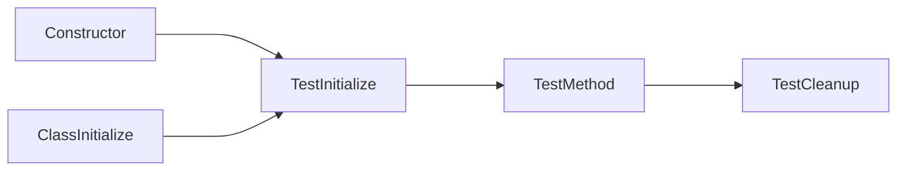

# 单元测试

## 概述

本文主要记录关于.NET各种项目的测试理念和方法，以C#开发语言为主。

.NET是一个多语言开发平台，对于每种语言，可以在几个测试框架中进行选择

1. `xUnit`

   是一个适用于.NET的免费、开源、面向社区的单元测试工具，是针对单元测试.NET应用的最新技术

2. `Nunit`

   是适用于所有.NET语言的单元测试框架，最初从`JUnit`移植而来，当前生产版本已经被重写

3. `MSTest`

   是适用于所有.NET语言的Microsoft测试框架。可以扩展，适用于`.NET CLI`和`Visual Studio`

## 为什么要执行单元测试

1. 比执行功能测试节省时间

   如果不执行单元测试，那么很多情况代码的质量都要依靠功能测试。然而，功能测试通常情况是有测试人员进行人工测试，需要打开应用程序，根据测试用力，遵循一系列的操作步骤进行验证，而且验证结果也是认为判断。这样不仅耗费了测试时间和费用，测试结果也不是很可靠。单元测试只需要一键启动，测试时间远小于功能测试，无需人员参与测试过程，测试结果取决于运行程序，相对可靠

2. 防止回归

   回归缺陷是在对应用程序进行更改时引入的缺陷，通常情况下，测试人员在测试的时候不仅要测试新功能，还要回归测试已有的功能是否受影响，增加了很多的工作量。使用单元测试，每次修改之后，都可以运行一次进行验证，防止引入新的缺陷

3. 可执行文档

   单元测试是一种无价的文档，展示函数或类如何使用的最佳文档，可编译，可运行，保持最新，与代码始终同步

4. 减少耦合代码

   当代码耦合度较高时，可能进行单元测试的时候比较困难，从这个方面反馈出代码结构问题也是比较明显和快捷的

## 优质单元测试的特征

+ 快速 Fast：测试应该快速。因为测试代码可能会频繁运行，如果测试不能很快速进行，就可能导致问题发现不及时等问题
+ 独立 Independent：测试应该相互独立。在同时执行很多测试的时候，测试顺序是随机无序的，但不会并行执行
+ 可重复 Repeatable：测试应该可在任何环境中重复通过。一个测试，应该在任何环境下都能运行通过，不可以设定特殊的运行环境
+ 自足验证 Self-Validating：测试应该由布尔值输出。无论是通过或失败，最好不要依赖人工依赖主观，更多的或者完全的交给测试自足验证
+ 及时 Timely：测试应该及时编写。单元测试应该恰好在使其通过的生产代码之前编写

## 代码覆盖率

### 概述

代码覆盖率，是一种通过计算测试过程中被执行的源代码占全部源代码的比例，进而间接度量软件质量的方法。

根据评价的标准和方法不同，代码覆盖率测试又可以细分为：

+ 语句覆盖 statement coverage
+ 判定覆盖(分支覆盖) decision coverage
+ 条件覆盖 condition coverage
+ 条件判定组合覆盖 condition decision coverage
+ 路径覆盖 path coverage
+ 多条件覆盖 multi-condition coverage
+ 修正条件判定覆盖 modified condition/decision coverage

这些分类中，不同的测试层次，适用不同的判定标准和方法，单元级测试常用的指标主要有：语句覆盖、判定覆盖和修正条件判定覆盖

### 语句覆盖

又称行覆盖，段覆盖，基本快覆盖，最常用也是最常见的一种覆盖方式，就是度量北侧代码中每个可执行语句是否被执行到了。

示例

```c#
int foo(int a, int b)
{
    return a / b;
}
```

上面的代码是待测试的方法体，这里提供一个测试用例`a=10,b=5`，执行单元测试之后，方法体中的每一行代码都被执行一次，所以代码覆盖率是100%。但是，很明显除数为0的情况没有检测，也就是有一个`bug`漏测了，没有被检测出来。

### 判定覆盖

也称为分支覆盖，所有边界覆盖，基本路径覆盖，判定路径覆盖。度量程序中每一个判定的分支是否都被测试到了。

### 条件覆盖

度量判定中的每个子表达式结果`true`和`false`是否被测试到了。

示例

```c#
int foo(int a, int b)
{
    if(a < 10 || b < 10)
    {
        return 0;
    }
    else
    {
        return 1;
    }
}
```

借助这个案例，说明一下判定覆盖和条件覆盖的区别

设计判定覆盖的测试用例时，我们只需要关注的是`if`条件的整体，分别为`true`和`false`即可。

```
TestCase1: a = 5, b = any
TestCase2: a = 15, b = 15
```

按照这两个用例进行测试，分别能够得到返回0和1两种结果，说明两个分支都被测试到了。

设计条件覆盖时，我们需要考虑**各分支中的每一个判定表达式**

```
TestCase1: a = 5, b = 5
TestCase2: a = 15, b = 15
```

一般情况下，这种测试用例最后的覆盖率也是100%，但是对于第一个条件表达式`a < 10`而言，分别有两个值输入，`true`和`false`两种结果也都测试到了，这个没有错误，但是对于另一个表达式`b < 10`，当`a = 5`时，由于两个条件是或的关系，所以实际上并没有执行这个条件表达式，直接将这个分支判定为`true`，当`a = 15`时，表达式`a < 10`的结果为`false`，那就必须要对表达式`b < 10`进行判定，这个时候`b = 15`，判定的结果是`false`。所以如果这么看，两个表达式中，`b < 10`判定为`true`的情况并没有测试到，所以还需要补充一个测试用例

```
TestCase3: a = 15, b = 5
```

这里需要说明一点，条件覆盖不是将判定中的每个表达式的结果进行排列组合，而是只要每个表达式的结果`true`和`false`都被测试到了即可。如果按照排列组合的形式，两个判定条件就应该对应4个测试用例，缺少的另一个用例应该是

```
TestCase4: a = 5, b = 15
```

实际上，这个用例对于条件覆盖而言是多余的，因为这个用例和第一个用例重复了，反正第二个条件表达式都不会执行

这个时候回头看看，条件覆盖和分支覆盖其实有很大的区别，分支覆盖关注的是分支，或者关注的是分支的整体结果，而条件覆盖关注的是每一个条件表达式，可以说和分支有几个或者分支的整体结果没有关系。

### 修正条件判定覆盖

修正条件判定覆盖，要求在一个程序中每一种输入输出至少出现一次，每一个条件必须产生所有可能的输出结果至少一次，并且每一个判定中的每一个条件必须能够独立影响一个判定的输出，即在其他条件不变的前提下仅改变这个条件的值，而使判定结果改变。

### 路径覆盖

又称断言覆盖。度量了是否函数的每一个分支都被执行。

```c#
int foo(int a, int b)
{
    int nReturn = 0;
    if(a < 10)
    {
        nReturn += 1;
    }
    if(b < 10)
    {
        nReturn += 10
    }
    return nReturn;
}
```

针对语句覆盖设计测试用例

```
TestCase a = 5, b = 5 nReturn = 11
```

所有语句都执行一次，语句覆盖率100%

针对判定覆盖设计测试用例

```
TestCase1 a = 5,b = 5 nReturn = 11
TestCase2 a = 15,b = 15 nReturn = 0
```

每一个分支都执行一次，判定覆盖率100%

针对条件覆盖设计测试用例

```
TestCase1 a = 5,b = 15 nReturn = 1
TestCase2 a = 15,b = 5 nReturn = 10
```

每一个判定表达式的两种情况都被测试到，条件覆盖率100%

仔细分析，根据代码的运行结果，可能出现四种情况，`nReturn`可以等于0，1，10，11，但是前面几种测试用例，都不能同时将4中情况同时测出来，说明还是有漏洞。

针对路径覆盖设计测试用例

```
TestCase1 a = 15,b = 15 nReturn = 0
TestCase2 a = 5,b = 15 nReturn = 1
TestCase3 a = 15,b = 5 nReturn = 10
TestCase4 a = 5, b = 5 nReturn = 11
```

这一组测试用例，将所有可能出现的返回值都测试到了，覆盖率100%

## 测试命名

测试的名称应该包括三个部分

+ 要测试的方法的名称
+ 测试的方案
+ 调用方案时的预期行为

### 为什么？

测试代码和生产代码同等重要，而且相比于生产代码，测试代码的可读性更为重要。测试的命名明确地表达了测试的意图。

### 示例

不佳

```C#
[Fact]
public void Test_Single()
{
    var stringCalculator = new StringCalculator();

    var actual = stringCalculator.Add("0");

    Assert.Equal(0, actual);
}
```

优化后

```c#
[Fact]
public void Add_SingleNumber_ReturnsSameNumber()
{
    var stringCalculator = new StringCalculator();

    var actual = stringCalculator.Add("0");

    Assert.Equal(0, actual);
}
```

## 执行测试

`Arrange、Act、Assert`是单元测试时的常见模式，也就是说，一个测试方法主要分为三部分

+ `Arrange`：创建和设置测试需要的数据，包括对象等数据信息
+ `Act`：对创建的数据进行操作，调用被测试的方法
+ `Assert`：断言，对执行的结果和预期的结果进行比对，是否达到预期

### 为什么？

+ 明确地将要测试的内容从`Arrange`和`Assert`步骤分开
+ 降低`Assert`和`Act`代码混杂的可能性

在测试中分离这些操作都明确地突出调用代码所需的依赖项、调用代码的方式以及尝试断言的内容

### 示例

不佳

```c#
[Fact]
public void Add_EmptyString_ReturnsZero()
{
    // Arrange
    var stringCalculator = new StringCalculator();

    // Assert
    Assert.Equal(0, stringCalculator.Add(""));
}
```

优化后

```c#
[Fact]
public void Add_EmptyString_ReturnsZero()
{
    // Arrange
    var stringCalculator = new StringCalculator();

    // Act
    var actual = stringCalculator.Add("");

    // Assert
    Assert.Equal(0, actual);
}
```

## 以最精简的方式编写通过测试

单元测试中使用的输入应为最简单的，便于验证当前正在测试的行为。

### 为什么？

+ 测试对代码库的未来更改更具弹性
+ 更接近与测试行为而不是实现

### 示例

不佳

```c#
[Fact]
public void Add_SingleNumber_ReturnsSameNumber()
{
    var stringCalculator = new StringCalculator();

    var actual = stringCalculator.Add("42");

    Assert.Equal(42, actual);
}
```

优化后

```c#
[Fact]
public void Add_SingleNumber_ReturnsSameNumber()
{
    var stringCalculator = new StringCalculator();

    var actual = stringCalculator.Add("0");

    Assert.Equal(0, actual);
}
```

## 避免使用魔法字符串

单元测试中的命名很重要，最好不要包含`magic`字符串

### 为什么？

+ 测试读者无需检查生产代码即可了解值的特殊之处
+ 明确地显示索要证明的内容，而不是显示要完成的内容

### 示例

不佳

```c#
[Fact]
public void Add_BigNumber_ThrowsException()
{
    var stringCalculator = new StringCalculator();

    Action actual = () => stringCalculator.Add("1001");

    Assert.Throws<OverflowException>(actual);
}
```

优化后

```c#
[Fact]
void Add_MaximumSumResult_ThrowsOverflowException()
{
    var stringCalculator = new StringCalculator();
    const string MAXIMUM_RESULT = "1001";

    Action actual = () => stringCalculator.Add(MAXIMUM_RESULT);

    Assert.Throws<OverflowException>(actual);
}
```

## 测试中应避免逻辑

编写测试时，请避免手动字符串串联、逻辑条件以及其他条件

### 为什么？

+ 降低在测试中引入bug的可能性
+ 专注于最终结果，而不是实现细节

### 示例

不佳

```c#
[Fact]
public void Add_MultipleNumbers_ReturnsCorrectResults()
{
    var stringCalculator = new StringCalculator();
    var expected = 0;
    var testCases = new[]
    {
        "0,0,0",
        "0,1,2",
        "1,2,3"
    };

    foreach (var test in testCases)
    {
        Assert.Equal(expected, stringCalculator.Add(test));
        expected += 3;
    }
}
```

优化后

```c#
[Theory]
[InlineData("0,0,0", 0)]
[InlineData("0,1,2", 3)]
[InlineData("1,2,3", 6)]
public void Add_MultipleNumbers_ReturnsSumOfNumbers(string input, int expected)
{
    var stringCalculator = new StringCalculator();

    var actual = stringCalculator.Add(input);

    Assert.Equal(expected, actual);
}
```

## 使用`helper`代替`setup`和`teardown`

如果测试需要类似的对象或状态，那么比起使用`setup`和`teardown`属性，更推荐使用`helper`方法

### 为什么？

+ 读者阅读测试时产生的困惑减少，因为每个测试中都可以看到所有代码
+ 给定测试的设置过多或过少的可能性降低
+ 在测试之间共享状态的可能性降低

在单元测试的框架中，具体的每一个测试方法执行之前都会调用被`setup`标记的方法，用于执行测试前的操作。测试方法执行完成之后，执行被`teardown`标记的方法，用于执行测试之后的操作。有时候可能是有用的，但是除了增大了阅读障碍之外，每个测试方法有不同的要求，如果所有的测试方法执行前都运行同一个方法，那就迫使每个测试使用完全相同的要求。

*xUnit目前已经删除了`SetUp`*和`TearDown`

### 示例

不佳

```c#
private readonly StringCalculator stringCalculator;
[SetUp]
public StringCalculatorTests()
{
    stringCalculator = new StringCalculator();
}
[Fact]
public void Add_TwoNumbers_ReturnsSumOfNumbers()
{
    var result = stringCalculator.Add("0,1");

    Assert.Equal(1, result);
}
```

优化后

```c#
private StringCalculator CreateDefaultStringCalculator()
{
    return new StringCalculator();
}
[Fact]
public void Add_TwoNumbers_ReturnsSumOfNumbers()
{
    var stringCalculator = CreateDefaultStringCalculator();

    var actual = stringCalculator.Add("0,1");

    Assert.Equal(1, actual);
}
```

根据代码的前后对比，很明显看得出优化后，每个测试方法使用的对象是互不相同的，也就可以实现每个测试方法的不同要求

## 避免多个操作

在编写测试的时候，每次测试只包含一个操作，仅使用一个操作的常用方法包括：

+ 每个操作创建单独的测试
+ 使用参数化测试

### 为什么

+ 当测试失败时，很明显那个行为失败
+ 确保测试仅侧重于单个用例
+ 方便从整体上了解测试失败的原因

一般情况下，每次调用待测试的一个方法都会对应至少一个断言，那么多个操作就需要单独断言多个操作，并且不能保证所有断言都会被执行。在大多数单元测试框架中，一旦断言在单元测试中失败，则正在进行中的测试会自动被视为失败。

### 示例

不佳

```c#
[Fact]
public void Add_EmptyEntries_ShouldBeTreatedAsZero()
{
    // Act
    var actual1 = stringCalculator.Add("");
    var actual2 = stringCalculator.Add(",");

    // Assert
    Assert.Equal(0, actual1);
    Assert.Equal(0, actual2);
}
```

优化后

```c#
[Theory]
[InlineData("", 0)]
[InlineData(",", 0)]
public void Add_EmptyEntries_ShouldBeTreatedAsZero(string input, int expected)
{
    // Arrange
    var stringCalculator = new StringCalculator();

    // Act
    var actual = stringCalculator.Add(input);

    // Assert
    Assert.Equal(expected, actual);
}
```

## 通过单元测试公共方法验证私有方法

在大多数情况下，不需要测试私有方法。私有方法是一个具体的实现环节，一般不孤立存在。更多的时候，存在调用私有方法作为实现部分的公共方法，这个公共方法的测试结果更重要。

```c#
public string ParseLogLine(string input)
{
    var sanitizedInput = TrimInput(input);
    return sanitizedInput;
}

private string TrimInput(string input)
{
    return input.Trim();
}
```

这里有一个私有的方法，可能会首先想到编写一个测试方法来测试这个私有的方法，确保这个方法按预期工作。但是这个方法可能会被不止一个公共或者私有的方法调用，而且调用方式或者其他操作方式可能会有很多种，甚至是意料之外的，那么对这个方法的单独测试就失去了意义。真正有意义的测试则是针对每个调用到这个方法的公开的方法。

```c#
public void ParseLogLine_StartsAndEndsWithSpace_ReturnsTrimmedResult()
{
    var parser = new Parser();

    var result = parser.ParseLogLine(" a ");

    Assert.Equals("a", result);
}
```

## `Stub`静态引用

单元测试的原则之一是其必须完全控制被测试的系统。当生产代码包含对静态引用(例如`DataTime.Now`)的调用时，这个时候可能就会出现一些问题

```C#
public int GetDiscountedPrice(int price)
{
    if (DateTime.Now.DayOfWeek == DayOfWeek.Tuesday)
    {
        return price / 2;
    }
    else
    {
        return price;
    }
}
```

测试代码

```c#
public void GetDiscountedPrice_NotTuesday_ReturnsFullPrice()
{
    var priceCalculator = new PriceCalculator();

    var actual = priceCalculator.GetDiscountedPrice(2);

    Assert.Equals(2, actual)
}

public void GetDiscountedPrice_OnTuesday_ReturnsHalfPrice()
{
    var priceCalculator = new PriceCalculator();

    var actual = priceCalculator.GetDiscountedPrice(2);

    Assert.Equals(1, actual);
}
```

如果按照这种方式进行测试，很遗憾，很明显存在一些问题

+ 如果在星期二运行测试，第二个方法测试通过，第一个测试则失败
+ 如果在其他不是星期二的日期运行测试，第一个方法测试通过，第二个方法测试失败

优化后

```c#
// 生产代码进行优化，在接口中包装需要控制的代码，这样生产代码就依赖于接口
public interface IDateTimeProvider
{
    DayOfWeek DayOfWeek();
}

public int GetDiscountedPrice(int price, IDateTimeProvider dateTimeProvider)
{
    if (dateTimeProvider.DayOfWeek() == DayOfWeek.Tuesday)
    {
        return price / 2;
    }
    else
    {
        return price;
    }
}
// 测试代码
public void GetDiscountedPrice_NotTuesday_ReturnsFullPrice()
{
    var priceCalculator = new PriceCalculator();
    var dateTimeProviderStub = new Mock<IDateTimeProvider>();
    dateTimeProviderStub.Setup(dtp => dtp.DayOfWeek()).Returns(DayOfWeek.Monday);

    var actual = priceCalculator.GetDiscountedPrice(2, dateTimeProviderStub);

    Assert.Equals(2, actual);
}

public void GetDiscountedPrice_OnTuesday_ReturnsHalfPrice()
{
    var priceCalculator = new PriceCalculator();
    var dateTimeProviderStub = new Mock<IDateTimeProvider>();
    dateTimeProviderStub.Setup(dtp => dtp.DayOfWeek()).Returns(DayOfWeek.Tuesday);

    var actual = priceCalculator.GetDiscountedPrice(2, dateTimeProviderStub);

    Assert.Equals(1, actual);
}
```

这样，测试方法就可以完全控制`DataTime.Now`，并且在调用方法时可以存根任何值。

## 主要的单元测试工具

C#单元测试相关的开源软件中，`NUnit`及`XUnit.NET`是开源软件中比较好用的两种，`MsTest`是微软公司开发的集成在`Visual Studio`中的C#单元测试工具。

##  `MsTest`

### 基本介绍

`MSTest`是一款由微软公司开发的单元测试框架，它能够很好地被应用在`Visual Studio`中，并且集成在了`Visual Studio`单元测试框架中，操作简单，上手容易。

从使用的角度来看，如果用户使用的是`Visual Studio`作为`IDE`，那么`MSTest`在对它的集成方面无疑是最方便的，无需下载，无需安装，内置在`vs`的测试框架模板中。在`VS`中使用`MsTest`生成测试项目和新建一个C#项目一样方便；如果用户不使用`VS`，那么也可以通过命令行执行`.exe`文件来执行单元测试，但是`MsTest`不提供自己单独的GUI界面。

### 核心概念

+ `[TestClass]`：通过这个特性来修饰一个类，表明这个类是测试类，一般测试类只包含测试代码
+ `[TestMethod]`：通过这个特性来修饰一个方法，表明这个方法是测试方法
+ `[Assert]`：是一个类，运行于测试一个条件或行为针对预期的结果
+ `[ClassInitialize]`：这个特性修饰的方法，在每个测试类初始化的时候被调用
+ `[ClassCleanup]`：这个特性修饰的方法，是在所有测试类的所有测试方法结束之后同一执行
+ `[TestInitialize]`：这个特性修饰的方法，在每个测试方法之前调用，如果一个测试方法包含了多组用例输入，每组用例执行之前也会调用
+ `[TestCleanup]`：这个特性修饰的方法，在每组测试用例执行结束之后调用
+ `[TestCategory]`：分类测试用例，在列表中可以根据这个分类单独执行
+ `[DataRow]`：为测试用例设置参数，一个测试方法有多组参数输入的时候，可以使用这个特性来输入参数，形成多组用例
+ `[Ignore]`：通过注解等方式跳过执行带有该注解的测试用例
+ `[TimeOut]`：设置单独测试用例的超时时间

### 构建和析构

测试框架执行每个测试用例的时候，会创建测试类对象，测试用例执行完成后，如果测试类实现了接口`IDisposable`，会执行相应的析构函数。

一个测试用例的执行顺序一般是



测试用例的执行是无序的，但是不会并发。

## `NUnit`

### 基本介绍

`NUnit` 是专门针对于.NET 的自动化单元测试框架，是 `XUnit` 家族的一个成员，最初是由Java的单元测是框架`JUnit` 而来，作者最终用C#对其进行重新编写，`NUnit`完全由C# 编写，使其更加符合C＃习惯，并充分利用了.NET中反射、客户属性等特性。因此，该工具具有丰富的单元测试历史的同时，也具有适当的C#风格。

`NUnit`采用分层体系架构，主要有三层：测试运行器层（Test Runner）、测试引擎层（Test Engine）和框架层（Framework），其中，Test Runner层主要包含各种运行程序，包括独立程序和在其它程序下运行的任务或者插件；Test Engine层则是`NUnit`平台的核心，它提供公共`API`，供希望查找，加载和运行测试并显示测试结果的应用程序使用；Framework层主要是为了兼容各个版本的`NUnit`程序。

`NUnit`中主要有三个抽象类：`TestFixtureBuilderAttribute`、`TestCaseBuilderAttribute`和`IncludeExcludeAttribute`。

+ `TestFixtureBuilderAttribute`是任何知道如何从所提供的类中构建某种测试fixture的属性的基类，`testfixture`是指基于用户类的任何测试。
+ `TestCaseBuilderAttribute`是任何知道如何从给定方法构建测试用例的属性的基类。测试用例可以是简单的（没有参数）也可以是参数化的（接受参数），并且总是基于`MethodInfo`。
+ `IncludeExcludeAttribute`是任何用于根据字符串属性`include`、`exclude`和`Reason`来决定是在当前运行中包含测试还是排除的属性的基类，抽象类是使这些属性可供派生类使用，派生类负责对它们采取操作。

### 常见特性

+ `[Test]`：标识一个测试方法
+ `[TestCase]`：在参数化测试中，标识一个测试用例
+ `[TestCaseSource]`：在参数化测试中，标识一个测试用例的参数来源
+ `[TestFixtureSource]`：在参数化测试中，为一个测试脚手架设置参数来源
+ `[SetUp]`：在一个`TestFixture`中，提供运行测试用例之前的统一设置，每次运行一个测试用例之前就会调用一次
+ `[TearDown]`：在一个`TestFixture`中，提供运行测试用例之后的统一操作，每次运行一个测试用例之后就会调用一次
+ `[OneTimeSetUp]`：运行`TestFixture`中任意一个测试用例之前调用一次
+ `[OneTimeTearDown]`：运行`TestFixture`中任意一个测试用例之后调用一次
+ `[Ignore]`：标识一个测试类或方法由于某些原因不应执行

## `XUnit`

### 基本介绍

XUnit .NET是一个开源的的单元测试工具，由NUnit v2的原始发明者编写，支持C#，F#，VB.NET版以及其他.NET语言，由.NET基金会支持，它采用了一种非常独特、现代和灵活的单元测试方法。

XUnit .NET强调编写具有较高的可读性，简单性的单元测试，与其它单元测试框架相比，有一些独特的地方：

XUnit比其他.Net单元测试框架更加灵活和可扩展，它允许创建新的属性来控制测试。XUnit支持两种类型的测试，[Fact]和[Theory]，[Fact]通常用来测试不需要参数的方法，并且在XUnit中，用[Skip]属性代替了[Ignore]，并要求指定跳过该测试的原因；[Theory]支持数据驱动的测试，可以用[InlineData]属性实现参数的传递，并支持多次执行同一个方法，是XUnit可扩展性强的一个重要体现。

### 常用特性

+ `[Fact]`：标识一个方法是测试方法，其中，三个属性

  ```c#
  public class FactAttribute : Attribute
  {
      public FactAttribute();
      
      public virtual string DisplayName { get; set; }
      public virtual string Skip { get; set; }
      public virtual int Timeout { get; set; }
  }
  ```

  `DisplayName`：设置名称，因为测试方法的命名有时候根据一些规则会很繁琐，这个时候使用这个就可以简化在测试方法列表中显示的名称

  `Skip`：如果测试方法被这个标记，就不会执行，直接跳过，详细信息中会显示跳过的原因

  `Timeout`：这对一个测试用例设置超时时间，一般是毫秒为单位，当执行的时间大于设定的时间，测试用例执行失败

+ `[Trait]`：标识不同的分组

+ `[Theory]`：标识执行相同的方法，可具有不同的输入参数

+ `[Data]`：一般搭配`Theory`使用，提供不同的输入参数

  `InlineData`：每一个`InlineData`对应着一组测试数据，针对同一个测试用例，可以设计不同的参数传入

  `MemberData`：

  自定义的

+ `[TestCaseOrder]`：用来自定义测试类中的测试用例的执行顺序

+ `[Collection]`：可将多个测试用例标记为同一个集合，不同的集合会并行执行，但标记为同一个集合内的测试用例则是无序非并行执行

### 共享上下文

因为在同一个测试类或者不同的测试类中，肯定会存在更多的测试方法，相应的需要执行的测试用例就会更多。在每个测试用例执行之前都会执行一定的初始化操作，那么会存在一些问题，对应可能会有用的几个方法：

+ 减少`new`对象，可以在构造函数中`new`，在方法中使用
+ 测试类实现`IDispose`接口，测试完成释放资源，注意每个测试结束后都会调用`Dispose()`方法

这方面的考虑其实和生产代码同理，尽量减少资源的消耗，提高测试效率和准确性

在使用`xUnit`进行单元测试时，有时候我们需要在不同的测试类中进行一些相同的初始化或者清理工作，这些代码成为**测试上下文**，根据范围不同，有三种不同的方式共享测试上下文：

+ 构造函数和析构函数，每个测试都需要一个全新的测试上下文，即每个测试方法共享初始与清理代码，但不需要共享对象实例

+ `Class Fixture`，需要创建一个单例的测试上下文，并在整个测试类的不同测试方法中共享它，最后在这个类所有测试运行完后清理

  使用步骤：

  1. 创建`Fixture`类，将初始化的代码放在这个类的构造函数中
  2. 如果`Fixture`类需要清理，这个类可以实现`IDisposable`接口，在`Dispose()`方法中进行清理操作
  3. 测试类实现`IClassFixture<>`接口
  4. 如果测试类需要用到`Fixture`类中的实例，通过构造函数注入

+ `Collection Fixtures`，需要创建一个单例的测试上下文，并在多个测试类的不同测试方法中共享它，最后在这些类所有测试运行完成后清理

  使用步骤：

  1. 创建`Fixture`类，将初始化的代码放在这个类的构造函数中
  2. 如果`Fixture`类需要清理，这个类可以实现`IDisposable`接口，在`Dispose()`方法中进行清理操作
  3. 创建一个类，打上特性`[CollectionDefinition]`，接受一个字符串参数作为集合名称
  4. 上一步的类实现接口`ICollectionFixture<>`
  5. 对想要共享的测试类，打上特性`[Collection]`，这个特性的参数传入相应的集合名称
  6. 在测试类中，通过构造函数注入`Fixture`实例

1. 同一个测试类

   在执行一个方法时，需要很长时间，而在构造函数中`new`对象的时候，每个测试执行的时候都会`new`对象或者执行方法，这就导致测试很慢

   ```c#
   // 生产代码，只是为了说明问题，在创建对象的时候会耗费比较多的时间
   public class Student
   {
       public Student()
       {
           Thread.Sleep(5000);
       }
   }
   // 测试代码
   public class StudentTests
   {
       private Student _student;
       public StudentTests()
       {
           _student = new Student();
       }
   
       [Fact]
       public void Constructor()
       {
           Assert.Equal(1,1);
       }
       [Fact]
       public void Constructor1()
       {
           Assert.Equal(1, 1);
       }
   }
   ```

   示例中的测试方法，如果全部执行一次，有两个测试方法，但是每个测试方法执行之前都会执行一次构造函数，也就是说每次执行测试方法都会消耗很长的时间来创建对象，这就造成了很大的资源消耗。如果把创建对象这个动作减少或者让这些测试i方法使用同一个实例对象，就可以减少时间。

   ```c#
   // 在测试类所在的项目中增加一个类
   public class StudentFixture : IDisposable
   {
       public Student Student { get;}
   
       public StudentFixture()
       {
           Student = new Student();
       }
   
       public void Dispose()
       {
           //throw new NotImplementedException();
       }
   }
   // 修改原有的测试类
   public class StudentTests : IClassFixture<StudentFixture>
   {
       private Student _student;
       public StudentTests(StudentFixture fixture)
       {
           _student = fixture.Student;
       }
   
       [Fact]
       public void Constructor()
       {
           Assert.Equal(1,1);
       }
       [Fact]
       public void Constructor1()
       {
           Assert.Equal(1, 1);
       }
   }
   ```

   按照这种方式进行修改，可以使创建对象的动作只剩一次，无论创建对象的时间消耗多长时间，只会执行一次，在任意一个测试用例开始执行之前执行。能够很明显的缩短测试执行时间。但是这么做会有一个特点，所有的测试用例使用的对象是同一个，如果存在两个测试方法之间必须使用不同的对象，那么这个方法就不适用了。

2. 不同测试类

   ```c#
   // 创建一个类，打上特性`[CollectionDefinition]`，接受一个字符串参数作为集合名称
   // 实现接口`ICollectionFixture<>`
   [CollectionDefinition("Student Collection")]
   public class CollctionFIxture : ICollectionFixture<StudentFixture>
   {
       // 这个集合类没有代码，也不会被实例化，它存在的意义仅仅是提供集合定义的信息
   }
   // 测试代码
   [Collection("Student Collection")]
   public class StudentTests
   {
       private Student _student;
       public StudentTests(StudentFixture fixture)
       {
           _student = fixture.Student;
       }
   
       [Fact]
       public void Constructor()
       {
           Assert.Equal(1,1);
       }
       [Fact]
       public void Constructor1()
       {
           Assert.Equal(1, 1);
       }
   }
   [Collection("Student Collection")]
   public class StudentTests2
   {
       private Student _student;
       public StudentTests2(StudentFixture fixture)
       {
           _student = fixture.Student;
       }
   
       [Fact]
       public void Constructor()
       {
           Assert.Equal(1, 1);
       }
       [Fact]
       public void Constructor1()
       {
           Assert.Equal(1, 1);
       }
   }
   ```
   
   

### 数据共享

1. 使用`[Theory]`，可以写有构造参数的测试i方法，使用`[InLineData]`传递参数

   ```c#
   [Theory]
   [InlineData(1,2,3)]
   [InlineData(2,2,4)]
   [InlineData(3,3,6)]
   public void ShouldAddEquals(int operand1,int operand2,int expected)
   {
       //Arrange
       var sut = new Calculator(); //sut-system under test
       //Act
       var result = sut.Add(operand1, operand2);
       //Assert
       Assert.Equal(expected, result);
   }
   ```

   这种写法，就会执行三次，三次分别使用三种不同的参数执行测试，方法体写了一次，相当于是三个测试用例

2. 使用`[MemberData]`特性，可以在多个测试中使用

   ```c#
   using System.Collections.Generic;
   
   namespace DemoTest
   {
       public  class CalculatorTestData
       {
           private static readonly List<object[]> Data = new List<object[]>
           {
               new object[]{ 1,2,3},
               new object[]{ 1,3,4},
               new object[]{ 2,4,6},
               new object[]{ 0,1,1},
           };
   
           public static IEnumerable<object[]> TestData => Data;
       }
   }
   
   [Theory]
   [MemberData(nameof(CalculatorTestData.TestData),MemberType =typeof(CalculatorTestData))]
   public void ShouldAddEquals2(int operand1, int operand2, int expected)
   {
       //Arrange
       var sut = new Calculator(); //sut-system under test
       //Act
       var result = sut.Add(operand1, operand2);
       //Assert
       Assert.Equal(expected, result);
   }
   ```

3. 使用外部数据

   ```c#
   using System.Collections.Generic;
   using System.IO;
   using System.Linq;
   
   namespace DemoTest.Data
   {
       /// <summary>
       /// 读取文件并返回数据集合
       /// </summary>
       public class CalculatorCsvData
       {
           public static IEnumerable<object[]> TestData
           {
               get
               {
   	            //把csv文件中的数据读出来，转换
                   string[] csvLines = File.ReadAllLines("Data\\TestData.csv");
                   var testCases = new List<object[]>();
                   foreach (var csvLine in csvLines)
                   {
                       IEnumerable<int> values = csvLine.Trim().Split(',').Select(int.Parse);
                       object[] testCase = values.Cast<object>().ToArray();
                       testCases.Add(testCase);
                   }
                   return testCases;
               }
           }
       }
   }
   
   [Theory]
   [MemberData(nameof(CalculatorCsvData.TestData), MemberType = typeof(CalculatorCsvData))]
   public void ShouldAddEquals3(int operand1, int operand2, int expected)
   {
       //Arrange
       var sut = new Calculator(); //sut-system under test
       //Act
       var result = sut.Add(operand1, operand2);
       //Assert
       Assert.Equal(expected, result);
   }
   
   ```

4. 使用自定义特性，继承自`DataAttribute`

   ```c#
   using System.Collections.Generic;
   using System.Reflection;
   using Xunit.Sdk;
   
   namespace DemoTest.Data
   {
       public class CalculatorDataAttribute : DataAttribute
       {
           public override IEnumerable<object[]> GetData(MethodInfo testMethod)
           {
               yield return new object[] { 0, 100, 100 };
               yield return new object[] { 1, 99, 100 };
               yield return new object[] { 2, 98, 100 };
               yield return new object[] { 3, 97, 100 };
           }
       }
   }
   
   [Theory]
   [CalculatorDataAttribute]
   public void ShouldAddEquals4(int operand1, int operand2, int expected)
   {
       //Arrange
       var sut = new Calculator(); //sut-system under test
       //Act
       var result = sut.Add(operand1, operand2);
       //Assert
       Assert.Equal(expected, result);
   }
   
   ```

   这里关于特性的创建和使用暂不做说明

## `Assert`

### 布尔值判断

```C#
[Fact]
[Trait("Category","New")]
public void BeNewWhenCreated()
{
    _output.WriteLine("第一个测试");
    // Arrange
    var patient = new Patient();
    // Act
    var result = patient.IsNew;
    // Assert
    Assert.True(result);
    //sert.False(result);
}
```

### 字符串结果判断

```C#
[Fact]
public void HaveCorrectFullName()
{
    //var patient = new Patient();
    _patient.FirstName = "Nick";
    _patient.LastName = "Carter";
    var fullName = _patient.FullName;
    Assert.Equal("Nick Carter", fullName); //相等
    Assert.StartsWith("Nick", fullName);//以开头
    Assert.EndsWith("Carter", fullName);//以结尾
    Assert.Contains("Carter", fullName);//包含
    Assert.Contains("Car", fullName);
    Assert.NotEqual("CAR", fullName);//不相等
    Assert.Matches(@"^[A-Z][a-z]*\s[A-Z][a-z]*", fullName);//正则表达式
}
```

### 数字结果判断

```C#
[Fact]
[Trait("Category", "New")]
public void HaveDefaultBloodSugarWhenCreated()
{
    var p = new Patient();
    var bloodSugar = p.BloodSugar;
    Assert.Equal(4.9f, bloodSugar,5); //判断是否相等
    Assert.InRange(bloodSugar, 3.9, 6.1);//判断是否在某一范围内
}
```

### `null`值判断

```C#
[Fact]
public void HaveNoNameWhenCreated()
{
    var p = new Patient();
    Assert.Null(p.FirstName);
    Assert.NotNull(_patient);
}
```

### 集合测试

```c#
[Fact]
public void HaveHadAColdBefore()
{
	//Arrange
    var _patient = new Patient();
    
	//Act
	var diseases = new List<string>
    {
        "感冒",
        "发烧",
        "水痘",
        "腹泻"
    };
    _patient.History.Add("发烧");
    _patient.History.Add("感冒");
    _patient.History.Add("水痘");
    _patient.History.Add("腹泻");
    
	//Assert
	//判断集合是否含有或者不含有某个元素
    Assert.Contains("感冒",_patient.History);
    Assert.DoesNotContain("心脏病", _patient.History);

    //判断p.History至少有一个元素，该元素以水开头
    Assert.Contains(_patient.History, x => x.StartsWith("水"));
	//判断集合的长度
    Assert.All(_patient.History, x => Assert.True(x.Length >= 2));

    //判断集合是否相等,这里测试通过，说明是比较集合元素的值，而不是比较引用
    Assert.Equal(diseases, _patient.History);

}
```

### 对象测试

```c#
/// <summary>
/// 测试Object
/// </summary>
[Fact]
public void BeAPerson()
{
    var p = new Patient();
    var p2 = new Patient();
    Assert.IsNotType<Person>(p); //测试对象是否相等，注意这里为false
    Assert.IsType<Patient>(p);

    Assert.IsAssignableFrom<Person>(p);//判断对象是否继承自Person,true

    //判断是否为同一个实例
    Assert.NotSame(p, p2);
    //Assert.Same(p, p2);

}
```

### 异常判断

```c#
/// <summary>
/// 判断是否发生异常
/// </summary>
[Fact]
public void ThrowException() //注意不能使用ctrl+R,T快捷键,因为会中断测试，抛出异常
{
    var p = new Patient();
    //判断是否返回指定类型的异常
    var ex = Assert.Throws<InvalidOperationException>(()=> { p.NotAllowed(); });
    //判断异常信息是否相等
    Assert.Equal("not able to create", ex.Message);
}
```

### 事件触发判断

```C#
/// <summary>
/// 判断是否触发事件
/// </summary>
[Fact]
public void RaizeSleepEvent()
{
    var p = new Patient();
    Assert.Raises<EventArgs>(
        handler=>p.PatientSlept+=handler,
        handler=>p.PatientSlept -= handler,
        () => p.Sleep());
}
```

```c#
/// <summary>
/// 测试属性改变事件是否触发
/// </summary>
[Fact]
public void RaisePropertyChangedEvent()
{
    var p = new Patient();
    Assert.PropertyChanged(p, nameof(p.HeartBeatRate),
                           () => p.IncreaseHeartBeatRate());
}
```

## 测试用例

### 什么是测试用例

指的是对一项特定的软件产品进行测试任务的描述，体现测试方案、方法和策略。简单地认为，测试用例是为了某个特殊目标而编制的一组测试输入、执行条件以及预期结果，用于核实是否满足某个特定软件需求

### 需要具备哪些方面

编写测试用例的八大要素：用例编号，所属模块，测试标题，重要级别，前置条件，测试输入，操作步骤，预期结果
