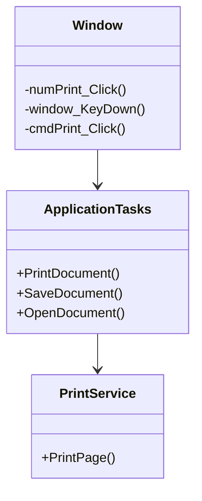

# CSharp

## 数据绑定

1. 数据绑定是一种关系，从源对象提取一些信息，并用这些信息设置目标对象的属性，是应用程序UI与业务逻辑之间建立连接的过程。

   1. 数据和数据之间交互的简单而一致的方法
   2. 元素能够以公共语言运行时CLR对象和XML的形式绑定到各种数据源中的数据
   3. 元素中数据的外部表现形式发生更改，则基础数据可以自动刚更新以反映更改
   4. 典型用法是将服务器或本地配置数据放置到窗体或其他UI控件中

2. 基础模型

   ```mermaid
   graph LR
    subgraph A[绑定目标]
        subgraph A1[DependencyObject]
         1[依赖项属性]
        end
    end
    subgraph B[绑定源]
        2[属性]
    end
    1 --绑定对象--> 2
    2 --绑定对象--> 1
   ```

   每个绑定有四个组件：绑定目标对象，目标属性(依赖项属性)，绑定源，绑定源值路径

3. 数据流方向

   ```mermaid
   graph LR
    subgraph A[绑定目标]
        subgraph A1[DependencyObject]
            1[依赖项属性]
        end
    end
    subgraph B[绑定源]
        subgraph B1[对象]
            2[属性]
        end
    end
       1 ==TwoWay=== 2
       2 --OneWay--> 1
       1 --OneWayToSource--> 2
   ```

   1. OneWay：绑定导致对源属性的更改会自动更新目标属性，但是对目标属性的更改不会传播回源属性。
   2. TwoWay：绑定导致对源属性的更改会自动更新目标属性，而对目标属性的更改会也自动更新源属性。
   3. OneWayToSource：与OneWay方向相反。
   4. OneTime：源属性初始化目标属性，不传播后续更改。

4. 触发源的更新情况

   | 名称            | 说明                                                         |
   | --------------- | ------------------------------------------------------------ |
   | PropertyChanged | 当目标属性发生变化时立即更新源                               |
   | LostFocus       | 当目标属性发生变化并且目标丢失焦点时更新源                   |
   | Explicit        | 除非调用BindingExpression.UpdateSource()方法，否则无法更新源 |

5. 创建绑定

   绑定源

   1. 在元素上直接设置DataContext属性，从上级继承DataContext值
   2. 通过设置Binding上的Source属性来显示指定绑定源
   3. 使用ElementName属性或者RelativeSource属性指定绑定源

## 依赖项属性

1. 定义依赖项属性

   1. 定义表示属性的对象，DependencyProperty类的实例

      ```c#
      public static readonly DependencyProperty MarginProperty;
      ```

      根据约定，依赖项属性的字段的名称是在普通属性的末尾处加上单词Property

   2. 注册依赖项属性

      在任何使用属性的代码之前完成注册-在相关联的类的静态构造函数中进行

      ```c#
      static FrameworkElement()
      {
          FrameworkPropertyMetadata metadata = new FrameworkPropertyMetadata(new Thickness(),FrameworkPropertyMetadataOptions.AffectMeasure);
          MarginProperty = DependencyProperty.Register("Margin",typeof(Thickness),typeof(FrameworkElement),metadata,new ValidateValueCallback(FrameworkElement.IsMarginValid));
      }
      ```

      1. 属性名称
      2. 属性使用的数据类型
      3. 拥有该属性的类型
      4. 一个具有附加属性设置的FrameworkPropertyMetadata对象，该要素是可选的
      5. 一个用于验证属性的回调函数，可选

   3. 添加属性包装器

      相对与传统的.NET属性(典型的属性过程是检索或设置某个私有字段的值)，WPF依赖项属性的属性过程是使用在DependencyObject基类中定义的GetValue和SetValue方法。

      ```c#
      public Thickness Margin
      {
          set{SetValue(MarginProperty,value);}
          get{return (Thickness)GetValue(MarginProperty);}
      }
      ```

      创建属性封装器时，应当只包含SetValue和GetValue方法的调用。

2. 使用依赖项属性

   WPF的许多功能使用依赖项属性都是通过每个属性都支持的两个关键行为——更改通知和动态值识别

   1. 更改通知(值发生变化的时候执行的具体动作)

      依赖项属性的值发生变化的时候，会触发受保护的名为OnPropertyChangeCallback()的方法。

      *************************依赖项属性不会自动引发事件以通知属性值发生了变化，一可以使用属性值创建绑定，二可以编写能够自动改变其他属性或开始动画的触发器

   2. 动态识别值

      依赖项属性依赖于多个属性提供者，每个提供者都有各自的优先级。

      优先级从低到高的顺序：

      1). 默认值(由FrameworkPropertyMetadata对象设置的值)

      2). 继承而来的值

      3). 来自主题样式的值

      4). 来自项目样式的值

      5). 本地值(使用代码或者XAML直接为对象设置的值)

      WPF决定属性值的四个步骤：

      1). 确定基本值

      2). 如果属性是使用表达式设置的，就对表达式进行求值(目前支持数据绑定和资源)

      3). 如果属性是动画的目标，就应用动画

      4). 运行CoreceValueCallback回调函数来修正属性值

   3. 具体代码

      ```c#
      //申明依赖项属性
      public static readonly DependencyProperty TestProperty;
      //注册依赖项属性
      FrameworkPropertyMetadata meta = new FrameworkPropertyMetadata();
      meta.DefaultValue = 100;
      meta.CoerceValueCallback = new CoerceCallback(TestPropertyCoerceValueCallback);
      meta.PropertyChangedCallback = new PropertyChangedCallback(TestPropertyPropertyChangedCallback);

      TestProperty = DependencyProperty.Register("Test",typeof(int),typeof(CurrentClass),meta,new ValidateValueCallback(TestPropertyValidateValueCallback));

      //回调函数,属性注册时执行，属性数据改变时执行
      //验证依赖项属性的值的类型和格式是否有效，有效返回true，无效返回false
      private static bool TestPropertyValidateValueCallback(object value)
      {
          //具体执行的操作
          return true;
      }

      //在ValidateValueCallback之后执行，可以对属性值做详细验证
      private static object TestPropertyCoerceValueCallback(DenpendncyObject sender,object value)
      {
          //这个回调函数必须返回object
          return value;
      }

      //属性值发生变化时执行
      private static void TestPropertyChangedCallback(DependencyObject d,DependencyPropertyChangedEventArgs e)
      {
          //最后执行
      }

      //包装依赖项属性
      public int Test
      {
          get { return (int)GetValue(TestProperty);}
          set { SetValue(TestProperty,value);}
      }
      ```

   4. 附加的依赖项属性

      附加属性是一类特殊的依赖项属性，由WPF属性系统管理，不同之处在于附加属性被应用到的类并非定义附加属性的类。

      ```C#
      //Grid类定义了Row和Column附加属性，被用于设置面板包含的元素应被放到哪个单元格
      class Grid
      {
          FrameworkPropertyMetadata meta = new FrameworkPropertyMetadata();
          public static DependencyProperty Row;
          public static DependencyProperty Column;
          Row = DependencyProperty.RegisterAttached("Row",typeof(int),typeof(Gird),meta,new ValidateValueCallback(Grid.IsIntValueNotNegative));
          //Column属性的注册同Row
      }
      //DockPanel类定义了Dock附加属性
      class DockPanel
      {
          public static DependencyProperty Dock;
          //具体的注册省略，使用DependencyProperty.RegisterAttached
      }
      //Canvas类定义了Left、Right、Top和Button附加属性
      class Canvas
      {
          public static DependencyProperty Left;
          public static DependencyProperty Right;
          public static DependencyProperty Top;
          public static DependencyProperty Button;
          //具体的注册省略，使用DependencyProperty.RegisterAttached
      }
      ```

      附加属性和依赖项属性的区别：

      1. 附加属性和依赖项属性的注册方法不同
      2. 包装方式不同。(依赖项属性的包装同普通的属性，通过属性自身获取或者设置属性值，只有定义和注册的类可以使用该属性；附加属性的包装方式不同于普通属性，要重新写两个get和set的方法，以达到获取和设置属性值的作用，这两个方法是公有静态的，所以不止当前的类可以用)

   5. 属性验证

      WPF提供了两种方法验证依赖项属性的值是否非法：ValidateValueCallback和CoerceValueCallback

      1. 首先，CoerceValueCallback方法有机会修改提供的值
      2. 接下来激活ValidateValueCallback方法，由于不能设置属性的具体对象，不能检查其他属性值
      3. 最后，前两个阶段如果都成功，就会触发PropertyChangedCallback方法，引发更改事件。

## 命令

   在应用程序中，使用路由事件可以响应广泛的鼠标和键盘动作，但是，事件是非常低级的元素，在实际应用中，功能被划分为一些高级的任务，可以通过各种不同的动作和用户界面元素触发，包括菜单，上下文菜单，键盘快捷键以及工具栏。这些任务就是所谓的命令，将控件连接到命令，从而不需要重复编写事件处理代码。



   1. 命令模型

      1. 命令：表示应用程序任务，并且跟踪任务是否能够被执行，然而命令实际上不包含执行应用程序任务的代码。
      2. 命令绑定：每个命令绑定针对用户界面的具体区域，将命令连接到相关的应用程序逻辑。
      3. 命令源：命令源触发命令。
      4. 命令目标：在其中执行命令的元素。

      ```C#
      //WPF命令模型的核心System.Windows.Input.ICommand
      public interface ICommand
      {
          //应用程序任务逻辑
          void Execute(object parameter);
          //返回命令的状态，可用返回true，不可用返回false
          bool CanExecute(object parameter);
          //命令状态改变时引发这个事件
          event EventHandler CanExecuteChanged;
      }

      //RoutedCommand
      //唯一一个实现了ICommand接口的类，该类中不包含任何应用程序逻辑，只代表命令。
      //RoutedUICommand类继承自RoutedCommand类，用于具有文本的命令，文本显示在用户界面中的某些地方
      ```

      命令库

      每个应用程序都有大量的命令，但是很多命令是通用的，WPF提供了基本命令库

      | 名称                | 说明                                       |
      | ------------------- | ------------------------------------------ |
      | ApplicationCommands | 通用命令，copy,cut,paste...                |
      | NavigationCommands  | 导航命令                                   |
      | EditingCommands     | 文档编辑命令                               |
      | ComponentCommands   | 由用户界面使用的命令，移动和选择内容的命令 |
      | MediaCommands       | 处理多媒体的命令                           |

      开始使用一个命令，必须做三件事：

      1. 定义一个命令
      2. 定义命令的实现
      3. 为命令创建一个触发器

      自定义命令的步骤：

      1. 创建命令类：如果没有涉及到业务逻辑，一般使用WPF中RouteCommand类，如果要声明一些复杂的类，可以实现RouteCommand类的继承或者ICommand类。
      2. 声明命令实例：一般情况下，命令是普遍使用的，在程序中只需要有一个实例即可，单例模式
      3. 指明命令的源：通常是可以点击的控件
      4. 指明命令的目标：命令的作用对象
      5. 设置命令关联：

   2. 执行命令

      1). 命令源

         为了触发命令，需要由命令源，最简单的方法就是将命令关联到实现了ICommandSource接口的控件。

         ICommandSource接口定义了三个属性，Command(指向连接的命令，唯一必须)；CommandParameter(提供其他希望随命令发送的数据)；CommadnTarget(确定将在其中执行命令的元素)

        ``` xaml
          <button command = "ApplicationCommands.New">New</button>
        ```

      2). 命令绑定

         当将命令关联到命令源时，命令源会自动禁用

         ```C#
         //create the binding
         CommandBinding commandBinding = new CommandBinding(ApplicationCommands.New);
         //attach the event handler
         //因为ApplicationCommands.New只是个命令，没有实现命令的具体操作
         commandBinding.Executed += NewCommand_Executed;
         //register the binding
         this.CommandBindings.Add(commandBinding);
         private void NewCommand_Executed(object sender, ExecuteRoutedEventArgs args)
         {
             MessageBox.Show("new command triggered by " + args.Source.Tostring());
         }
         ```

## 消息和事件

消息Message就是用于描述某个事件所发生的信息，事件Event则是用户操作应用程序产生的动作或Windows系统自身所产生的动作。事件是原因，消息是结果，事件产生消息，消息对应事件。

1. 消息基础概念

   消息源：消息的来源，发出这个消息的对象

   消息名：消息的唯一标示

   消息数据：消息发出后附带的数据，有可能是空数据

   消息的分类：

   系统消息：操作系统发送出来的消息，消息名称是固定的

   自定义消息：有开发者自己定义，消息名称可以任意定义

## 路由事件

相对于传统的简单的事件模型，事件的响应者使用事件处理器做出响应，如果事件的宿主不能直接访问事件的响应者，用户控件的内部事件不能被外部访问，简单事件模型就出现了问题。路由事件的事件拥有者和事件的响应者之间没有直接的显示订阅关系，时间的额拥有者只负责激发事件，事件的响应者则使用事件监听器对事件进行监听。

路由事件出现的三种方式：

1. 直接路由事件：源于一个元素，不传递给其他元素。
2. 冒泡路由事件：在包含层次中向上传递
3. 隧道路由事件：在包含层次中向下传递

```C#
//定义、注册和封装路由事件
public abstract class ButtonBase : ContenControl,...
{
    //The event definition
    public static readonly RoutedEvent ClickEvent;
    //The event registration
    /*
    第一个参数为路由事件的名称
    第二个参数是路由事件的策略，事件的传递方式
    第三个参数用于指定事件处理器的类型
    第四个参数用于指定事件的宿主是哪种类型
    */
    static ButtonBase()
    {
        ButtonBase.ClickEvent = EventManager.RegisterRoutedEvent(
        "CLick",RoutingStrategy.Bubble,typeof(RoutedEventHandler),typeof(ButtonBase));
        ...
    }
    //The traditional event wrapper
    public event RoutedEventHandler Click
    {
        add
        {
            base.AddHandler(ButtonBase.ClickEvent,value);
        }
        remove
        {
            base.RemoveHandler(ButtonBase.ClickEvent,value);
        }
    }
}

//共享路由事件
UIEvent.MouseUpEvent = Mouse.MouseUpEvent.AddOwner(typeof(UIEvent));

//处理，引发路由事件
//XAML
<Image Source="happyface.jpg" Stretch="None" Name="img" MouseUp="img_MouseUp"/>
//cs
img.MouseUp += new MouseButtonEventHandler(img_MouseUp);//img.MouseUp+=img_MouseUp;
//事件封装器cs
img.AddHandler(Image.MouseUpEvent, new MouseButtonEventHandler(img_MouseUp));

//断开事件连接
img.MouseUp -= img_MouseUp;
img.RemoveHandler(Image.MouseUpEvent, new MouseButtonEventHandler(img_MouseUp));
```

## 事件路由

事件的路由指引发事件后事件的传递，同传统的.NET事件相比，除了直接路由外，由于元素的层次嵌套，引发事件的元素可以在层次中向上或者向下传递事件的引发信号，从而引发嵌套元素中响应的事件或者执行同样的事件处理器。

*如果事件在执行到某个节点的时候不希望继续传递下去，设置Handed属性即可

## WPF事件

1. 生命周期事件：元素被初始化、加载或卸载时发生这些事件
2. 鼠标事件：鼠标动作的结果
3. 键盘事件：键盘动作的结果
4. 手写笔事件：手写笔动作的结果
5. 多点触控事件：win7中，一根或者多根手指在多点触控屏幕上触摸的结果

## 属性

## 模板

开发人员在进行桌面应用开发的时候，使用控件必须在方便性和灵活性之间做出选择。所谓的方便性，就是使用预先设定好的控件，可以减少一定的开发过程。但是这些控件几乎具有固定的可视化外观，可定制性有限。所谓的灵活性，就是希望实现一些更特殊效果的自定义控件。

最终，通过**样式**和**模板**解决了控件的自定义问题。也就是说，模板的主要功能就是对不同的控件进行定制化，修改控件的各种属性。

1. 逻辑树和可视化树

   ```C#
   <Window x:Class="WpfApp1.MainWindow"
           xmlns="http://schemas.microsoft.com/winfx/2006/xaml/presentation"
           xmlns:x="http://schemas.microsoft.com/winfx/2006/xaml"
           xmlns:d="http://schemas.microsoft.com/expression/blend/2008"
           xmlns:mc="http://schemas.openxmlformats.org/markup-compatibility/2006"
           xmlns:local="clr-namespace:WpfApp1"
           mc:Ignorable="d"
           Title="MainWindow" Height="450" Width="800">
       <Grid>
           <StackPanel>
               <Button Content="逻辑树" Click="Button_Click"/>
               <Button Content="可视化树" Click="Button_Click_1"/>
           </StackPanel>
       </Grid>
   </Window>
   ```

   这个例子中，很简单的界面布局，在窗口中嵌套了一个`StackPanel`控件，在`StackPanel`控件中放置了两个`Button`控件。

   添加的元素分类称为**逻辑树**，下面的图展示这种情况下的逻辑树。

   可视化树是逻辑树的扩展版本，将元素分成更小的部分。

   ```mermaid
   graph TB
   	Window --- StackPanel --- Button
   	StackPanel --- Button1
   	Button --- String
   	Button1 --- String1
   ```

   

   ```mermaid
   graph TB
   	Window --- StackPanel --- Button
   	StackPanel --- Button1
   	Button --- ButtonChrome --- ContentPresenter --- TextBlock --- String
   	Button1 --- ButtonChrome1 --- ContentPresenter1 --- TextBlock1 --- String1
   ```

   逻辑树的作用：描述了界面的整体框架，WPF大部分特性都是通过逻辑树进行工作的

   可视化树的作用：描述了界面的所有细节，使用样式可以改变视觉树上的元素。

2. 模板类型

   在WPF中，实际上有三种类型的模板，所有这些模板都继承自`FrameworkTemplate`基类。一个是控件模板(`ControlTemplate`类)，一个是数据模板(`DataTemplate`类和`HierarchicalDataTemplate`类)，以及更特殊的面板模板(`ItemsPanelTemplate`类)。

## 触发器

WPF中有个主题，就是以声明方式扩展代码的功能。当使用样式、资源或数据绑定时，讲发现即使不使用代码，也能完成不少工作。触发器是另一个实现这种功能的例子。使用触发器，可自动完成简单的样式改变，而这通常需要使用样板事件处理逻辑。

| 名称             | 说明                                                         |
| ---------------- | ------------------------------------------------------------ |
| Trigger          | 一种最简单的触发器。可以监测依赖项属性的变化，然后使用设置器改变样式 |
| MultiTrigger     | 联合了多个条件，只有满足了所有这些条件，才会启动触发器       |
| DataTrigger      | 使用数据绑定，监测的是任意绑定数据的变化                     |
| MultiDataTrigger | 联合多个数据触发器                                           |
| EventTrigger     | 最复杂的触发器，当事件发生时，这种触发器应用动画             |

1. 简单触发器

   示例：界面上有一个`TextBlock`，设置其`Foreground`属性为蓝色。添加一个触发器，监听的属性是`IsMouseOver`，这个属性发生变为`True`时，将`Foreground`属性改为红色，并增加下划线，字体变大。

   ```xaml
   <!--静态资源，添加样式-->
   <Window.Resources>
       <Style x:Key="TB" TargetType="TextBlock">
           <Setter Property="Foreground" Value="Blue"/>
           <Style.Triggers>
               <Trigger Property="IsMouseOver" Value="True">
                   <Setter Property="FontWeight" Value="ExtraBlack"/>
                   <Setter Property="Foreground" Value="Red" />
                   <Setter Property="TextDecorations" Value="Underline" />
               </Trigger>
           </Style.Triggers>
       </Style>
   </Window.Resources>
   <!--界面代码，添加一个控件-->
   <Grid>
       <StackPanel>
           <TextBlock Style="{StaticResource TB}" Text="www.baidu.com" TextAlignment="Center" FontSize="28"/>
       </StackPanel>
   </Grid>
   ```

   属性`IsMouseOver`的意思是鼠标悬浮在控件上的时候，其值为`true`。

   方案一

   ```xaml
   <Border Width="100" Height="30" BorderBrush="Blue" BorderThickness="3">
       <Border.Style>
           <Style TargetType="Border">
               <Style.Setters>
                   <Setter Property="Background" Value="Green" />
               </Style.Setters>
               <Style.Triggers>
                   <Trigger Property="IsMouseOver" Value="True">
                   	<Setter Property="BorderBrush" Value="Red" />
                       <Setter Property="BorderThickness" Value="3" />
                   </Trigger>
               </Style.Triggers>
           </Style>
       </Border.Style>
   </Border>
   ```

   方案二

   ```xaml
   <Border Width="100" Height="30">
       <Border.Style>
           <Style TargetType="Border">
               <Style.Setters>
                   <Setter Property="Background" Value="Green" />
                   <Setter Property="BorderBrush" Value="Blue" />
                   <Setter Property="BorderThickness" Value="3" />
               </Style.Setters>
               <Style.Triggers>
                   <Trigger Property="IsMouseOver" Value="True">
                   	<Setter Property="BorderBrush" Value="Red" />
                       <Setter Property="BorderThickness" Value="3" />
                   </Trigger>
               </Style.Triggers>
           </Style>
       </Border.Style>
   </Border>
   ```

   对比这两种写法，不同的地方是`Border`元素的`BorderBrush`属性和`BorderThickness`属性的声明方式，按照方案一运行后边框一直显示最开始设置的蓝色，方案二在运行时鼠标移入时边框颜色会变成红色。

   为什么会出现这种情况呢？我们进一步探索和验证

   方案三

   ```xaml
   <Border Width="100" Height="30" BorderBrush="Orange" BorderThickness="3">
       <Border.Style>
           <Style TargetType="Border">
               <Style.Setters>
                   <Setter Property="Background" Value="Green" />
                   <Setter Property="BorderBrush" Value="Blue" />
                   <Setter Property="BorderThickness" Value="3" />
               </Style.Setters>
               <Style.Triggers>
                   <Trigger Property="IsMouseOver" Value="True">
                   	<Setter Property="BorderBrush" Value="Red" />
                       <Setter Property="BorderThickness" Value="3" />
                   </Trigger>
               </Style.Triggers>
           </Style>
       </Border.Style>
   </Border>
   ```

   在方案二的基础上，加入两个本地属性，设置为橙色。运行起来之后，边框的颜色一直显示为橙色。

   因为WPF中允许多个地方设置依赖属性的值，这就涉及到优先级的问题，也就是说本地属性的优先级要高于`Setter`设置的值，而默认`Style.Setter`的优先级又高于`Style.Trigger`中设置的值，这种优先级在所有的触发器中都适用。

   关于依赖属性的设置值的优先级如图(优先级从左到右)

   ```mermaid
   graph TB
   	动画
       绑定
       本地值
   	自定义StyleTrigger
   	自定义TemplateTrigger
       自定义StyleSetter
   	默认StyleTrigger
       默认StyleSetter
       继承值
       默认值
   ```

   当多个触发器设置同一个属性值的时候，触发器在标记中的排列顺序决定了最终显示的效果。

2. 多条件触发器

   就是普通触发器进行简单的组合，然后进行`&&`运算，当所有条件都满足时发出`Setter`设置的属性

   ```xaml
   <CheckBox>
   	<CheckBox.Style>
       	<Style.Setters>
           	<Setter Property="BorderBrush" Value="Blue" />
               <Setter Property="BorderThickness" Value="3" />
           </Style.Setters>
           <Style.Triggers>
           	<MultiTrigger>
               	<MultiTrigger.Conditions>
                   	<Condition Property="IsVisible" Value="True" />
                       <Condition Property="IsChecked" Value="False" />
                   </MultiTrigger.Conditions>
                   <MultiTrigger.Setters>
                   	<Setter Property="BorderBrush" Value="Red" />
                       <Setter Property="BorderThickness" Value="3" />
                   </MultiTrigger.Setters>
               </MultiTrigger>
           </Style.Triggers>
       </CheckBox.Style>
   </CheckBox>
   ```

   这种情况下，只有当控件处于可见状态并且选中时，复选框的边框呈现红色。

3. 数据触发器

   和简单触发器一样，当到达设置的某个条件时，进行样式的更改，或者动画的触发。

   ```xaml
   <TextBox Margin="16 0 0 0" Width="80">
   	<TextBox.Style>
       	<Style TargetType="TextBox">
           	<Style.Setters>
               	<Setter Property="Foreground" Value="Green" />
               </Style.Setters>
               <Style.Triggers>
               	<DataTrigger Binding="{Binding RelativeSource={RelativeSource Self},Path=Text}" Value="5">
                   	<Setter Property="Foreground" Value="OrangeRed" />
                   </DataTrigger>
               </Style.Triggers>
           </Style>
       </TextBox.Style>
   </TextBox>
   ```

   实例中展示的意思是，当文本框中输入的数字是5的时候将字体颜色设置为橙红色，其余时候为绿色。

4. 多条件数据触发器

   在数据绑定中，触发条件可以使用绑定，这就意味着触发条件可以是多个，除了绑定自身的属性之外，还可以绑定其他元素的属性，使用`ElementName`进行绑定，或者我们干脆直接绑定后台属性。

5. 事件触发器

   事件触发器和其他几个触发器相比是一个比较特殊的触发器，使用的目的不是为了直接改变某个依赖属性的值，而是缓慢改变，具有一个动画效果，用于触发一段动画。

## 实现`MVVM`

   在winform中，基于事件实现，下面的例子是wpf项目，基于事件实现的计算器

   ```c#
   //wpf中，界面布局使用XAML文件格式
   <Window x:Class="WpfCalc.MainWindow"
           xmlns="http://schemas.microsoft.com/winfx/2006/xaml/presentation"
           xmlns:x="http://schemas.microsoft.com/winfx/2006/xaml"
           xmlns:d="http://schemas.microsoft.com/expression/blend/2008"
           xmlns:mc="http://schemas.openxmlformats.org/markup-compatibility/2006"
           xmlns:local="clr-namespace:WpfCalc"
           mc:Ignorable="d"
           FontSize="18"
           Title="MainWindow" Height="450" Width="800">
       <Grid>
           <StackPanel>
               <StackPanel Orientation="Horizontal">
                   <TextBlock>
                       <TextBlock.Text>第一个数</TextBlock.Text>
                   </TextBlock>
                   <TextBox x:Name="txtNumber1" Width="200">
                   </TextBox>
               </StackPanel>
               <StackPanel Orientation="Horizontal" Margin="0,10,0,0">
                   <TextBlock>
                       <TextBlock.Text>第二个数</TextBlock.Text>
                   </TextBlock>
                   <TextBox x:Name="txtNumber2" Width="200">
                   </TextBox>
               </StackPanel>
               <StackPanel Orientation="Horizontal" Margin="0,10,0,0">
                   <TextBlock>
                       <TextBlock.Text>结果</TextBlock.Text>
                   </TextBlock>
                   <TextBox x:Name="txtResult" Width="200">
                   </TextBox>
               </StackPanel>
               <StackPanel HorizontalAlignment="Left" Margin="0,10,0,0">
                   <Button Click="Button_Click">
                       <Button.Content>计算</Button.Content>
                       <Button.Width>200</Button.Width>                    
                   </Button>
               </StackPanel>
           </StackPanel>
       </Grid>
   </Window>
   
   ```

   ```c#
   using System.Windows;
   
   namespace WpfCalc
   {
       /// <summary>
       /// Interaction logic for MainWindow.xaml
       /// </summary>
       public partial class MainWindow : Window
       {
           public MainWindow()
           {
               InitializeComponent();
           }
   
           private void Button_Click(object sender, RoutedEventArgs e)
           {
               this.txtResult.Text = int.Parse(this.txtNumber1.Text) + int.Parse(this.txtNumber2.Text) + "";
           }
       }
   }
   ```

   这个例子比较明显看出的是，按钮的`click`事件直接触发的方法中，获取的是某一个或几个界面控件的值。

   手动实现一个`WPF+MVVM`的计算器

   界面设计

   ```c#
   <Window x:Class="WpfMVVMCalc.MainWindow"
           xmlns="http://schemas.microsoft.com/winfx/2006/xaml/presentation"
           xmlns:x="http://schemas.microsoft.com/winfx/2006/xaml"
           xmlns:d="http://schemas.microsoft.com/expression/blend/2008"
           xmlns:mc="http://schemas.openxmlformats.org/markup-compatibility/2006"
           xmlns:local="clr-namespace:WpfMVVMCalc"
           mc:Ignorable="d"
           Title="MainWindow" Height="450" Width="800">
       <Window.DataContext>
           local.MainWindowViewModel
       </Window.DataContext>
       <Grid>
           <StackPanel>
               <StackPanel Orientation="Horizontal">
                   <TextBlock>
                       <TextBlock.Text>第一个数</TextBlock.Text>
                   </TextBlock>
                   <TextBox x:Name="txtNumber1" Width="200" Text="{Binding Number1}">
                   </TextBox>
               </StackPanel>
               <StackPanel Orientation="Horizontal" Margin="0,10,0,0">
                   <TextBlock>
                       <TextBlock.Text>第二个数</TextBlock.Text>
                   </TextBlock>
                   <TextBox x:Name="txtNumber2" Width="200" Text="{Binding Number2}">
                   </TextBox>
               </StackPanel>
               <StackPanel Orientation="Horizontal" Margin="0,10,0,0">
                   <TextBlock>
                       <TextBlock.Text>结果</TextBlock.Text>
                   </TextBlock>
                   <TextBox x:Name="txtResult" Width="200" Text="{Binding Result}">
                   </TextBox>
               </StackPanel>
               <StackPanel HorizontalAlignment="Left" Margin="0,10,0,0">
                   <Button Command="{Binding GetResult}">
                       <Button.Content>计算</Button.Content>
                       <Button.Width>200</Button.Width>
                   </Button>
               </StackPanel>
           </StackPanel>
       </Grid>
   </Window>
   ```

   ```c#
   using System.Windows;
   
   namespace WpfMVVMCalc
   {
       /// <summary>
       /// Interaction logic for MainWindow.xaml
       /// </summary>
       public partial class MainWindow : Window
       {
           public MainWindow()
           {
               InitializeComponent();
               //数据上下文，供数据绑定使用
               this.DataContext = new MainWindowViewModel();
           }
       }
   }
   ```

   关键的代码，`viewmodel`中的属性，供界面展示使用，按钮的事件绑定需要实现`ICommand`接口，绑定的属性的值发生变化时需要通知界面重新渲染改变，这个功能需要实现接口`INotifyPropertyChanged`接口

   ```C#
   using System;
   using System.Collections.Generic;
   using System.ComponentModel;
   using System.Linq;
   using System.Text;
   using System.Threading.Tasks;
   
   namespace WpfMVVMCalc
   {
       public class MainWindowViewModel : INotifyPropertyChanged
       {
           private int _number1 = 12;
   
           public int Number1
           {
               get { return _number1; }
               set { _number1 = value; }
           }
   
           private int _number2 = 11;
   
           public int Number2
           {
               get { return _number2; }
               set { _number2 = value; }
           }
   
           private int _result = 23;
   
           /// <summary>
           /// 实现INotifyPropertyChanged接口，当绑定属性值发生变化时通知界面
           /// </summary>
           public event PropertyChangedEventHandler? PropertyChanged;
   
           public void OnPropertyChanged(string propertyName)
           {
               if (PropertyChanged != null)
               {
                   PropertyChanged(this, new PropertyChangedEventArgs(propertyName));
               }
           }
   
           public int Result
           {
               get { return _result; }
               set { _result = value; OnPropertyChanged(nameof(Result)); }
           }
   
           public ReplayCommand GetResult
           {
               get => new()
               {
                   DoExecute = new Action<object>(CalcSum)
               };
           }
   
           private void CalcSum(object obj)
           {
               this.Result = _number1 + _number2;
           }
       }
   }
   
   
   using System;
   using System.Collections.Generic;
   using System.Linq;
   using System.Text;
   using System.Threading.Tasks;
   using System.Windows.Input;
   
   namespace WpfMVVMCalc
   {
       /// <summary>
       /// 命令的基础类
       /// </summary>
       public class ReplayCommand : ICommand
       {
           /// <summary>
           /// 事件
           /// </summary>
           public event EventHandler? CanExecuteChanged;
   
           /// <summary>
           /// 是否可以执行的属性
           /// </summary>
           public Func<object, bool>? CanExecution
           {
               set; 
               get;
           }
   
           /// <summary>
           /// 事件触发执行的委托
           /// </summary>
           public Action<object>? DoExecute
           {
               set;
               get;
           }
   
           /// <summary>
           /// 检查当前的事件是否执行
           /// 如果绑定事件对应的界面控件IsEnable=false时，事件将不执行
           /// </summary>
           /// <param name="parameter"></param>
           /// <returns></returns>
           /// <exception cref="NotImplementedException"></exception>
           public bool CanExecute(object? parameter)
           {
               if (CanExecution != null)
               {
                   CanExecute(parameter);
               }
   
               return true;
           }
   
           /// <summary>
           /// 具体执行的事件
           /// </summary>
           /// <param name="parameter"></param>
           /// <exception cref="NotImplementedException"></exception>
           public void Execute(object? parameter)
           {
               DoExecute!.Invoke(parameter!);
           }
       }
   }
   ```

## 消息发送和接收

基于事件的聚合器，实现`viewmodel`之间的消息通讯

示例

```c#
//界面信息
<Window x:Class="WpfVMSendMsg.MainWindow"
        xmlns="http://schemas.microsoft.com/winfx/2006/xaml/presentation"
        xmlns:x="http://schemas.microsoft.com/winfx/2006/xaml"
        xmlns:d="http://schemas.microsoft.com/expression/blend/2008"
        xmlns:mc="http://schemas.openxmlformats.org/markup-compatibility/2006"
        xmlns:local="clr-namespace:WpfVMSendMsg"
        mc:Ignorable="d"
        Title="MainWindow" Height="450" Width="800">
    <Grid>
        <Grid.RowDefinitions>
            <RowDefinition Height="50"/>
            <RowDefinition Height="*"/>
        </Grid.RowDefinitions>
        <StackPanel Orientation="Horizontal"
                    HorizontalAlignment="Center"
                    VerticalAlignment="Center">
            <Label Content="接收到的消息"></Label>
            <TextBox Width="200" Text="{Binding RecieveMsg}"></TextBox>
        </StackPanel>
        <Grid Grid.Row="1">
            <local:SendMsgController/>
        </Grid>
    </Grid>
</Window>
<UserControl x:Class="WpfVMSendMsg.SendMsgController"
        xmlns="http://schemas.microsoft.com/winfx/2006/xaml/presentation"
        xmlns:x="http://schemas.microsoft.com/winfx/2006/xaml"
        xmlns:d="http://schemas.microsoft.com/expression/blend/2008"
        xmlns:mc="http://schemas.openxmlformats.org/markup-compatibility/2006"
        xmlns:local="clr-namespace:WpfVMSendMsg"
        mc:Ignorable="d" Height="450" Width="800">
    <Grid>
        <Button Content="Send" Height="40" Width="150" Command="{Binding SendMsgCommand}"/>
    </Grid>
</UserControl>
//界面数据上下文绑定各自的viewmodel
using System;
using System.Collections.Generic;
using System.Linq;
using System.Text;
using System.Threading.Tasks;
using System.Windows;
using System.Windows.Controls;
using System.Windows.Data;
using System.Windows.Documents;
using System.Windows.Input;
using System.Windows.Media;
using System.Windows.Media.Imaging;
using System.Windows.Navigation;
using System.Windows.Shapes;

namespace WpfVMSendMsg
{
    /// <summary>
    /// Interaction logic for MainWindow.xaml
    /// </summary>
    public partial class MainWindow : Window
    {
        public MainWindow()
        {
            InitializeComponent();
            this.DataContext = new MainWindowViewModel();
        }
    }
}
using System.Windows.Controls;

namespace WpfVMSendMsg
{
    /// <summary>
    /// SendMsgController.xaml 的交互逻辑
    /// </summary>
    public partial class SendMsgController : UserControl
    {
        public SendMsgController()
        {
            InitializeComponent();
            this.DataContext = new SendMsgControllerViewModel();
        }
    }
}
//viewmodel的具体实现
using System;
using System.Collections.Generic;
using System.ComponentModel;
using System.Linq;
using System.Linq.Expressions;
using System.Text;
using System.Threading.Tasks;

namespace WpfVMSendMsg
{
    public class ViewModelBase : INotifyPropertyChanged
    {
        public event PropertyChangedEventHandler? PropertyChanged;

        public void RasiePropertyChanged(string propertyName)
        {
            if (PropertyChanged != null)
            {
                PropertyChanged(this, new PropertyChangedEventArgs(propertyName));
            }
        }

        public void RasiePropertyChanged<T>(Expression<Func<T>> expression)
        {
            MemberExpression member = (MemberExpression)expression.Body;
            string propertyName = member.Member.Name;
            RasiePropertyChanged(propertyName);
        }
    }
}
using System;
using System.Collections.Generic;
using System.Linq;
using System.Text;
using System.Threading.Tasks;
using System.Windows;

namespace WpfVMSendMsg
{
    public class MainWindowViewModel : ViewModelBase
    {
        private string _recieveMsg = string.Empty;

        public string RecieveMsg
        {
            get { return _recieveMsg; }
            set { _recieveMsg = value; RasiePropertyChanged(() => RecieveMsg); }
        }

        public MainWindowViewModel()
        {
            EventAggregatorRepository.GetInstance().eventAggregator.Register<string>(ShowData);
        }

        private void ShowData(object obj)
        {
            string msg = obj.ToString();
            RecieveMsg = msg;
            MessageBox.Show(obj.ToString());
        }
    }
}
using System;
using System.Collections.Generic;
using System.Linq;
using System.Text;
using System.Threading.Tasks;

namespace WpfVMSendMsg
{
    public class SendMsgControllerViewModel : ViewModelBase
    {
        public ReplayCommand<string> SendMsgCommand
        {
            get;
            set;
        }
        public SendMsgControllerViewModel()
        {
            SendMsgCommand = new ReplayCommand<string>(SendMsg);
        }

        private void SendMsg(string msg)
        {
            EventAggregatorRepository.GetInstance().eventAggregator.Send<string>("hello");
        }
    }
}
using System;
using System.Windows.Input;

namespace WpfVMSendMsg
{
    public class ReplayCommand : ICommand
    {
        public event EventHandler? CanExecuteChanged;
        private Action? _execute;
        private Func<bool>? _canexecute;

        public ReplayCommand(Action? execute, Func<bool>? canexecute = null)
        {
            _execute = execute;
            _canexecute = canexecute;
        }

        public bool CanExecute(object? parameter)
        {
            if (_canexecute == null)
            {
                return true;
            }
            return _canexecute();
        }

        public void Execute(object? parameter)
        {
            _execute!();
        }
    }
    public class ReplayCommand<T> : ICommand
    {
        public event EventHandler? CanExecuteChanged;
        private Action<T>? _execute;
        private Func<T, bool>? _canexecute;

        public ReplayCommand(Action<T>? execute, Func<T, bool>? canexecute = null)
        {
            _execute = execute;
            _canexecute = canexecute;
        }

        public bool CanExecute(object? parameter)
        {
            if (_canexecute == null)
            {
                return true;
            }
            return _canexecute((T)parameter!);
        }

        public void Execute(object? parameter)
        {
            _execute((T)parameter!);
        }
    }
}
using System;
using System.Collections.Concurrent;
using System.Collections.Generic;
using System.Linq;
using System.Text;
using System.Threading.Tasks;

namespace WpfVMSendMsg
{
    /// <summary>
    /// 事件聚合器
    /// </summary>
    public class EventAggregator
    {
        //添加一个线程安全字典
        public static ConcurrentDictionary<Type, List<Action<object>>> _handles = new ConcurrentDictionary<Type, List<Action<object>>>();
        /// <summary>
        /// 添加注册方法
        /// </summary>
        /// <typeparam name="T"></typeparam>
        /// <param name="action"></param>
        public void Register<T>(Action<object> action)
        {
            if (!_handles.ContainsKey(typeof(T)))
            {
                _handles[typeof(T)] = new List<Action<object>>();
            }
            _handles[typeof(T)].Add(action);
        }
        /// <summary>
        /// 添加一个发送消息的方法
        /// </summary>
        /// <typeparam name="T"></typeparam>
        /// <param name="obj"></param>
        public void Send<T>(object obj)
        {
            if (_handles.ContainsKey(typeof(T)))
            {
                foreach (var action in _handles[typeof(T)])
                {
                    action!.Invoke(obj);
                }
            }
        }
    }
}
using System;
using System.Collections.Generic;
using System.Linq;
using System.Text;
using System.Threading.Tasks;

namespace WpfVMSendMsg
{
    /// <summary>
    /// 事件聚合器的仓库，用于生成聚合器
    /// </summary>
    public class EventAggregatorRepository
    {
        public EventAggregator eventAggregator;
        private static EventAggregatorRepository eventAggregatorRepository;
        private static object _lock = new object();

        public EventAggregatorRepository()
        {
            eventAggregator = new EventAggregator();
        }
        /// <summary>
        /// 单例获取对象实例
        /// </summary>
        /// <returns></returns>
        public static EventAggregatorRepository GetInstance()
        {
            if (eventAggregatorRepository == null)
            {
                lock(_lock)
                {
                    if (eventAggregatorRepository == null)
                    {
                        eventAggregatorRepository = new EventAggregatorRepository();
                    }
                }
            }
            return eventAggregatorRepository;
        }
    }
}

```

## 拖放

1. 概述

   在很多桌面应用中，经常会遇到拖放操作，拖放文件，拖放控件等，`WPF`中也是支持拖放。

   拖放操作通常涉及两个参与者，拖动对象所源自的拖动源和接收放置对象的拖放目标。拖动源和放置目标可能是相同的应用程序或者不同应用程序的`UI`元素

   `WPF`提供的拖放设施拥有高度的灵活性并可自定义，以便支持各种拖放方案，拖放支持的单个应用程序内或不同应用程序之间操作对象，完全支持`WPF`应用程序和其他应用程序之间的拖放

   在`WPF`中，任何`UIElement`或`ContentElement`都可以参与拖放。拖放操作所需的时间和方法是在`DragDrop`类中定义的。

2. 数据传输

   拖放属于广义的数据传输，包括拖放和复制粘贴操作。拖放操作类似于用于借助系统剪贴板将数据从一个对象或应用程序传输到另一个对象或应用程序的复制、剪切、粘贴操作。

   要求：

   + 提供数据的源对象
   + 用于临时存储传输的数据的方法
   + 接受数据的目标对象

   在复制粘贴操作中，系统剪贴板用于临时存储传输的数据；在拖放操作中，`DataObject`用于存储数据。

   拖动源通过调用`DragDrop.DoDragDrop`方法，和向其传递的数据来启动拖放操作。

   拖放操作的源和目标均为`UI`元素，然而，实际正在传输的数据通常不具有可视表示形式。可以编写代码来提供拖动的数据的可是表示形式，一般情况，通过改变光标的形状作为反馈。

3. 拖放效果

   在拖放的过程中，不同的目的，可以有不同的效果。`DragDropEffects`枚举

   | 字段名称 | 值          | 说明                                           |
   | -------- | ----------- | ---------------------------------------------- |
   | All      | -2147483645 | 从拖动源复制、清除数据，并将其滚动到放置目标中 |
   | Copy     | 1           | 将数据复制到放置目标                           |
   | Link     | 4           | 将拖动源中的数据链接到放置目标                 |
   | Move     | 2           | 将拖动源的数据移动到放置目标                   |
   | Node     | 0           | 放置目标不接受该数据                           |
   | Scroll   | -2147483648 | 即将在放置目标中开始滚动，或当前正在滚动       |

   在拖动源中，可以指定源在`DoDragDrop`方法中允许的效果。在拖放目标中，可以指定目标在`Effect`类的`DragEventArgs`属性中的预期效果。当拖放目标制定在`DragOver`事件中的预期效果时，该信息将被传回`GiveFeedback`时间中的拖动源。

4. 拖放事件

   拖动源事件

   | 事件              | 总结                                                         |
   | ----------------- | ------------------------------------------------------------ |
   | GiveFeedback      | 此事件在拖放期间持续发生，并且使放置源能够向用户提供反馈信息。 |
   | QueryContinueDrag | 此事件于拖放期间键盘或鼠标按钮状态发生变化时，并将放置源能够根据键盘或者鼠标状态取消拖放操作 |

   拖放目标事件

   | 事件      | 总结                                       |
   | --------- | ------------------------------------------ |
   | DargEnter | 将对象拖到拖放目标的边界中时发生此事件     |
   | DragLeave | 将对象拖出拖放目标边界时发生此事件         |
   | DragOver  | 在拖放目标的边界内拖动对象时持续发生此事件 |
   | Drop      | 将对象放置在拖放目标上时发生此事件         |

5. 实现拖放

   `UI`元素可以时拖动源、拖放目标或者两者均可。若要实现基本拖放，需要完成一下任务：

   + 表示将作为拖动源的元素
   + 在将启动拖放操作的拖动源上创建事件处理程序，通常是`MouseMove`事件
   + 在拖动源事件处理程序中，调用`DoDragDrop`方法启动拖放操作。指定拖动源、要传输的数据和允许的效果
   + 表示将作为拖放目标的元素
   + 在拖放目标上，将`AllowDrag`设置为`true`
   + 在拖放目标中，创建`Drop`事件处理程序以处理放置的数据
   + 在`Drop`事件处理程序中，利用`DragEventArgs`和`GetDataPresent`方法提取`GetData`中的数据
   + 在`Drop`事件处理程序中，使用数据来执行所需要的拖放操作

   可以通过创建自定义`DataObject`和处理可选拖动源和拖放目标事件来增加拖放实现

   + 若要传递自定义数据或多个数据项，请创建一个`DataObject`以传递至`DoDragDrop`方法
   + 若要在拖动过程中执行其他操作，请处理拖放目标上的`DragEnterDragOver`和`DragLeave`事件
   + 若要更改鼠标指针外观，请处理拖动源上的`GiveFeedback`事件
   + 若要更改取消拖放操作的方式，请处理拖动源上的`QueryContinueDrag`事件

6. 使元素作为拖动源

   拖动源对象用于：

   + 表示拖动发生的时候
   + 启动拖放操作
   + 表示要传输的数据
   + 指定允许拖放操作对传输的数据产生的效果

   `DoDragDrop`方法采用三个参数：

   + `dragSource`：引用作为传输的数据源的依赖项对象
   + `data`：包含传输的数据的对象
   + `allowedEffects`：指定拖放操作允许的效果`DragDropEffects`枚举

   任何可以序列化的对象都可以在`data`中传递，如果数据没有自定义包装，那么就会自动包装在一个新的`DataObject`中。如果要传递多个数据项，必须自行创建`DataObject`，然后在作为参数传入。

7. 使元素作为拖放目标

   作为拖放目标的对象用于：

   + 指定其是有效的拖放目标
   + 当它拖动到目标之上时，向拖动源做出相应
   + 检查传输的数据是否是它可以接收的格式
   + 处理已放置的数据

   若要指定一个元素是拖放目标，将`AllowDrop`属性设置为`true`，然后，元素中将引发拖放目标事件。

8. 示例

   
   
   ```xaml
   <Grid>
       <Grid.ColumnDefinitions>
           <ColumnDefinition />
           <ColumnDefinition />
       </Grid.ColumnDefinitions>
       <StackPanel Grid.Column="0">
           <DataGrid
                     Name="dg"
                     Margin="20"
                     IsReadOnly="True"
                     SelectionUnit="FullRow" />
       </StackPanel>
       <StackPanel Grid.Column="1">
           <TextBlock
                      Height="100"
                      Margin="20"
                      Background="Yellow" />
           <Label
                  Height="100"
                  Margin="20"
                  Background="Green" />
       </StackPanel>
   </Grid>
   ```
   
   界面比较简单，左边是一个数据表格`DataGrid`，作为拖动源，右边是两个展示框，用来作为拖放目标
   
   第一步，给拖动源创建一个事件方法，这里采用的是`MouseLeftButtonDown`
   
   ```xaml
   <DataGrid
             Name="dg"
             Margin="20"
             IsReadOnly="True"
             SelectionUnit="FullRow" 
             MouseLeftButtonDown="dg_MouseLeftButtonDown"/>
   ```
   
   ```c#
   private void dg_MouseLeftButtonDown(object sender, MouseButtonEventArgs e)
   {
       var source = sender as DependencyObject;
       var student = dg.SelectedItem as Student;
       var data = new DataObject(student);
       DragDrop.DoDragDrop(source, data, DragDropEffects.Copy);
   }
   ```
   
   `DragDrop.DoDragDrop()`方法中最后一个参数，可以根据不同的目标选用不同的状态，`DragDropEffects`枚举
   
   第二步，标记拖放目标元素
   
   ```xaml
   <StackPanel Grid.Column="1">
       <TextBlock
                  Height="100"
                  Margin="20"
                  AllowDrop="True"
                  Background="Yellow" />
       <Label
              Height="100"
              Margin="20"
              AllowDrop="True"
              Background="Green" />
   </StackPanel>
   ```
   
   第三步，给拖放目标创建接收拖放数据的事件
   
   ```xaml
   <StackPanel Grid.Column="1">
       <TextBlock
                  Height="100"
                  Margin="20"
                  AllowDrop="True"
                  Background="Yellow"
                  Drop="TextBlock_Drop" />
       <Label
              Height="100"
              Margin="20"
              AllowDrop="True"
              Background="Green"
              Drop="TextBlock_Drop" />
   </StackPanel>
   ```
   
   ```c#
   private void TextBlock_Drop(object sender, DragEventArgs e)
   {
       // 检查当前接收到的数据类型是否为能接收并处理的数据类型
       // 这里将处理Student类型的数据
       if (!e.Data.GetDataPresent(typeof(Student))) return;
   
       // 取出参数中包含的对象数据
       var student = e.Data.GetData(typeof(Student)) as Student;
   
       // 处理数据，这里将拖放目标展示的内容改为传过来的数据对象的Name属性
       Tb.Text = student.Name;
   }
   private void Lbl_Drop(object sender, DragEventArgs e)
   {
       // 检查当前接收到的数据类型是否为能接收并处理的数据类型
       // 这里将处理Student类型的数据
       if (!e.Data.GetDataPresent(typeof(Student))) return;
   
       // 取出参数中包含的对象数据
       var student = e.Data.GetData(typeof(Student)) as Student;
   
       // 处理数据，这里将拖放目标展示的内容改为传过来的数据对象的Name属性
       Lbl.Content = student.Name;
   }
   ```
   
   这个示例比较简单的实现了拖放的功能，没有异常检查等操作。
   
   看效果
   
   <video src="D:\personal\rote\WPF.assets\MainWindow 2023-06-15 21-01-25.mp4"></video>