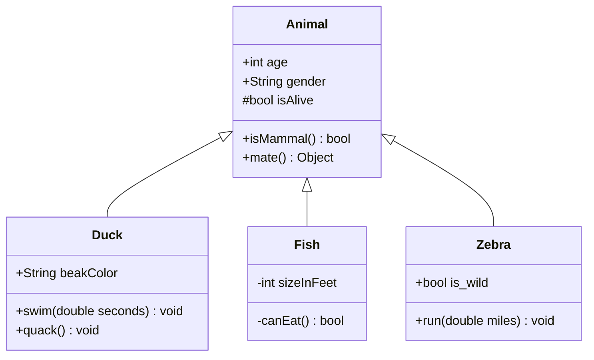
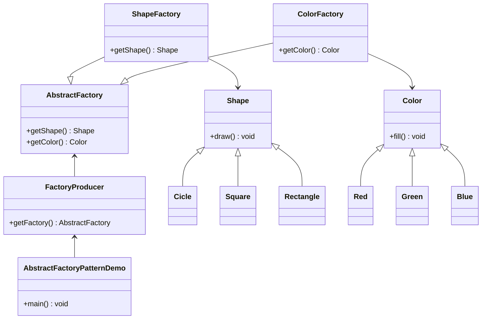
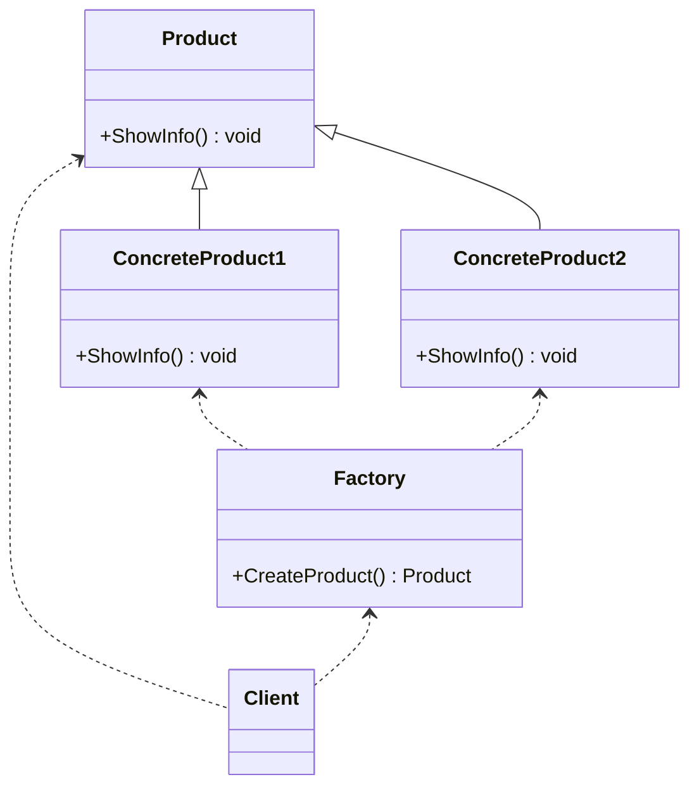
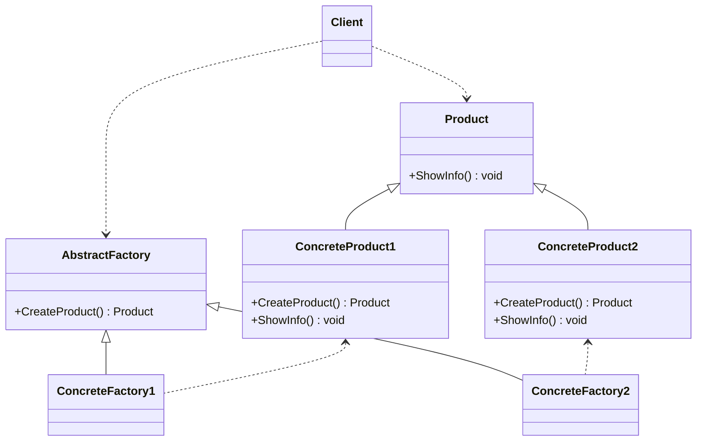
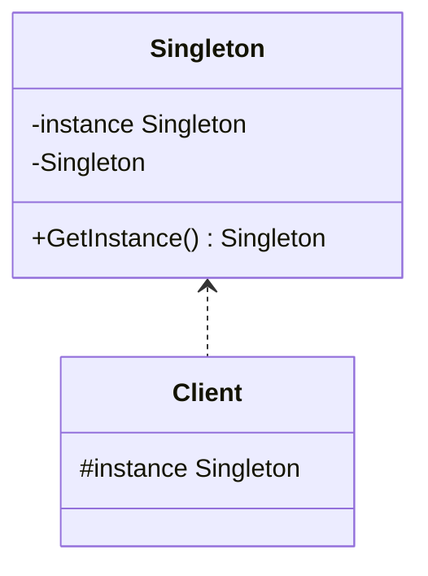
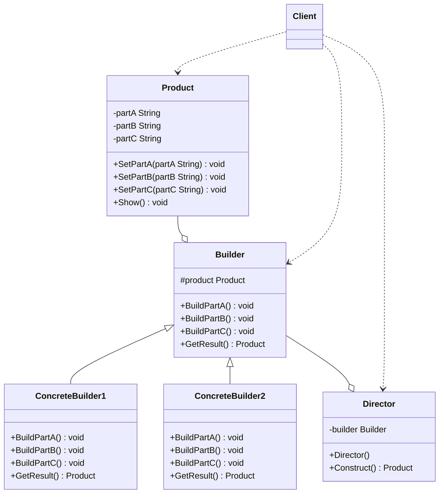

# design pattern

| 序号 | 名称         | 详述                                                         |
| ---- | ------------ | ------------------------------------------------------------ |
| 1    | 软件设计原则 | 单一职责、开闭、里氏替换、依赖倒转、接口隔离、合成复用、迪米特 |
| 2    | 创建型       | 抽象工厂模式、建造者模式、工厂方法模式、原型模式、单例模式   |
| 3    | 结构型       | 适配器模式、桥接模式、组合模式、装饰模式、外观模式、享元模式、代理模式 |
| 4    | 行为型       | 职责链模式、命令模式、解释器模式、迭代器模式、中介者模式、备忘录模式、观察者模式、状态模式、策略模式、模板方法模式、访问者模式 |

# 类图

## 什么是类图

class diagram 显示了模型的静态结构，特别是模型中存在的类、类的内部结构以及他们与其他类的关系等。既可以用于应用程序的系统分类的一般概念建模，也可以用于详细建模，将模型转换成编程代码。

## 类的表示方式-UML

在UML类图中，类使用包含类名，属性field和方法method且带有分割线的矩形来表示。



UML类图中，表示可见性的符号有三种：

+ `+`：表示的是public
+ `-`：表示的是private
+ `#`：表示的是protected(包括friendly)

属性的完整表示方式是`可见性 名称 ： 类型[ = 缺省值]`，方法的完整表示方式为`可见性 名称(参数列表)[: 返回类型]`

## 类与类之间关系的表示方式

1. | 关系 | 表示方式         | 代码  | 代码  |
   | ---- | ---------------- | ----- | ----- |
   | 关联 | 带箭头的直线     | <..   | ..>   |
   | 聚合 | 带空心菱形的直线 | o--   | --o   |
   | 组合 | 带实心菱形的直线 | *--   | --*   |
   | 依赖 | 带箭头的虚线     | <..   | ..>   |
   | 继承 | 带空心三角的虚线 | <\|-- | --\|> |
   
   注：虚线箭头指向依赖；实线箭头指向关联；虚线三角指向接口；实线三角指向父类；空心菱形能分离独立存在，是聚合；实心菱形精密关联不可分割，是组合。
   
2. 泛化Generalization

   【泛化关系】是一种继承关系，表示一般与特殊的关系，指定了子类如何特化父类的所有特征和行为。

   【箭头指向】带三角箭头的实线，箭头指向父类(在markdown中，没有空心三角，用实心三角表示)

   ```mermaid
   classDiagram
   	Notice <|-- CutoverNotice
   	Notice <|-- BizEnsureNotice
   	Notice : -Long id
       Notice : -String name
       Notice : -List replyList
       CutoverNotice : -Fault faultList
       CutoverNotice : -CutoverRequire require
       CutoverNotice : -影响业务 influenceServiceList
       BizEnsureNotice: -Case case
   ```

   

3. 实现Realization

   【实现关系】是一种类与接口的关系，表示类是接口所有特征和行为的实现

   【箭头指向】带三角箭头的虚线，箭头指向接口

   ```mermaid
   classDiagram
   	NoticeService <|.. NoticeServiceImpl
   	NoticeServiceImpl : -BaseDao baseDao
   	NoticeServiceImpl : +save(Notice) void
   	NoticeServiceImpl : +findNoticeByID(Long) void
   ```

4. 组合Composition

   【组合关系】是整体与部分的关系，但部分不能离开整体而单独存在。

   【代码体现】成员变量

   【箭头指向】带实心菱形的实线，菱形指向整体

   ```mermaid
   classDiagram
   	Department --* Company
   ```

5. 聚合Aggregation

   【聚合关系】是整体与部分的关系，且部分可以离开整体而单独存在

   【代码体现】成员变量

   【箭头指向】带空心菱形的实线，菱形指向整体

   ```mermaid
   classDiagram
   	Wheel --o Car
   ```

6. 关联Association

   【关联关系】是一种拥有关系，它使一个类知道另一个类的属性和方法。

   【箭头指向】带普通箭头的实线，单向关联有一个箭头，双向关联有两个箭头或者没有箭头

   ```mermaid
   classDiagram
   	Customer <--> Order
   ```

   

7. 依赖Dependency

   【依赖关系】是一种使用关系，一个类的实线需要另一个类的协助

   【代码体现】局部变量、方法的参数或者对静态方法的调用

   【箭头指向】带普通箭头的虚线，指向被使用者
   
   **对象之间最弱的一种关联关系，临时的关联。**
   
   ```mermaid
   classDiagram
   	NoticeService <|.. NoticeServiceImpl
   	NoticeServiceImpl : -BaseDao baseDao
   	NoticeServiceImpl : +save(Notice) void
   	NoticeServiceImpl : +findNoticeByID(Long) void
   	Notice <.. NoticeServiceImpl
   	Notice : -Long id
   	Notice : -String name
   	Notice : -List replyList
   	BaseDao <.. NoticeServiceImpl
   	BaseDao : +findObjectByID(Long) Notice
   ```
   
   

# 软件设计的七大原则

在软件开发中，为了提高软件系统的可维护性和可复用性，增加软件的可扩展性和灵活性。

1. 开闭原则：总纲，对扩展开放，对修改关闭。程序需要拓展时，不能修改原有的代码，实现一个热插拔的效果。

2. 里氏替换：不要破坏继承体系。开闭原则的补充，开闭原则的关键步骤就是抽象化，而基类和子类的继承关系就是抽象化的具体实现。子类可以实现基类的抽象方法，但不能覆盖基类的非抽象方法；子类可以增加自己特有的方法；当子类的方法重载基类的方法时，方法的形参要比基类的参数更宽松；子类的方法实现基类的抽象方法时，方法的返回值要比基类更严格。

3. 依赖倒置：面向接口编程。依赖与抽象，不要依赖于具体。

4. 单一职责：实现类要职责单一。一个类，只有一个引起变化的原因，每个职责都是变化的一个轴线。

5. 接口隔离：设计接口要精简单一。使用多个隔离的接口，要比使用单个接口好。

6. 迪米特：降低耦合度。最少知道原则。一个实体应当尽量少的与其他实体之间发生相互作用。

7. 合成复用：优先使用组合或者聚合关系复用，少用继承关系复用。

```
补充：类和类之间的关系
1. 继承关系：一个类继承另外一个类的功能，并可以增加它自己的新功能的能力。
2. 实现关系：一个class类实现interface接口的功能
3. 依赖关系：一个类A使用到了另一类B，偶然性，临时性，非常弱，但是类B的变化会影响到类A。
4. 关联关系：两个类之间的语义级别的一种强依赖关系
5. 聚合关系：关联中的一个特例，整体与部分之间的关系，可分离，具有各自的生命周期，部分可以属于多个整体，也可以为多个整体对象共享
6. 组合关系：关联中的一个特例，强聚合，体现整体与部分之间的关系，不可分割，整体与部分的生命周期相同
```

# 设计模式

## 创建型模式

在软件工程中，创建型模式时处理对象创建的设计模式。一是将系统使用的具体类封装起来，二是隐藏这些具体类的实例创建和结合的方式。

### 抽象工厂模式

简单工厂不作为一种设计模式而作为一种编码习惯。通过实例化一个工厂类，来获取对应的产品实例。不需要关注产品本身是如何创建，只需要通过工厂获取实例即可使用。

抽象工厂模式是围绕一个超级工厂创建其他工厂。

【意图】解决接口选择的问题

【主要解决】系统中的产品有多于一个的产品族，而系统只消费其中某一族的产品

【如何解决】在一个产品族里面，定义多个产品

【关键代码】在一个工厂里**聚合**多个同类产品

【优点】当一个产品族中的多个对象被设计成一起工作时，它能够保证客户端始终只使用同一个产品族中的对象

【缺点】产品族扩展非常困难，要增加一个系列的某一个产品，既要在抽象的Creator里面修改，又要在具体的方法里面修改

【注意事项】产品族难扩展，产品等级易扩展

工厂：负责实现创建所有实例的内部逻辑，创建产品类的方法可以被外界直接调用，创建所需要的产品对象。

抽象产品：工厂所创建的所有产品对象的基类，负责描述所有实例所有共有的公共接口。

具体产品：工厂的创建目标，所有创建的对象都是这些具体产品类的具体实例。



抽象工厂提供了创建一系列服务的对象的接口，用于创建对象的家族，不需要明确指定具体类。

```
补充：产品等级和产品族。手机厂商小米，不仅仅生产手机，还有电脑，耳机等，这种横向的称之为产品族；纵向来看，生产的每一个产品都是按照一定的规则来生产显示器，电池等，这称之为产品等级。抽象工厂解决的是产品族的问题，工厂方法解决的是产品等级。
```

代码

```c#
//抽象工厂类
	/// <summary>
	/// 抽象工厂
	/// 自身是抽象的，其中的各方法也是抽象的，每一个具体的工厂都必须实现所有的方法，能够独立生产任何一个产品
	/// </summary>
	public abstract class AbstractFactory
	{
		/// <summary>
		/// 获取形状-抽象方法，子类必须实现
		/// </summary>
		/// <returns></returns>
		public abstract IShape GetShape(string type);
		/// <summary>
		/// 获取颜色-抽象方法，子类必须实现
		/// </summary>
		/// <returns></returns>
		public abstract IColor GetColor(string type);
	}
	/// <summary>
	/// 具体的某一个工厂，主要负责颜色生产
	/// </summary>
	class ColorFactory : AbstractFactory
	{
		/// <summary>
		/// 具体工厂，创建具体的对象，这是职责
		/// </summary>
		/// <param name="colortype"></param>
		/// <returns></returns>
		public override IColor GetColor(string type)
		{
			if (type.ToLower() == "red")
			{
				return new Red();
			}
			else if (type.ToLower() == "green")
			{
				return new Green();
			}
			else if(type.ToLower() == "blue")
			{
				return new Blue();
			}
			else
			{
				return null;
			}
		}

		public override IShape GetShape(string type)
		{
			return null;
		}
	}
	class ShapeFactory : AbstractFactory
	{
		/// <summary>
		/// 获取颜色，具体实现
		/// </summary>
		/// <returns></returns>
		public override IColor GetColor(string type)
		{
			return null;
		}
		/// <summary>
		/// 获取形状，具体实现
		/// </summary>
		/// <returns></returns>
		public override IShape GetShape(string type)
		{
			if (type.ToLower() == "circle")
			{
				return new Circle();
			}
			else if (type.ToLower() == "square")
			{
				return new Square();
			}
			else if (type.ToLower() == "rectangle")
			{
				return new Rectangle();
			}
			else
			{
				return null;
			}
		}
	}
	/// <summary>
	/// 形状-接口
	/// 产品族级别
	/// </summary>
	public interface IShape
	{
		/// <summary>
		/// 画图形状
		/// </summary>
		void Draw();
	}
	/// <summary>
	/// 圆形，形状的具体实现
	/// 具体产品
	/// </summary>
	public class Circle : IShape
	{
		public void Draw()
		{
			Console.WriteLine("shape = circle");
		}
	}
	/// <summary>
	/// 正方形，形状的具体实现
	/// 具体产品
	/// </summary>
	public class Square : IShape
	{
		public void Draw()
		{
			Console.WriteLine("shape = square");
		}
	}
	/// <summary>
	/// 矩形，形状的具体实现
	/// 具体产品
	/// </summary>
	public class Rectangle : IShape
	{
		public void Draw()
		{
			Console.WriteLine("shape = rectangle");
		}
	}
	/// <summary>
	/// 颜色，接口
	/// 产品族级别
	/// </summary>
	public interface IColor
	{
		/// <summary>
		/// 填充颜色
		/// </summary>
		void Fill();
	}
	/// <summary>
	/// 红色，具体实现
	/// 具体产品
	/// </summary>
	public class Red : IColor
	{
		/// <summary>
		/// 填充颜色
		/// </summary>
		public void Fill()
		{
			Console.WriteLine("color = red");
		}
	}
	/// <summary>
	/// 绿色，具体实现
	/// 具体产品
	/// </summary>
	public class Green : IColor
	{
		/// <summary>
		/// 填充颜色
		/// </summary>
		public void Fill()
		{
			Console.WriteLine("color = green");
		}
	}
	/// <summary>
	/// 蓝色，具体实现
	/// 具体产品
	/// </summary>
	public class Blue : IColor
	{
		/// <summary>
		/// 填充颜色
		/// </summary>
		public void Fill()
		{
			Console.WriteLine("color = blue");
		}
	}
```

### 工厂方法模式

简单工厂模式



**简单工厂**一般不作为一种设计模式，它的思路是将对象的创建封装起来，客户端只与工厂类和抽象产品类相依赖，只需要告诉工厂生产什么产品即可，无论增加多少中产品，产品类和客户端始终不相耦合。

**工厂方法**：定义一个创建对象的接口，让实现这个接口的类去决定实例化具体的类。具体产品的对象的创建推迟到了实现接口的子类中。



【适用场景】

+ 客户只知道创建产品的工厂名，不知道具体的产品名称

+ 创建对象的任务由多个具体子工厂中的某一个完成，抽象工厂只提供创建产品的接口

+ 客户不关心创建产品的细节，只关心产品的品牌

  `客户和各个工厂类与抽象产品类相依赖，增加一个产品的同时增加一个工厂，易于扩展`

| 模式名称 | 优点                                                         | 缺点                                           |
| -------- | ------------------------------------------------------------ | ---------------------------------------------- |
| 简单工厂 | 不需要关注实例化的过程，对象的实例化操作在工厂内部做，客户只需要知道生产什么产品即可 | 新增一个产品，每次都要修改工厂，不符合开闭原则 |
| 工厂方法 | 工厂抽象化，产品的实例化在子类中实现，遵循了开闭原则，增加产品的同时增加一个工厂，易于扩展 | 每次增加一个产品，都要增加一个工厂             |
| 抽象工厂 | 复杂的抽象关联关系，产品内部管理简单                         | 不易扩展，每次扩展都需要修改很多类             |

代码

```c#
	/// <summary>
	/// 抽象产品类
	/// </summary>
	public abstract class Product
	{
		/// <summary>
		/// 抽象方法，每个具体产品各自实现
		/// </summary>
		public abstract void ShowInfo();
	}
	/// <summary>
	/// 具体产品1
	/// </summary>
	public class ConcreteProduct1 : Product
	{
		/// <summary>
		/// 产品1
		/// </summary>
		public override void ShowInfo()
		{
			Console.WriteLine("this is ConcreteProduct1");
		}
	}
	/// <summary>
	/// 具体产品2
	/// </summary>
	public class ConcreteProduct2 : Product
	{
		/// <summary>
		/// 产品2
		/// </summary>
		public override void ShowInfo()
		{
			Console.WriteLine("this is ConcreteProduct2");
		}
	}
	/// <summary>
	/// 抽象工厂类
	/// </summary>
	public abstract class AbstractFactory
	{
		/// <summary>
		/// 抽象方法，创建对象，每个具体工厂各自实现
		/// </summary>
		/// <returns>返回创建好的产品对象实例</returns>
		public abstract Product CreateProduct();
	}
	/// <summary>
	/// 具体工厂1
	/// </summary>
	public class ConcreteFactory1 : AbstractFactory
	{
		/// <summary>
		/// 创建ConcreteProduct1对象实例
		/// </summary>
		/// <returns>返回ConcreteProduct1对象</returns>
		public override Product CreateProduct()
		{
			return new ConcreteProduct1();
		}
	}
	/// <summary>
	/// 具体工厂2
	/// </summary>
	public class ConcreteFactory2 : AbstractFactory
	{
		/// <summary>
		/// 创建ConcreteProduct2对象实例
		/// </summary>
		/// <returns>放回ConcreteProduct2对象</returns>
		public override Product CreateProduct()
		{
			return new ConcreteProduct2();
		}
	}
```

### 单例模式

定义：确保一个类只有一个实例，并且提供一个全局访问点。

节约了系统资源，提高了系统效率，能严格控制客户对它的访问。由于只有一个实例，职责会加重，不太符合单一职责，没有抽象类，不易于扩展。



实现：

1. 简单实现

   ```c#
   public sealed class Singleton
   {
       static Singleton instance = null;//唯一的实例
       //构造方法
       private Singleton()
       {
           
       }
       //提供一个获取实例的方法
       public static Singleton Instance
       {
           get
           {
               if(instance == null)
               {
                   instance = new Singleton();
               }
               return instance;
           }
       }
   }
   ```

   **优点**：实例是Instance属性方法内部创建的，此类可以使用附加功能，直到对象要求产生一个实例才执行实例化操作，避免在程序启动的时候实例化不必要的实例。

   **缺点**：线程不安全，如果多个线程同时获取实例，第一个线程在执行`if(instance == null)`时，此时的Instance为null，创建新的实例，第二个线程也执行`if(instance == null)`时，实例还没有创建完成，仍然为null，这样就会创建两个实例。

2. 线程的安全

   ```c#
   public sealed class Singleton
   {
       static Singleton instance = null;//唯一的实例
       private static readonly object padlock = new object();//线程锁
       //构造方法
       private Singleton()
       {
           
       }
       //提供一个获取实例的方法
       public static Singleton Instance
       {
           get
           {
               lock(packlock)
               {
                   if(instance == null)
               	{
                   	instance = new Singleton();
               	}
               }
               return instance;
           }
       }
   }
   ```

   同一个时刻加了锁的那部分代码只有一个线程可以进入，实例由最先进入的那个线程创建。增加了额外的开销，损失了性能。

3. 双重所定

   ```C#
   public sealed class Singleton
   {
       static Singleton instance = null;//唯一的实例
       private static readonly object padlock = new object();//线程锁
       //构造方法
       private Singleton()
       {
           
       }
       //提供一个获取实例的方法
       public static Singleton Instance
       {
           get
           {
               if(instance == null)
               {
                   lock(packlock)
               	{
                   	if(instance == null)
               		{
                   		instance = new Singleton();
               		}
               	}
               }
               return instance;
           }
       }
   }
   ```

   多线程安全，线程不是每次都加锁，允许实例化延迟到第一次访问对象时发生

4. 静态初始化

   ```C#
   public sealed class Singleton
   {
       private static readonly Singleton instance = null;//唯一的实例
       static Singleton()
       {
           instance = new Singleton();
       }
       //构造方法
       private Singleton()
       {
           
       }
       //提供一个获取实例的方法
       public static Singleton Instance
       {
           get
           {
               return instance;
           }
       }
   }
   ```

   公共静态属性为访问实例提供了个全局访问点，依赖公共语言运行库负责处理变量初始化。

5. 延迟初始化

   ```C#
   public sealed class Singleton
   {
       //构造方法
       private Singleton()
       {
           
       }
       //提供一个获取实例的方法
       public static Singleton Instance
       {
           get
           {
               return Nested.instance;
           }
       }
       private class Nested
       {
           internal static readonly Singleton instance = null;
           static Nested()
           {
               instance = new Singleton();
           }
       }
   }
   ```

   初始化工作由Nested类的一个静态成员来完成，实现了延迟初始化。由于静态函数的调用机制，在类被初始化或者静态成员被调用的时候进行调用，并且由.Net框架来调用静态构造函数来初始化静态成员变量。

   **懒汉式**：实例的初始化是在对象实际使用的时候才创建实例

   **饿汉式**：程序启动的时候直接创建实例，无论是否使用

### 建造者模式

定义：将一个复杂对象的构建与表示分离，使得同样的构建过程可以创建不同的表示。将一个复杂的对象分解为多个简单的对象，一步步构建，将变与不变分离，**产品的组成部分不变，每一部分可以灵活选择**



【结构与实现】建造者Builder由产品、抽象建造者、具体建造者、指挥者

【角色】

+ 产品Product：包含多个组成部件的复杂对象，由建造者来创建其各个零部件

+ 抽象建造者Builder：包含创建产品各个子部分的抽象方法的接口，通常还包含一个返回复杂产品的方法

+ 具体建造者Concrete Builder：实现Builder接口，完成复杂产品的各个部件的具体创建方法

+ 指挥者Director：调用建造者对象中的部件构造方法与装配方法完成复杂对象的创建，指挥者中不涉及具体产品信息

【优缺点】

+ 优点：各个具体的建造者相互独立，有利于系统的扩展；客户端不必知道产品内部组成的细节，便于风控

+ 缺点：产品的组成部分必须相同；产品内部变化复杂，会有很多的建造这类

  `建造者模式注重零部件的组装过程，工厂方法模式更注重零部件的创建过程`

指挥者director直接和客户client进行需求沟通，将需求划分为各个部件的建造需求builder，这种建造需求被委派到具体的建造者concrete builder，各个具体建造者负责产品部件的构建，最终形成具体的产品。

### 原型模式

定义：用于创建重复的对象，实现对象的拷贝。能够快速创建复杂对象实例，规避构造函数的约束。

## 结构型模式

主要是用于处理类或者对象的组合，从结构上解决模块之间的耦合问题。

### 适配器模式

将一个类的接口，转换成期望的另一个接口。需要使用两个不同的接口进行通信的时候，不需要修改原接口代码，增加一个中间件，通过参数的设置，将两个接口的实例进行相互转换。

类适配器：创建一个新类，继承原有的类，实现新的接口

对象适配器：创建一个包装类，持有原类的一个实例，在包装类的方法中，调用实例的方法。

### 桥接模式

将抽象部分与实现部分分离，使他们都可以独立变化。针对自身可以有多个维度的变化的类型，在不引入其他复杂度的前提下，将各个维度分离开。

画笔可以有粗细和颜色的区分，如果是蜡笔，那将是画笔的粗细和颜色不能分开，如果是毛笔，颜色和粗细就可以分开。画笔是一个抽象类，不同粗细程度的画笔具体实现这个类，颜色类作为另一个抽象类，各种具体的颜色具体实现，画笔抽象类提供一个设置颜色的方法，将颜色抽象类作为参数传入，采用组合的方式。

多继承方式违背了单一职责，复用性较差，不能做到一个类只有一个变化的原因。如果一个类型有两个变化的维度，但是其中一个的变化不一定会导致纵横交错的结果，也不一定要用桥接模式，适用于两个非常强的变化维度。

### 组合模式

将对象组合成树形结构来表现整体-部分的层次结构，是的客户端以一致的方式处理单个对象以及对象容器。所有的对象类继承同一个基类，对象容器也继承这个基类，但是要有区别于对象类的方法。

优点：客户端代码可以一致的处理对象和对象容器，将客户端代码和对象容器结构解耦，更容易的往组合对象中加入新的构件

缺点：设计复杂，需要花费一定的时间理清类之间的层次关系。

### 装饰模式

通过采用组合的方法，实现在运行时动态地扩展对象功能的能力。

优点：抽象接口和实现解耦，抽象和实现可以独立扩展，不会影响对方，实现细节对客户端透明

缺点：增加了系统的复杂度

### 外观模式

通过实现一个提供更合理的接口的类，将一个复杂的子系统变得容易使用。客户需要很多的子系统实例，按照一定规则使用时，可以增加一个类，封装一个新的方法供客户使用，使客户代码减少。

实现了子系统对客户的屏蔽，减少了客户处理的对象数且使用更方便，子系统和客户之间松耦合，子系统之间紧耦合，提供的新类可以作为各子系统之间的信息交互，减少了子系统之间的依赖，新增的类不影响客户对子系统的使用。

### 享元模式-共享单元

对象共享降低系统中对象的个数，从而减低细粒度对象给系统带来的内存压力。

优点：能够极大的减少系统中对象的个数，增加了外部状态，不影响内部状态。

缺点：需要区分内部状态和外部状态，增加了使用复杂度，内部状态和外部状态之间的交互增加了时间的消耗。

### 代理模式

为客户端程序提供一种中间层以控制对这个对象的访问

优点：将客户端程序和调用对象隔离，一定程度上解耦，在真正调用对象之前，代理可以做一些保护性操作

缺点：增加代理后，处理速度变慢，增加了系统实现的复杂度

## 行为型模式

​	在不同的对象之间划分责任和算法的抽象化，分为类的行为模式和对象的行为模式

​	类的行为模式：使用继承关系在几个类之间分配行为

​	对象的行为模式：对象聚合的方式来分配行为

### 职责链模式

注重封装对象责任，支持责任的变化，通过动态构建职责链，实现事务处理

为请求创建了一个接收者对象的链，每个接收者都会包含对另一个接收者的引用，如果一个对象不能处理请求，会把相同的请求传给下一个接收者。

优点：降低耦合，请求的发送者和接收者解耦，简化了对象，不需要知道链的结构，增强对象指派职责的灵活性，便于增加新的请求处理类

缺点：不能保证请求一定被接收，可能会造成循环调用，不便于排查错误

### 命令模式

注重将请求封装为对象，支持请求的变化，通过将一组行为抽象为对象，实现行为请求者和行为实现者之间的解耦

命令模式把一个请求或者操作封装到一个对象中，把发出命令的责任和执行命令的责任分隔开，委派给不同的对象。

优点：新命令很容易被加入到系统里；可以设计一个命令队列实现对请求的Undo和Redo；较容易地将命令写入日志；把命令对象聚合在一起

缺点：可能会导致太多的具体命令类

### 解释器模式

注重封装特定领域变化，支持领域问题的频繁变化，将特定领域的问题表达为某种语法规则下的句子，然后构建一个解释器来解释这样的句子，从而达到解决问题的目的。

### 迭代器模式

注重封装特定领域变化，支持集合的变化，屏蔽集合对象内部复杂结构，提供客户程序对它的透明遍历

### 中介者模式

注重封装对象间的交互，通过封装一系列对象之间的复杂交互，使他们不需要显式相互引用，实现解耦

### 备忘录模式

注重封装对象状态变化，支持状态保存、恢复

### 观察者模式

注重封装对象通知，支持通信对象的变化，实现对象状态改变，通知依赖它的对象并更新

### 状态模式

注重封装与状态相关的行为，支持状态的变化，通过封装对象状态，从而在其内部状态改变时改变它的行为

### 策略模式

注重封装算法，支持算法的变化，通过封装一系列算法，从而可以随时独立于客户替换算法

### 模板方法模式

封装算法结构，定义算法骨架，支持算法子步骤变化

### 访问者模式

注重封装对象操作变化，支持在运行时为类结构添加新的操作，在类层次结构中，在不改变各类的前提下定义作用于这些类实例的新的操作
