## Git分区、配置和日志

### `Git`的三个分区

+ 工作区`working directory`：直接编辑文件的地方，肉眼可见直接操作
+ 暂存区`stage area` ：数据暂时存放的地方
+ 版本库`Respositiry`：存放已经提交的数据，`push`的时候，就是把这个区的数据`push`到远程仓库

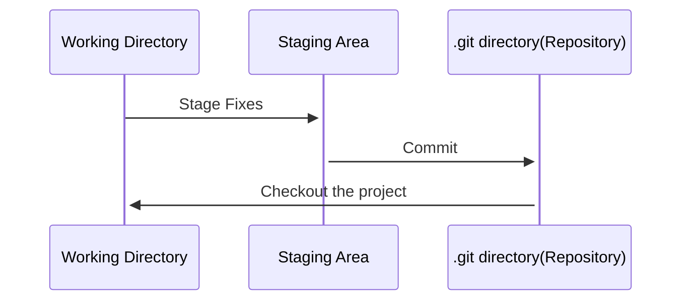

通过`git status`查看`git`状态时，**红色**的文件表示**工作区**，**绿色**的文件表示在**暂存区**。工作区中的文件只要通过`git add`命令添加进了`Git`仓库，就会被追踪。

1. 工作区->暂存区：`git add <file>`
   + `git add test.txt`：单个文件
   + `git add test.txt test2.txt`：多个文件
   + `git add .`：当前目录及其子目录下的所有文件
2. 暂存区->版本库
   + `git commit -m '注释'`：一定要有注释，否则不让提交
   + `git commit`：注释很长的时候，选择这个命令，进入`vim`编辑模式编辑注释
   + `git commit -am '注释'`：相当于是`git add .`和`git commit`两步操作
3. 暂存区->工作区
   + `git rm --cache <file>`：删除暂存区中的文件，并将其还原到工作区中
   + `git restore --stage <file>`：将文件从暂存区中移动到工作区
   + `git reset HEAD <file>`：将文件从暂存区中移到工作区

### 常用命令

#### `git config`

配置`Git`的相关参数

`Git`一共有三个配置文件

1. 仓库级的配置文件：在仓库的`.git/.gitconfig`，该配置文件只对所在的仓库有效
2. 全局配置文件：`Mac`系统在`~/.gitconfig`，`Windows`系统在`C:\Users\<用户名>\.gitconfig`
3. 系统级的配置文件：在`Git`的安装目录下的`etc`文件夹中的`gitconfig`，`Mac`系统下安装目录在`/user/local/git`

```shell
# 查看配置信息
# --local：仓库级，--global：全局级，--system：系统级
$ git config <--local | --global | --system> -l

# 查看仓库配置
$ cat .git/config

# 查看当前生效的配置信息
$ git config -l

# 编辑配置文件
# --local：仓库级，--global：全局级，--system：系统级
$ git config <--local | --global | --system> -e

# 添加配置项
# --local：仓库级，--global：全局级，--system：系统级
$ git config <--local | --global | --system> --add <name> <value>

# 获取配置项
$ git config <--local | --global | --system> --get <name>

# 删除配置项
$ git config <--local | --global | --system> --unset <name>

# 配置提交记录中的用户信息
$ git config --global user.name <用户名>
$ git config --global user.email <邮箱地址>

# 更改Git缓存区的大小
# 如果提交的内容较大，默认缓存较小，提交会失败
# 缓存大小单位：B，例如：524288000（500MB）
$ git config --global http.postBuffer <缓存大小>

# 调用 git status/git diff 命令时以高亮或彩色方式显示改动状态
$ git config --global color.ui true

# 配置可以缓存密码，默认缓存时间15分钟
$ git config --global credential.helper cache

# 配置密码的缓存时间
# 缓存时间单位：秒
$ git config --global credential.helper 'cache --timeout=<缓存时间>'

# 配置长期存储密码
$ git config --global credential.helper store
```

#### `git init`

初始化项目所在目录，初始化后会在当前目录下出现一个名为`.git`的目录。

```shell
# 初始化本地仓库，在当前目录下生成.git文件夹
$ git init
```

#### `git clone`

从远程仓库克隆一个版本库到本地

```shell
# 默认在当前目录下创建和版本库名相同的文件夹并下载版本库到该文件夹下
$ git clone <远程仓库的网址>

# 指定本地仓库的目录
$ git clone <远程仓库的网址> <本地目录>

# -b 指定要克隆的分支，默认是master分支
$ git clone <远程仓库的网址> -b <分支名称> <本地目录>
```

#### `git add`

把要提交的文件的信息添加到暂存区中。当使用`git commit`时，将一句暂存区中的内容来进行文件的提交。

```shell
# 把指定的文件添加到暂存区中
$ git add <文件路径>

# 添加所有修改、已删除的文件到暂存区中
$ git add -u [<文件路径>]
$ git add --update [<文件路径>]

# 添加所有修改、已删除、新增的文件到暂存区中，省略 <文件路径> 即为当前目录
$ git add -A [<文件路径>]
$ git add --all [<文件路径>]

# 查看所有修改、已删除但没有提交的文件，进入一个子命令系统
$ git add -i [<文件路径>]
$ git add --interactive [<文件路径>]
```

#### `git commit`

将暂存区中的文件提交到本地仓库中

```shell
# 把暂存区中的文件提交到本地仓库，调用文本编辑器输入该次提交的描述信息
$ git commit

# 把暂存区中的文件提交到本地仓库中并添加描述信息
$ git commit -m "<提交的描述信息>"

# 把所有修改、已删除的文件提交到本地仓库中
# 不包括未被版本库跟踪的文件，等同于先调用了 "git add -u"
$ git commit -a -m "<提交的描述信息>"

# 修改上次提交的描述信息
$ git commit --amend
```

#### `git status`

查看本地仓库的状态

```shell
# 查看本地仓库的状态
$ git status

# 以简短模式查看本地仓库的状态
# 会显示两列，第一列是文件的状态，第二列是对应的文件
# 文件状态：A 新增，M 修改，D 删除，?? 未添加到Git中
$ git status -s
```

#### `git remote`

操作远程库

```shell
# 列出已经存在的远程仓库
$ git remote

# 列出远程仓库的详细信息，在别名后面列出URL地址
$ git remote -v
$ git remote --verbose

# 添加远程仓库
$ git remote add <远程仓库的别名> <远程仓库的URL地址>

# 修改远程仓库的别名
$ git remote rename <原远程仓库的别名> <新的别名>

# 删除指定名称的远程仓库
$ git remote remove <远程仓库的别名>

# 修改远程仓库的 URL 地址
$ git remote set-url <远程仓库的别名> <新的远程仓库URL地址>
```

#### `git branch`

操作分支

```shell
# 列出本地的所有分支，当前所在分支以 "*" 标出
$ git branch

# 列出本地的所有分支并显示最后一次提交，当前所在分支以 "*" 标出
$ git branch -v

# 创建新分支，新的分支基于上一次提交建立
$ git branch <分支名>

# 修改分支名称
# 如果不指定原分支名称则为当前所在分支
$ git branch -m [<原分支名称>] <新的分支名称>
# 强制修改分支名称
$ git branch -M [<原分支名称>] <新的分支名称>

# 删除指定的本地分支
$ git branch -d <分支名称>

# 强制删除指定的本地分支
$ git branch -D <分支名称>
```

#### `git checkout`

检出命令，用于创建、切换分支

```shell
# 切换到已存在的指定分支
$ git checkout <分支名称>

# 创建并切换到指定的分支，保留所有的提交记录
# 等同于 "git branch" 和 "git checkout" 两个命令合并
$ git checkout -b <分支名称>

# 创建并切换到指定的分支，删除所有的提交记录
$ git checkout --orphan <分支名称>

# 替换掉本地的改动，新增的文件和已经添加到暂存区的内容不受影响
$ git checkout <文件路径>
```

#### `git fetch`

从远程仓库获取最新的版本到本地的 `tmp` 分支上

```shell
# 将远程仓库所有分支的最新版本全部取回到本地
$ git fetch <远程仓库的别名>

# 将远程仓库指定分支的最新版本取回到本地
$ git fetch <远程主机名> <分支名>
```

#### `git merge`

合并分支

```shell
# 把指定的分支合并到当前所在的分支下
$ git merge <分支名称>
```

#### `git diff`

比较版本之间的差异

```shell
# 比较当前文件和暂存区中文件的差异，显示没有暂存起来的更改
$ git diff

# 比较暂存区中的文件和上次提交时的差异
$ git diff --cached
$ git diff --staged

# 比较当前文件和上次提交时的差异
$ git diff HEAD

# 查看从指定的版本之后改动的内容
$ git diff <commit ID>

# 比较两个分支之间的差异
$ git diff <分支名称> <分支名称>

# 查看两个分支分开后各自的改动内容
$ git diff <分支名称>...<分支名称>
```

#### `git pull`

从远程仓库获取最新版本并合并到本地

首次会执行`git fetch`，后续会执行`git merge`，把获取的分支的`HEAD`合并到当前分支

```shell
# 从远程仓库获取最新版本。
$ git pull
```

#### `git push`

把本地仓库的提交推送到远程仓库

```shell
# 把本地仓库的分支推送到远程仓库的指定分支
$ git push <远程仓库的别名> <本地分支名>:<远程分支名>

# 删除指定的远程仓库的分支
$ git push <远程仓库的别名> :<远程分支名>
$ git push <远程仓库的别名> --delete <远程分支名>
```

#### `git log`

显示提交记录

```shell
# 打印所有的提交记录
$ git log

# 打印从第一次提交到指定的提交的记录
$ git log <commit ID>

# 打印指定数量的最新提交的记录
$ git log -<指定的数量>

# 以图形化的形式显示提交记录
$ git log --graph

# 如果每次提交注释较多，可以选择以一行的形式显示提交历史
$ git log --pretty=oneline

# 对提交信息进行简化，也可以和其他参数结合使用
$ git log --graph --abbrev-commit

# 按照某种格式显示日志内容
# %h：commit id
# %an：提交人
# %ar：提交时间
# %s：提交信息
$ git log --pretty=online:"%h - %an, %ar : %s"

# 一次性查看所有分支及其提交记录
$ git log --all --decorate --online --graph
```

#### `git reset`

还原提交记录

```shell
# 重置暂存区，但文件不受影响
# 相当于将用 "git add" 命令更新到暂存区的内容撤出暂存区，可以指定文件
# 没有指定 commit ID 则默认为当前 HEAD
$ git reset [<文件路径>]
$ git reset --mixed [<文件路径>]

# 将 HEAD 的指向改变，撤销到指定的提交记录，文件未修改
$ git reset <commit ID>
$ git reset --mixed <commit ID>

# 将 HEAD 的指向改变，撤销到指定的提交记录，文件未修改
# 相当于调用 "git reset --mixed" 命令后又做了一次 "git add"
$ git reset --soft <commit ID>

# 将 HEAD 的指向改变，撤销到指定的提交记录，文件也修改了
$ git reset --hard <commit ID>
```

#### `git revert`

生成一个新的提交来撤销某次提交，此次提交之前的所有提交都会被保留

```shell
# 生成一个新的提交来撤销某次提交
$ git revert <commit ID>
```

#### `git tag`

操作标签的命令

```shell
# 打印所有的标签
$ git tag

# 添加轻量标签，指向提交对象的引用，可以指定之前的提交记录
$ git tag <标签名称> [<commit ID>]

# 添加带有描述信息的附注标签，可以指定之前的提交记录
$ git tag -a <标签名称> -m <标签描述信息> [<commit ID>]

# 切换到指定的标签
$ git checkout <标签名称>

# 查看标签的信息
$ git show <标签名称>

# 删除指定的标签
$ git tag -d <标签名称>

# 将指定的标签提交到远程仓库
$ git push <远程仓库的别名> <标签名称>

# 将本地所有的标签全部提交到远程仓库
$ git push <远程仓库的别名> –tags
```

#### `git mv`

重命名文件或者文件夹

```shell
# 重命名指定的文件或者文件夹
$ git mv <源文件/文件夹> <目标文件/文件夹>
```

#### `git rm`

删除文件或者文件夹

```shell
# 移除跟踪指定的文件，并从本地仓库的文件夹中删除
$ git rm <文件路径>

# 移除跟踪指定的文件夹，并从本地仓库的文件夹中删除
$ git rm -r <文件夹路径>

# 移除跟踪指定的文件，在本地仓库的文件夹中保留该文件
$ git rm --cached
```

#### `git blame`

查看修改日志，如果想知道一个文件有哪些人修改，可以使用这个命令

```shell
# 查看某个文件的修改记录，展示每一行的提交
$ git blame <file>
```

#### `git reflog`

`git log`是显示当前的`HEAD`和它的祖先的，递归是沿着当前指针的父亲，父亲的父亲，……，这样的原则。 
`git reflog`根本不遍历`HEAD`的祖先。它是`HEAD`所指向的一个顺序的提交列表：它的`undo`历史。`reflog`并不是`repo`（仓库）的一部分，它单独存储，而且不包含在`pushes`，`fetches`或者`clones`里面，它纯属是本地的。 
`reflog`可以很好地帮助你恢复你误操作的数据，例如你错误地`reset`了一个旧的提交，或者`rebase`，……，这个时候你可以使用`reflog`去查看在误操作之前的信息，并且使用`git reset --hard` 去恢复之前的状态。 

```shell
$ git reflog [show] [log-options] [<ref>]
$ git reflog expire [--expire=<time>] [--expire-unreachable=<time>] [--rewrite] [--updateref] [--stale-fix] [--dry-run | -n] [--verbose] [--all | <refs>…​]
$ git reflog delete [--rewrite] [--updateref] [--dry-run | -n] [--verbose] ref@{specifier}…​
$ git reflog exists <ref>
```

#### `git stash`

该指令的作用：对没有提交到版本库的，位于工作区或暂存区的修改进行保存，在需要的时候进行恢复。假设当前的分支是`dev`分支，并且有了修改，在没有提交之前，直接切换分支到`master`，就会报错

```shell
$ git checkout master
error: Your local changes to the following files would be overwritten by checkout:
	...
Please commit your changes or stash them before you switch branches.
Aborting
```

如果此时的修改可以提交，那么执行一次提交就可以解决这个冲突。但是有的时候，这个修改不能或者不想提交，就需要使用`git stash`命令，将本次修改暂时保存。

执行这个命令后，会将本次的修改暂时保存起来，并且同时将将当前分支还原到修改之前的状态

`git stash list`命令可以查看`stash`里面保存的修改列表

`git stash save 'message'`命令可以对每一次的`stash`操作添加注释，便于恢复时使用

`git stash pop`恢复最新一次的修改，并且将`stash`中保存的最新一次的修改删除

`git stash apply`恢复最新一次的修改，但是`stash`中保存的最新一次的修改不会被删除

`git stash apply stash@{n}`这个是最常用的方法，恢复特定的修改，并且不删除`stash`中的修改

#### `git cherry-pick`

该命令的作用是移植提交。比如在`dev`分支上进行了两次提交，如果想将这两次提交移植到`master`分支，采用手动复制的方法比较繁琐且易错，这个时候使用该命令可以轻松搞定。

和`git merge`命令相比，不是合并所有的提交，而是有选择性的合并其他分支的提交。

示例：

```shell
a -b -c -d  master
       \
         e - f - g dev
```

在`master`分支上，有4个提交记录，我们的目标是将`dev`分支的`f`提交合并到`master`分支上。

```shell
# 切换分支
$ git checkout master
$ git cherr-pick f
```

`git cherry-pick commit_id`格式，后面紧跟对应的提交编号。执行命令后，分支的提交情况为：

```shell
a -b -c -d - f  master
       \
         e - f - g dev
```

参数

```shell
$ git cherry-pick -h
usage: git cherry-pick [<options>] <commit-ish>...
   or: git cherry-pick <subcommand>
	# 退出但是不恢复到操作前的状态
    --quit                end revert or cherry-pick sequence
    # 解决完冲突后继续执行
    --continue            resume revert or cherry-pick sequence
    # 发生冲突后，放弃合并，恢复操作前的状态
    --abort               cancel revert or cherry-pick sequence
    # 
    --skip                skip current commit and continue
    --cleanup <mode>      how to strip spaces and #comments from message
    # 更新工作区和暂存区，不自动产生新的提交
    -n, --no-commit       don't automatically commit
    # 编辑提交信息
    -e, --edit            edit the commit message
    -s, --signoff         add a Signed-off-by trailer
    -m, --mainline <parent-number>
                          select mainline parent
    --rerere-autoupdate   update the index with reused conflict resolution if possible
    --strategy <strategy>
                          merge strategy
    -X, --strategy-option <option>
                          option for merge strategy
    # 在提交信息的末尾追加一行操作者的签名，表示是谁进行了这个操作
    -S, --gpg-sign[=<key-id>]
                          GPG sign commit
    # 在提交信息的末尾追加一行`cherry picked from commit_id`，保留原提交信息，方便以后查询
    -x                    append commit name
    --ff                  allow fast-forward
    --allow-empty         preserve initially empty commits
    --allow-empty-message
                          allow commits with empty messages
    --keep-redundant-commits
                          keep redundant, empty commits
```

#### `git rebase`

该命令有两个意思：变基，衍合，即变换分支的参考基点。默认情况，分支会以分支的第一次提交作为基点。

在另一个分支基础上重新应用，用于把一个分支的修改合并到当前分支。

**使用语法**

```shell
$ git rebase -h
usage: git rebase [-i] [options] [--exec <cmd>] [--onto <newbase> | --keep-base] [<upstream> [<branch>]]
   or: git rebase [-i] [options] [--exec <cmd>] [--onto <newbase>] --root [<branch>]
   or: git rebase --continue | --abort | --skip | --edit-todo

    --onto <revision>     rebase onto given branch instead of upstream
    --keep-base           use the merge-base of upstream and branch as the current base
    --no-verify           allow pre-rebase hook to run
    -q, --quiet           be quiet. implies --no-stat
    -v, --verbose         display a diffstat of what changed upstream
    -n, --no-stat         do not show diffstat of what changed upstream
    --signoff             add a Signed-off-by trailer to each commit
    --committer-date-is-author-date
                          make committer date match author date
    --reset-author-date   ignore author date and use current date
    -C <n>                passed to 'git apply'
    --ignore-whitespace   ignore changes in whitespace
    --whitespace <action>
                          passed to 'git apply'
    -f, --force-rebase    cherry-pick all commits, even if unchanged
    --no-ff               cherry-pick all commits, even if unchanged
    --continue            continue
    --skip                skip current patch and continue
    --abort               abort and check out the original branch
    --quit                abort but keep HEAD where it is
    --edit-todo           edit the todo list during an interactive rebase
    --show-current-patch  show the patch file being applied or merged
    --apply               use apply strategies to rebase
    -m, --merge           use merging strategies to rebase
    -i, --interactive     let the user edit the list of commits to rebase
    --rerere-autoupdate   update the index with reused conflict resolution if possible
    --empty <{drop,keep,ask}>
                          how to handle commits that become empty
    --autosquash          move commits that begin with squash!/fixup! under -i
    --update-refs         update branches that point to commits that are being rebased
    -S, --gpg-sign[=<key-id>]
                          GPG-sign commits
    --autostash           automatically stash/stash pop before and after
    -x, --exec <exec>     add exec lines after each commit of the editable list
    -r, --rebase-merges[=<mode>]
                          try to rebase merges instead of skipping them
    --fork-point          use 'merge-base --fork-point' to refine upstream
    -s, --strategy <strategy>
                          use the given merge strategy
    -X, --strategy-option <option>
                          pass the argument through to the merge strategy
    --root                rebase all reachable commits up to the root(s)
    --reschedule-failed-exec
                          automatically re-schedule any `exec` that fails
    --reapply-cherry-picks
                          apply all changes, even those already present upstream
```


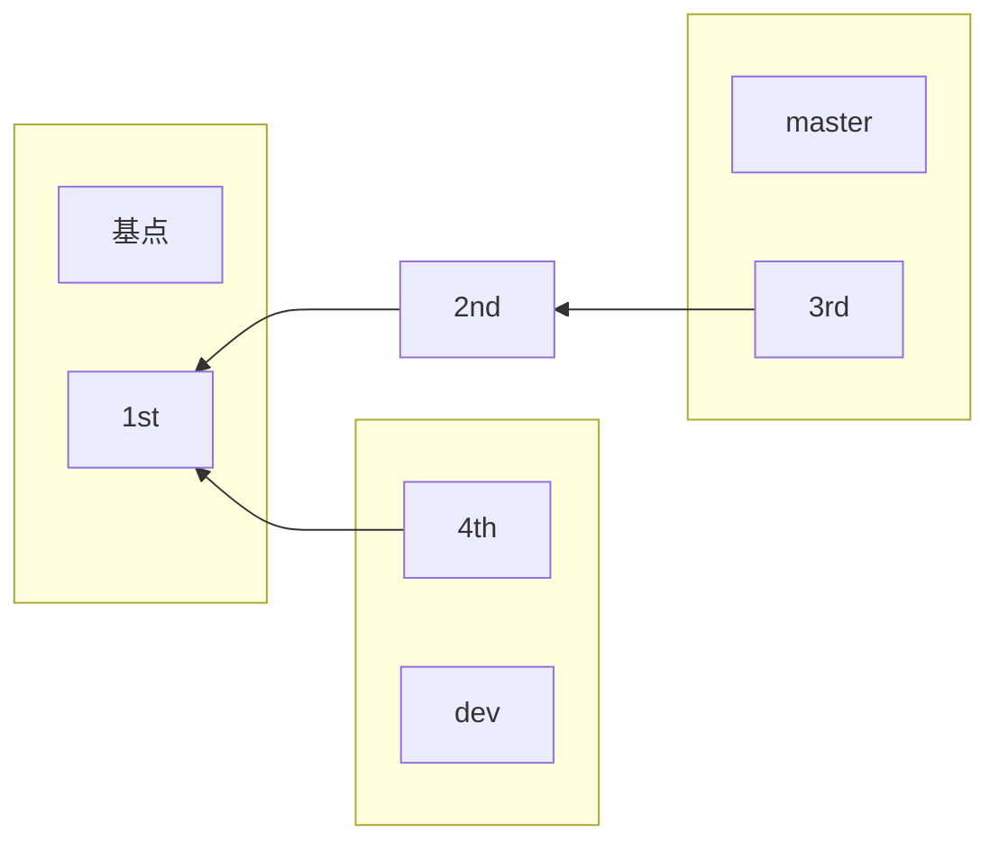


如图所示，`master`分支默认以提交`1st`作为基点。如果以`4th`作为`master`分支的基点，那么就会变为

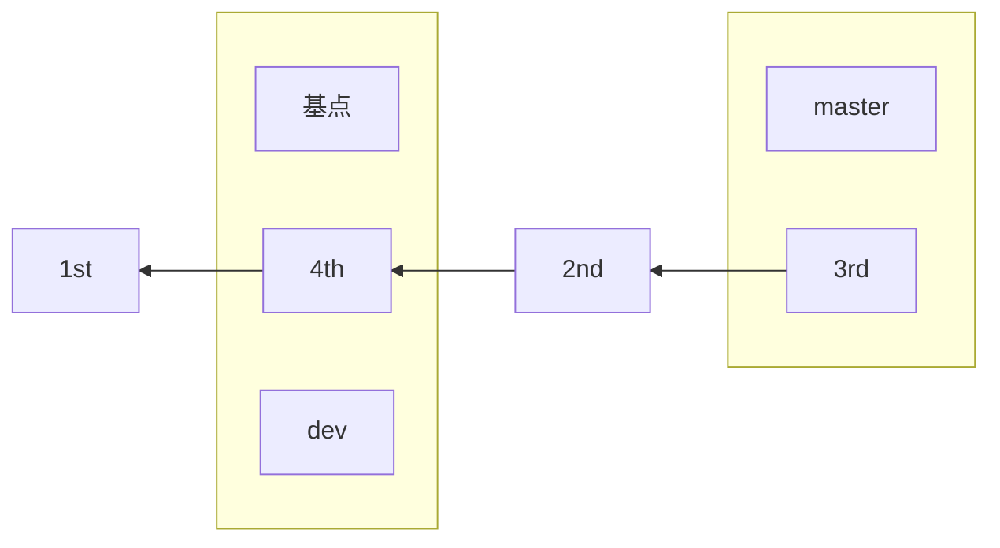

这个过程被称为变基。`rebase`和`merge`十分相似，二者的工作方式有着显著的差异

+ 在分支A上执行`git merge B`，表示的是将B分支合并到A分支上
+ 在分支A上执行`git rebase B`，表示的是将A分支通过变基合并到分支B上

**采用`merge`合并分支**

```shell
c1 - c2 - c3 -c4  origin
		\
		  c5 - c6 mywork
```

现在有两个分支`origin`和`mywork`，如果想将`origin`分支合并到`mywork`分支上，根据三方合并原则，需要在`c4`,`c6`和它们的公共父节点`c2`的基础上进行合并

```shell
c1 - c2 - c3 - c4  origin
		\         \
		  c5 - c6 - c7  mywork
```

合并后产生一次新的提交`c7`，改提交有两个父节点。具体的合并方式为：如果没有冲突，自动合并。有冲突就需要手动解决冲突后手动合并。

**采用`rebase`方式合并**

使用语法

```shell
git rebase [-i | --interactive] [options] [--exec <cmd>] [--onto <newbase>]
    [<upstream> [<branch>]]
git rebase [-i | --interactive] [options] [--exec <cmd>] [--onto <newbase>]
    --root [<branch>]
git rebase --continue | --skip | --abort | --quit | --edit-todo
```

假设，基于远程分支`origin`，创建一个分支`mywork`

```shell
$ git checkout -b mywork origin
```

对分支`mywork`进行一些修改，产生两个提交

```shell
$ vi file.txt
$ git commit
$ vi otherfile.txt
$ git commit
```

此时的结果如下：

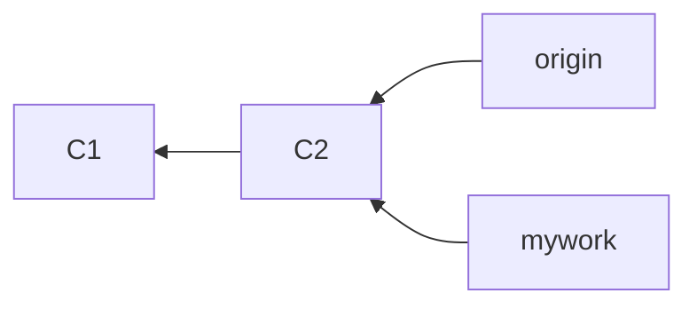

此时，也在`origin`分支上做了一些修改，并且做了提交了，这就意味着`origin`和`mywork`这两个分支各自都有了自己独特的提交，他们分叉了。

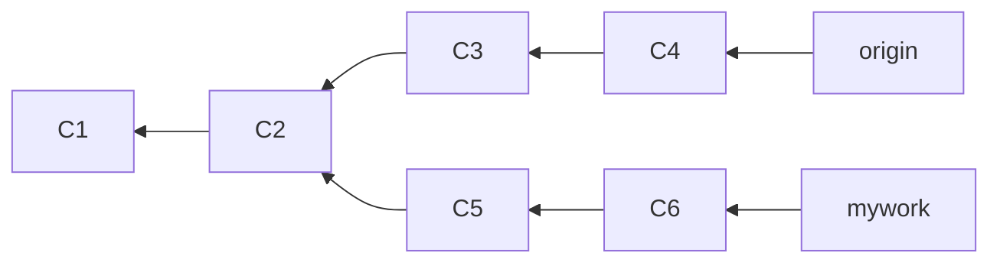

在这里，可以使用`pull`命令把`origin`分支上的修改拉下来并且和本地的修改进行合并，结果看起来就像是一个新的合并的提交`merge commit`

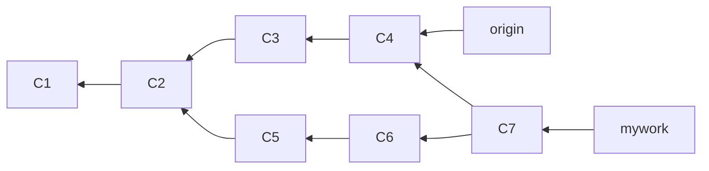

但是，如果想让`mywork`分支历史看起来像没有经过任何合并一样，也可以使用`git rebase`

```shell
$ git checkout mywork
$ git rebase origin
```

这些命令会把分支`mywork`里的每个提交取消掉，并且把他们临时保存为补丁，然后把`mywork`分支更新到最新的`origin`分支，最后把保存的这些 补丁应用到`mywork`分支上。

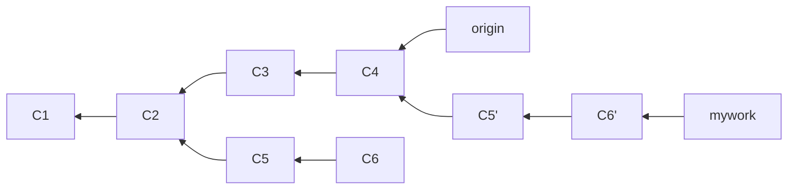

当`mywork`分支更新后，会指向这些新创建的提交，而那些老的提交会被丢弃。如果运行垃圾收集命令`git gc`，这些被丢弃的提交就会被删除。

在`rebase`过程中，如果出现冲突，进程将会停止，并会提示解决冲突，在解决完冲突后，用`git add`命令去更新这些内容的索引，然后，无需执行`git commit`，只需要执行`git rebase --continue`。

### 删除文件

1. `git rm <file>`

   该命令用于删除版本库中的文件，删除工作区和暂存区中的文件会报错。所谓版本库中的文件就是通过`commit`命令提交的文件。这个命令实际上分为两步：

   + 第一步：将版本库中的文件删除
   + 第二步：将删除的文件放入暂存区，需要后续执行提交命令完成文件的删除

2. `rm <file>`

   该命令用于删除工作区和版本库中的文件，不能删除暂存区文件。与`git rm`命令不同的是，该命令不会将删除操作放入暂存区，需要先将删除的文件放入暂存区，再提交才能完成文件的删除

### 重命名文件

1. `git mv <file_org> <file_new>`

   该命令可以理解为剪切的同时进行更名，并且该修改已经放入暂存区，可以进行提交操作。这个命令分为两步：

   + 第一步：将文件更名
   + 第二步：将重命名操作放入暂存区

2. `mv <file_org> <file_new>`

   使用系统命令，进行更名，分为三步：

   + 第一步：删除原文件
   + 第二步：新建一个文件
   + 第三步：将新建的文件放入暂存区

### 比较文件

1. 本地文件和本地文件

   `diff file_a file_b`：系统提供的命令，用于比较本地文件或者已经提交到版本库的文件

   第一步：创建两个文件

   ```shell
   # 创建一个文件1.txt
   $ touch 1.txt
   
   # 创建另一个文件2.txt
   $ touch 2.txt
   
   # 分别向两个文件写入内容
   $ echo 1>1.txt
   $ echo 2>2.txt
   
   # 比较两个文件
   $ diff 1.txt 2.txt
   1,2c1
   <
   < 1
   \ No newline at end of file
   ---
   > 2
   \ No newline at end of file
   
   # 使用更详细的信息展示
   $ diff -u 1.txt 2.txt
   --- 1.txt       2022-10-16 22:35:06.526402200 +0800
   +++ 2.txt       2022-10-16 22:34:49.799076900 +0800
   @@ -1,2 +1 @@
   -
   -1
   \ No newline at end of file
   +2
   \ No newline at end of file
   ```

   + `---`表示原文件
   + `+++`表示目标文件
   + `-1,2`和`+1`表示原文件的第一行到第二行，目标文件的第一行
   + 数据前面有三种符号，分别表示不同的信息：
     + 空格：表示改行在两个文件中都存在
     + `-`：表示原文件去掉该行就可以变为目标文件，意思是原文件中有目标文件中没有
     + `+`：表示原文件加上该行就可以变为目标文件，意思是目标文件中有原文件中没有

2. 工作区和暂存区

   `git diff`是`git`提供的命令，比较暂存区和工作区中同一个文件，原文件为暂存区中的文件，目标文件为工作区中的文件

   ```shell
   $ git diff
   diff --git "a/git\345\221\275\344\273\244.md" "b/git\345\221\275\344\273\244.md"
   index da8ea1d..0ad98f9 100644
   --- "a/git\345\221\275\344\273\244.md"
   +++ "b/git\345\221\275\344\273\244.md"
   @@ -479,6 +479,65 @@ $ git reflog exists <ref>
   # 这里后面会将所有的不同全部展示在vim中，可以预览
   ```

3. 工作区和版本库

   比较版本库和工作区中的同一个文件，原始文件为版本库中的文件，目标文件为工作区中的文件。

   `git diff commit_id`用于比较指定提交的文件

   `git diff HEAD`用于比较最新提交的文件

4. 暂存区和版本库

   比较版本库和暂存区中的同一个文件，原始文件为版本库中的文件，目标文件为暂存区中的文件

   `git diff --cache commit_id`用于比较指定提交的文件

   `git diff --cache`用于比较最新提交的文件

5. 总结

   | 命令                       | 作用                             |
   | -------------------------- | -------------------------------- |
   | diff file1 file2           | 比较两个本地文件                 |
   | git diff                   | 比较暂存区和工作区中的同一个文件 |
   | git diff commit_id         | 比较指定提交文件和工作区中的文件 |
   | git diff HEAD              | 比较最新提交文件和工作区中的文件 |
   | git diff --cache commit_id | 比较指定提交文件和暂存区中的文件 |
   | git diff --cache           | 比较最新提交文件和暂存区中的文件 |

### 修改撤销

主要是将放入暂存区的修改，先恢复到工作区中，再恢复到修改前。

1. 将暂存区中的修改恢复到工作区

   `git reset head <file>`

   `git restore --stage <file>`

2. 撤销工作区操作

   `git restore <file>`

   `git checkout -- <file>`

### 修改提交注释与作者

1. 修改最近一次提交信息

   `git commit --amend -m '修正信息'`：修正信息比较简单的时候，可以使用这个指令进行修改

   `git commit --amend`：修正信息比较复杂的时候，可以使用这个指令进行修改

   这个指令修改提交信息，只有一次提交记录，而不是两次

   `git commit --amend --author 'Name<email>'`

2. 修改特定提交信息

   `git rebase -i commit_id`

   通过以上指令可以进入`rebase`交互模式，并显示`commit_id`之后的提交信息。比如：若命令中的`commit_id`为第一次提交的`commit_id`，那么就会显示第`2~4`次的提交信息。这里我们需要修改第三次提交的信息，只需要将它指定为第二次提交的`commit_id`即可

   ```shell
   pick 927f173 update
   
   # Rebase 923038c..927f173 onto 923038c (1 command)
   #
   # Commands:
   # p, pick <commit> = use commit
   # r, reword <commit> = use commit, but edit the commit message
   # e, edit <commit> = use commit, but stop for amending
   # s, squash <commit> = use commit, but meld into previous commit
   # f, fixup [-C | -c] <commit> = like "squash" but keep only the previous
   #                    commit's log message, unless -C is used, in which case
   #                    keep only this commit's message; -c is same as -C but
   #                    opens the editor
   # x, exec <command> = run command (the rest of the line) using shell
   # b, break = stop here (continue rebase later with 'git rebase --continue')
   # d, drop <commit> = remove commit
   # l, label <label> = label current HEAD with a name
   # t, reset <label> = reset HEAD to a label
   # m, merge [-C <commit> | -c <commit>] <label> [# <oneline>]
   #         create a merge commit using the original merge commit's
   #         message (or the oneline, if no original merge commit was
   #         specified); use -c <commit> to reword the commit message
   # u, update-ref <ref> = track a placeholder for the <ref> to be updated
   #                       to this position in the new commits. The <ref> is
   #                       updated at the end of the rebase
   #
   # These lines can be re-ordered; they are executed from top to bottom.
   #
   # If you remove a line here THAT COMMIT WILL BE LOST.
   #
   # However, if you remove everything, the rebase will be aborted.
   #
   ```

   在`rebase`界面，我们可以通过修改`pick`参数，达到目的

   `reword`参数：直接修改设置了该参数的提交的注释，整个界面是在`vim`中进行，修改完参数之后，保存，然后再次进入修改注释的界面，进行编辑和修改提交注释，修改完之后保存即可。注意：错误的提交信息得到了纠正，并且这次提交及其之后的提交序号会发生变化，说明重新创建了对应数目的提交，并对原有提交进行了覆盖，但是内容没有发生变化
   
   `edit`参数：停下`rebase`进程，编辑添加了该参数的提交，编辑完之后，通过调用`git rebase --continue`继续进行`rebase`
   
   `git rebase -i HEAD~n`：其中`n`表示需要显示的最近`n`次提交记录

### 获取帮助

1. `git help config`
2. `git config --help`
3. `man git-config`
4. `git`

## 本地分支的重要操作

在开发中，往往需要分工合作。

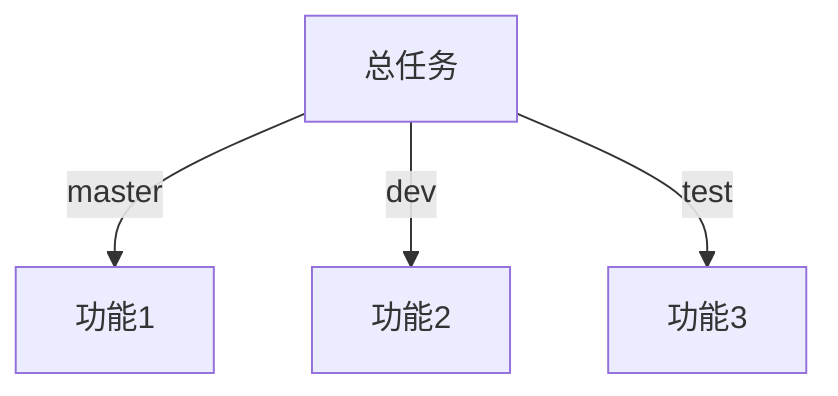

在实际开发中，`master`分支是用来发布项目稳定版本的，新的功能往往是在一个新建的分支上进行开发，等到新功能开发完毕经过测试之后，表现稳定，才会合并到`master`分支进行版本更新。

### 查看本地分支

`git branch`：查看当前版本库中所有的分支

`git branch -a`：查看所有本地分支，包括本地分支和本地远程分支

`git branch -v`：查看本地分支上最近一次的递交记录，不包括本地远程分支

`git branch -r`：单独查看本地远程分支

`git branch -av`：显示所有本地分支，包括本地远程分支，以及对应分支上的最新提交信息

`git branch -vv`：查看本地分支和远程分支的关联情况

### 创建本地分支

`git branch <branch_name>`：由于是在`master`分支上创建的`new_branch`分支，所以`new_branch`分支与`master`分支有着部分共同的提交历史；所以，`master`分支上的文件，`new_branch`分支上都有。但是，在`new_branch`分支上添加的`new_branch`文件，不会存在于`master`分支上

`git branch -b <branch_name>`：通过上述命令可创建并切换到`new_branch`分支

### 切换本地分支

`git checkout <branch_name>`

`git checkout -`

### 重命名本地分支

`git branch -m <oldName> <newName>`

### 删除本地分支

`git branch -d <branch_name>`

+ 不能删除当前所在的分支
+ 当需要删除的分支上有`master`分支上没有的内容，并且删除前没有进行合并时，会报错
+ 使用命令`git branch -D <branch_name>`可以在不合并的情况下强制删除分支

### 合并分支

1. 合并原则

   `git`分支的合并采用的是三方合并的原则：找到两分支最新提交`A`和`B`的公共父节点`C`，在这三个节点的基础上合并为节点`D`。这个节点`D`就包含了两个分支上的所有内容：

   ```mermaid
   graph LR
   master --> D --> A --> C
   D --> B --> C
   dev --> B
   ```

2. 合并指令

   `git merge <branch_name>`

### 分支的本质

分支：指向一条`commit`对象链或一条工作记录线的指针

快照`A~D`分别表示四次提交（`commit`），注意提交的顺序为：`A -> B -> C -> D`：

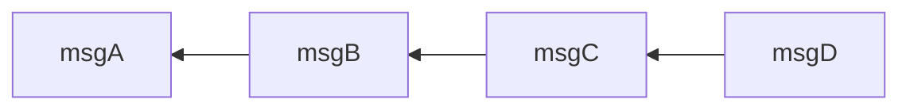

每一次提交的对象内都会保存上一次提交的`commit id`，由此可以从后往前把所有的提交（`commit`）串起来形成一条**链**（类似单向链表），**这条链就组成了一条完整的分支信息**：

- **当版本库中只有一条分支：**该分支的最新提交就包含了整条分支的所有内容，代表版本库的**当前状态**。
- **当版本库中有多条分支：**每条分支上的最新提交包含了所处分支的**全部内容**，将各个分支的最新提交进行合并。合并的节点就包含了所有分支的内容，也就是**现阶段的版本库本身**；

#### 分支 `==` 指针

情景一：

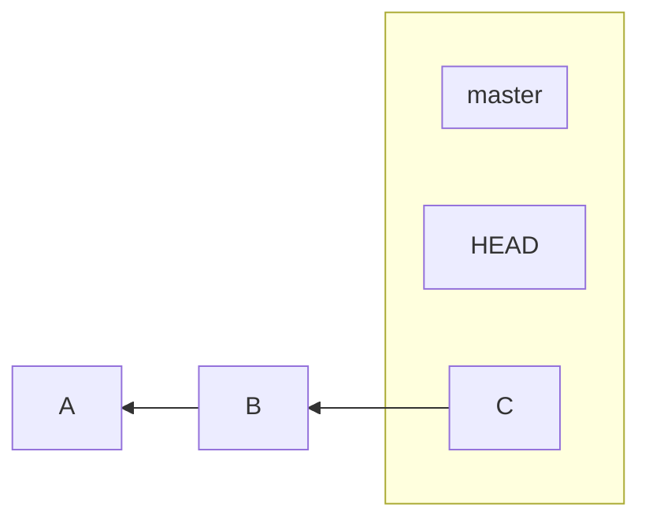


从图中可以看到：

- **`HEAD`为一个指针：指向当前分支；**
- **`master`也为一指针：指向提交；**

情景二：

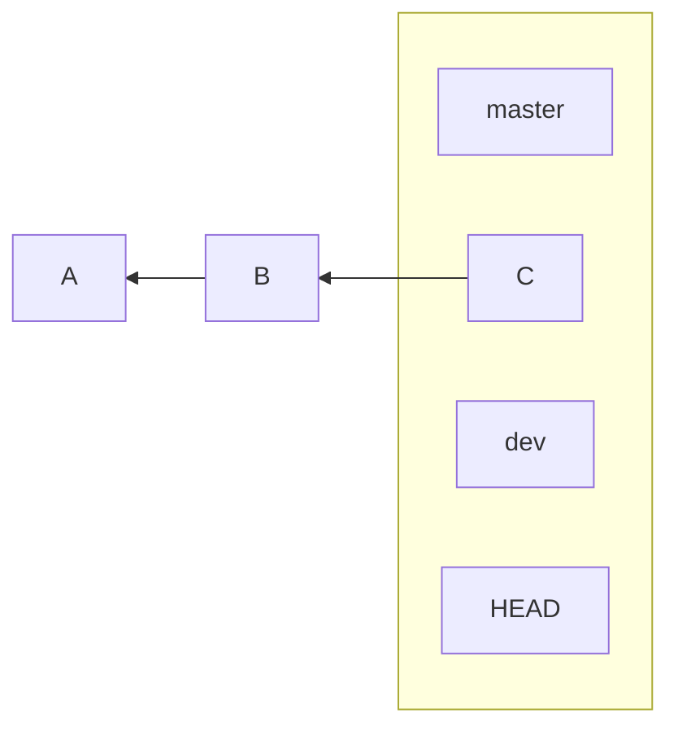


上图中，`dev`为`master`分支上创建的新分支，可知：

- `git`在创建新分支时，文件本身不变化，只需要创建一个**代表新分支，并指向当前分支的指针**；如图中的`dev`与`master`指向同一个提交，文件没有发生任何变化；
- `HEAD`指向`dev`分支，表示当前所处分支为`dev`，相当于执行了：`git checkout -b dev` 后的状态；

> 相信你已经发现：`HEAD`是一个始终**指向当前分支**的**指针**；

#### HEAD标识符

HEAD文件是一个指向当前所在分支的引用标识符，可以理解为一个指针

1. 查看`HEAD`

   `HEAD`文件中并不包含每次提交的信息，而是包含一个指向另外一个引用的指针。查看`.git`文件夹下面的`HEAD`文件。

   ```shell
   WINDOWS-PTR2QGM+hspcadmin@WINDOWS-PTR2QGM MINGW64 /f/personal/favorite/.git (GIT_DIR!)
   $ ll
   total 72
   -rw-r--r-- 1 WINDOWS-PTR2QGM+hspcadmin 197121     7 Oct 15 22:53 COMMIT_EDITMSG
   -rw-r--r-- 1 WINDOWS-PTR2QGM+hspcadmin 197121    90 Oct 17 15:32 FETCH_HEAD
   -rw-r--r-- 1 WINDOWS-PTR2QGM+hspcadmin 197121    23 Jun 19 16:37 HEAD
   -rw-r--r-- 1 WINDOWS-PTR2QGM+hspcadmin 197121    41 Oct 17 15:32 ORIG_HEAD
   -rw-r--r-- 1 WINDOWS-PTR2QGM+hspcadmin 197121   355 Sep 19 14:20 config
   -rw-r--r-- 1 WINDOWS-PTR2QGM+hspcadmin 197121    73 Jun 19 16:37 description
   drwxr-xr-x 1 WINDOWS-PTR2QGM+hspcadmin 197121     0 Jun 19 16:37 hooks/
   -rw-r--r-- 1 WINDOWS-PTR2QGM+hspcadmin 197121 35252 Oct 17 15:32 index
   drwxr-xr-x 1 WINDOWS-PTR2QGM+hspcadmin 197121     0 Jun 19 16:37 info/
   drwxr-xr-x 1 WINDOWS-PTR2QGM+hspcadmin 197121     0 Jun 19 16:40 logs/
   drwxr-xr-x 1 WINDOWS-PTR2QGM+hspcadmin 197121     0 Oct 17 15:32 objects/
   drwxr-xr-x 1 WINDOWS-PTR2QGM+hspcadmin 197121     0 Jun 19 16:40 refs/
   -rw-r--r-- 1 WINDOWS-PTR2QGM+hspcadmin 197121     0 Sep 24 14:44 tgitchangelist
   -rw-r--r-- 1 WINDOWS-PTR2QGM+hspcadmin 197121   350 Jul 23 14:59 tortoisegit.data
   -rw-r--r-- 1 WINDOWS-PTR2QGM+hspcadmin 197121   124 Jul 23 14:59 tortoisegit.index
   
   WINDOWS-PTR2QGM+hspcadmin@WINDOWS-PTR2QGM MINGW64 /f/personal/favorite/.git (GIT_DIR!)
   $ cat head
   ref: refs/heads/master
   ```

   可以看出当前的`HEAD`指向的是`master`分支。如果切换了分支，这个文件就会跟着被修改，始终指向当前的分支。

2. 修改`HEAD`

   正常通过命令切换分支，这些操作是被`git reflog`记录下来的，而如果手动修改了文件，则不会被记录，所以不建议直接手动修改文件。

#### 合并原理`git merge`

在新的分支上进行提交操作

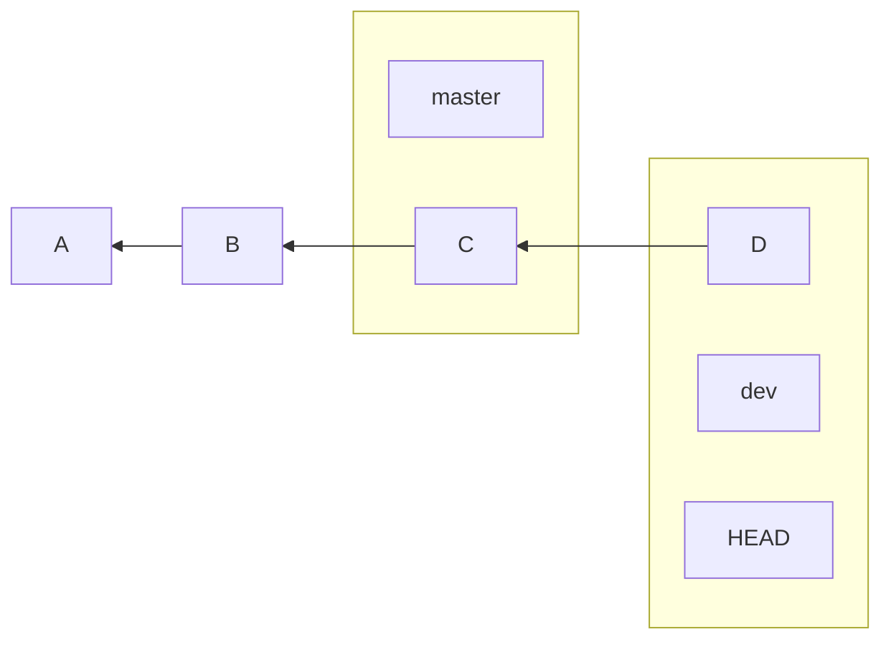

图中表示在`dev`分支上进行了提交，此时：

+ 分支`master`的提交记录有：A,B,C
+ 分支`dev`的提交记录有：A,B,C,D

对两个分支进行合并

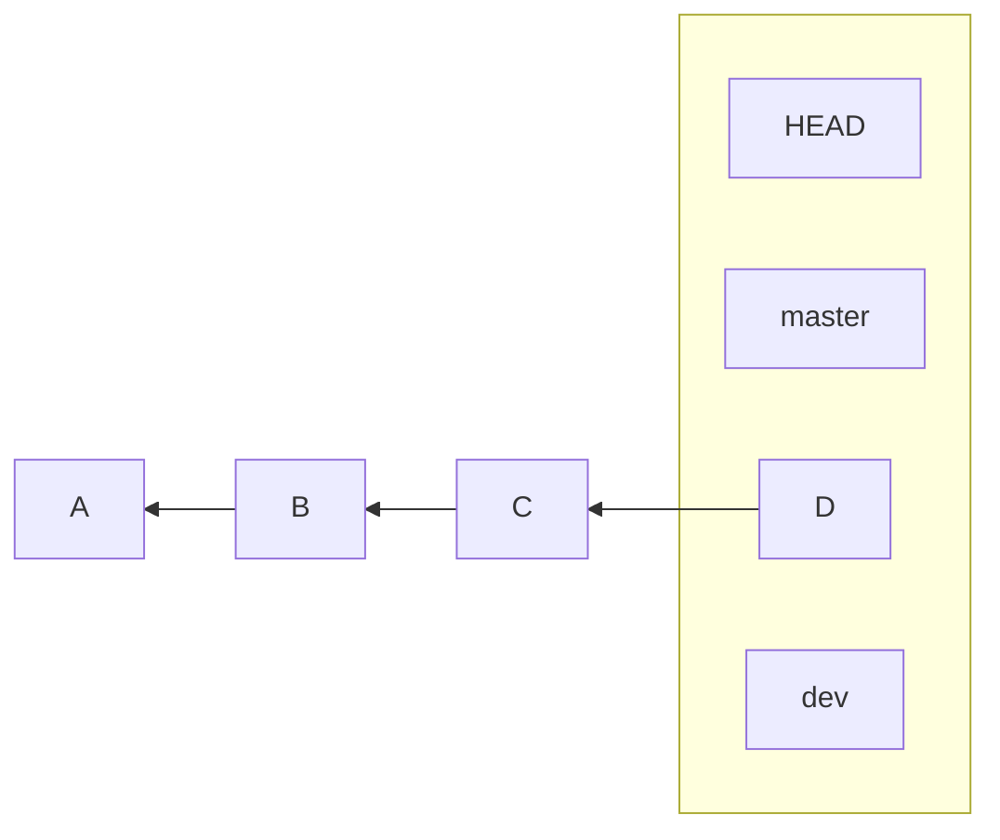

在`master`分支上执行：`git merge dev`：将`dev`分支的内容合并到了`master`分支，这种合并方式称为`Fast-forward`，没有冲突，改变的只是`master`指针的指向。

### 版本回退

#### `git reset`

1. 参数

   `reset`命令有很多参数，常用的有`--mixed`、`--soft`、`--hard`三种。

   ```mermaid
   graph LR
   subgraph 版本库原始
   	hard
   	本地文件
   end
   subgraph 工作区修改
   	mixed
   	1.txt
   end
   subgraph 提交暂存区
   	soft
   	gitadd
   end
   subgraph 提交版本库
   	gitcommit
   end
   本地文件 --> 1.txt --> gitadd --> gitcommit
   ```

   三个参数的区别：

   + `--mixed`：缺省参数，直接执行命令`git reset`等同于`git reset --mixed`。将文件回退到工作区，此时会保留工作区中的文件，但会丢弃暂存区中的文件
   + `--soft`：将文件回退到暂存区，此时会保留工作区和暂存区中的文件
   + `--hard`：将文件回退到修改前，此时会丢弃工作区和暂存区中的文件

2. 写法

   `git reset --hard HEAD^`：回退一次提交

   `git reset --hard HEAD^^`：回退两次提交

   `git reset --hard HEAD~n`：回退指定次提交

   `git reset --hard commit_id`：回退到指定的提交版本

#### `git revert`

回滚或者重做的意思。不同于`reset`直接通过改变分支指向来进行版本回退，并且不产生新的提交；`revert`是通过额外创建一次提交，来取消分支上指定的某次提交的方式，来实现版本回退的。这种做法的思想就是通过创建一个新的提交来取消不要的提交，所以，提交数会增加。

1. 参数

   `--edit`：默认参数。`git revert commit_id`这个命令，执行之后会进入`vim`中进行提交信息的编辑，相对应的提交信息将会被撤回，暂存区的文件和工作区的文件都将会收到影响。

   `--no-edit`：该参数的作用为不编辑重做时新增提交的注释信息，直接将文件回退，并且提交。

   `--no-commit`：该参数的作用为对重做时产生的修改，不进行提交，也就不会产生一次新的提交。

2. 写法

   `git revert commit_id`：第一，重做最新一次提交，不会产生冲突，这个时候可以直接执行命令，完成重做过程。第二，重做非最新一次提交，会出现合并冲突，使用`git mergetool`指令，查看冲突的文件，手动解决冲突之后，进行一次提交，完成重做过程。

   `git revert HEAD`：该指令的作用为重做所在分支的最新一次提交，不会产生冲突。

   `git revert HEAD^`：该指令的作用为重做所在分支的倒数第二次提交，会产生冲突，需要手动解决冲突并提交完成重做过程。

   `git revert HEAD^^`：该指令的作用为重做所在分支的倒数第三次提交，会产生冲突，需要手动解决冲突并提交完成重做过程。

   `git revert HEAD~n`：该指令的作用为重做所在分支的倒数第`n+1`次提交，会产生冲突，需要手动解决冲突并提交完成重做过程。

3. 撤销`revert`操作

   思路很简单，再次通过`revert`操作，取消上一次的重做即可

4. `revert`和`reset`的选择

   + `revert`通过创建一个新提交的方法来撤销某次操作，改操作之前和之后的提交记录都会被保留，并且会将该撤销操作作为最新的提交
   + `reset`通过改变`HEAD`和分支指针指向的方式，进行版本回退，该操作之后的提交记录不会被保留，并且不会创建新的提交

#### `git checkout commit_id`

如果直接使用这个命令，版本将回退到对应的提交版本。切换后，`HEAD`指向的并不是当前的分支，而是指向了对应提交序号的节点，可以想象为一个新的分支，但是并没有重新创建一个分支。如果此时有了文件的修改，那么切换回到当前分支时，将会提示存在没有保存的提交。如果，这个时候做一次提交操作，然后切换回到当前的分支，由于没有任何分支执行刚才的提交，则会被忽略。此时，如果想要保存这个修改，使用命令`git branch mycommit commit_id`，新建一个分支，将刚才的提交保存下来。

+ 如果使用`checkout`进行版本回退造成游离的提交对象，需要额外创建一个分支进行保存
+ 使用`checkout`进行版本回退的思路，先切换到想要回退的提交版本，在删除进行版本回退的分支，最后创建一个新的分支指向游离的提交对象链，完成版本回退，简称“偷天换日“
+ 只要有分支指向，提交就不会被丢弃

#### 版本回退方法总结

|              方法              |            效果             | 向前回退 | 向后回退 | 同步修改`HEAD`与分支指向 |
| :----------------------------: | :-------------------------: | :------: | :------: | :----------------------: |
|    `git reset --hard HEAD^`    |      往前回退`1`次提交      |    能    |    否    |            是            |
|   `git reset --hard HEAD^^`    |      往前回退`2`次提交      |    能    |    否    |            是            |
|   `git reset --hard HEAD~n`    |      往前回退`n`次提交      |    能    |    否    |            是            |
| `git reset --hard <commit_id>` | 回退到指定`commit id`的提交 |    能    |    能    |            是            |
|       `git revert HEAD`        |      重做最新一次提交       |    能    |    否    |            是            |
|       `git revert HEAD^`       |     重做倒数第二次提交      |    能    |    否    |            是            |
|      `git revert HEAD^^`       |     重做倒数第三次提交      |    能    |    否    |            是            |
|      `git revert HEAD~n`       |    重做倒数第`n+1`次提交    |    能    |    否    |            是            |
|     `git revert commit_id`     |  重做指定`commit_id`的提交  |    能    |    能    |            是            |
|    `git checkout commit_id`    | 回退到指定`commit id`的提交 |    能    |    能    |            否            |


***

https://www.cnblogs.com/AhuntSun-blog/p/12685415.html
